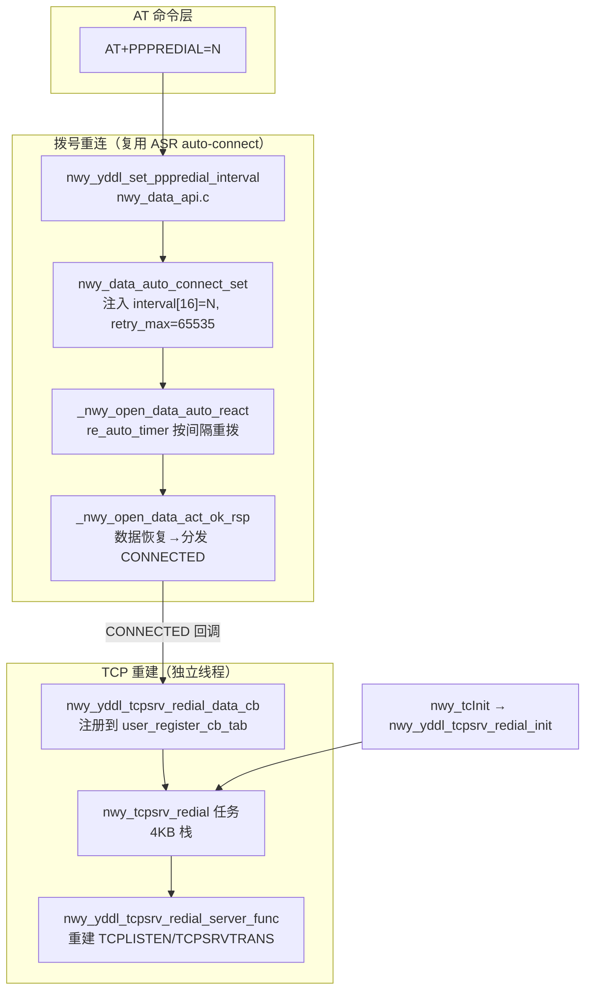

# PPPREDIAL 与 TCP 自动重建 需求文档

## 0. 结构化摘要

> 以下信息供知识库检索使用，需完整准确填写。

| 字段 | 内容 |
|------|------|
| **项目 ID** | 7002450192 |
| **模块** | 数据通道管理 / TCP 服务端 |
| **需求描述** | 数据通话断开后按可配间隔无限自动重拨直至恢复，恢复后自动重建 TCP 服务端监听（IPv4/IPv6/双栈），重建过程对上层透明 |
| **优先级** | P0（必须实现） |

---

## 目录
- [文档信息](#文档信息)
- [1. 项目概述](#1-项目概述)
- [2. 功能需求](#2-功能需求)
- [3. 非功能需求](#3-非功能需求)
- [4. 待澄清事项](#4-待澄清事项)

## 文档信息
| 字段 | 内容 |
|------|------|
| 文档编号 | REQ-PPPREDIAL-001 |
| 项目名称 | PPPREDIAL 与 TCP 自动重建（ASR1603） |
| 创建日期 | 2026-06-16 |
| 版本 | v1.0 |
| 需求来源 | 客户需求（网络不稳定场景下数据链路与 TCP 服务端自愈） |

| 版本 | 日期 | 修改内容 | 作者 |
|------|------|----------|------|
| v1.0 | 2026-06-16 | 初始创建 | spec-requirement-generator |

## 1. 项目概述

### 1.1 项目背景
设备部署在射频环境不稳定、存在掉网、基站切换、漫游的场景。一旦数据通话断开，若不能保证持续自动恢复，且 TCP 服务端监听不随数据恢复而重建，外部客户端将无法重新接入，需要人工干预。本需求要求数据链路与 TCP 服务端具备"断而自愈、上层无感"的能力。

### 1.2 目标用户与场景
- **目标用户**：使用 ASR1603 模组、需长期维持数据连接并提供 TCP 服务端的嵌入式设备开发者 / 客户。
- **使用场景**：设备处于网络波动环境（金属屏蔽、天线接触不良、小区切换、漫游），数据通话偶发断开；要求自动恢复数据链路并重建 TCP 监听，外部客户端可随时重新接入。

### 1.3 项目目标
- 数据通话断开后按可配置间隔持续重拨，直到恢复（不设实际上限）。
- 数据恢复后自动重建此前建立的 TCP 服务端监听（TCPLISTEN / 透传 TCPSRVTRANS），支持 IPv4/IPv6/双栈。
- 整个恢复 / 重建过程对上层应用透明，不产生干扰性 URC。

### 1.4 适用范围
- **包含**：AT+PPPREDIAL 命令、拨号自动重连、TCP 服务端监听自动重建、重建 URC 抑制。
- **不包含**：interval 的掉电持久化（重启归零，与参考平台一致）；+GETIP 命令（本次不需要）。

## 2. 功能需求

### 2.1 核心功能
| 编号 | 功能名称 | 描述 | 优先级 | 备注 |
|------|----------|------|--------|------|
| FR-001 | PPPREDIAL 命令 | `AT+PPPREDIAL=N` 设置重拨间隔（0~7200 秒，0=关闭）；支持 READ/TEST；越界/非数字/缺参返回 ERROR | P0 | |
| FR-002 | 拨号自动重连 | 数据通话断开后按 N 秒间隔持续重拨，恢复后自动重连，不设实际次数上限 | P0 | |
| FR-003 | TCP 监听自动重建 | 数据恢复后自动重建此前建立的 TCPLISTEN/TCPSRVTRANS 监听，支持 IPv4/IPv6/双栈 | P0 | |
| FR-004 | 重建 URC 抑制 | 重建过程抑制相关 URC（+TCPLISTEN / +CLOSELISTEN / +TCPSRVTRANS），不干扰上层 | P0 | |
| FR-005 | 用户主动停不重拨 | 用户显式停止数据通话后不再自动重拨 | P0 | |
| FR-006 | 关闭 / 清理不重建 | `AT+PPPREDIAL=0` 或 `AT+CLOSELISTEN` 后不再触发重建 | P0 | |
| FR-007 | 间隔动态修改 | 运行中修改间隔立即生效，不影响重拨链路 | P1 | |
| FR-008 | 双卡 / 漫游 / 切换稳定 | 多卡、漫游、RAT 切换下重拨与重建行为稳定 | P1 | |

> **优先级定义**：P0 = 必须实现，否则产品不可用 | P1 = 重要功能，严重影响用户体验 | P2 = 增值功能，可后续实现

### 2.2 扩展功能（可选）
| 编号 | 功能名称 | 描述 | 优先级 |
|------|----------|------|--------|
| FR-101 | 与既有自动拨号共存 | 与 USBNETAUTO / NWNETSHAREACT 等旧机制共存，互不干扰 | P1 |
| FR-102 | redial 状态 URC | 提供数据链路状态 URC 供上层决策（待澄清是否需要） | P2 |

## 3. 非功能需求
| 类别 | 需求项 | 具体要求 | 验证方法 |
|------|--------|----------|----------|
| 实时性 | 重拨间隔 | 间隔可配 1~7200s，实际重拨间隔误差 ±2s | 日志时间戳 |
| 实时性 | 恢复时延 | 网络恢复后 ≤ 一个 interval 重连；TCP 重建耗时 ≤ 2s | 端到端计时 |
| 可靠性 | 无限重拨 | 长时间断网（≥ 20 分钟）持续重试不停止 | 长时间断网测试 |
| 可靠性 | 长循环稳定 | 100 轮断/连循环无资源泄漏，重建成功率 ≥ 99% | 自动化长循环 |
| 可靠性 | 网络抖动 | 快速抖动下不崩溃、不泄漏，稳定后可恢复 | flap 测试 |
| 内存 | 资源占用 | 重拨/重建任务栈与堆充足，持续运行无溢出、无看门狗复位 | 栈水位/内存监测 |
| 安全性 | 异常自愈 | 拔卡 / APN 错误 / 重建失败等异常下不崩溃，可自愈 | 异常场景测试 |

## 4. 待澄清事项
- [ ] 是否需要 interval 掉电持久化（当前重启归零，与参考平台一致；客户若需持久化另议）。
- [ ] 是否需要向上层提供 redial / 链路状态 URC，以及其与既有 +PPPSTATUS 的协调（对应 FR-102）。
- [ ] 重建后 `open_check` 抑制窗口的边界行为（若重建后不发任何 AT 命令，是否持续抑制 TCPLISTEN 类 URC）是否需与参考平台同步修复。
- [ ] 与既有自动拨号机制（USBNETAUTO 等）共存的优先级与边界（对应 FR-101）。

---

# PPPREDIAL 与 TCP 自动重建 方案文档（ASR1603）

## 文档信息

| 项目 | 内容 |
|------|------|
| 文档编号 | PPPREDIAL-DESIGN-001 |
| 版本 | V1.0 |
| 创建日期 | 2026-06-16 |
| 平台 | ASR1603（ARM Cortex-R5F + ThreadX），编译平台 `pcac/nwy_bpv2_plat` |
| 参考平台 | UIS8852（U:\N706C\UIS8852） |
| 关联需求 | [需求.md](需求.md) |
| 详细文档 | 实现说明 / 测试方案 / 跨平台一致性审查（见 `.spec/design/`） |

---

## 1. 设计目标

由宏 `FEATURE_NWY_AT_PPPREDIAL_FUNCTION` 控制，提供两部分能力：

1. **拨号自动重连**：`AT+PPPREDIAL=N`（N=1~7200 秒）配置重拨间隔后，数据通话断开时按 N 秒间隔**无限重拨**，直到重连成功；`AT+PPPREDIAL=0` 关闭。
2. **TCP Server 自动重建**：数据通话恢复后，自动重建此前建立的 TCPLISTEN / TCPSRVTRANS 监听；重建过程抑制相关 URC，不干扰上层。

**ASR 实现策略**：不复用 UIS8852 的独立拨号引擎 `nwy_data_component.c`，而是复用 ASR 自带的数据通话 auto-connect 机制，把 PPPREDIAL 间隔注入其中；TCP 重建为独立线程模块，通过数据回调触发，与拨号机制解耦。

## 2. 宏控与编译

| 项 | 位置 | 说明 |
|----|------|------|
| 总开关宏 | `FEATURE_NWY_AT_PPPREDIAL_FUNCTION` | 守卫全部新增代码 |
| 宏启用 | `NWY_CUSTOM/N706B_CN1X_BZ_GENUS/tavor/Arbel/build/nwy_project.mak` | `TARGET_DFLAGS += -DFEATURE_NWY_AT_PPPREDIAL_FUNCTION` |
| 构建注册 | `nota/NWY_FRAMEWORK/build/NWY_FRAMEWORK.mak` | NWY_FRAMEWORK 源文件已含相关 .c，无需新增源文件注册 |

> 宏未启用时全部 PPPREDIAL/TCP 重建代码不参与编译，对原有功能零影响。

## 3. 总体架构



两大子系统**解耦**：拨号重连负责"把数据通话重新建起来"；TCP 重建负责"数据恢复后把监听重建起来"，二者仅通过数据回调的 CONNECTED 事件耦合。

## 4. 关键机制

### 4.1 AT+PPPREDIAL 命令
处理函数 `nwy_app_at_pppredial_func()`（`nwy_app_at_func_data.c`）。命令路由：`hop nwy_at_table.c +PPPREDIAL` → `AT_NWY_CmdFunc_Adpt` → NWY_FRAMEWORK 处理函数。

| 模式 | 行为 |
|------|------|
| `AT+PPPREDIAL=N`（SET） | 校验 `0 ≤ N ≤ 7200`，调 `nwy_yddl_set_pppredial_interval(N)`，返回 OK；越界/非数字/缺参返回 ERROR |
| `AT+PPPREDIAL?`（READ） | 返回 `+PPPREDIAL: <N>` |
| `AT+PPPREDIAL=?`（TEST） | 返回 OK |

### 4.2 拨号自动重连（复用 ASR auto-connect）
- `nwy_yddl_set_pppredial_interval(interval)`：把 interval 注入 `auto_rec_interval_ms[16]`（16 个重试槽全填 N），`retry_max = 65535`（实际无限），CID = `NWY_INTERNAL_CALL_CID = 1`。
- 间隔实际延迟：`OSATimerStart(timer, interval*200, …)`，OSA 定时器单位 5ms ⇒ `N*200*5ms = N 秒`。
- 拨号失败/数据断 → `_nwy_open_data_act_fail_rsp` 重启 `re_auto_timer`；定时器到期重拨；拨号成功 → `_nwy_open_data_act_ok_rsp` 置 `last_state=CONNECTED` 并**遍历 `user_register_cb_tab[]` 发 `NWY_DATA_CALL_CONNECTED_STATE`**（TCP 重建触发点）。
- 用户主动停（`nwy_data_call_stop`）：`is_own_close_flag=0 → is_auto=0`，不再重拨。

### 4.3 TCP Server 自动重建（独立线程）
- 任务 `nwy_yddl_tcpsrv_redial_task`（栈 4096），全局状态 `g_tcpsrv_redial_info`（open_check/link_trans/port）。
- 数据回调 `nwy_yddl_tcpsrv_redial_data_cb` 命中条件：`CONNECTED && port>0 && interval>0` → 发 EVENT_SERVER。
- 重建 `nwy_yddl_tcpsrv_redial_server_func`：按 `link_trans` 选 TCPSRVTRANS / TCPLISTEN，按 `nwy_plat_IP_type()` 处理 IPv4/IPv6/双栈（双栈先 v4，sleep 100ms 后 v6）；socket 已存在则跳过。
- 端口记录与 URC 抑制在 7 处插入点完成（TCPLISTEN/TCPSRVTRANS 的 OPENED/CLOSED_PASV 回调、对应 AT 命令成功分支、CLOSELISTEN）。

### 4.4 触发链路
```
AT+PPPREDIAL=10 → set interval → auto_connect_set(interval=10, retry_max=65535)
  → is_auto=1（若有用户通话）→ 启动 re_auto_timer
[断网] fail_rsp → re_arm timer(10s) → [10s] 重拨 CID1
[成功] ok_rsp → 发 CONNECTED → redial_data_cb 命中 → EVENT_SERVER
  → redial 任务重建 TCPLISTEN/TCPSRVTRANS（open_check=true 抑制 URC）
```

## 5. 初始化与启动

入口 `hop/telephony/atcmdsrv/src/telcontroller.c` 的 `nwy_tcInit()`，`FEATURE_NWY_BPV2` 分支、`nwy_cp_service_start()` 之后：
```c
#ifdef FEATURE_NWY_AT_PPPREDIAL_FUNCTION
    extern void nwy_yddl_tcpsrv_redial_init(void);
    nwy_yddl_tcpsrv_redial_init();
#endif
```
`nwy_yddl_tcpsrv_redial_init()`：清零状态 → 创建 redial 任务（4KB 栈）→ 发 EVENT_DATA 注册 SIM1/2 数据回调。

初始化日志关键字：`nwy_yddl_tcpsrv_redial_init`、`TCP server redial task created successfully`、`Registered data callback for SIM x successfully`。

## 6. ASR 移植适配（踩坑记录）

TCP 重建逻辑代码与 UIS8852 一致，但不能直接照搬，移植时做了以下适配（均已修复验证）：

1. **日志宏参数**：ASR `NWY_APP_LOG_*(fmt,arg1,arg2,arg3)` 固定 3 值参（UIS8852 变参），27 处补 `0` 到 3 个。
2. **`#ifdef FEATURE_NWY_AT_RSP_CPS` 宏控被误删**：插入 PPPREDIAL 块时吃掉了回调里原有 URC 格式宏控，补回。
3. **C90**：armcc 不允许 `for(int i...)`，改为先声明再 for。
4. **`bool`**：结构体改用 `uint8_t`（部分编译单元 bool 未定义）。
5. **【死机根因·栈】**：`NWY_TCPSRV_REDIAL_TASK_STACK_SIZE` 由 UIS8852 的 2048 改为 **4096**（最终上传版本；调试阶段曾试 8192，实测 4096 已足够）。2048 跑 `nwy_app_tcp_server_setup` 深 TCP 栈调用会溢出，越界写坏 RTI 记录触发 `rti_thread_switch_out` 空指针解引用 DataAbort 死机。教训：UIS8852→ASR 移植涉及 TCP/网络深调用的任务，栈不能照搬 2KB，至少翻倍给 4KB 并按实测水位调整。
6. **【sid 赋值顺序】TCPLISTEN OPENED**：原代码 `nwy_tcplisten_sid=sid;` 在 break 之后，redial 重建时 break 跳过赋值导致 sid 停在 -1；在 break 前补赋值。

## 7. 与 UIS8852 的关系

| 维度 | UIS8852 | ASR1603 |
|------|---------|---------|
| 拨号引擎 | 独立 `nwy_data_component.c` | 复用 `nwy_data_api.c` auto-connect |
| interval 注入 | 直接赋值静态变量 | `nwy_data_auto_connect_set` 注入 interval[]+retry_max |
| 重拨上限 | 无限（LNT 路径） | 65535（实际无限） |
| 网络未就绪 | 静默等 REGISTERED 事件 | 每 interval 轮询重试 |
| TCP 重建代码 | `nwy_app_at_func_tcp.c` | 逻辑一致，仅 ASR 移植适配差异 |
| +GETIP | 有 | 未移植（本次不需要） |

## 8. 关键数据结构

```c
typedef struct {
    uint8_t open_check;   // 重建中标志（抑制 URC）
    uint8_t link_trans;   // 透传模式标记
    uint16_t port;        // 监听端口
} nwy_yddl_tcpsrv_redial_t;
```

## 9. 已知点与注意事项

1. `open_check` 重建后不复位：仅靠下次 `AT+TCPLISTEN/TCPSRVTRANS/CLOSELISTEN` 清零；若重建后不发任何 AT 命令理论上持续抑制 TCPLISTEN 类 URC（两平台共有，关注不阻塞）。
2. 非持久化：interval 重启归零，与 UIS8852 一致；客户若要持久化需另议。
3. 栈水位：redial 任务 4KB（最终上传值），建议测试观察栈使用率，>70% 再调到 8KB。
4. 提交：change 64882 相关文件 + `telcontroller.c` + `nwy_app_at_func_tcp.c/.h` 适配改动需一起提交，commit message 注明"ASR 栈适配修复死机 + sid 赋值顺序修复"。

## 10. 验证

详见 `.spec/design/PPPREDIAL与TCP自动重建测试方案.md`（23 个用例，覆盖命令、重连、重建、URC 抑制、IPv4/IPv6/双栈、长循环、网络抖动、异常自愈等）。通过准则：高优先级用例 100% 通过；TC-19 重建成功率 ≥ 99%、无资源泄漏；各项时延在目标范围内。