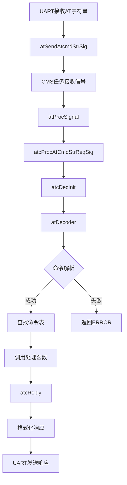
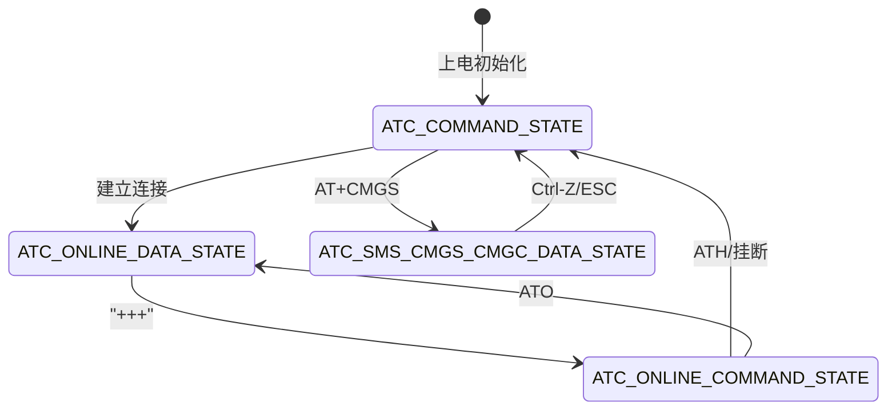

# AT命令模块 - 代码架构总结

## 目录

- [1. 架构概述](#1-架构概述)
  - [1.1 系统定位](#11-系统定位)
  - [1.2 分层架构](#12-分层架构)
  - [1.3 核心组件](#13-核心组件)
- [2. 模块依赖关系](#2-模块依赖关系)
  - [2.1 依赖的基础框架](#21-依赖的基础框架)
  - [2.2 被依赖的模块](#22-被依赖的模块)
- [3. 目录结构分析](#3-目录结构分析)
  - [3.1 目录组织](#31-目录组织)
  - [3.2 关键文件说明](#32-关键文件说明)
- [4. 核心数据结构](#4-核心数据结构)
  - [4.1 AT通道实体 (AtChanEntity)](#41-at通道实体-atchannelentity)
  - [4.2 AT命令预定义信息 (AtCmdPreDefInfo)](#42-at命令预定义信息-atcmdpredefinfo)
  - [4.3 AT命令输入上下文 (AtCmdInputContext)](#43-at命令输入上下文-atcmdinputcontext)
  - [4.4 枚举类型](#44-枚举类型)
- [5. 关键接口分析](#5-关键接口分析)
  - [5.1 API函数](#51-api函数)
  - [5.2 命令处理函数原型](#52-命令处理函数原型)
  - [5.3 响应接口](#53-响应接口)
- [6. 实现机制解析](#6-实现机制解析)
  - [6.1 核心流程](#61-核心流程)
  - [6.2 命令注册机制](#62-命令注册机制)
  - [6.3 状态机设计](#63-状态机设计)
  - [6.4 信号处理机制](#64-信号处理机制)
  - [6.5 错误处理](#65-错误处理)
- [7. 配置与编译](#7-配置与编译)
  - [7.1 编译选项](#71-编译选项)
  - [7.2 宏定义](#72-宏定义)
  - [7.3 S参数配置](#73-s参数配置)
- [8. 扩展点识别](#8-扩展点识别)
  - [8.1 可扩展接口](#81-可扩展接口)
  - [8.2 钩子点](#82-钩子点)
  - [8.3 插件机制](#83-插件机制)
- [9. 关键文件索引](#9-关键文件索引)
- [附录: AT命令分类](#附录-at命令分类)

---

## 1. 架构概述

### 1.1 系统定位

AT命令模块是EC626项目中位于中间件层的核心组件，负责解析、处理和响应AT命令。该模块实现了V.250标准规定的AT命令协议栈，提供标准的人机交互接口，用于配置、控制和查询模块的各种功能。

### 1.2 分层架构

```
┌─────────────────────────────────────────────────────────────┐
│                    应用层 (Application)                      │
│  各协议栈业务逻辑: HTTP/MQTT/LwM2M/COAP/SOCKET/短信等        │
├─────────────────────────────────────────────────────────────┤
│                    AT中间件层 (Middleware)                   │
│  ┌─────────────┐  ┌─────────────┐  ┌─────────────┐         │
│  │ atentity    │  │ atdecoder   │  │ atreply     │         │
│  │ AT实体/调度  │  │ 命令解析    │  │ 响应格式化  │         │
│  └─────────────┘  └─────────────┘  └─────────────┘         │
│  ┌─────────────┐  ┌─────────────┐  ┌─────────────┐         │
│  │ atcust      │  │ atps        │  │ nwy_at      │         │
│  │ 客户命令集   │  │ PS相关命令  │  │ 移远扩展    │         │
│  └─────────────┘  └─────────────┘  └─────────────┘         │
├─────────────────────────────────────────────────────────────┤
│                    CMS层 (Common Service)                   │
│  消息通信、定时器、内存管理等基础服务                          │
├─────────────────────────────────────────────────────────────┤
│                    驱动层 (Driver)                          │
│  UART驱动、CCIO等硬件接口                                     │
└─────────────────────────────────────────────────────────────┘
```

### 1.3 核心组件

| 组件 | 文件路径 | 功能描述 |
|------|----------|----------|
| **atentity** | `middleware/eigencomm/at/atentity/` | AT命令实体管理、信号调度、任务入口 |
| **atdecoder** | `middleware/eigencomm/at/atdecoder/` | AT命令词法分析、参数解析、状态管理 |
| **atreply** | `middleware/eigencomm/at/atreply/` | AT响应格式化、错误码映射、输出控制 |
| **atcust** | `middleware/eigencomm/at/atcust/` | 客户定制AT命令实现 |
| **atps** | `middleware/eigencomm/at/atps/` | PS(Packet Service)相关AT命令 |
| **atqa** | `middleware/eigencomm/at/atqa/` | 产线测试(QA)相关AT命令 |
| **nwy_at** | `middleware/eigencomm/at/nwy_at/` | 移远(Neoway)扩展AT命令 |

---

## 2. 模块依赖关系

### 2.1 依赖的基础框架

本模块依赖以下框架的实现：

| 框架名 | 依赖方式 | 关键接口 |
|--------|----------|----------|
| CMS框架 | 信号通信 | CMS消息发送/接收 |
| OSAL框架 | 操作系统 | 任务、定时器、内存、信号量 |
| CMI接口 | 调制解调接口 | `CacCmiCnf`/`CacCmiInd` |
| NVDM | NVRAM数据管理 | 配置持久化 |

### 2.2 被依赖的模块

以下模块通过AT命令接口与外界交互：

- **网络协议栈**: HTTP/MQTT/LwM2M/COAP/Socket
- **短信服务**: SMS
- **设备管理**: 设备信息、SIM卡管理
- **文件系统**: FS AT命令
- **蓝牙模块**: BLE AT命令

---

## 3. 目录结构分析

### 3.1 目录组织

```
middleware/eigencomm/at/
├── atentity/          # AT实体核心
│   ├── inc/
│   │   ├── at_entity.h       # AT实体入口、信号处理
│   │   ├── at_api.h          # AT外部API接口
│   │   ├── at_def.h          # AT宏定义
│   │   ├── at_util.h         # AT工具函数
│   │   └── at_*.h            # 各协议AT任务头文件
│   └── src/
│       ├── at_entity.c       # AT任务主入口
│       ├── at_api.c          # AT API实现
│       └── at_*.c            # 各协议AT任务实现
├── atdecoder/         # AT命令解码器
│   ├── inc/atc_decoder.h
│   └── src/atc_decoder.c
├── atreply/           # AT响应处理器
│   ├── inc/atc_reply.h
│   ├── inc/atc_reply_err_map.h
│   └── src/atc_reply.c
├── atcust/            # 客户定制命令
│   ├── inc/atec_*.h
│   └── src/atec_*.c
├── atps/              # PS相关命令
├── atqa/              # 产线测试命令
└── nwy_at/            # 移远扩展命令
```

### 3.2 关键文件说明

| 文件 | 说明 |
|------|------|
| [at_entity.c](../../middleware/eigencomm/at/atentity/src/at_entity.c) | AT任务主入口，处理所有AT相关信号 |
| [atc_decoder.h](../../middleware/eigencomm/at/atdecoder/inc/atc_decoder.h) | AT解码核心数据结构定义 |
| [atc_reply.h](../../middleware/eigencomm/at/atreply/inc/atc_reply.h) | AT响应码定义和响应接口 |
| [atec_cust_cmd_table.c](../../middleware/eigencomm/at/atcust/src/atec_cust_cmd_table.c) | 客户AT命令注册表 |
| [at_api.h](../../middleware/eigencomm/at/atentity/inc/at_api.h) | AT模块对外API |

---

## 4. 核心数据结构

### 4.1 AT通道实体 (AtChanEntity)

位置: [atc_decoder.h:764](../../middleware/eigencomm/at/atdecoder/inc/atc_decoder.h#L764)

```c
typedef struct AtChanEntity_tag
{
    UINT8   chanId;                 // 通道ID
    BOOL    bInited;                // 初始化标志
    UINT8   chanState;              // AtcState 通道状态
    BOOL    bApiMode;               // API模式标志

    UINT32  nextTid : 5;            // 下一个异步定时器ID
    UINT32  curTid : 5;             // 当前定时器ID
    UINT32  bWaitDataModeHSCnf : 1; // 等待数据模式握手确认

    CHAR    chanName[AT_CHAN_NAME_SIZE];  // 通道名称

    AtChanConfig    cfg;            // 通道配置(S3/S4/S5/ECHO等)
    AtInputInfo     atInputInfo;    // AT输入队列信息
    AtCmdLineInfo   atLineInfo;     // AT命令行信息

    struct {
        AtRespFunctionP     respFunc;       // 响应回调
        void                *pArg;          // 回调参数
        osSemaphoreId_t     apiSem;         // API信号量
        CHAR                *pBufResp;      // 响应缓冲区
        AtUrcFunctionP      urcFunc;        // URC回调
        AtDataAndOnlineCmdStateFuncP dataAndOnlineCmdFunc;
    } callBack;

    // 命令表指针
    UINT16              preDefCmdNum;
    UINT16              preDefCustCmdNum;
    AtCmdPreDefInfoC    *pPreDefCmdList;
    AtCmdPreDefInfoC    *pPreDefCustCmdList;

    osTimerId_t         asynTimer;      // 异步定时器
} AtChanEntity;
```

### 4.2 AT命令预定义信息 (AtCmdPreDefInfo)

位置: [atc_decoder.h:589](../../middleware/eigencomm/at/atdecoder/inc/atc_decoder.h#L589)

```c
typedef struct AtCmdPreDefInfo_Tag
{
    const CHAR          *pName;         // AT命令名称
    UINT16              timeOutS;       // 超时时间(秒)
    UINT8               cmdType;        // AtCmdSyntaxType 命令类型
    UINT8               paramMaxNum;    // 最大参数个数
    const AtValueAttr   *pParamList;    // 参数属性列表
    const AtCallbackFunctionP atProcFunc; // 处理函数
} AtCmdPreDefInfo;
```

### 4.3 AT命令输入上下文 (AtCmdInputContext)

位置: [atc_decoder.h:506](../../middleware/eigencomm/at/atdecoder/inc/atc_decoder.h#L506)

```c
typedef struct AtCmdInputContext_Tag
{
    UINT16  operaType : 4;      // AtCmdReqType 操作类型
    UINT16  chanId    : 4;      // 通道ID
    UINT16  tid       : 5;      // 异步定时器索引
    UINT16  rsvd      : 3;

    UINT8   paramMaxNum;        // 最大参数个数
    UINT8   paramRealNum;       // 实际参数个数
    AtParamValue *pParamList;   // 参数值列表
} AtCmdInputContext;
```

### 4.4 枚举类型

#### AT命令请求类型 (AtCmdReqType)
位置: [atc_decoder.h:231](../../middleware/eigencomm/at/atdecoder/inc/atc_decoder.h#L231)

```c
typedef enum AtCmdReqType_enum
{
    AT_INVALID_REQ_TYPE = 0,
    AT_EXEC_REQ         = 1,    // AT+CMD1
    AT_SET_REQ          = 2,    // AT+CMD2=<param>
    AT_READ_REQ         = 3,    // AT+CMD2?
    AT_TEST_REQ         = 4,    // AT+CMD2=?
    AT_BASIC_EXT_SET_REQ= 5,    // AT&F=<param>
} AtCmdReqType;
```

#### AT通道状态 (AtcState)
位置: [atc_decoder.h:352](../../middleware/eigencomm/at/atdecoder/inc/atc_decoder.h#L352)

```c
typedef enum AtcState_enum
{
    ATC_COMMAND_STATE,              // 命令状态
    ATC_ONLINE_CMD_STATE,           // 在线命令状态
    ATC_ONLINE_COMMAND_STATE,       // 在线命令状态(++)
    ATC_ONLINE_DATA_STATE,          // 在线数据状态
    ATC_SMS_CMGS_CMGC_DATA_STATE,   // SMS数据输入状态
    ATC_MQTT_PUB_DATA_STATE,        // MQTT发布数据状态
    ATC_SOCKET_SEND_DATA_STATE,     // Socket发送数据状态
    ATC_BLE_SEND_DATA_STATE,        // BLE发送数据状态
    // ... 更多状态
} AtcState;
```

#### AT结果码 (AtResultCode)
位置: [atc_reply.h:145](../../middleware/eigencomm/at/atreply/inc/atc_reply.h#L145)

```c
typedef enum AtResultCode_Tag
{
    AT_RC_OK = 0,
    AT_RC_CONNECT = 1,
    AT_RC_RING = 2,
    AT_RC_NO_CARRIER = 3,
    AT_RC_ERROR = 4,
    AT_RC_NO_DIALTONE = 6,
    AT_RC_BUSY = 7,
    AT_RC_NO_ANSWER = 8,
    AT_RC_CONTINUE = 10,       // AT过程未完成
    AT_RC_NO_RESULT = 11,      // AT完成但不返回结果码
    AT_RC_CME_ERROR,           // +CME ERROR
    AT_RC_CMS_ERROR,           // +CMS ERROR
    // ... 扩展错误码
} AtResultCode;
```

---

## 5. 关键接口分析

### 5.1 API函数

#### 通道注册API
位置: [at_api.h:130](../../middleware/eigencomm/at/atentity/inc/at_api.h#L130)

```c
INT32 atRegisterAtChannel(AtChanRegInfo *pAtRegInfo);
```
功能: 注册AT通道，返回通道ID

#### 发送AT命令API
位置: [at_api.h:140](../../middleware/eigencomm/at/atentity/inc/at_api.h#L140)

```c
void atSendAtcmdStrSig(UINT8 atChanId, const UINT8 *pCmdStr, UINT32 len);
```
功能: 向AT任务发送AT命令字符串

#### RIL API
位置: [at_api.h:175](../../middleware/eigencomm/at/atentity/inc/at_api.h#L175)

```c
CmsRetId atRilAtCmdReq(const CHAR *pAtCmdLine, UINT32 cmdLen,
                       AtRespFunctionP respCallback, void *respData,
                       UINT32 timeOutMs);
```
功能: RIL接口发送AT命令

### 5.2 命令处理函数原型

```c
typedef CmsRetId (*AtCallbackFunctionP)(const AtCmdInputContext *pAtInputCtx);
```

示例: [atec_cust_dev.c:45](../../middleware/eigencomm/at/atcust/src/atec_cust_dev.c#L45)

```c
CmsRetId ccCGMI(const AtCmdInputContext *pAtCmdReq)
{
    // 根据 operaType 处理不同请求类型
    switch (pAtCmdReq->operaType) {
        case AT_TEST_REQ:  // AT+CGMI=?
        case AT_EXEC_REQ:  // AT+CGMI
        // ...
    }
    return atcReply(...);
}
```

### 5.3 响应接口

位置: [atc_reply.h:226](../../middleware/eigencomm/at/atreply/inc/atc_reply.h#L226)

```c
CmsRetId atcReply(UINT16 srcHandle, AtResultCode resCode,
                  UINT32 errCode, const CHAR *pRespInfo);
```
功能: 发送AT响应

#### URC接口
位置: [atc_reply.h:231](../../middleware/eigencomm/at/atreply/inc/atc_reply.h#L231)

```c
CmsRetId atcURC(UINT32 chanId, const CHAR *pUrcStr);
```
功能: 发送主动上报(URC)消息

---

## 6. 实现机制解析

### 6.1 核心流程



### 6.2 命令注册机制

#### AT_CMD_PRE_DEFINE宏
位置: [at_def.h:131](../../middleware/eigencomm/at/atentity/inc/at_def.h#L131)

```c
#define AT_CMD_PRE_DEFINE(name, atProcFunc, paramAttrList, cmdType, timeOutS) \
    {name, (timeOutS), cmdType, \
     (paramAttrList == PNULL ? 0 : (sizeof(paramAttrList)/sizeof(AtValueAttr))), \
     paramAttrList, atProcFunc}
```

#### 命令表定义示例
位置: [atec_cust_cmd_table.c:1520](../../middleware/eigencomm/at/atcust/src/atec_cust_cmd_table.c#L1520)

```c
const AtCmdPreDefInfo g_ATCustCmdTable[] = {
    AT_CMD_PRE_DEFINE("+NFTCIMEI", AT_CmdFunc_NWY_NFTCIMEI,
                      attrNFTCIMEI, AT_EXT_ACT_CMD, AT_DEFAULT_TIMEOUT_SEC),
    AT_CMD_PRE_DEFINE("I", AT_CmdFunc_NWY_ATI,
                      attrATI, AT_BASIC_CMD, AT_DEFAULT_TIMEOUT_SEC),
    // ... 更多命令
};
```

### 6.3 状态机设计

AT通道状态机遵循V.250标准：



### 6.4 信号处理机制

AT任务处理的核心信号:
位置: [at_entity.c:546](../../middleware/eigencomm/at/atentity/src/at_entity.c#L546)

| 信号ID | 处理函数 | 说明 |
|--------|----------|------|
| SIG_AT_CMD_STR_REQ | atcProcAtCmdStrReqSig | AT命令字符串请求 |
| SIG_CAC_CMI_CNF | atProcCmiCnfSig | CMI确认 |
| SIG_CAC_CMI_IND | atProcCmiIndSig | CMI指示 |
| SIG_CMS_APPL_CNF | atProcApplCnfSig | 应用层确认 |
| SIG_CMS_APPL_IND | atProcApplIndSig | 应用层指示 |
| SIG_TIMER_EXPIRY | atProcTimerExpirySig | 定时器到期 |
| SIG_AT_CMD_CONTINUE_REQ | atcProcAtCmdContinueReqSig | 命令继续处理 |

### 6.5 错误处理

#### 错误码映射
位置: [atc_reply_err_map.h](../../middleware/eigencomm/at/atreply/inc/atc_reply_err_map.h)

支持多种错误类型:
- **AT_RC_ERROR**: 一般错误
- **AT_RC_CME_ERROR**: 移动设备错误
- **AT_RC_CMS_ERROR**: 短信设备错误
- **AT_RC_HTTP_ERROR**: HTTP错误
- **AT_RC_MQTT_ERROR**: MQTT错误
- 等等...

---

## 7. 配置与编译

### 7.1 编译选项

在 `nwy_project.mk` 和 `nwy_common.mk` 中配置:

```makefile
# AT命令相关宏
FEATURE_REF_AT_ENABLE          # 参考AT命令使能
FEATURE_ATADC_ENABLE           # ADC AT命令使能
FEATURE_NWY_AT_NET_BZ          # 网络相关AT命令
```

### 7.2 宏定义

| 宏 | 默认值 | 说明 |
|---|--------|------|
| AT_CMD_MAX_NAME_LEN | 32 | AT命令名最大长度 |
| AT_CMD_PARAM_MAX_NUM | 32 | 最大参数个数 |
| AT_CMD_MAX_PENDING_STR_LEN | 4096 | 最大待处理命令长度 |
| AT_DEFAULT_TIMEOUT_SEC | 5 | 默认超时时间(秒) |
| AT_CHAN_NAME_SIZE | 8 | 通道名长度 |
| AT_CMD_STR_MAX_LEN | 3072 | AT命令字符串最大长度 |

### 7.3 S参数配置

V.250标准S参数:

| 参数 | 默认值 | 说明 |
|-------|--------|------|
| S3 | '\r' (CR) | 命令行终止符 |
| S4 | '\n' (LF) | 响应格式化字符 |
| S5 | 0x08 (BS) | 命令行编辑字符 |

---

## 8. 扩展点识别

### 8.1 可扩展接口

#### 添加新AT命令

1. **定义命令处理函数**:
```c
CmsRetId myCmdHandler(const AtCmdInputContext *pAtInputCtx)
{
    // 处理逻辑
    return atcReply(reqHandle, AT_RC_OK, ATC_SUCC_CODE, respStr);
}
```

2. **定义参数属性**:
```c
const AtValueAttr myCmdParams[] = {
    AT_PARAM_ATTR_DEF(AT_DEC_VAL, AT_MUST_VAL),   // 必填数字参数
    AT_PARAM_ATTR_DEF(AT_STR_VAL, AT_OPT_VAL),    // 可选字符串参数
};
```

3. **注册到命令表**:
```c
AT_CMD_PRE_DEFINE("+MYCMD", myCmdHandler,
                  myCmdParams, AT_EXT_PARAM_CMD, AT_DEFAULT_TIMEOUT_SEC)
```

#### 添加新的AT通道

使用 `atRegisterAtChannel()` API:
```c
AtChanRegInfo regInfo = {
    .chanName = "MYCHAN",
    .atRespFunc = myRespCallback,
    .atUrcFunc = myUrcCallback,
};
INT32 chanId = atRegisterAtChannel(&regInfo);
```

### 8.2 钩子点

| 钩子点 | 接口 | 说明 |
|--------|------|------|
| 命令响应 | AtRespFunctionP | 命令响应回调 |
| URC上报 | AtUrcFunctionP | 主动上报回调 |
| 数据模式 | AtDataAndOnlineCmdStateFuncP | 在线数据状态处理 |
| CMI确认 | 各协议处理函数 | 底层确认处理 |
| APP指示 | 各协议处理函数 | 应用层指示处理 |

### 8.3 插件机制

通过命令表实现模块化:

- **atcust**: 客户命令集
- **atps**: PS命令集
- **atqa**: QA命令集
- **nwy_at**: 移远扩展命令集

每个模块维护独立的命令表，在初始化时注册到AT通道。

---

## 9. 关键文件索引

| 文件路径 | 说明 |
|----------|------|
| [at_entity.h](../../middleware/eigencomm/at/atentity/inc/at_entity.h) | AT实体入口 |
| [atc_decoder.h](../../middleware/eigencomm/at/atdecoder/inc/atc_decoder.h) | AT解码核心定义 |
| [atc_reply.h](../../middleware/eigencomm/at/atreply/inc/atc_reply.h) | AT响应接口 |
| [at_api.h](../../middleware/eigencomm/at/atentity/inc/at_api.h) | AT外部API |
| [at_def.h](../../middleware/eigencomm/at/atentity/inc/at_def.h) | AT宏定义 |
| [atec_cust_cmd_table.c](../../middleware/eigencomm/at/atcust/src/atec_cust_cmd_table.c) | 客户命令表 |
| [at_entity.c](../../middleware/eigencomm/at/atentity/src/at_entity.c) | AT任务实现 |

---

## 附录: AT命令分类

### 标准AT命令

| 分类 | 命令前缀 | 说明 |
|------|----------|------|
| 设备 | AT+CGMI/+CGMM/+CGMR | 制造商/型号/版本 |
| SIM卡 | AT+CPIN/+CCID | PIN状态/卡ID |
| 短信 | AT+CMGS/+CMGR/+CMGL | 发送/读取/列表 |
| 网络 | AT+CREG/+CEREG | 网络注册状态 |
| 数据 | AT+CGDATA | 数据连接 |

### 扩展AT命令

| 分类 | 命令前缀 | 说明 |
|------|----------|------|
| Socket | AT+NSOST/+NSOCL | Socket操作 |
| HTTP | AT+HTTPCFG | HTTP配置 |
| MQTT | AT+MQTTCONN/+MQTTPUB | MQTT操作 |
| LwM2M | AT+MLWM2M | LwM2M配置 |
| 文件 | AT+FSOPEN/+FSWRITE | 文件操作 |

---

*文档生成时间: 2026-02-02*
*基于项目: EC626 PLAT*
