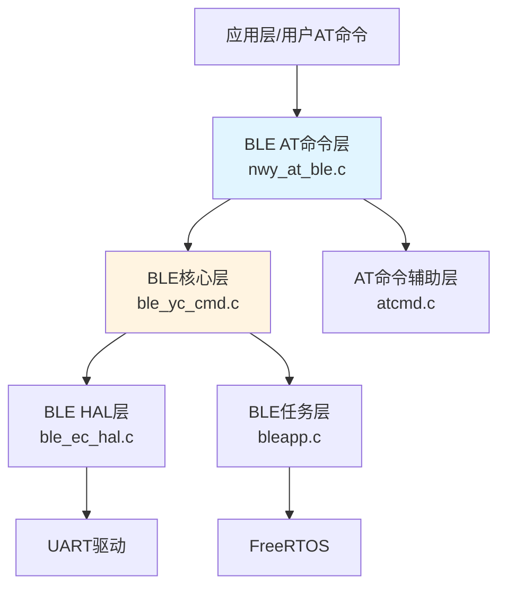
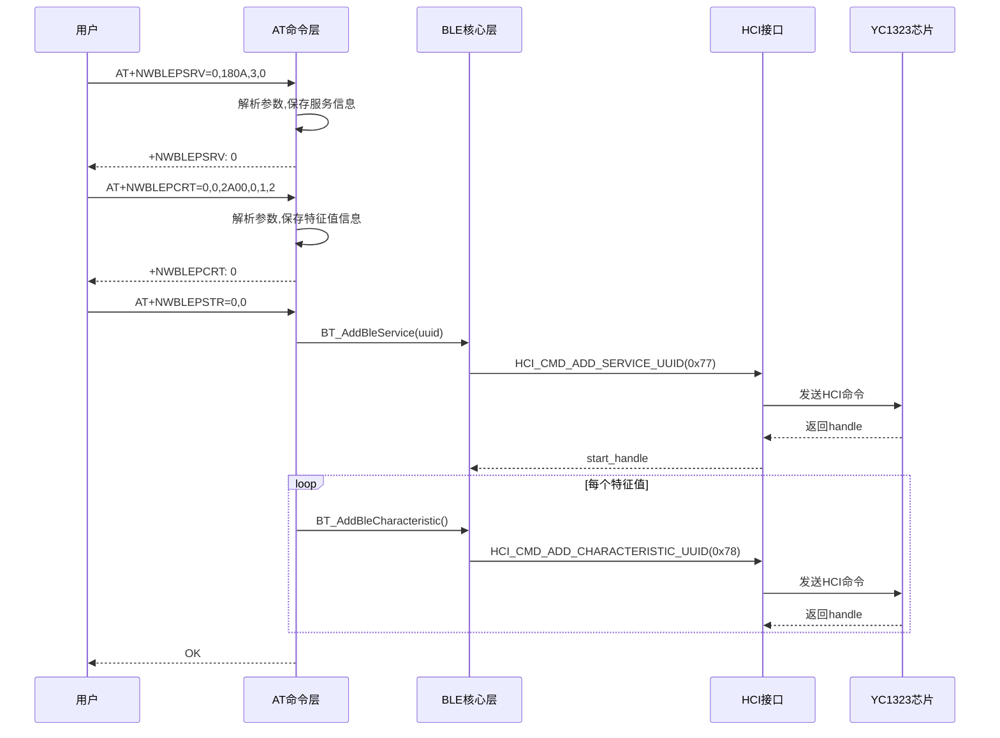
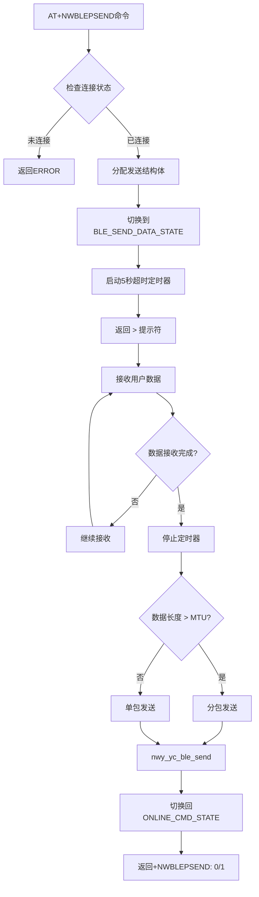

# BLE AT命令模块 - 代码实现总结

## 目录

- [1. 模块概述](#1-模块概述)
  - [1.1 系统定位](#11-系统定位)
  - [1.2 分层架构](#12-分层架构)
  - [1.3 核心组件](#13-核心组件)
- [2. 模块依赖关系](#2-模块依赖关系)
  - [2.1 依赖的基础框架](#21-依赖的基础框架)
  - [2.2 依赖的底层模块](#22-依赖的底层模块)
- [3. 目录结构分析](#3-目录结构分析)
  - [3.1 目录组织](#31-目录组织)
  - [3.2 关键文件说明](#32-关键文件说明)
- [4. 核心数据结构](#4-核心数据结构)
  - [4.1 BLE服务结构 (nwy_ble_srv_t)](#41-ble服务结构-nwy_ble_srv_t)
  - [4.2 BLE特征值结构 (nwy_ble_chara_t)](#42-ble特征值结构-nwy_ble_chara_t)
  - [4.3 BLE发送信息结构 (nwy_ble_send_info_t)](#43-ble发送信息结构-nwy_ble_send_info_t)
  - [4.4 BLE属性总结构 (nwy_ble_t)](#44-ble属性总结构-nwy_ble_t)
  - [4.5 HCI命令结构 (HCI_TypeDef)](#45-hci命令结构-hci_typedef)
- [5. AT命令接口分析](#5-at命令接口分析)
  - [5.1 命令列表](#51-命令列表)
  - [5.2 命令参数定义](#52-命令参数定义)
  - [5.3 核心命令实现](#53-核心命令实现)
- [6. 实现机制解析](#6-实现机制解析)
  - [6.1 BLE服务创建流程](#61-ble服务创建流程)
  - [6.2 BLE数据发送机制](#62-ble数据发送机制)
  - [6.3 状态管理](#63-状态管理)
  - [6.4 HCI命令交互](#64-hci命令交互)
- [7. 配置与编译](#7-配置与编译)
  - [7.1 编译选项](#71-编译选项)
  - [7.2 宏定义](#72-宏定义)
- [8. 扩展点识别](#8-扩展点识别)
  - [8.1 可扩展接口](#81-可扩展接口)
  - [8.2 钩子点](#82-钩子点)
- [9. 关键文件索引](#9-关键文件索引)

---

## 1. 模块概述

### 1.1 系统定位

BLE AT命令模块是EC626项目中AT命令框架的扩展模块，位于 `middleware/eigencomm/at/nwy_at/nwy_ble/` 目录。该模块实现了基于 YC1323 蓝牙芯片的 BLE 外围设备功能，通过 AT 命令接口提供 BLE 广播、连接、服务创建、数据收发等功能。

### 1.2 分层架构



### 1.3 核心组件

| 组件 | 文件路径 | 功能描述 |
|------|----------|----------|
| **nwy_at_ble** | `nwy_at/nwy_ble/src/nwy_at_ble.c` | BLE AT命令处理入口，实现所有BLE相关AT命令 |
| **ble_yc_cmd** | `nwy_at/nwy_ble/src/ble_yc_cmd.c` | YC1323蓝牙芯片命令接口封装 |
| **bleapp** | `nwy_at/nwy_ble/src/bleapp.c` | BLE任务初始化和事件管理 |
| **ble_ec_hal** | `nwy_at/nwy_ble/src/ble_ec_hal.c` | BLE硬件抽象层，UART通信接口 |
| **atcmd** | `nwy_at/nwy_ble/src/atcmd.c` | AT命令辅助函数，配置读写 |

---

## 2. 模块依赖关系

### 2.1 依赖的基础框架

本模块依赖以下模块的实现：

| 框架名 | 依赖方式 | 关键接口 | 参考文档 |
|--------|----------|----------|----------|
| AT框架 | 命令注册 | atcReply(), atGetNumValue(), atGetStrValue() | [AT命令模块.md](./AT命令模块.md) |
| OSAL框架 | 定时器/内存 | osTimerNew(), OsaAllocMemory() | - |
| FreeRTOS | 事件组 | EventGroupHandle_t | - |

### 2.2 依赖的底层模块

| 模块 | 依赖方式 | 关键接口 |
|------|----------|----------|
| BLE HAL | UART通信 | BLE_BUS.send(), BLE_BUS.read() |
| YC1323 HCI | 命令交互 | ble_yc_set(), ble_yc_handle() |

---

## 3. 目录结构分析

### 3.1 目录组织

```
middleware/eigencomm/at/nwy_at/nwy_ble/
├── inc/                          # 头文件目录
│   ├── nwy_at_ble.h              # BLE AT命令接口声明
│   ├── bleapp.h                  # BLE任务接口
│   ├── ble_yc_cmd.h              # YC1323命令接口
│   ├── ble_ec_hal.h              # BLE HAL接口
│   ├── atcmd.h                   # AT辅助函数接口
│   ├── yc1323_bt.h               # YC1323 HCI命令/事件定义
│   ├── atec_ble.h                # BLE配置结构
│   └── bt_patch_*.h              # 蓝牙固件补丁(多版本)
└── src/                          # 源文件目录
    ├── nwy_at_ble.c              # BLE AT命令实现
    ├── bleapp.c                  # BLE任务实现
    ├── ble_yc_cmd.c              # YC1323命令实现
    ├── ble_ec_hal.c              # BLE HAL实现
    └── atcmd.c                   # AT辅助函数实现
```

### 3.2 关键文件说明

| 文件 | 说明 |
|------|------|
| [nwy_at_ble.h](../../PLAT/middleware/eigencomm/at/nwy_at/nwy_ble/inc/nwy_at_ble.h) | BLE AT命令函数声明，核心数据结构定义 |
| [nwy_at_ble.c](../../PLAT/middleware/eigencomm/at/nwy_at/nwy_ble/src/nwy_at_ble.c) | 所有BLE AT命令的实现代码 |
| [ble_yc_cmd.h](../../PLAT/middleware/eigencomm/at/nwy_at/nwy_ble/inc/ble_yc_cmd.h) | YC1323蓝牙芯片命令接口 |
| [yc1323_bt.h](../../PLAT/middleware/eigencomm/at/nwy_at/nwy_ble/inc/yc1323_bt.h) | HCI命令码和事件码定义 |
| [ble_ec_hal.h](../../PLAT/middleware/eigencomm/at/nwy_at/nwy_ble/inc/ble_ec_hal.h) | BLE硬件抽象层接口 |

---

## 4. 核心数据结构

### 4.1 BLE服务结构 (nwy_ble_srv_t)

位置: [nwy_at_ble.h:28](../../PLAT/middleware/eigencomm/at/nwy_at/nwy_ble/inc/nwy_at_ble.h#L28)

```c
typedef struct
{
    uint8_t chara_num;                      // 特征值数量
    uint32_t uuid;                          // 服务UUID
    nwy_ble_chara_t chara[CREATE_CHAR_MAX_NUM]; // 特征值数组(最大5个)
    uint32_t start_handle;                  // 服务起始句柄
    uint32_t end_handle;                    // 服务结束句柄
} nwy_ble_srv_t;
```

### 4.2 BLE特征值结构 (nwy_ble_chara_t)

位置: [nwy_at_ble.h:20](../../PLAT/middleware/eigencomm/at/nwy_at/nwy_ble/inc/nwy_at_ble.h#L20)

```c
typedef struct
{
    uint32_t uuid;                          // 特征值UUID
    uint8_t attribute;                      // 属性
    uint8_t per;                            // 权限: 0=READ, 1=WRITE, 2=W&R
    uint8_t cp;                             // 能力: 0=WRITE, 1=READ, 2=notify, 3=indicate, 4=all
    uint16_t handle;                        // 特征值句柄
} nwy_ble_chara_t;
```

### 4.3 BLE发送信息结构 (nwy_ble_send_info_t)

位置: [nwy_at_ble.h:9](../../PLAT/middleware/eigencomm/at/nwy_at/nwy_ble/inc/nwy_at_ble.h#L9)

```c
typedef struct
{
    UINT16  reqHander;                      // AT请求句柄
    UINT8   srv_id;                         // 服务ID
    UINT8   crt_id;                         // 特征值ID
    UINT8   op;                             // 操作类型: 0=notify, 1=indicate
    UINT8   mode;                           // 数据模式: 0=hex, 1=ascii
    UINT16  totallen;                       // 总数据长度
    UINT8   data[MAX_SEND_LEN*2 + 2];       // 数据缓冲区(最大2048+2字节)
} nwy_ble_send_info_t;
```

### 4.4 BLE属性总结构 (nwy_ble_t)

位置: [nwy_at_ble.h:37](../../PLAT/middleware/eigencomm/at/nwy_at/nwy_ble/inc/nwy_at_ble.h#L37)

```c
typedef struct
{
    nwy_ble_srv_t srv[CREATE_SRV_MAX_NUM];  // 服务数组(最大2个)
    uint8_t srv_num;                        // 服务数量
} nwy_ble_t;
```

### 4.5 HCI命令结构 (HCI_TypeDef)

位置: [yc1323_bt.h:155](../../PLAT/middleware/eigencomm/at/nwy_at/nwy_ble/inc/yc1323_bt.h#L155)

```c
typedef struct
{
    uint8_t type;                           // 类型: HCI_CMD/HCI_EVENT
    uint8_t opcode;                         // 操作码
    uint8_t DataLen;                        // 数据长度
    uint8_t *p_data;                        // 数据指针
} HCI_TypeDef;
```

---

## 5. AT命令接口分析

### 5.1 命令列表

| 命令 | 功能 | 实现函数 |
|------|------|----------|
| +NWBTBLEPWR | BLE电源开关 | AT_CmdFunc_NWY_NWBTBLEPWR |
| +NWBTBLENAME | 设置/查询BLE名称 | AT_CmdFunc_NWY_NWBTBLENAME |
| +NWBTBLEMAC | 查询BLE MAC地址 | AT_CmdFunc_NWY_NWBTBLEMAC |
| +NWBLEADV | 设置广播间隔 | AT_CmdFunc_NWY_NWBLEADV |
| +NWBLEADVEN | 开启/关闭广播 | AT_CmdFunc_NWY_NWBLEADVEN |
| +NWBLEPSRV | 创建BLE服务 | AT_CmdFunc_NWY_NWBLEPSRV |
| +NWBLEPCRT | 创建特征值 | AT_CmdFunc_NWY_NWBLEPCRT |
| +NWBLEPSTR | 启动服务 | AT_CmdFunc_NWY_NWBLEPSTR |
| +NWBLESRVRM | 删除服务 | AT_CmdFunc_NWY_NWBLESRVRM |
| +NWBLECRTRM | 删除特征值 | AT_CmdFunc_NWY_NWBLECRTRM |
| +NWBLEDISCON | 断开BLE连接 | AT_CmdFunc_NWY_NWBLEDISCON |
| +NWBLEADVDATA | 设置广播数据 | AT_CmdFunc_NWY_NWBLEADVDATA |
| +NWBLEPSEND | 发送BLE数据 | AT_CmdFunc_NWY_NWBLEPSEND |
| +NWBLEPWRITE | 写特征值 | AT_CmdFunc_NWY_NWBLEPWRITE |
| +NWBLERCVMODE | 设置接收模式 | AT_CmdFunc_NWY_NWBLERCVMODE |
| +NWBLESLEEP | BLE睡眠 | AT_CmdFunc_NWY_NWBLESLEEP |
| +NFTBTMAC | 设置/查询工厂MAC | AT_CmdFunc_NWY_NFTBTMAC |
| +NFTBTVER | 查询固件版本 | AT_CmdFunc_NWY_NFTBTVER |

### 5.2 命令参数定义

位置: [atec_cust_cmd_table.c:1233-1256](../../PLAT/middleware/eigencomm/at/atcust/src/atec_cust_cmd_table.c#L1233)

```c
// +NWBTBLEPWR: <mode>
static AtValueAttr attrNWBTBLEPWR[] = { 
    AT_PARAM_ATTR_DEF(AT_DEC_VAL, AT_MUST_VAL)
};

// +NWBLEPSRV: <app_id>,<uuid>,<chara_num>,<p>
static AtValueAttr attrNWBLEPSRV[] = { 
    AT_PARAM_ATTR_DEF(AT_DEC_VAL, AT_MUST_VAL),
    AT_PARAM_ATTR_DEF(AT_STR_VAL, AT_MUST_VAL),
    AT_PARAM_ATTR_DEF(AT_DEC_VAL, AT_MUST_VAL),
    AT_PARAM_ATTR_DEF(AT_DEC_VAL, AT_MUST_VAL)
};

// +NWBLEPCRT: <app_id>,<srv_id>,<uuid>,<slt>,<per>,<cp>
static AtValueAttr attrNWBLEPCRT[] = {
    AT_PARAM_ATTR_DEF(AT_DEC_VAL, AT_MUST_VAL),
    AT_PARAM_ATTR_DEF(AT_DEC_VAL, AT_MUST_VAL),
    AT_PARAM_ATTR_DEF(AT_STR_VAL, AT_MUST_VAL),
    AT_PARAM_ATTR_DEF(AT_DEC_VAL, AT_MUST_VAL),
    AT_PARAM_ATTR_DEF(AT_DEC_VAL, AT_MUST_VAL),
    AT_PARAM_ATTR_DEF(AT_DEC_VAL, AT_MUST_VAL)
};

// +NWBLEPSTR: <app_id>,<srv_id>
static AtValueAttr attrNWBLEPSTR[] = {
    AT_PARAM_ATTR_DEF(AT_DEC_VAL, AT_MUST_VAL),
    AT_PARAM_ATTR_DEF(AT_DEC_VAL, AT_MUST_VAL)
};

// +NWBLEPSEND: <srv_id>,<crt_id>,<op>,<mode>,<len>
static AtValueAttr attrNWBLEPSEND[] = {
    AT_PARAM_ATTR_DEF(AT_DEC_VAL, AT_MUST_VAL),
    AT_PARAM_ATTR_DEF(AT_DEC_VAL, AT_MUST_VAL),
    AT_PARAM_ATTR_DEF(AT_DEC_VAL, AT_MUST_VAL),
    AT_PARAM_ATTR_DEF(AT_DEC_VAL, AT_MUST_VAL),
    AT_PARAM_ATTR_DEF(AT_DEC_VAL, AT_MUST_VAL)
};
```

### 5.3 核心命令实现

#### +NWBLEPSRV (创建BLE服务)

位置: [nwy_at_ble.c:374](../../PLAT/middleware/eigencomm/at/nwy_at/nwy_ble/src/nwy_at_ble.c#L374)

**命令格式**: `AT+NWBLEPSRV=<app_id>,<uuid>,<chara_num>,<p>`

**参数说明**:
| 参数 | 类型 | 范围 | 说明 |
|------|------|------|------|
| app_id | DEC | 0-1 | 应用ID |
| uuid | HEX | - | 服务UUID(16位) |
| chara_num | DEC | 1-5 | 特征值数量 |
| p | DEC | 0-1 | 主服务标志 |

**实现逻辑**:
1. 解析4个参数
2. 检查服务UUID是否已存在
3. 查找空闲服务槽位(最大2个)
4. 保存服务UUID和特征值数量
5. 返回服务索引

**关键代码片段**:
```c
// 查找已存在的服务
for(int i = 0; i < CREATE_SRV_MAX_NUM; i++)
{
    if(g_nwy_ble_att.srv[i].uuid == srv_uuid)
    {
        ser_index = i;
        uuid_index = i+1;
        break;
    }
}

// 查找空闲槽位
if(uuid_index == 0)
{
    for(int i = 0; i < CREATE_SRV_MAX_NUM; i++)
    {
        if(g_nwy_ble_att.srv[i].uuid == 0)
        {
            ser_index = i;
            uuid_index = i;
            break;
        }
    }
}

// 保存服务信息
g_nwy_ble_att.srv_num += 1;
g_nwy_ble_att.srv[ser_index].uuid = srv_uuid;
g_nwy_ble_att.srv[ser_index].chara_num = chara_num;
```

#### +NWBLEPCRT (创建特征值)

位置: [nwy_at_ble.c:473](../../PLAT/middleware/eigencomm/at/nwy_at/nwy_ble/src/nwy_at_ble.c#L473)

**命令格式**: `AT+NWBLEPCRT=<app_id>,<srv_id>,<uuid>,<slt>,<per>,<cp>`

**参数说明**:
| 参数 | 类型 | 范围 | 说明 |
|------|------|------|------|
| app_id | DEC | 0-1 | 应用ID |
| srv_id | DEC | 0-5 | 服务ID |
| uuid | HEX | - | 特征值UUID |
| slt | DEC | 0-1 | 槽位 |
| per | DEC | 0-3 | 权限 |
| cp | DEC | 0-5 | 能力 |

**实现逻辑**:
1. 解析6个参数
2. 检查服务的特征值数量限制
3. 查找空闲特征值槽位
4. 保存特征值UUID、权限、能力

#### +NWBLEPSTR (启动服务)

位置: [nwy_at_ble.c:607](../../PLAT/middleware/eigencomm/at/nwy_at/nwy_ble/src/nwy_at_ble.c#L607)

**命令格式**: `AT+NWBLEPSTR=<app_id>,<srv_id>`

**实现逻辑**:
1. 调用 `BT_AddBleService()` 添加服务到蓝牙芯片
2. 遍历服务的所有特征值
3. 根据特征值能力(cp)设置属性标志
4. 调用 `BT_AddBleCharacteristic()` 添加特征值

**能力标志映射**:
| cp值 | 属性标志 | 说明 |
|------|----------|------|
| 0 | 0x08 | WRITE |
| 1 | 0x02 | READ |
| 2 | 0x10 | NOTIFY |
| 3 | 0x20 | INDICATE |
| 4 | 0x2A | ALL |

#### +NWBLEPSEND (发送数据)

位置: [nwy_at_ble.c:981](../../PLAT/middleware/eigencomm/at/nwy_at/nwy_ble/src/nwy_at_ble.c#L981)

**命令格式**: `AT+NWBLEPSEND=<srv_id>,<crt_id>,<op>,<mode>,<len>`

**参数说明**:
| 参数 | 类型 | 范围 | 说明 |
|------|------|------|------|
| srv_id | DEC | 0-2 | 服务ID |
| crt_id | DEC | 0-4 | 特征值ID |
| op | DEC | 0-1 | 0=notify, 1=indicate |
| mode | DEC | 0-1 | 0=hex, 1=ascii |
| len | DEC | 1-1024 | 数据长度 |

**实现逻辑**:
1. 检查BLE连接状态
2. 分配发送信息结构体
3. 切换通道到 `ATC_BLE_SEND_DATA_STATE`
4. 启动5秒超时定时器
5. 返回 `>` 提示符等待数据输入
6. 数据接收完成后分包发送(MTU限制)

---

## 6. 实现机制解析

### 6.1 BLE服务创建流程



### 6.2 BLE数据发送机制



**分包发送逻辑**:
```c
if(g_nwy_ble_send_info->totallen <= g_ble_mtu)
{
    // 单包发送
    result = nwy_ble_data_send(srv_id, crt_id, op, data, totallen);
}
else
{
    // 分包发送
    pack = totallen / g_ble_mtu;
    for(i = 0; i < pack; i++)
    {
        memcpy(send_buf, data + i*g_ble_mtu, g_ble_mtu);
        result = nwy_ble_data_send(srv_id, crt_id, op, send_buf, g_ble_mtu);
    }
    // 发送剩余数据
    if(totallen % g_ble_mtu > 0)
    {
        send_length = totallen % g_ble_mtu;
        memcpy(send_buf, data + i*g_ble_mtu, send_length);
        result = nwy_ble_data_send(srv_id, crt_id, op, send_buf, send_length);
    }
}
```

### 6.3 状态管理

**全局状态变量**:
| 变量 | 类型 | 说明 |
|------|------|------|
| g_nwy_ble_work_status | uint8_t | BLE工作状态: 0=关闭, 1=开启, 2=重启中 |
| g_nwy_ble_recv_mode | uint8_t | 接收模式: 0=hex, 1=ascii |
| g_nwy_ble_conn_state | uint8_t | 连接状态: 0=断开, 1=已连接 |
| g_adv_status | uint8_t | 广播状态 |
| g_ble_mtu | uint8_t | 当前MTU值(默认23) |
| g_nwy_ble_att | nwy_ble_t | BLE属性数据库 |
| g_ble_add_srv | uint8_t[2] | 服务添加标志 |

**状态设置/获取接口**:
```c
void nwy_ble_status_set(uint8_t status);
uint8_t nwy_ble_status_get(void);
void nwy_ble_conn_state_set(uint8_t state);
uint8_t nwy_ble_conn_state_get(void);
void nwy_ble_mtu_set(uint8_t mtu);
uint8_t nwy_ble_mtu_get(void);
void nwy_ble_recvmode_set(uint8_t recvmode);
uint8_t nwy_ble_recvmode_get(void);
```

### 6.4 HCI命令交互

**关键HCI命令码**:
| 命令码 | 名称 | 说明 |
|--------|------|------|
| 0x01 | HCI_CMD_SET_BLE_ADDR | 设置BLE地址 |
| 0x04 | HCI_CMD_SET_BLE_NAME | 设置BLE名称 |
| 0x09 | HCI_CMD_SEND_BLE_DATA | 发送BLE数据 |
| 0x12 | HCI_CMD_BLE_DISCONNECT | 断开BLE连接 |
| 0x27 | HCI_CMD_ENTER_SLEEP_MODE | 进入睡眠模式 |
| 0x34 | HCI_CMD_LE_SET_ADV_DATA | 设置广播数据 |
| 0x37 | HCI_CMD_LE_SET_ADV_PARM | 设置广播参数 |
| 0x77 | HCI_CMD_ADD_SERVICE_UUID | 添加服务UUID |
| 0x78 | HCI_CMD_ADD_CHARACTERISTIC_UUID | 添加特征值UUID |

**关键HCI事件码**:
| 事件码 | 名称 | 说明 |
|--------|------|------|
| 0x02 | HCI_EVENT_BLE_CONNECTED | BLE连接建立 |
| 0x05 | HCI_EVENT_BLE_DISCONNECTED | BLE连接断开 |
| 0x06 | HCI_EVENT_CMD_COMPLETE | 命令完成 |
| 0x08 | HCI_EVENT_BLE_DATA_RECEIVED | 接收BLE数据 |
| 0x29 | HCI_EVENT_UUID_HANDLE | UUID句柄返回 |
| 0x45 | HCI_BLE_UPDATE_MTU_EVENT | MTU更新事件 |

---

## 7. 配置与编译

### 7.1 编译选项

在 `nwy_project.mk` 中配置:

```makefile
FEATURE_NWY_BLE_ENABLE    # BLE功能总开关
```

### 7.2 宏定义

| 宏 | 默认值 | 说明 |
|---|--------|------|
| MAX_SEND_LEN | 1024 | 最大发送长度 |
| BLE_MTU | 247 | BLE MTU大小 |
| CREATE_SRV_MAX_NUM | 2 | 最大服务数量 |
| CREATE_CHAR_MAX_NUM | 5 | 每服务最大特征值数量 |
| BLE_YC_PATCH_VER | 3784 | 蓝牙固件版本 |
| BLE_UART_BAUD_RATE | 115200 | BLE UART波特率 |
| BLE_TXPWR_LEVEL | 5 | 发射功率级别 |
| YC_TASK_STATK_SIZE | 6144 | BLE任务栈大小 |
| BLE_CMD_RETRY_MAX | 3 | 命令重试次数 |

---

## 8. 扩展点识别

### 8.1 可扩展接口

#### 添加新的BLE AT命令

1. **定义命令处理函数**:
```c
CmsRetId AT_CmdFunc_NWY_NEWBLECMD(const AtCmdInputContext *pAtCmdReq)
{
    UINT32 atHandle = AT_SET_SRC_HANDLER(pAtCmdReq->tid, CMS_DEFAULT_SUB_AT_ID, pAtCmdReq->chanId);
    // 实现逻辑
    return atcReply(atHandle, AT_RC_OK, 0, NULL);
}
```

2. **定义参数属性**:
```c
static AtValueAttr attrNEWBLECMD[] = {
    AT_PARAM_ATTR_DEF(AT_DEC_VAL, AT_MUST_VAL),
};
```

3. **注册到命令表** (atec_cust_cmd_table.c):
```c
AT_CMD_PRE_DEFINE("+NEWBLECMD", AT_CmdFunc_NWY_NEWBLECMD, 
                  attrNEWBLECMD, AT_EXT_PARAM_CMD, AT_DEFAULT_TIMEOUT_SEC)
```

#### 添加新的HCI命令

在 `ble_yc_cmd.c` 中添加:
```c
uint8_t ble_yc_newCmd(uint8_t *data, uint8_t len)
{
    return ble_yc_set(&yc_bus, HCI_CMD_NEW_CMD, data, len);
}
```

### 8.2 钩子点

| 钩子点 | 接口 | 说明 |
|--------|------|------|
| BLE连接事件 | HCI_EVENT_BLE_CONNECTED | 可扩展连接后处理 |
| BLE断开事件 | HCI_EVENT_BLE_DISCONNECTED | 可扩展断开后处理 |
| BLE数据接收 | HCI_EVENT_BLE_DATA_RECEIVED | 可扩展数据处理 |
| MTU更新 | HCI_BLE_UPDATE_MTU_EVENT | 可扩展MTU协商处理 |

---

## 9. 关键文件索引

| 文件路径 | 说明 |
|----------|------|
| [nwy_at_ble.h](../../PLAT/middleware/eigencomm/at/nwy_at/nwy_ble/inc/nwy_at_ble.h) | BLE AT命令接口声明 |
| [nwy_at_ble.c](../../PLAT/middleware/eigencomm/at/nwy_at/nwy_ble/src/nwy_at_ble.c) | BLE AT命令实现 |
| [ble_yc_cmd.h](../../PLAT/middleware/eigencomm/at/nwy_at/nwy_ble/inc/ble_yc_cmd.h) | YC1323命令接口 |
| [yc1323_bt.h](../../PLAT/middleware/eigencomm/at/nwy_at/nwy_ble/inc/yc1323_bt.h) | HCI命令/事件定义 |
| [ble_ec_hal.h](../../PLAT/middleware/eigencomm/at/nwy_at/nwy_ble/inc/ble_ec_hal.h) | BLE HAL接口 |
| [bleapp.h](../../PLAT/middleware/eigencomm/at/nwy_at/nwy_ble/inc/bleapp.h) | BLE任务接口 |
| [atcmd.h](../../PLAT/middleware/eigencomm/at/nwy_at/nwy_ble/inc/atcmd.h) | AT辅助函数接口 |

---

*文档生成时间: 2026-06-01*
*基于项目: EC626 PLAT*
*分析模块: BLE AT命令模块 (NWBLEPSRV相关)*
