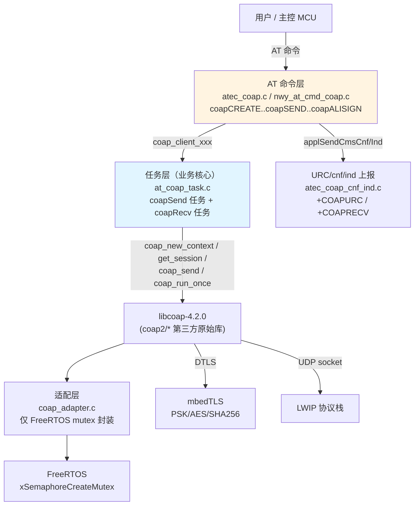
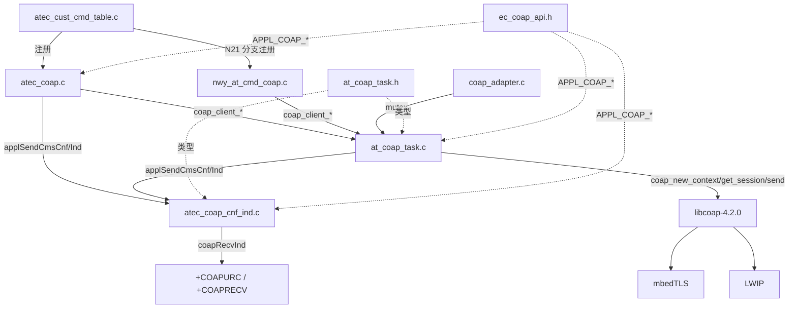
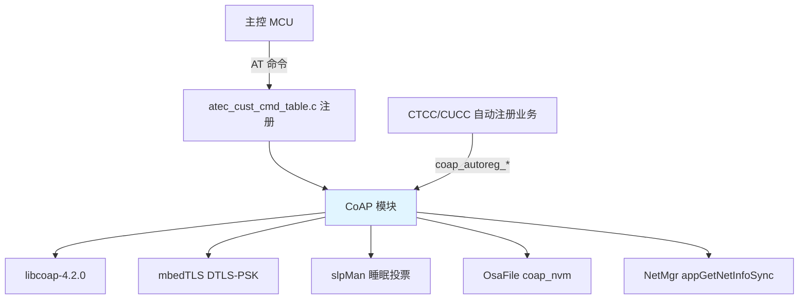
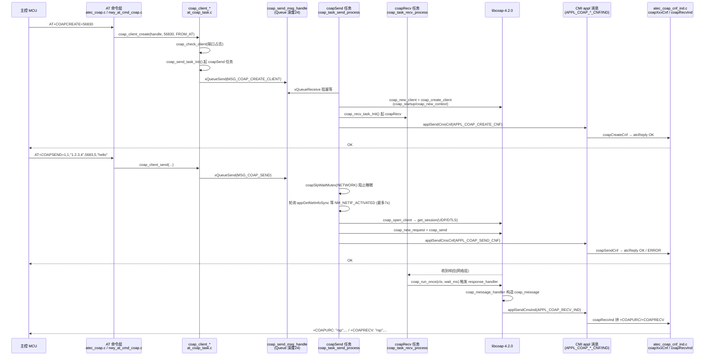
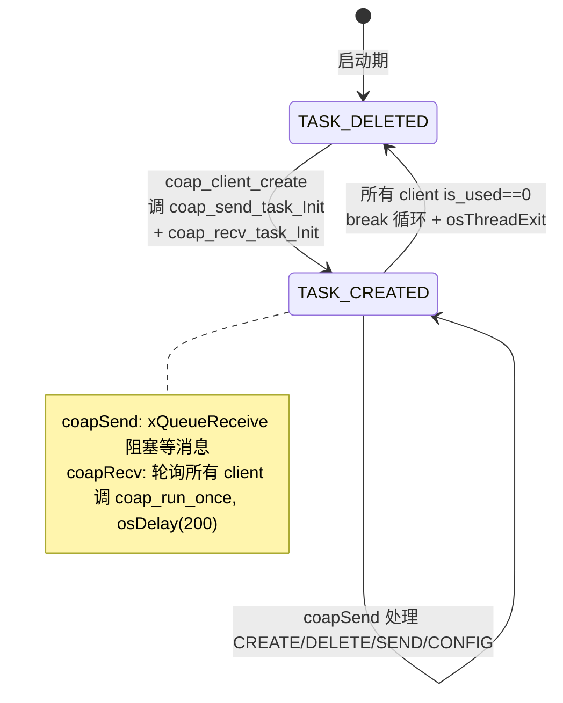
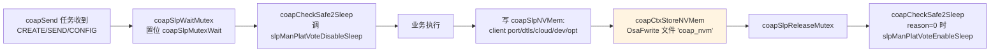

# CoAP 模块代码架构总结

## 目录
- [文档信息](#文档信息)
- [1. 参考文档](#1-参考文档)
- [2. 架构概述](#2-架构概述)
- [3. 代码结构](#3-代码结构)
- [4. 模块依赖关系](#4-模块依赖关系)
- [5. 核心数据结构](#5-核心数据结构)
- [6. 关键接口分析](#6-关键接口分析)
- [7. 实现机制解析](#7-实现机制解析)
- [8. 关键日志检索字段](#8-关键日志检索字段)
- [9. 配置与编译](#9-配置与编译)
- [附录 A. 术语表](#附录-a-术语表)
- [附录 B. 扩展点](#附录-b-扩展点)

---

## 文档信息

- **模块名称**：CoAP 模块（含 AT 命令层 / 收发任务 / N21 兼容层 / 适配层全栈）
- **代码路径**：
  - AT 命令层：`D:\EC626\PLAT\middleware\eigencomm\at\atcust\src\atec_coap.c`
  - URC/cnf/ind 上报：`D:\EC626\PLAT\middleware\eigencomm\at\atcust\src\cnfind\atec_coap_cnf_ind.c`
  - AT 命令注册表：`D:\EC626\PLAT\middleware\eigencomm\at\atcust\src\atec_cust_cmd_table.c`（行 1692–1715）
  - 收发任务 + 上层 API（业务核心）：`D:\EC626\PLAT\middleware\eigencomm\at\atentity\src\at_coap_task.c`（3638 行）
  - N21 兼容层：`D:\EC626\PLAT\middleware\eigencomm\at\nwy_at\nwy_n21_coap\src\nwy_at_cmd_coap.c`（1033 行）
  - 适配层：`D:\EC626\PLAT\middleware\thirdparty\libcoap\coap_adapter\coap_adapter.c`（仅 mutex 封装）
- **所属平台**：EC626（EigenComm，ARM Cortex-M + FreeRTOS）
- **分析日期**：2026-06-19
- **代码版本/标签**：master / 含 N21 兼容编译开关 `FEATURE_NWY_AT_COAP_COMPATIBLE_N21`

## 1. 参考文档

| 文档名称 | 类型 | 来源 | 参考内容 |
|---------|------|------|---------|
| `code-summary-template.md` | 模板 | spec-code-summary/references | 章节骨架与 §8 字面量规矩 |

全新分析，未引用已有平台知识库文档。

## 2. 架构概述

### 2.1 系统定位

CoAP 模块是 EC626 平台面向轻量物联网协议（Constrained Application Protocol, RFC 7252）的业务实现，定位为 **AT 命令驱动的 CoAP 客户端**，支持：
- 单 CoAP 客户端实例（`COAP_CLIENT_NUMB_MAX = 1`）。
- UDP / DTLS(PSK) 两种传输，DTLS 基于 mbedTLS（`FEATURE_MBEDTLS_ENABLE`）。
- CON / NON / ACK / RST 四种消息类型；阿里云 / OneNet / Eclipse / 普通 4 类云端对接（含阿里 HMAC-SHA1 签名 `+COAPALISIGN`）。
- 深度睡眠（SLP2）保活：睡眠前把 client ctx 持久化到 NV 文件 `coap_nvm`，唤醒后由 `coapCtxRestore()` 自动重建。
- 自动注册（CTCC/CUCC DM）通道：`coap_autoreg_*` 一套独立收发逻辑。

### 2.2 分层架构（全栈链路）



> **重要纠正**：上一轮分析只看了 `coap_adapter.c`（46 行的薄封装）就当业务，导致漏掉真正的业务入口（AT 命令层）和业务核心（收发任务层）。本轮把全栈 6 类文件纳入。其中 `ec_coap_api.c` 实际是**空文件（仅 6 行注释）**，业务上层的真实 API 是 `at_coap_task.c` 里的 `coap_client_*` 系列；`ec_coap_api.h` 只放 `APPL_COAP_*_REQ/CNF/IND` 原语 ID 枚举与 `atCoapError` 错误码。

### 2.3 核心组件

| 组件 | 职责 | 关键文件:行 |
|------|------|------|
| AT 命令处理 | 解析 AT 入参 → 调 `coap_client_*` | `atec_coap.c:42` `coapCREATE` 等 |
| N21 兼容 AT 命令 | 把 Neoway N21 命令名（`+COAPOPEN/+COAPCLOSE`）映射到同一套 `coap_client_*`，并把 URC 改成 `+COAPRECV` | `nwy_at_cmd_coap.c:121` `nwy_at_cmd_coapopen` |
| 收发任务（业务核心） | `coapSend` 任务消费 `coap_send_msg` 队列、`coapRecv` 任务循环 `coap_run_once` 收响应 | `at_coap_task.c:1959` `coap_task_recv_process` / `:2009` `coap_task_send_process` |
| URC 上报 | cnf/ind 路由表 + 拼 `+COAPURC`/`+COAPRECV` 字符串 | `atec_coap_cnf_ind.c:242` `coapRecvInd` |
| 睡眠 / NV 持久化 | client ctx 落 `coap_nvm` 文件 + 投票 SLP2 | `at_coap_task.c:3103` `COAP_CLIENT_SLEEP_INTERFACE` 段 |
| 阿里签名 / DTLS-PSK | HMAC-SHA1 算 clientId / `psk_identity` | `at_coap_task.c:865` `coap_get_dtls_key` |
| 第三方原始库 | libcoap-4.2.0 协议状态机、er-coap-13、mbedTLS | 不深入，仅在 §4 提及 |

## 3. 代码结构

> 6 类文件按「业务入口 → 业务核心 → 兼容 → 适配 → 第三方」分层。优先级标注分析顺序。

### 3.1 目录组织（实际项目布局）

```
D:\EC626\PLAT\middleware\
├── eigencomm\at\
│   ├── atcust\src\
│   │   ├── atec_coap.c              # AT 命令处理（标准 EC 风格）
│   │   ├── atec_cust_cmd_table.c    # 全局命令注册表（CoAP 段 1692–1715 行）
│   │   └── cnfind\atec_coap_cnf_ind.c   # cnf/ind 上报（含 URC 字符串拼接）
│   ├── atcust\inc\
│   │   ├── atec_coap.h              # AT 命令参数宏 + coap_send_data 结构
│   │   └── cnfind\atec_coap_cnf_ind.h
│   ├── atentity\src\at_coap_task.c  # ★ 3638 行业务核心（任务+API+睡眠+NV）
│   ├── atentity\inc\at_coap_task.h  # 核心类型 / 枚举 / API 声明
│   └── nwy_at\nwy_n21_coap\src\nwy_at_cmd_coap.c  # N21 兼容 AT 命令
├── eigencomm\ecapi\appmwapi\
│   ├── src\ec_coap_api.c            # ⚠ 实际为空文件（仅 6 行注释）
│   └── inc\ec_coap_api.h            # APPL_COAP_* 原语 ID 枚举 + atCoapError 错误码
└── thirdparty\libcoap\
    ├── coap_adapter\coap_adapter.c   # 仅 FreeRTOS mutex 封装（46 行）
    ├── libcoap-4.2.0\               # 第三方原始库（不深入）
    └── er-coap-13\                  # 第三方原始库（不深入）
```

### 3.2 关键文件索引

| 分类 | 文件路径 | 核心内容 | 优先级 | 行数 |
|------|----------|----------|--------|------|
| AT 命令处理 | `atcust\src\atec_coap.c` | 9 个 `+COAPxxx` 命令处理函数、`coapSENDInputData`（流式 `>` 数据） | P0 | 919 |
| AT 命令参数 | `atcust\inc\atec_coap.h` | 各命令参数 min/max/def 宏 + `coap_send_data` 结构 | P0 | 154 |
| AT 命令注册 | `atcust\src\atec_cust_cmd_table.c` | `+COAPCREATE..+COAPALISIGN` 注册（或 N21 分支） | P1 | 段 1692–1715 |
| URC/cnf/ind 上报 | `atcust\src\cnfind\atec_coap_cnf_ind.c` | cnf/ind 路由表、`coapRecvInd` 拼 `+COAPURC`/`+COAPRECV` | P0 | 535 |
| 业务核心实现 | `atentity\src\at_coap_task.c` | `coap_client_*` API、coapSend/coapRecv 任务、睡眠投票、`coap_nvm` 持久化 | P0 | 3638 |
| 核心类型 | `atentity\inc\at_coap_task.h` | `coap_client`、`coap_send_msg`、`coapSlpCtx_t`、错误码枚举 | P0 | 440 |
| N21 兼容层 | `nwy_at\nwy_n21_coap\src\nwy_at_cmd_coap.c` | `+COAPOPEN/+COAPCLOSE/+COAPSENDBIN` 等 N21 风格命令 | P1 | 1033 |
| 原语 ID/错误码 | `ecapi\appmwapi\inc\ec_coap_api.h` | `APPL_COAP_*_REQ/CNF/IND`、`atCoapError` | P1 | 118 |
| 空占位文件 | `ecapi\appmwapi\src\ec_coap_api.c` | **空文件**（仅 6 行注释） | — | 6 |
| 适配层 | `thirdparty\libcoap\coap_adapter\coap_adapter.c` | FreeRTOS mutex 封装（`xSemaphoreCreateMutex`） | P3 | 46 |
| 第三方原始库 | `libcoap-4.2.0\`、`er-coap-13\` | libcoap 协议状态机 | 仅 §4 提及 | — |

### 3.3 文件依赖关系图



## 4. 模块依赖关系

### 4.1 依赖的基础框架

| 框架名 | 依赖方式 | 关键接口 | 参考文档 |
|--------|----------|----------|----------|
| libcoap-4.2.0 | 静态链接第三方原始库 | `coap_startup` / `coap_new_context` / `get_session` / `coap_new_request` / `coap_send` / `coap_run_once` / `coap_register_response_handler` | 第三方，不深入 |
| er-coap-13 | 第三方原始库 | （老版本 CoAP 实现，编译开关控制） | 第三方 |
| mbedTLS | `FEATURE_MBEDTLS_ENABLE`，DTLS-PSK + 阿里 AES/SHA | `mbedtls_sha256` / `mbedtls_aes_*` | 第三方 |
| FreeRTOS / CMSIS-RTOS2 | 任务/队列/信号量 | `osThreadNew` / `xQueueCreate` / `xQueueSend` / `xQueueReceive` / `xSemaphoreCreateMutex` | 平台基础 |
| LWIP | socket 接口 | `inet_aton` / `sock_get_errno` / `getaddrinfo` | 平台基础 |
| slpMan（睡眠管理） | 平台投票接口 | `slpManApplyPlatVoteHandle("COAP",...)` / `slpManPlatVoteEnableSleep` / `slpManPlatVoteDisableSleep` / `slpManGetLastSlpState` | 平台基础 |
| OsaFile（文件系统） | NV 持久化 | `OsaFopen("coap_nvm",...)` / `OsaFread` / `OsaFwrite` | 平台基础 |
| NetMgr | PS 网络状态 | `appGetNetInfoSync`（查 `NM_NETIF_ACTIVATED`） | 平台基础 |
| CMI / appl 消息机制 | AT ↔ 任务的异步原语通道 | `applSendCmsCnf` / `applSendCmsInd` + `APPL_COAP_*_CNF/IND` 原语 ID | 平台基础 |
| ECOMM_TRACE/STRING | 日志宏 | 模块 ID `UNILOG_COAP` / `UNILOG_ONENET` / `UNILOG_PLA_APP` | 平台基础 |

### 4.2 模块依赖关系图



## 5. 核心数据结构

> 全部出自 `at_coap_task.h`，少数出自 `atec_coap.h`。

### 5.1 结构体定义

| 结构体 | 主要字段 | 用途 | 生命周期 | 出处 |
|--------|----------|------|----------|------|
| `coap_client` | `is_used` / `is_connected` / `coap_id` / `coap_ctx` / `coap_session` / `coap_optlist` / `coap_dst` / `coap_dev` / `cloud` / `encrypt` / `dtls_flag` / `showra` / `showrspopt` | 单 CoAP 客户端上下文（含 libcoap ctx/session、目标地址、设备凭证） | create→delete | at_coap_task.h:285 |
| `coap_send_msg` | `cmd_type`(MSG_COAP_*) / `client_ptr` / `reqhandle` / `coap_msgtype` / `coap_method` / `coap_payload` / `coap_dst` / `raiFlag` / `coapCnf` / `isRestore` | 任务队列消息（AT 层 → coapSend 任务） | 单次 send | at_coap_task.h:227 |
| `coap_message` | `msg_type` / `msg_method` / `msg_id` / `server_ip` / `server_port` / `coap_payload` / `coap_token` / `recv_optlist_buf` / `showra` / `showrspopt` | 收到响应后上报 URC 用的载荷 | 单次 ind | at_coap_task.h:255 |
| `coap_config` | `mode`(COAP_CFG_*) / `dec_para1..3` / `str_para1` | addres/head/option/cfg 配置项 | 单次 config | at_coap_task.h:217 |
| `coap_dev_info` | `device_id` / `device_name` / `device_scret` / `product_key` / `seq` / `psk_key` | 阿里/OneNet 设备凭证 | create→delete | at_coap_task.h:275 |
| `coapSlpCtxBody_t` | `coap_id` / `handle` / `coap_local_port` / `dtls_flag` / `cloud` / `encrypt` / `coap_resource` / `coap_head` / `coap_opt[20]` / `coap_dev` | 睡眠前持久化的单 client 快照 | 跨睡眠 | at_coap_task.h:368 |
| `coapSlpCtx_t` | `restoreFlag` / `body_len` / `memcleared`(0xAABB) / `needRestoreConfig` / `body[1]` | NV 文件 `coap_nvm` 整体结构 | 跨睡眠 | at_coap_task.h:386 |
| `coapSlpNVMem_t` | `ctx_valid` / `coapSlpCtx` | 运行期 NV 缓存（含是否已 restore 标志） | 进程期 | at_coap_task.h:397 |
| `coapClientSlpInfo_t` | `wait_msg` / `last_msg_type` / `timeout_vaild` / `timeout` | 每 client 的睡眠投票依据（CON 等待） | 运行期 | at_coap_task.h:403 |
| `coap_send_data` | `chanId` / `reqHandle` / `msg_type` / `msg_method` / `port` / `ip_addr` | `+COAPSEND` 流式输入态暂存（`>` 模式） | 单次输入 | atec_coap.h:125 |

### 5.2 枚举类型

| 枚举 | 值域 | 用途 | 出处 |
|------|------|------|------|
| `enum COAP_RC` | `COAP_OK=100` / `COAP_ERR` / `COAP_RECREATE` / `COAP_FULL` / `COAP_CLIENT_ERR` / `COAP_URI_ERR` / `COAP_IP_ERR` / `COAP_NETWORK_ERR` / `COAP_DNS_ERR` / `COAP_CONTEXT_ERR` / `COAP_SESSION_ERR` / `COAP_TASK_ERR` / `COAP_RECONNECT` / `COAP_SEND_NOT_END_ERR` / `COAP_SEND_CONTINUE` / `COAP_NULL` | 内部返回码 | at_coap_task.h:102 |
| `enum COAP_MSG_CMD` | `MSG_COAP_RESERVE/CREATE_CLIENT/DELETE_CLIENT/SEND/ADD_RES/HEAD/OPTION/CONFIG/ALISIGN` | 任务队列消息类型 | at_coap_task.h:122 |
| `enum COAP_CLIENT` | `COAP_CLIENT_NOT_USED / USED / IS_CREATING` | client 槽位使用状态 | at_coap_task.h:136 |
| `enum COAP_CONNECT` | `COAP_CONN_NOT_CONNECTED / CONNECTED / IS_CONNECTING` | 连接状态 | at_coap_task.h:143 |
| `enum COAP_STATUS` | `COAP_TASK_STAT_NULL / CREATE / DELETE` | 收/发任务状态 | at_coap_task.h:156 |
| `enum COAP_CFG` | `COAP_CFG_ADDRES / HEAD / OPTION / SHOW / CLOUD / ALISIGN` | config 分类 | at_coap_task.h:170 |
| `enum COAP_SHOW_CFG` | `COAP_SHOW_SHOWRA=1 / SHOWRSPOPT` | `+COAPCFG` 的 showra/showrspopt 开关 | at_coap_task.h:180 |
| `enum COAP_CLOUD_TYPE` | `ONENET=1 / ALI / ECLIPSE / NORMAL` | 云端类型（DTLS-PSK 签名方式） | at_coap_task.h:186 |
| `enum COAP_ENCRYP_TYPE` | `MD5=1 / SHA1 / SHA256` | 加密算法 | at_coap_task.h:195 |
| `enum COAP_SEND_TYPE` | `COAP_SEND_CTRLZ=0 / COAP_SEND_AT=1` | payload 来源（`>` 流式 vs AT 直接） | at_coap_task.h:203 |
| `CoapSlpWait_e` | `COAPSLP_WAIT_CREATE=1 / DELETE=2 / CONFIG=4 / NETWORK=8` | 睡眠等待互斥位掩码 | at_coap_task.h:337 |
| `CoapCreateFrom` | `COAP_CREATE_FROM_AT / RESTORE` | 区分 AT 创建 vs 唤醒恢复 | at_coap_task.h:321 |
| `applCoapPrimId` | `APPL_COAP_CREATE_REQ..RECV_IND` 全套原语 ID | AT↔任务异步消息 | ec_coap_api.h:34 |
| `atCoapError` | `COAP_PARAM_ERROR=1` … `COAP_RECV_FAIL=19` | AT 错误码（见 §8.2） | ec_coap_api.h:76 |
| `CoapHeadMode` | `COAPHEAD_MODE_1..5` | `+COAPHEAD` 5 种消息头模式 | atec_coap.h:113 |

### 5.3 全局变量

| 变量名 | 类型 | 作用域 | 说明 | 出处 |
|--------|------|--------|------|------|
| `coapClient[1]` | `coap_client` | 全局 | 单例客户端槽位数组（`COAP_CLIENT_NUMB_MAX=1`） | at_coap_task.c:120 |
| `coapCurrClient` | `coap_client*` | 全局 | coapRecv 任务当前轮询的 client | at_coap_task.c:121 |
| `coap_send_msg_handle` | `QueueHandle_t` | 全局 | coapSend 任务消息队列（深度 24，元素 `coap_send_msg`） | at_coap_task.c:111 |
| `coap_recv_task_handle` / `coap_send_task_handle` | `osThreadId_t` | 全局 | 两个任务句柄 | at_coap_task.c:112,114 |
| `coap_task_recv_status_flag` / `coap_task_send_status_flag` | `int` | 全局 | 任务运行/退出状态 | at_coap_task.c:104,105 |
| `coapSlpInfo[1]` | `coapClientSlpInfo_t` | static | 每 client 睡眠投票依据 | at_coap_task.c:130 |
| `coapSlpNVMem` | `coapSlpNVMem_t` | static | NV 文件运行期缓存 | at_coap_task.c:131 |
| `coapSlpHandler` | `uint8_t` | 全局，初值 0xff | slpMan 投票句柄 | at_coap_task.c:132 |
| `coapSlpMutexWait` | `uint8_t` | 全局，初值 0x0 | 睡眠等待互斥位掩码 | at_coap_task.c:133 |
| `coap_send_packet_count` | `int` | 全局（extern） | 已发送包数（超 `COAP_SEND_PACKET_MAX=8` 拒发） | coap_adapter.c:5 / at_coap_task.c:107 |
| `coap_mutex1/2/3` | `coap_mutex` | 全局 | FreeRTOS mutex（在 `coap_adapter.c` 定义/初始化） | coap_adapter.c:10-12 |
| `coapSendTemp` | `coap_send_data` | 全局 | `+COAPSEND` 流式输入态（EC 风格） | atec_coap.c:26 |
| `coapInputDataPtr` / `coapDataTotalLength` | `CHAR*` / `INT32` | 全局 | `>` 模式累计 payload | atec_coap.c:27,28 |
| `autoRegSuccFlag` | `int` | 全局 | 收到阿里 `"resultDesc":"Success"` 置 1 | atec_coap_cnf_ind.c:25 |

## 6. 关键接口分析

### 6.1 API 函数（at_coap_task.c 中的 `coap_client_*` 上层 API）

| 函数 | 功能 | 参数 | 返回值 | 线程安全 | 出处 |
|------|------|------|--------|----------|------|
| `coap_client_create` | 创建 client：检查端口占用→起 coapSend 任务（连带起 coapRecv）→入队 `MSG_COAP_CREATE_CLIENT` | `reqHandle, localPort, CoapCreateInfo` | `COAP_OK` / `COAP_CLIENT_ERR` / `COAP_TASK_ERR` | 通过任务队列间接安全 | at_coap_task.c:2592 |
| `coap_client_delete` | 删除 client：入队 `MSG_COAP_DELETE_CLIENT` | `reqHandle, coapId` | `COAP_OK` / `COAP_CLIENT_ERR` | 队列驱动 | at_coap_task.c:2645 |
| `coap_client_send` | 发送：构造 `coap_send_msg`（含 payload、ip、port、rai）入队 `MSG_COAP_SEND` | `reqHandle, coapId, msgType, method, ip, port, payloadLen, payload, sendMode, rai` | `COAP_OK` 等 | 队列驱动 | at_coap_task.c:2691 |
| `coap_client_addres` | 配置 resource：入队 `MSG_COAP_ADD_RES`（mode=`COAP_CFG_ADDRES`） | `reqHandle, coapId, resLen, resource` | `COAP_OK` | 队列驱动 | at_coap_task.c:2805 |
| `coap_client_head` | 配置 msgId/token：入队 `MSG_COAP_HEAD` | `reqHandle, coapId, mode, msgId, tokenLen, token` | `COAP_OK` | 队列驱动 | at_coap_task.c:2840 |
| `coap_client_option` | 追加 option：入队 `MSG_COAP_OPTION`，`cmdEndFlag=1` 表示最后一条 | `reqHandle, coapId, mode, optValue, cmdEndFlag` | `COAP_OK` | 队列驱动 | at_coap_task.c:2900 |
| `coap_client_status` | 查询发送状态：读 `coap_send_packet_count` | `reqHandle, coapId, *outValue` | `COAP_OK` | 直接读全局 | at_coap_task.c:2936 |
| `coap_client_config` | 通用 config：showra/showrspopt/dtls(cloud,encrypt) | `reqHandle, coapId, mode, v1, v2, v3` | `COAP_OK` | 队列驱动 | at_coap_task.c:2957 |
| `coap_client_alisign` | 阿里签名：HMAC-SHA1 算 signature 直接返回 | `reqHandle, coapId, deviceId, deviceName, deviceScret, productKey, seq, *signature` | `COAP_OK` | 同步 | at_coap_task.c:2986 |
| `coap_recv_task_Init` | 起 `coapRecv` 任务（栈 `COAP_TASK_RECV_STACK_SIZE`，优先级 `osPriorityBelowNormal6`） | — | `COAP_OK` / `COAP_TASK_ERR` | — | at_coap_task.c:2358 |
| `coap_send_task_Init` | 起 `coapSend` 任务（栈 `COAP_TASK_SEND_STACK_SIZE`，优先级 `osPriorityBelowNormal7`）+ 初始化 mutex/队列（深度 24） | — | `COAP_OK` / `COAP_TASK_ERR` | — | at_coap_task.c:2377 |
| `coap_engine_init`（即 `coapEngineInit`） | 启动期：`coapSlpNVMemInit` + `coapSlpCheck2RestoreCtx`，准备唤醒恢复 | `autoreg_flag` | — | — | at_coap_task.c:3299 |

### 6.2 命令接口（AT 命令）—— ★ 全栈覆盖核心

> **两种命令风格互斥编译**：默认 EC 风格（`FEATURE_NWY_AT_COAP_COMPATIBLE_N21` 未定义），或 N21 兼容风格（定义该宏）。注册在 `atec_cust_cmd_table.c:1692-1715`。URC 在 N21 模式下用 `+COAPRECV`，否则用 `+COAPURC`（见 §8.4）。

#### 6.2.1 EC 风格命令（`atec_coap.c`，`FEATURE_NWY_AT_COAP_COMPATIBLE_N21` 未定义）

| AT 命令 | 处理函数 | 关键参数 | 成功回复 | 失败回复 | 出处 |
|---------|----------|----------|----------|----------|------|
| `AT+COAPCREATE=<port>` | `coapCREATE` | port 1–65535（默 56830） | （异步 cnf）`OK` | `CME ERROR: 3`（`CME_OPERATION_NOT_ALLOW`） | atec_coap.c:42 |
| `AT+COAPDEL` | `coapDELETE`（仅 EXEC） | — | （异步 cnf）`OK` | `CME ERROR: 3` | atec_coap.c:98 |
| `AT+COAPADDRES=<len>,<resource>` | `coapADDRES` | len 1–51，resource ≤51 字节 | `OK` | `CME ERROR: 3` | atec_coap.c:143 |
| `AT+COAPHEAD=<mode>[,...]` | `coapHEAD` | mode 1–5；mode2 带 token；mode3/4 带 msgId；mode5 带 msgId+token | `OK` | `CME ERROR: 3` | atec_coap.c:203 |
| `AT+COAPOPTION=<cnt>,<name>,<value>[,...]` | `coapOPTION` | cnt 1–12，name 1–60（默 11），value ≤181 字节；多条成对，最后一条触发 cnf | `OK` | `CME ERROR: 3` | atec_coap.c:319 |
| `AT+COAPSEND=[...]` | `coapSEND` | `<msgType+rai*10>,<method>,<ip>,<port>[,<len>,<data>]`；msgType 0–3，rai 0–3 | `OK` 或 `\r\n> `（流式 `>`，等 `Ctrl+Z`/`ESC`） | `CME ERROR: 3` / `CME ERROR: 4`（NOT_SUPPORT，用于 EXEC） | atec_coap.c:412 |
| （`>` 数据输入） | `coapSENDInputData`（chanId 触发） | 累计收到 `0x1A`(Ctrl+Z) 触发 send，`0x1B`(ESC) 取消 | `OK` | `CME ERROR: 4` | atec_coap.c:576 |
| `AT+COAPDATASTATUS?` | `coapDATASTATUS`（仅 READ） | — | `+COAPDATASTATUS: <n>`（`coap_send_packet_count`） | `CME ERROR: 4` | atec_coap.c:657 |
| `AT+COAPCFG=<mode>,<v1>[,<v2>,<v3>]` | `coapCFG` | mode 字符串：`Showra`/`Showrspopt`/`dtls`（dtls 时 v1=cloud, v2=enable, v3=encrypt） | `OK` | `CME ERROR: 3` | atec_coap.c:699 |
| `AT+COAPALISIGN=<devId>,<devName>,<devSecret>,<productKey>[,<seq>]` | `coapALISIGN` | seq 默认 `COAP_ALI_RANDOM_DEF=0x7FFFFFFF` | `+COAPALISIGN: "<signature>"` | `CME ERROR: 3` | atec_coap.c:794 |

#### 6.2.2 N21 兼容命令（`nwy_at_cmd_coap.c`，`FEATURE_NWY_AT_COAP_COMPATIBLE_N21` 定义）

| AT 命令 | 处理函数 | 关键参数 | 成功回复 | 失败回复 | 出处 |
|---------|----------|----------|----------|----------|------|
| `AT+COAPOPEN=<port>` | `nwy_at_cmd_coapopen` | port 1–65535；**先查网络**（`nwy_netif_check`） | （异步 cnf）`OK` | 未激活：`CME ERROR`（`CME_PDN_NOT_ACTIVED`）；其它：`CME ERROR: 3` | nwy_at_cmd_coap.c:121 |
| `AT+COAPCLOSE` | `nwy_at_cmd_coapclose`（EXEC） | — | （异步 cnf）`OK` | `CME ERROR: 3` | nwy_at_cmd_coap.c:177 |
| `AT+COAPADDRES=<len>,<resource>` | `nwy_at_cmd_coapaddres` | 同 EC 风格 | `OK` | `CME ERROR: 3` | nwy_at_cmd_coap.c:213 |
| `AT+COAPOPTION=<cnt>,<name>,<value>[,...]` | `nwy_at_cmd_coapoption` | 同 EC 风格 | `OK` | `CME ERROR: 3` | nwy_at_cmd_coap.c:274 |
| `AT+COAPHEAD=<mode>[,...]` | `nwy_at_cmd_coaphead` | 同 EC 风格 | `OK` | `CME ERROR: 3` | nwy_at_cmd_coap.c:369 |
| `AT+COAPSEND=[...]` | `nwy_at_cmd_coapsend` | 同 EC 风格（但禁用 `>` 流式，默认 sendMode=AT） | `OK` | `CME ERROR: 3` / `CME ERROR: 4` | nwy_at_cmd_coap.c:484 |
| `AT+COAPSENDBIN=[...]` | `nwy_at_cmd_coapsendbin` | 同 send，但 payload 是 hex 字符串，经 `nwy_hex_string_to_ascii` 转 ASCII 后发送 | `OK` | `CME ERROR: 3` | nwy_at_cmd_coap.c:708 |

> **AT 命令注册表（`atec_cust_cmd_table.c:1692-1715`）** 在两种模式下注册不同的命令集，URC 也对应切换（见 §8.4）。

### 6.3 回调函数

| 回调 | 触发条件 | 注册方式 | 出处 |
|------|----------|----------|------|
| `coap_message_handler` | libcoap 收到响应 | `coap_register_response_handler(ctx, coap_message_handler)`（在 `coap_open_client` 末尾） | at_coap_task.c:1946 |
| `coap_autoreg_message_handler` | 自动注册通道收到响应 | `coapClient->coap_ctx->response_handler = coap_autoreg_message_handler` | at_coap_task.c:2564 |
| cnf 路由表 `coapCmsCnfHdrList[]` | AT 任务收到 `APPL_COAP_*_CNF` 原语 | 静态表，由 `atApplCoapProcCmsCnf` 派发 | atec_coap_cnf_ind.c:31 |
| ind 路由表 `coapCmsIndHdrList[]` | 收到 `APPL_COAP_RECV_IND` 原语 | 静态表，由 `atApplCoapProcCmsInd` 派发 | atec_coap_cnf_ind.c:48 |
| `eccoap_loghandler` | libcoap 内部日志回调 | `coap_set_log_handler` | at_coap_task.c:774 |

## 7. 实现机制解析

### 7.1 核心流程：AT 命令 → 收发任务 → libcoap 全链路



### 7.2 收发任务状态机



任务自退出条件：当所有 client 槽位 `is_used != COAP_CLIENT_USED`，跳出 while 循环并 `osThreadExit()`（见 `at_coap_task.c:1990-2005` 与 `2338-2355`）。下次 `coap_client_create` 时重新 `coap_send_task_Init`。

### 7.3 睡眠 / NV 持久化机制（产品化关键）

EC626 深度睡眠（SLP2）下网络/socket/DTLS 会话全部丢失，CoAP 模块通过 **NV 文件 + 投票** 保障唤醒后能自动重建：



关键点（出处 `at_coap_task.c:3103-3633`）：
- **投票句柄**：`coapSlpInit()` 用 `slpManApplyPlatVoteHandle("COAP", &coapSlpHandler)` 申请名为 `"COAP"` 的句柄；任务退出时 `coapSlpDeInit()` 归还。
- **不能睡眠的 3 个理由**（`coapCheckSafe2Sleep:3577`）：
  1. `reason=1`：有 client 在等 CON 响应（`coapSlpInfo[i].wait_msg==1`，由 `coapMaintainSlpInfo` 维护）。
  2. `reason=2`：CON 超时未到（`timeout_vaild && timeout <= COAP_DEEPSLP_THD=10000ms`）。
  3. `reason=3`：业务在执行（`coapSlpMutexWait != 0`，CREATE/DELETE/CONFIG/NETWORK 任一位置位）。
- **NV 文件 `coap_nvm`**：结构 `coapSlpNVMem_t`，含 `restoreFlag` / `body_len` / `memcleared`(初值 `0xAABB`) / `needRestoreConfig` / `body[1]`（client 快照：port/dtls/cloud/encrypt/resource/head/opt[20]/dev_info）。
- **恢复触发**：`coapSlpCheck2RestoreCtx()` 检查 `slpManGetLastSlpState() == SLP_SLP2_STATE || SLP_HIB_STATE` 且 `restoreFlag == COAP_IS_CREATE` 时调 `coapCtxRestore()`（`:3457`），按 NV 内容自动 `coap_client_create` + 重新 addres/head/option，恢复业务无感。
- **memcleared 机制**：`coapSlpNVMemInit` 读文件，若 `memcleared != COAP_NV_CLEARED(0xAABB)` 且上次确实睡眠过，则清 body 并写回（避免脏数据）。

> **业务场景符合性提示**：`COAP_CLIENT_NUMB_MAX = 1`（单 client）与 AT 命令 `<coapId>` 参数（0–3）不一致，实际只用 0；AT 注释里写的 4 个 client 是历史遗留。NV body 数组也固定 `body[1]`。

### 7.4 错误处理

| 错误码 | 含义 | 抛出位置 | 处理方式 | 出处 |
|--------|------|----------|----------|------|
| `COAP_CLIENT_ERR` | client 找不到/已存在/创建失败 | `coap_client_create`/`find_client` 返回 NULL | AT 层转 `CME ERROR: 3` | at_coap_task.h:108 |
| `COAP_CONTEXT_ERR` | `coap_new_context` 返回 NULL | `coap_create_client:1806` | 删 client 返回错 | at_coap_task.h:113 |
| `COAP_SESSION_ERR` | `get_session` 返回 NULL | `coap_open_client:1921` | `coap_log(LOG_EMERG, "cannot create client session\n")` 后返回错 | at_coap_task.c:1924 |
| `COAP_TASK_ERR` | osThreadNew 失败 | `coap_recv_task_Init:2369` / `coap_send_task_Init:2410` | 删 client + 清句柄 | at_coap_task.h:115 |
| `COAP_SEND_NOT_END_ERR` | 已发 `>COAP_SEND_PACKET_MAX(8)` 包未收完 | `coap_client_send:2709` | 直接拒发 | at_coap_task.h:117 |
| `COAP_IP_ERR` | `coap_check_ip_type` 失败 | `coap_autoreg_send:2506` | 返回错 | at_coap_task.h:110 |
| `CME_OPERATION_NOT_ALLOW (3)` | 通用 AT 失败 | 所有 `coapXxx` AT 处理函数 | atcReply CME | atec_coap.c 等 |
| `CME_PDN_NOT_ACTIVED` | N21 模式网络未激活 | `nwy_at_cmd_coapopen:146` | atcReply CME | nwy_at_cmd_coap.c:146 |
| `socket_error_is_fatal(socket_stat)` | send 后 socket 致命错 | `coap_task_send_process:2246` | 触发平台 fatal 处理 | at_coap_task.c:2246 |

## 8. 关键日志检索字段

> EC626 用 EigenComm 日志宏 `ECOMM_TRACE(UNILOG_模块ID, tag, 级别, 参数数, "fmt", ...)` 和 `ECOMM_STRING(UNILOG_模块ID, tag, 级别, "fmt", buf)`。检索的关键是**模块 ID（`UNILOG_COAP` 等）+ 唯一 tag 字符串**。N21 兼容层用 `nwy_log(fmt, ...)` 宏（实际转发到 `ECOMM_STRING(UNILOG_COAP, nwy_log_printf, P_ERROR, ...)`，**默认 P_ERROR 级别可见**）。
>
> **默认可见性标注**：`P_SIG`（信号级，默认输出）/ `P_VALUE`（值级，默认输出）/ `P_INFO`（信息级，**多数默认输出**）/ `P_WARNING` / `P_ERROR`（默认输出）/ `P_DEBUG`（**默认不输出**）。`coap_msg_1..coap_msg_28` 系列 tag 多为 `P_INFO`，默认可见。

### 8.1 模块标识（任务名 / 日志 TAG / 模块 ID）

| 标识 | 类型 | 出现位置 | 出处 |
|------|------|----------|------|
| `coapRecv` | FreeRTOS task name | AP 日志 / dump TCB | at_coap_task.c:2364（`task_attr.name = "coapRecv"`） |
| `coapSend` | FreeRTOS task name | AP 日志 / dump TCB | at_coap_task.c:2405（`task_attr.name = "coapSend"`） |
| `UNILOG_COAP` | ECOMM 模块 ID（主） | AP 日志 | at_coap_task.c / atec_coap_cnf_ind.c 几乎所有 ECOMM_TRACE |
| `UNILOG_ONENET` | ECOMM 模块 ID（OneNet 通道） | AP 日志 | at_coap_task.c:787（`ec_coap_0`） |
| `UNILOG_PLA_APP` | ECOMM 模块 ID（自动注册 ack） | AP 日志 | atec_coap_cnf_ind.c:417（`autoReg580`） |
| `"COAP"` | slpMan 投票 handle 名 | AP 日志 / dump 投票表 | at_coap_task.c:3124,3129 |

### 8.2 错误码与错误字符串

| 字面值 | 类型 | 含义 | 默认可见 | 出处 |
|--------|------|------|----------|------|
| `COAP_PARAM_ERROR` = 1 | atCoapError 枚举 | 参数错 | 编译期 | ec_coap_api.h:78 |
| `COAP_CREATE_CLIENT_ERROR` = 2 | atCoapError | 创建 client 错 | 编译期 | ec_coap_api.h:79 |
| `COAP_CREATE_SOCK_ERROR` = 3 | atCoapError | socket 创建错 | 编译期 | ec_coap_api.h:80 |
| `COAP_CONNECT_UDP_FAIL` = 4 | atCoapError | UDP 连接失败 | 编译期 | ec_coap_api.h:81 |
| `COAP_SEND_FAIL` = 8 | atCoapError | 发送失败 | 编译期 | ec_coap_api.h:85 |
| `COAP_NETWORK_FAIL` = 14 | atCoapError | 网络失败 | 编译期 | ec_coap_api.h:91 |
| `COAP_TASK_FAIL` = 16 | atCoapError | 任务创建失败 | 编译期 | ec_coap_api.h:93 |
| `COAP_OK` = 100 | enum COAP_RC | 成功 | 编译期 | at_coap_task.h:104 |
| `COAP_NV_CLEARED` = `0xAABB` | NV 标记宏 | NV 清除标记 | 编译期 | at_coap_task.c:126 |
| `COAP_DEEPSLP_THD` = `10000` | 睡眠阈值宏 | CON 等待 < 10s 不许睡 | 编译期 | at_coap_task.h:335 |
| `CME OPERATION NOT ALLOW` = 3 | AT CME 错 | 通用失败（AT 串口直接回 `CME ERROR: 3`） | 默认输出 | atec_coap.c:73 等 |
| `coapc: NET DISCONNECTION` | nwy_log 字符串 | N21 模式 PS 网络未激活 | 默认（P_ERROR） | nwy_at_cmd_coap.c:145 |
| `cannot create client session` | libcoap log | get_session 失败 | 看 libcoap 日志级别（`LOG_EMERG`） | at_coap_task.c:1924 |

### 8.3 状态字符串 / 状态机值（AP 日志里的关键串）

| 状态/字符串 | 日志形式 | 触发条件 | 默认可见 | 出处 |
|--------|----------|----------|----------|------|
| `.....coap_run_once.......` | ECOMM_TRACE tag `coap_msg_6` P_INFO | coapRecv 每轮轮询 | 默认 | at_coap_task.c:1981 |
| `.....coap_run_once..release.....` | tag `coap_msg_7` P_INFO | 每轮 release mutex 后 | 默认 | at_coap_task.c:1986 |
| `.....coap_delete_recv..task....` | tag `coap_msg_8` P_INFO | coapRecv 任务退出 | 默认 | at_coap_task.c:1999 |
| `...coap_client_create..1...` / `..2...` | tag `coap_msg_9/10` P_INFO | coapSend 处理 CREATE 各阶段 | 默认 | at_coap_task.c:2056,2065 |
| `.....start send coap publish packet.......` | tag `coap_msg_17` P_INFO | coapSend 处理 SEND 入口 | 默认 | at_coap_task.c:2163 |
| `.....send coap publish packet ok.......` | tag `coap_msg_19` P_INFO | send 成功 | 默认 | at_coap_task.c:2238 |
| `.....send coap publish packet fail,network err.......` | tag `coap_msg_18` / `coap_msg_21` P_INFO | 网络未就绪或 open_client 失败 | 默认 | at_coap_task.c:2193,2256 |
| `.....send coap publish packet fail.......` | tag `coap_msg_20` P_INFO | send 返回 `COAP_INVALID_TID` | 默认 | at_coap_task.c:2250 |
| `.....coap_open_client..` | tag `coap_msg_5` P_VALUE | 进入 open_client | 默认 | at_coap_task.c:1829 |
| `...coap client..is.already..ex` | tag `coap_msg_24` P_SIG | 端口已占用，重复 create | 默认 | at_coap_task.c:2605 |
| `can not find coap client` | tag `coap_msg_26` P_SIG | find_client 返回 NULL | 默认 | at_coap_task.c:2655 |
| `coapSlp Init` | tag `coapSlpInit0` P_SIG | coapSlpInit 申请投票句柄 | 默认 | at_coap_task.c:3123 |
| `coapSlp find vote handle failed` | tag `coapSlpInit_1` P_ERROR | "COAP" 句柄已存在 | 默认 | at_coap_task.c:3126 |
| `coapSlp can not sleep reason = %u` | tag `coapCheckSafe2Sleep_1` P_VALUE | 投票禁止睡眠（reason 1/2/3） | 默认 | at_coap_task.c:3617 |
| `coapSlp still in recovery process, skip vote` | tag `coapCheckSafe2Sleep_0` P_VALUE | handler==0xff 恢复中 | 默认 | at_coap_task.c:3586 |
| `coapSlp message add CON Packet...` | tag `coapMaintainSlpInfo_1` P_INFO | 收到 CON 消息开始等响应 | 默认 | at_coap_task.c:3323 |
| `coapSlp Last packet not finish...` | tag `coapMaintainSlpInfo_2` P_WARNING | 上一包 CON 未应答 | 默认 | at_coap_task.c:3329 |
| `coapSlp store Context to FileSys` | tag `coapCtxStoreNVMem_3` P_VALUE | NV 写入成功 | 默认 | at_coap_task.c:3177 |
| `coapSlp open file fail` | tag `coapCtxStoreNVMem_1` P_VALUE | `coap_nvm` 打不开 | 默认 | at_coap_task.c:3154 |
| `coapSlp Restore Context` | tag `coapCtxRestoreNVMem_4` P_VALUE | NV 恢复完成 | 默认 | at_coap_task.c:3226 |
| `coapSlp NVMem invalid, use default value` | tag `coapCtxRestoreNVMem_3` P_WARNING | NV 长度校验失败 | 默认 | at_coap_task.c:3222 |
| `coapSlp auto create failed, result = %u` | tag `coapCtxRestore_3` P_ERROR | 唤醒后自动重建 client 失败 | 默认 | at_coap_task.c:3536 |
| `.....recv coap packet..%s.....` | tag `coap_msg_str4` P_INFO (STRING) | 收到 CoAP 响应 payload | 默认 | at_coap_task.c:530 |
| `.....recv coap opt..%s.....` | tag `coap_msg_str2` P_INFO (STRING) | 收到 option 列表 | 默认 | at_coap_task.c:526 |
| `....0.aliAthToken..%s.....` / `....0.aliRandom..%s.....` | tag `coap_msg_str1` / `coap_msg_str122` P_INFO | 阿里认证 token / random | 默认 | at_coap_task.c:324,330 |

### 8.4 URC / AT 回复（AT 类模块）—— ★ 给 bug-analyzer 直接 grep

| AT 命令 | 成功 URC / 回复 | 失败 URC / 回复 | 出处 |
|---------|----------|----------|------|
| `+COAPCREATE` | （异步）`OK` | `CME ERROR: 3` | atec_coap.c:55,73 |
| `+COAPDEL` | （异步）`OK` | `CME ERROR: 3` | atec_coap.c:118 |
| `+COAPADDRES` | `OK` | `CME ERROR: 3` | atec_coap.c:178 |
| `+COAPHEAD` | `OK` | `CME ERROR: 3` | atec_coap.c:294 |
| `+COAPOPTION` | `OK`（最后一条才回） | `CME ERROR: 3` | atec_coap.c:387 |
| `+COAPSEND` | `OK` 或 `\r\n> `（流式提示） | `CME ERROR: 3` / `CME ERROR: 4` | atec_coap.c:537,561 |
| `+COAPDATASTATUS` | `+COAPDATASTATUS: <n>` | `CME ERROR: 4` | atec_coap.c:670 |
| `+COAPCFG` | `OK` | `CME ERROR: 3` | atec_coap.c:763 |
| `+COAPALISIGN` | `+COAPALISIGN: "<sig>"` | `CME ERROR: 3` | atec_coap.c:842,847 |
| **（收到响应，EC 风格）** | `+COAPURC: "rsp",<msgType>,<code>,<msgId>[,...]` / `+COAPURC: "req",...` | — | atec_coap_cnf_ind.c:304,309,358,363 |
| **（收到响应，N21 风格）** | `+COAPRECV: "rsp",...` / `+COAPRECV: "req",...` | — | atec_coap_cnf_ind.c:294,299,348,353 |
| **（阿里自动注册 ack）** | `+ECAUTOREG: ...`（`mwGetEcAutoRegAckPrint()`） | — | atec_coap_cnf_ind.c:419,420 |
| `+COAPOPEN` (N21) | `OK` | 网络未激活：`CME ERROR`(`CME_PDN_NOT_ACTIVED`)；其它：`CME ERROR: 3` | nwy_at_cmd_coap.c:146,162 |
| `+COAPCLOSE` (N21) | `OK` | `CME ERROR: 3` | nwy_at_cmd_coap.c:198 |
| `+COAPSEND` (N21) | `OK` | `CME ERROR: 3` / `CME ERROR: 4` | nwy_at_cmd_coap.c:692 |
| `+COAPSENDBIN` (N21) | `OK` | `CME ERROR: 3` | nwy_at_cmd_coap.c:731 |

> 关键字面量（带引号、逗号、冒号，逐字保留）：`+COAPURC: "rsp",` / `+COAPURC: "req",` / `+COAPRECV: "rsp",` / `+COAPRECV: "req",` / `+COAPALISIGN: "` / `+COAPDATASTATUS: ` / `"resultDesc":"Success"`（自动注册成功判断，atec_coap_cnf_ind.c:412）。

### 8.5 内存管理入口（供 memory-leak-analyzer）

| 调用点用途 | 接口 | 是否统一接口 | 出处 |
|-----------|------|--------------|------|
| CoAP payload / token / optlist（业务侧） | `COAP_AT_MALLOC(size)` → `coap_malloc_type(COAP_STRING, size)` | **是**（libcoap 统一分配器） | at_coap_task.c:38（宏） / nwy_at_cmd_coap.c:14 |
| 释放 | `COAP_AT_FREE(ptr)` → `coap_free_type(COAP_STRING, ptr)` | 是 | at_coap_task.c:39 / nwy_at_cmd_coap.c:15 |
| AT 层 `+COAPSEND` 流式 payload 累计缓冲 | `malloc(len+1)` / `free` | **否**（直接 libc，**非统一接口**） | atec_coap.c:458,533,610 |
| URC 拼字符串缓冲 | `malloc` / `free` | 否（直接 libc） | atec_coap_cnf_ind.c:261,288,333 |
| `coapSendTemp.ip_addr` | `malloc(COAPSEND_2_IP_MAX_LEN)` / `free` | 否 | atec_coap.c:530,533 |
| mutex | `xSemaphoreCreateMutex` / `vSemaphoreDelete` | FreeRTOS 接口 | coap_adapter.c:16,30 |
| 队列 | `xQueueCreate(24, sizeof(coap_send_msg))` | FreeRTOS 接口 | at_coap_task.c:2395 |

> **埋点提示**：业务侧 `COAP_AT_MALLOC/FREE` 全走 libcoap 的 `coap_malloc_type/coap_free_type`（`COAP_STRING` 类型），若启用了 libcoap 的 `coap_memory_t` 统计或自定义 malloc hook，分配/释放可成对追踪；AT 层的 `malloc/free`（atec_coap.c 流式数据、URC 缓冲）是裸 libc，**埋点时需单独处理**。

### 8.6 埋点标签（如启用 MEM_TRACE / STATS）

本模块代码里**未发现**显式的 `MEM_TRACE`/`STATS` 埋点宏。CoAP 侧内存统计依赖 libcoap 自身的 `coap_malloc_type/coap_free_type` 类型化分配（`COAP_STRING` 等 `coap_memory_t` 枚举），若在 libcoap 配置层启用内存追踪，可通过 `COAP_STRING` 标签筛 CoAP 业务侧分配。`coap_send_packet_count` / `coap_send_packet_count_recv` / `coap_send_packet_count_send`（coap_adapter.c:5-7）是手写的收发计数器，可通过 `+COAPDATASTATUS?` 查询。

### 8.7 一行 grep 速查

```bash
# AP 日志里筛 CoAP 模块（喂给 spec-bug-analyzer 的 log_analyzer.py）
python log_analyzer.py search app.log -k "coapRecv" "coapSend" "UNILOG_COAP" \
  "coap_msg_" "coapSlp" "coap_open_client" "publish packet" "can not sleep reason" \
  "+COAPURC" "+COAPRECV" "+COAPALISIGN" "resultDesc\":\"Success" \
  "coapc: NET DISCONNECTION" "CME ERROR" -c 3

# AT 串口日志筛 URC
grep -E '\+COAP(URC|RECV|CREATE|DEL|ADDRES|HEAD|OPTION|SEND|DATASTATUS|CFG|ALISIGN|OPEN|CLOSE)' at.log
```

## 9. 配置与编译

### 9.1 宏定义

| 宏名 | 默认值 | 说明 | 出处 |
|------|--------|------|------|
| `FEATURE_LIBCOAP_ENABLE` | 编译开关 | 启用整个 CoAP 模块（命令注册表门控） | atec_cust_cmd_table.c:1692 |
| `FEATURE_NWY_AT_COAP_COMPATIBLE_N21` | 未定义（EC 风格）/ 定义（N21 兼容） | **二选一编译**，决定命令名（`+COAPCREATE/+COAPDEL` vs `+COAPOPEN/+COAPCLOSE`）和 URC 风格（`+COAPURC` vs `+COAPRECV`） | atec_cust_cmd_table.c:1694 / atec_coap_cnf_ind.c:291 |
| `FEATURE_MBEDTLS_ENABLE` | 编译开关 | 启用 DTLS-PSK + 阿里 AES/SHA；同时把收发任务栈从 2200 提到 6300/4900 | at_coap_task.h:32-38 |
| `FEATURE_CTCC_DM_ENABLE` / `FEATURE_CUCC_DM_ENABLE` | 编译开关 | 启用自动注册通道（`coap_autoreg_*` + `autoregCoapClient`） | at_coap_task.c:122,2418 |
| `COAP_SLP_ENABLE` | `1` | 启用睡眠投票 + NV 持久化 | at_coap_task.h:333 |
| `COAP_CLIENT_NUMB_MAX` | `1` | 单 client（与 AT 注释的 0–3 不一致，实际仅 0） | at_coap_task.h:40 |
| `COAP_SEND_PACKET_MAX` | `8` | 未收响应前最大发送包数，超则 `COAP_SEND_NOT_END_ERR` | at_coap_task.h:47 |
| `COAP_MSG_TIMEOUT` | `500` | `xQueueSend` 超时（ms? tick） | at_coap_task.h:43 |
| `COAP_DEEPSLP_THD` | `10000` | CON 等待 <10ms 不许睡眠 | at_coap_task.h:335 |
| `COAP_TASK_RECV_STACK_SIZE` | 2200（无 mbedTLS）/ 6300（有） | coapRecv 栈 | at_coap_task.h:33-37 |
| `COAP_TASK_SEND_STACK_SIZE` | 2200 / 4900 | coapSend 栈 | at_coap_task.h:34-38 |
| `COAP_NV_CLEARED` | `0xAABB` | NV 文件 memcleared 字段的"已清"魔数 | at_coap_task.c:126 |
| `COAP_ALI_RANDOM_DEF` | `0x7FFFFFFF` | `+COAPALISIGN` seq 默认值（表示用默认 random） | at_coap_task.h:99 |
| `NWY_COAP_SUB_AT_ID` | （N21） | N21 模式 AT sub ID（区别于 EC 的 `CMS_DEFAULT_SUB_AT_ID`） | nwy_at_cmd_coap.c:125 |

### 9.2 配置文件

- **NV 文件 `coap_nvm`**：运行期由 `OsaFopen("coap_nvm", ...)` 创建/读写，结构见 `coapSlpNVMem_t`（§5.1）。存放 client 在睡眠前的快照（端口/dtls/cloud/encrypt/resource/head/opt/dev_info），唤醒后自动恢复。
- **libcoap 配置**：日志级别 `LOG_NOTICE`（在 `coap_create_client:1799` 设置）；DTLS-PSK 算法由 `+COAPCFG=dtls,<cloud>,<enable>,<encrypt>` 决定（MD5/SHA1/SHA256）。
- 无独立 `.conf` 配置文件，全部参数化在 AT 命令里。

## 附录 A. 术语表

| 术语 | 含义 |
|------|------|
| CoAP | Constrained Application Protocol，RFC 7252 轻量物联网应用层协议 |
| CON / NON / ACK / RST | CoAP 4 种消息类型（Confirmable / Non-confirmable / Acknowledgement / Reset） |
| DTLS | Datagram TLS，UDP 上的 TLS；本模块用 PSK 模式 |
| PSK | Pre-Shared Key，DTLS 预共享密钥 |
| SLP2 | EC626 深度睡眠状态（保留 NV、断网络/socket） |
| slpMan | EC626 平台睡眠管理器，支持投票机制 |
| CMI | EigenComm 内部消息机制（client-modem IPC），承载 `APPL_COAP_*_CNF/IND` 原语 |
| cnf / ind | CMI 的两类消息：confirm（请求确认）/ indication（主动上报，即 URC 来源） |
| URC | Unsolicited Result Code，AT 主动上报 |
| N21 | Neoway N21 平台，本模块提供命令名兼容层 |
| 自动注册（autoreg） | CTCC/CUCC DM 业务，开机自动连运营商 DM 服务器 |

## 附录 B. 扩展点

### B.1 可扩展接口

| 接口 | 扩展方式 | 示例 |
|------|----------|------|
| 云端类型 | 在 `enum COAP_CLOUD_TYPE` 加新类型 + 在 `coap_get_dtls_key` 加对应 PSK 签名逻辑 | 加华为云：`COAP_CLOUD_TYPE_HUAWEI` + HMAC 算法分支 |
| 加密算法 | 在 `enum COAP_ENCRYP_TYPE` 加新算法 + 在 `coap_get_dtls_key:913-930` 加 `psk_identity` 拼接分支 | 已支持 MD5/SHA1/SHA256 |
| option 类型 | `+COAPOPTION=<name>,<value>` 透传到 libcoap optlist，name 1–60（RFC 7252 option number） | 标准 option 直接可用 |
| AT 命令风格 | 切换 `FEATURE_NWY_AT_COAP_COMPATIBLE_N21` 宏重新编译，命令名/URC 全套切换 | EC 风格 ↔ N21 风格 |

### B.2 钩子点

| 钩子 | 触发时机 | 用途 | 出处 |
|------|----------|------|------|
| `coap_message_handler`（response handler） | libcoap 收到响应 | 解析 PDU → 拼 `coap_message` → `applSendCmsInd(RECV_IND)` → URC | at_coap_task.c:1946 注册 |
| `eccoap_loghandler` | libcoap 内部日志 | 转发到 `ECOMM_STRING(UNILOG_ONENET, ec_coap_0, ...)` | at_coap_task.c:774 |
| `socket_error_isfatal` | send 返回 `COAP_INVALID_TID` 后查 socket 错 | 触发平台 fatal 处理（可能重启） | at_coap_task.c:2246 |
| `coapEngineInit(autoreg_flag)` | 启动期 | 触发 NV 读取 + 唤醒恢复检查 | at_coap_task.c:3299 |

---

> **后续衔接**：本文档可运行 `spec-knowledge-archiver` 纳入向量索引，供 `spec-bug-analyzer` / `spec-memory-leak-analyzer` 检索复用（特别是 §8 的字面量可直接喂 log_analyzer.py）。分析 CoAP 相关 bug 时，优先按 §8.1 的 `coapRecv`/`coapSend` 任务名定位 dump 崩溃任务，再按 §8.3 的 `coap_msg_*` tag 串还原执行链路；睡眠/功耗问题重点查 §8.3 的 `coapSlp can not sleep reason` 与 §7.3 的 NV 持久化流程。
