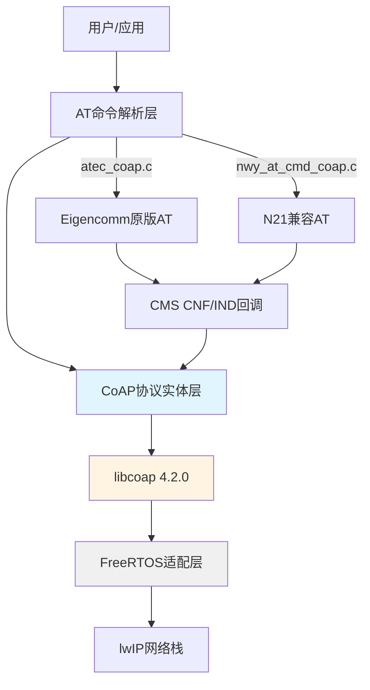
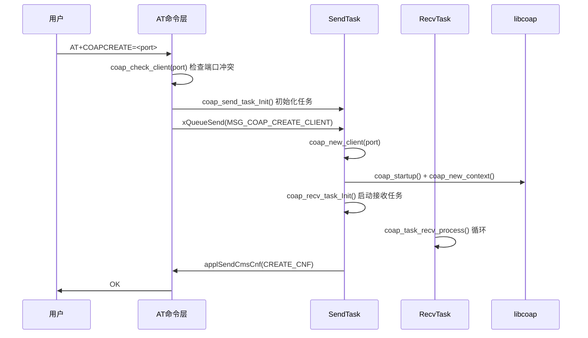
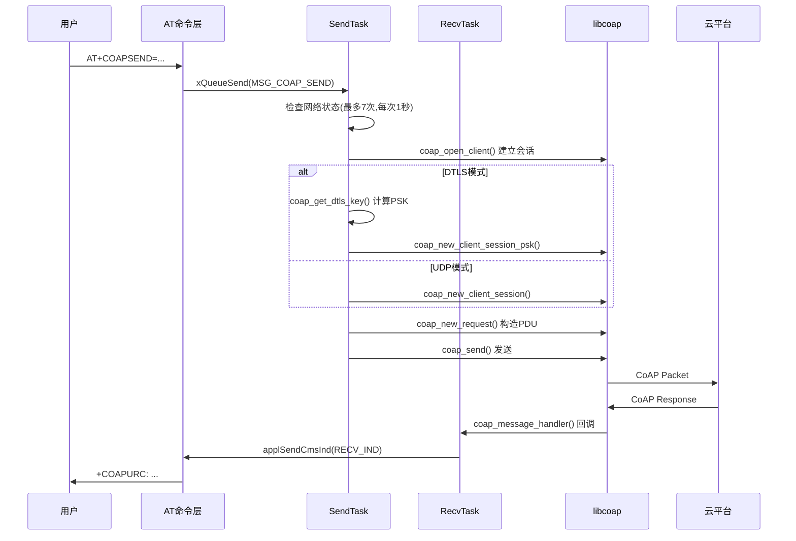
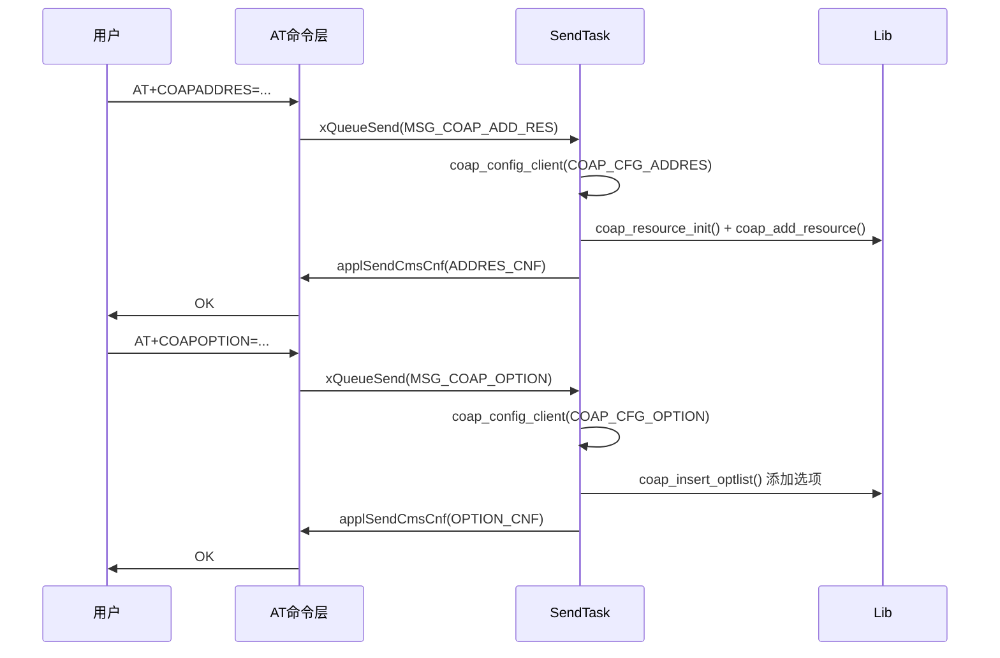
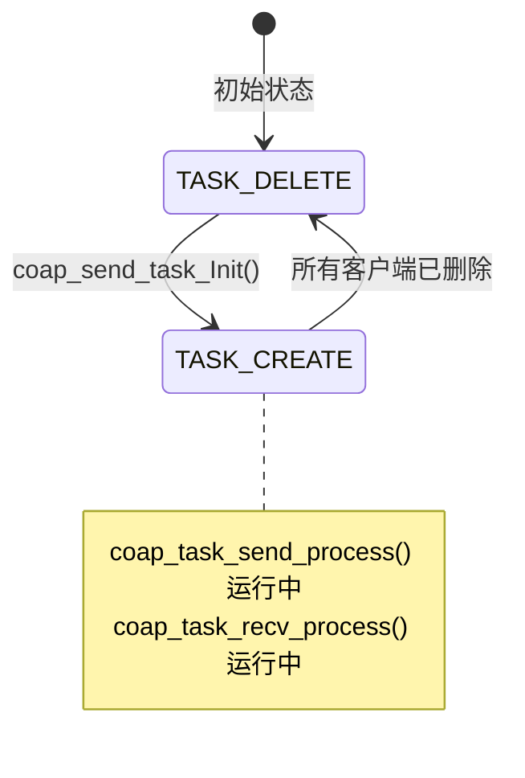
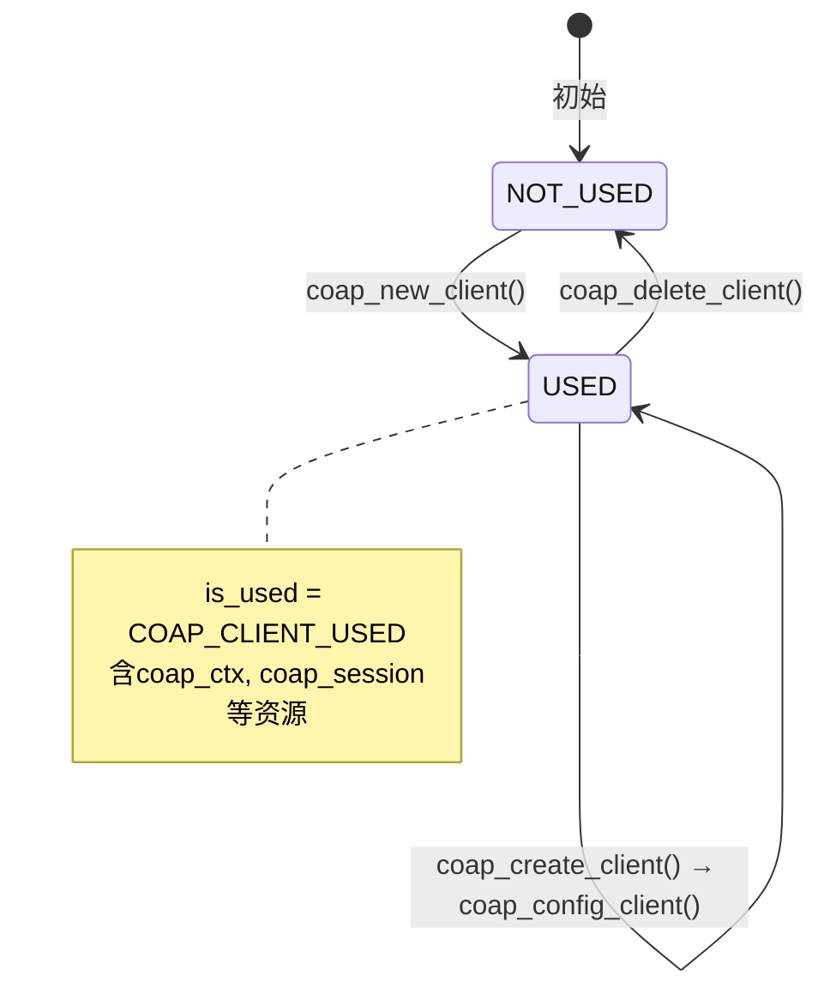
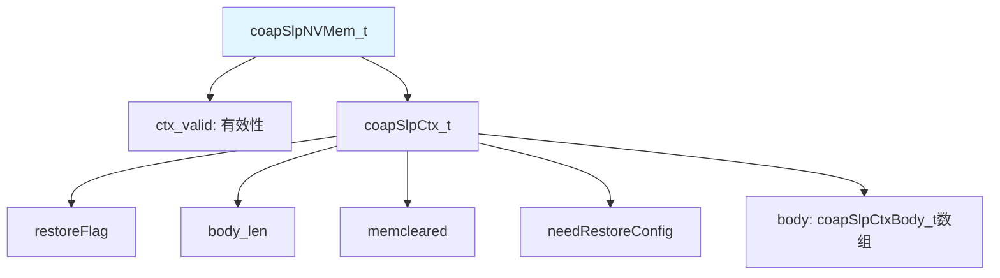

# CoAP模块代码实现总结

> 生成时间：2026-06-01
> 模块路径：`PLAT/middleware/eigencomm/at/nwy_at/nwy_n21_coap/`, `PLAT/middleware/eigencomm/at/atcust/`, `PLAT/middleware/eigencomm/at/atentity/`, `PLAT/middleware/eigencomm/ecapi/appmwapi/`, `PLAT/middleware/thirdparty/libcoap/coap_adapter/`
> 参考文档：[project-overview.md](../architecture/project-overview.md)

## 目录

- [1. 模块概述](#1-模块概述)
- [2. 目录结构](#2-目录结构)
- [3. 分层架构](#3-分层架构)
- [4. 模块依赖关系](#4-模块依赖关系)
- [5. 核心数据结构](#5-核心数据结构)
- [6. AT命令接口](#6-at命令接口)
- [7. 核心流程](#7-核心流程)
- [8. 状态机](#8-状态机)
- [9. 错误处理](#9-错误处理)
- [10. 睡眠与NV存储](#10-睡眠与nv存储)
- [11. 扩展点](#11-扩展点)

---

## 1. 模块概述

CoAP模块基于开源 **libcoap 4.2.0** 实现CoAP协议客户端功能，通过AT命令向应用层提供CoAP通信能力。支持UDP/DTLS传输、多种云平台接入（OneNET/阿里云/Eclipse/普通模式）、Block传输、Observe订阅，以及低功耗睡眠上下文保存恢复。

| 属性 | 值 |
|------|-----|
| 协议栈 | libcoap 4.2.0 |
| 传输协议 | CoAP over UDP / CoAP over DTLS |
| 最大客户端数 | 1 (`COAP_CLIENT_NUMB_MAX`) |
| 最大发送数据 | 1024字节(AT模式) / 512字节(二进制模式) |
| 安全传输 | DTLS PSK / PKI |
| RTOS依赖 | FreeRTOS (任务/队列/信号量) |

---

## 2. 目录结构

```
PLAT/middleware/
├── eigencomm/at/
│   ├── atcust/                          # AT命令解析层（Eigencomm原版）
│   │   ├── inc/atec_coap.h              # AT命令声明 + 参数宏定义
│   │   ├── inc/cnfind/atec_coap_cnf_ind.h  # CNF/IND回调声明
│   │   ├── src/atec_coap.c              # AT命令解析实现
│   │   └── src/cnfind/atec_coap_cnf_ind.c  # CNF/IND回调实现 + URC输出
│   ├── atentity/                        # CoAP协议实体层
│   │   ├── inc/at_coap_task.h           # 核心数据结构 + 接口声明
│   │   └── src/at_coap_task.c           # CoAP客户端核心实现
│   └── nwy_at/nwy_n21_coap/             # AT命令解析层（N21兼容版）
│       ├── inc/nwy_at_cmd_coap.h        # N21兼容AT命令声明
│       └── src/nwy_at_cmd_coap.c        # N21兼容AT命令实现
├── eigencomm/ecapi/appmwapi/            # CMS原语定义层
│   ├── inc/ec_coap_api.h               # 原语ID + 错误码定义
│   └── src/ec_coap_api.c               # 空文件
└── thirdparty/libcoap/coap_adapter/     # libcoap适配层
    ├── coap_adapter.h/c                 # FreeRTOS互斥锁适配
    ├── coap_demo.h/c                    # CoAP demo客户端
    ├── coap_list.h/c                    # 选项链表（兼容旧版）
    └── coap_freertos/                   # FreeRTOS移植配置
        ├── coap_config.h               # libcoap编译配置
        ├── unistd.h                    # POSIX兼容头文件
        └── armcc/types.h               # ARMCC类型适配
```

---

## 3. 分层架构



**各层职责**：

| 层级 | 文件 | 职责 |
|------|------|------|
| AT命令解析层 | `atec_coap.c`, `nwy_at_cmd_coap.c` | 解析AT命令参数，调用`coap_client_xxx`接口 |
| CMS回调层 | `atec_coap_cnf_ind.c` | 处理CNF确认和IND指示，输出AT回复/URC |
| 协议实体层 | `at_coap_task.c` | CoAP客户端生命周期管理、收发任务、PDU构造 |
| 适配层 | `coap_adapter.c` | FreeRTOS互斥锁、包计数 |
| 原语定义 | `ec_coap_api.h` | CMS原语ID、错误码枚举 |

---

## 4. 模块依赖关系

### 4.1 依赖的基础框架

| 框架名 | 依赖方式 | 关键接口 | 参考文档 |
|--------|----------|----------|----------|
| AT框架 | 命令注册 | `atcReply()`, `atcURC()`, `atGetNumValue()`, `atGetStrValue()` | [AT命令模块.md](./AT命令模块.md) |
| CMS消息 | CNF/IND通信 | `applSendCmsCnf()`, `applSendCmsInd()` | - |
| FreeRTOS | 任务/队列/信号量 | `osThreadNew()`, `xQueueSend()`, `xSemaphoreCreateMutex()` | - |
| libcoap | CoAP协议实现 | `coap_new_context()`, `coap_send()`, `coap_run_once()` | - |
| lwIP | 网络传输 | `inet_aton()`, `getaddrinfo()`, socket API | - |
| mbedTLS | DTLS加密 | `mbedtls_sha256()`, `mbedtls_aes_crypt_cbc()` | - |
| NV存储 | 睡眠上下文持久化 | `coapCtxStoreNVMem()`, `coapSlpCheck2RestoreCtx()` | - |

### 4.2 与依赖模块的集成

本模块基于 AT 框架实现 AT 命令注册和处理，AT 框架的详细实现机制请参考 **[AT命令模块.md](./AT命令模块.md)**。

本模块主要关注：
- CoAP 特定的 AT 命令定义与参数解析
- CoAP 客户端生命周期管理（创建/配置/发送/删除）
- libcoap 协议栈的嵌入式适配
- 多云平台接入（阿里云/OneNET）的认证与加密
- 低功耗场景下的上下文保存与恢复

---

## 5. 核心数据结构

### 5.1 coap_client — CoAP客户端实例

```c
// at_coap_task.h:217-319
typedef struct {
    int is_used;                    // 使用状态: COAP_CLIENT_NOT_USED/USED
    int is_connected;               // 连接状态
    int coap_id;                    // 客户端ID (0~3)
    unsigned int coap_reqhandle;    // AT请求句柄
    coap_string_t coap_proxy;       // 代理地址
    int coap_proxy_port;            // 代理端口
    int coap_ping_seconds;          // Keepalive间隔
    unsigned int coap_wait_ms;      // 等待超时
    int coap_reliable;              // 可靠传输标志
    unsigned char coap_msgtype;     // 消息类型: CON/NON/ACK/RST
    int coap_method;                // 请求方法: GET/POST/PUT/DELETE
    int coap_block_flags;           // Block传输标志
    coap_block_t coap_block_cfg;    // Block配置: {num, m, szx}
    char *coap_ip;                  // 服务器IP
    unsigned int coap_port;         // 服务器端口
    unsigned int coap_local_port;   // 本地端口
    int head_mode;                  // Header模式(1~5)
    int msg_id;                     // 自定义消息ID
    coap_binary_t coap_token;       // Token
    coap_address_t coap_dst;        // 目的地址
    coap_context_t *coap_ctx;       // libcoap上下文
    coap_session_t *coap_session;   // libcoap会话
    coap_uri_t coap_uri_info;       // URI信息
    coap_optlist_t *coap_optlist;   // 选项链表
    coap_string_t coap_payload;     // 发送负载
    unsigned int showra;            // URC显示远端地址
    unsigned int showrspopt;        // URC显示响应选项
    unsigned int dtls_flag;         // DTLS使能
    unsigned int cloud;             // 云平台类型
    unsigned int encrypt;           // 加密算法类型
    coap_resource_t *coap_resource; // CoAP资源
    coap_dev_info coap_dev;         // 设备认证信息
} coap_client;
```

### 5.2 coap_send_msg — 任务间消息

```c
// at_coap_task.h:227-246
typedef struct {
    uint8_t cmd_type;           // 命令类型: MSG_COAP_xxx
    bool isRestore;             // 是否从睡眠恢复
    void *client_ptr;           // 客户端指针
    unsigned char coap_msgtype; // 消息类型
    int coap_method;            // 请求方法
    char data_type;             // 数据类型
    uint8_t raiFlag;            // RAI标志
    unsigned int reqhandle;     // AT请求句柄
    int id;                     // 客户端ID
    char *ip;                   // 服务器IP
    int port;                   // 服务器端口
    int local_port;             // 本地端口
    char *token;                // Token
    coap_config coapCnf;        // 配置参数
    coap_string_t coap_payload; // 负载数据
    coap_address_t coap_dst;    // 目的地址
    int cmd_end_flag;           // 命令结束标志
} coap_send_msg;
```

### 5.3 coap_message — 接收消息（上报用）

```c
// at_coap_task.h:248-273
typedef struct {
    int coap_id;
    int msg_type;               // 消息类型
    int msg_method;             // 方法/响应码
    int msg_id;                 // 消息ID
    int mode;                   // Header模式
    unsigned int showra;        // 显示远端地址
    unsigned int showrspopt;    // 显示响应选项
    int server_port;            // 服务器端口
    unsigned int server_ip;     // 服务器IP
    int payload_len;            // 负载长度
    char *coap_payload;         // 负载数据
    int token_len;              // Token长度
    char *coap_token;           // Token数据
    void *client_ptr;           // 客户端指针
    int recv_opt_cnt;           // 接收选项计数
    char *recv_optlist_buf;     // 接收选项缓冲区
} coap_message;
```

### 5.4 coap_config — 配置消息

```c
// at_coap_task.h:217-225
typedef struct {
    int mode;           // 配置模式: COAP_CFG_xxx
    int is_from;        // 来源: COAP_CREATE_FROM_AT/RESTORE
    int dec_para1;      // 参数1
    int dec_para2;      // 参数2
    int dec_para3;      // 参数3
    char *str_para1;    // 字符串参数
} coap_config;
```

### 5.5 关键枚举

| 枚举名 | 值 | 说明 |
|--------|-----|------|
| `COAP_OK` | 100 | 操作成功 |
| `COAP_ERR` | 101 | 通用错误 |
| `COAP_RECREATE` | 102 | 需要重建 |
| `COAP_FULL` | 103 | 客户端已满 |
| `COAP_CLIENT_ERR` | 104 | 客户端错误 |
| `COAP_URI_ERR` | 105 | URI错误 |
| `COAP_IP_ERR` | 106 | IP地址错误 |
| `COAP_NETWORK_ERR` | 107 | 网络错误 |
| `COAP_SESSION_ERR` | 112 | 会话错误 |
| `COAP_SEND_NOT_END_ERR` | 117 | 上次发送未完成 |

| 云平台类型 | 值 | 说明 |
|------------|-----|------|
| `COAP_CLOUD_TYPE_ONENET` | 1 | 中国移动OneNET |
| `COAP_CLOUD_TYPE_ALI` | 2 | 阿里云 |
| `COAP_CLOUD_TYPE_ECLIPSE` | 3 | Eclipse (无认证) |
| `COAP_CLOUD_TYPE_NORMAL` | 4 | 普通模式 (需clientid/user/passwd) |

| 加密类型 | 值 | 说明 |
|----------|-----|------|
| `COAP_ENCRYP_TYPE_MD5` | 1 | HMAC-MD5 |
| `COAP_ENCRYP_TYPE_SHA1` | 2 | HMAC-SHA1 |
| `COAP_ENCRYP_TYPE_SHA256` | 3 | HMAC-SHA256 |

---

## 6. AT命令接口

### 6.1 Eigencomm原版AT命令

| AT命令 | 函数 | 功能 | 参数 |
|--------|------|------|------|
| `AT+COAPCREATE=<port>` | `coapCREATE()` | 创建CoAP客户端 | port: 1-65535 |
| `AT+COAPDELETE` | `coapDELETE()` | 删除CoAP客户端 | 无参数 |
| `AT+COAPADDRES=<len>,"<resource>"` | `coapADDRES()` | 添加资源 | len:1-50, resource:1-50字节 |
| `AT+COAPHEAD=<mode>[,<msgid>[,<tkl>,"<token>"]]` | `coapHEAD()` | 配置消息头 | mode:1-5, msgid:0-65535, tkl:1-8 |
| `AT+COAPOPTION=<cnt>,<name>,"<value>"[,...]` | `coapOPTION()` | 添加CoAP选项 | cnt:1-12, name:1-60 |
| `AT+COAPSEND=<type>,<method>,"<ip>",<port>[,<len>,"<data>"]` | `coapSEND()` | 发送CoAP消息 | type:0-44, method:0-505, data:0-512字节 |
| `AT+COAPDATASTATUS?` | `coapDATASTATUS()` | 查询发送状态 | 读命令 |
| `AT+COAPCFG="<mode>",<v1>[,<v2>[,<v3>]]` | `coapCFG()` | 配置参数 | Showra/Showrspopt/dtls/cloud/encrypt |
| `AT+COAPALISIGN="<devId>","<name>","<secret>","<key>"[,<seq>]` | `coapALISIGN()` | 阿里云签名 | 设备认证信息 |

### 6.2 N21兼容版AT命令

| AT命令 | 函数 | 功能 | 与原版差异 |
|--------|------|------|-----------|
| `AT+COAPOPEN=<port>` | `nwy_at_cmd_coapopen()` | 创建CoAP客户端 | 增加网络状态检查；SUB_AT_ID=5 |
| `AT+COAPCLOSE` | `nwy_at_cmd_coapclose()` | 删除CoAP客户端 | 同原版 |
| `AT+COAPADDRES=<len>,"<resource>"` | `nwy_at_cmd_coapaddres()` | 添加资源 | 资源最大128字节；校验resLen==len |
| `AT+COAPHEAD=<mode>[,...]` | `nwy_at_cmd_coaphead()` | 配置消息头 | 同原版 |
| `AT+COAPOPTION=<cnt>,<name>,"<value>"[,...]` | `nwy_at_cmd_coapoption()` | 添加选项 | 最大8个选项；校验paramRealNum |
| `AT+COAPSEND=<type>,<method>,"<ip>",<port>[,<len>,"<data>"]` | `nwy_at_cmd_coapsend()` | 发送消息 | 数据最大1024字节 |
| `AT+COAPSENDBIN=<type>,<method>,"<ip>",<port>[,<len>,"<hex>"]` | `nwy_at_cmd_coapsendbin()` | 发送二进制消息 | hex字符串转ASCII，最大512字节 |

### 6.3 Header模式说明

| 模式 | Token | MsgID | 说明 |
|------|-------|-------|------|
| 1 | 随机8字节 | 自动 | 默认模式 |
| 2 | 用户指定(hex) | 自动 | 自定义Token |
| 3 | 无 | 用户指定 | 自定义MsgID |
| 4 | 随机8字节 | 用户指定 | 自定义MsgID+随机Token |
| 5 | 用户指定(hex) | 用户指定 | 完全自定义 |

### 6.4 URC输出格式

**Eigencomm原版** (`+COAPURC`):
```
+COAPURC: "rsp",<msgType>,<class>.<detail>,<msgId>[,<optCnt>,<opts>][,<payloadLen>,<payload>]
+COAPURC: "req",<msgType>,<method>,<msgId>,<optCnt>[,<tkl>,<token>][,<opts>][,<payloadLen>,<payload>]
```

**N21兼容版** (`+COAPRECV`):
```
+COAPRECV: "rsp",<ip>,<port>,<msgType>,<class>.<detail>,<msgId>[,...]
+COAPRECV: "req",<ip>,<port>,<msgType>,<method>,<msgId>[,...]
```

---

## 7. 核心流程

### 7.1 客户端创建流程



### 7.2 消息发送流程



### 7.3 配置流程（ADDRES/HEAD/OPTION）



### 7.4 数据输入模式

CoAPSEND支持两种数据输入模式：

| 模式 | 触发条件 | 数据格式 | 结束标志 |
|------|----------|----------|----------|
| AT模式 | 命令行直接带数据 | ASCII字符串 | 命令结束 |
| CTRL-Z模式 | 不带数据参数 | 逐段输入 | `0x1A`(CTRL-Z)确认 / `0x1B`(ESC)取消 |

CTRL-Z模式下，AT通道进入`ATC_COAP_SEND_DATA_STATE`状态，通过`coapSENDInputData()`逐段接收数据。

---

## 8. 状态机

### 8.1 任务状态



| 状态 | 标志变量 | 说明 |
|------|----------|------|
| `COAP_TASK_STAT_DELETE` | `coap_task_send/recv_status_flag` | 任务未创建 |
| `COAP_TASK_STAT_CREATE` | `coap_task_send/recv_status_flag` | 任务运行中 |

### 8.2 客户端生命周期



### 8.3 连接状态

| 状态 | 说明 |
|------|------|
| `COAP_CONN_NOT_CONNECTED` | 未连接 |
| `COAP_CONN_CONNECTED` | 已连接 |
| `COAP_CONN_IS_CONNECTING` | 连接中 |

### 8.4 睡眠等待状态

| 状态 | 说明 |
|------|------|
| `COAPSLP_WAIT_CREATE = 1` | 等待客户端创建完成 |
| `COAPSLP_WAIT_DELETE = 2` | 等待客户端删除完成 |
| `COAPSLP_WAIT_CONFIG = 4` | 等待配置操作完成 |
| `COAPSLP_WAIT_NETWORK = 8` | 等待网络就绪 |

---

## 9. 错误处理

### 9.1 AT层错误码

| 错误码 | 枚举值 | 说明 |
|--------|--------|------|
| `COAP_PARAM_ERROR` | 1 | 参数错误 |
| `COAP_CREATE_CLIENT_ERROR` | 2 | 创建客户端失败 |
| `COAP_CREATE_SOCK_ERROR` | 3 | 创建Socket失败 |
| `COAP_CONNECT_UDP_FAIL` | 4 | UDP连接失败 |
| `COAP_SEND_FAIL` | 8 | 发送失败 |
| `COAP_NOT_CONNECTED` | 12 | 未连接 |
| `COAP_NETWORK_FAIL` | 14 | 网络不可用 |
| `COAP_SEND_NOT_END_FAIL` | 18 | 上次发送未完成 |

### 9.2 内部返回码

| 返回码 | 说明 |
|--------|------|
| `COAP_OK(100)` | 成功 |
| `COAP_ERR(101)` | 通用错误 |
| `COAP_CLIENT_ERR(104)` | 客户端操作失败 |
| `COAP_IP_ERR(106)` | IP地址格式错误 |
| `COAP_SESSION_ERR(112)` | 会话创建失败 |
| `COAP_SEND_NOT_END_ERR(117)` | 上次发送未结束 |
| `COAP_SEND_CONTINUE` | 数据输入继续（CTRL-Z模式） |

### 9.3 错误处理策略

1. **网络检查**：发送前循环检查网络状态（最多7次，每次1秒延迟）
2. **端口冲突**：创建时检查本地端口是否已被占用
3. **IP校验**：通过`coap_check_ip_type()`校验IPv4(3个点)/IPv6(7个冒号)格式
4. **包计数保护**：`coap_send_packet_count > COAP_SEND_PACKET_MAX(8)` 时拒绝发送
5. **CMS CNF/IND**：所有操作通过CMS消息异步回复，成功/失败分别发送CNF

---

## 10. 睡眠与NV存储

### 10.1 睡眠上下文保存

CoAP模块通过 `COAP_SLP_ENABLE` 宏控制睡眠支持，实现低功耗场景下的上下文保存与恢复。

**保存内容**（`coapSlpCtxBody_t`）：

| 字段 | 类型 | 说明 |
|------|------|------|
| `valid` | uint8_t | 有效性标志 |
| `coap_id` | uint8_t | 客户端ID |
| `handle` | uint32_t | AT请求句柄 |
| `coap_local_port` | uint32_t | 本地端口 |
| `showra` | uint32_t | 显示远端地址 |
| `showrspopt` | uint32_t | 显示响应选项 |
| `dtls_flag` | uint32_t | DTLS标志 |
| `cloud` | uint32_t | 云平台类型 |
| `encrypt` | uint32_t | 加密类型 |
| `coap_resource` | coapResource_t | 资源配置 |
| `coap_head` | coapHead_t | Header配置 |
| `coap_opt[20]` | coapOption_t | 选项配置 |
| `coap_dev` | coap_dev_info | 设备认证信息 |

### 10.2 NV存储结构



### 10.3 睡眠流程

1. **保存**：每次配置操作后调用 `coapCtxStoreNVMem(false)` 将上下文写入NV存储
2. **恢复**：唤醒后调用 `coapSlpCheck2RestoreCtx()` 检测并恢复，`CoapCreateFrom=COAP_CREATE_FROM_RESTORE`
3. **互斥**：通过 `coapSlpWaitMutex()` / `coapSlpReleaseMutex()` 保护关键操作不被睡眠打断
4. **安全检查**：`coapCheckSafe2Sleep()` 判断当前是否可以安全进入睡眠

---

## 11. 扩展点

| 扩展类型 | 位置 | 说明 |
|----------|------|------|
| 云平台接入 | `coap_get_dtls_key()` | 新增云平台类型需在此函数添加PSK计算逻辑 |
| 加密算法 | `COAP_ENCRYP_TYPE_xxx` | 新增加密类型需在`coap_get_dtls_key()`的switch中添加 |
| AT命令兼容 | `FEATURE_NWY_AT_COAP_COMPATIBLE_N21` | 宏控N21兼容版AT命令，URC使用`+COAPRECV`替代`+COAPURC` |
| DTLS认证 | `get_session()` | 支持PKI证书和PSK两种认证方式 |
| 自动注册 | `FEATURE_CTCC_DM_ENABLE`/`FEATURE_CUCC_DM_ENABLE` | 电信/联通自动注册接口 |
| 阿里云Token | `aliAuthToken`/`aliRandom` | 从服务器响应中解析Token和Random，自动添加到后续请求选项 |
