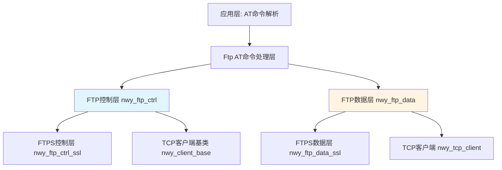
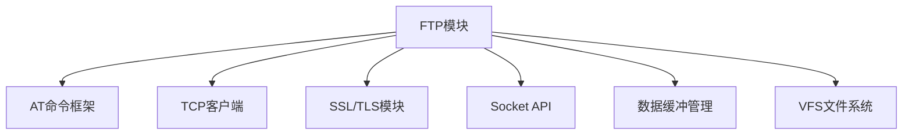
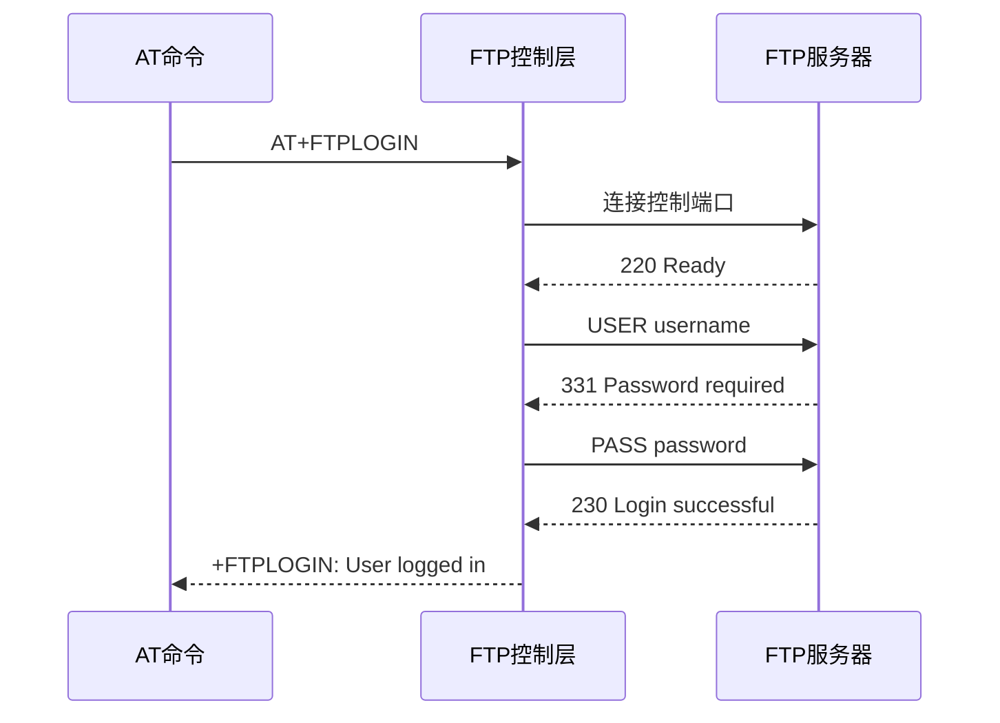
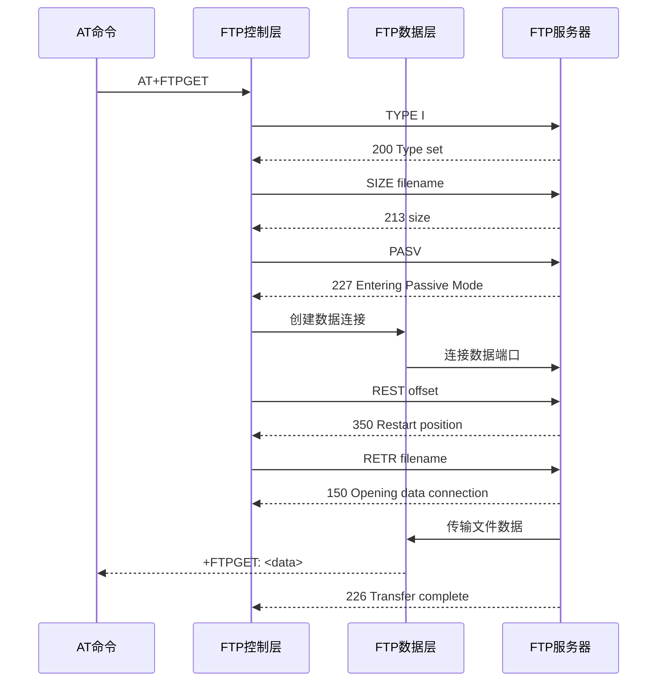
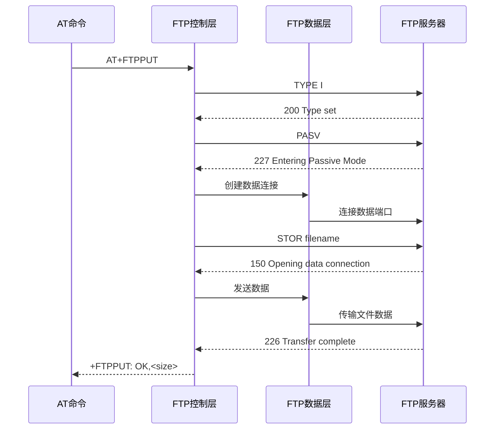
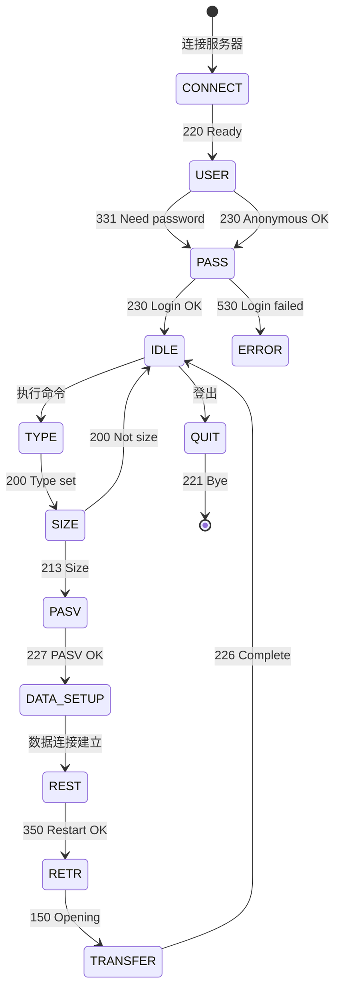
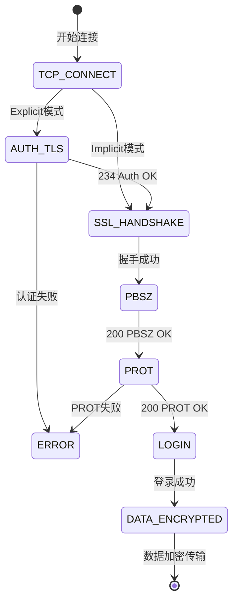

# FTP模块 - 代码架构总结

## 文档元数据

| 项目 | 内容 |
|------|------|
| 文档编号 | 5 |
| 文档类型 | 实现总结 |
| 模块名称 | FTP模块 |
| 代码路径 | `middleware/thirdparty/NWY_FRAMEWORK/nwy_app_comm/` 和 `nwy_app_at_proc/` |
| 分析日期 | 2026-02-05 |
| 版本 | 基于EC626平台 |

---

## 目录

- [1. 架构概述](#1-架构概述)
- [2. 模块依赖关系](#2-模块依赖关系)
- [3. 目录结构分析](#3-目录结构分析)
- [4. 核心数据结构](#4-核心数据结构)
- [5. 关键接口分析](#5-关键接口分析)
- [6. 实现机制解析](#6-实现机制解析)
- [7. 配置与编译](#7-配置与编译)
- [8. 扩展点识别](#8-扩展点识别)

---

## 1. 架构概述

### 1.1 系统定位

FTP模块是EC626项目中位于中间件层的文件传输协议客户端实现，支持标准FTP协议和FTPS(FTP over SSL/TLS)协议。该模块通过AT命令接口提供文件上传、下载、删除、重命名、目录操作等功能。

### 1.2 分层架构



### 1.3 核心组件

| 组件 | 文件路径 | 功能描述 |
|------|----------|----------|
| **nwy_ftp_ctrl** | `nwy_app_comm/src/nwy_ftp_ctrl.cpp` | FTP控制连接管理、命令协议处理 |
| **nwy_ftp_data** | `nwy_app_comm/src/nwy_ftp_data.cpp` | FTP数据连接管理、文件传输 |
| **nwy_ftp_ctrl_ssl** | `nwy_app_comm/src/nwy_ftp_ctrl_ssl.cpp` | FTPS控制连接、SSL/TLS处理 |
| **nwy_ftp_data_ssl** | `nwy_app_comm/src/nwy_ftp_data_ssl.cpp` | FTPS数据连接、加密传输 |
| **AT命令处理** | `nwy_app_at_proc/src/nwy_app_at_func_ftp.c` | AT命令接口实现 |

---

## 2. 模块依赖关系

### 2.1 依赖的基础框架

本模块依赖以下模块的实现：

| 框架名 | 依赖方式 | 关键接口 | 参考文档 |
|--------|----------|----------|----------|
| AT框架 | 命令注册 | at_register_cmd() | [AT命令模块.md](./AT命令模块.md) |
| TCP客户端 | 继承 | nwy_tcp_client | - |
| SSL/TLS | 加密传输 | nwy_ssl_* | - |
| Socket API | 网络通信 | nwy_dss_* | - |

### 2.2 与AT框架的集成

本模块基于 AT 框架实现 AT 命令注册和处理。

AT 框架的详细实现机制请参考 **[AT命令模块.md](./AT命令模块.md)**。

本模块主要关注：
- FTP 特定的 AT 命令定义
- FTP/FTPS 协议层实现
- 与 AT 框架的适配层

### 2.3 模块依赖关系图



---

## 3. 目录结构分析

### 3.1 目录组织

```
middleware/thirdparty/NWY_FRAMEWORK/
├── nwy_app_comm/                        # FTP核心实现
│   ├── inc/
│   │   ├── nwy_ftp_ctrl.h               # FTP控制连接头文件
│   │   ├── nwy_ftp_data.h               # FTP数据连接头文件
│   │   ├── nwy_ftp_ctrl_ssl.h           # FTPS控制连接头文件
│   │   └── nwy_ftp_data_ssl.h           # FTPS数据连接头文件
│   └── src/
│       ├── nwy_ftp_ctrl.cpp             # FTP控制连接实现
│       ├── nwy_ftp_data.cpp             # FTP数据连接实现
│       ├── nwy_ftp_ctrl_ssl.cpp         # FTPS控制连接实现
│       └── nwy_ftp_data_ssl.cpp         # FTPS数据连接实现
└── nwy_app_at_proc/                     # AT命令接口
    ├── inc/
    │   └── nwy_app_at_func_ftp.h        # FTP AT命令头文件
    └── src/
        ├── nwy_app_at_func_ftp.c        # FTP AT命令实现
        └── nwy_app_at_func_myftp.c      # MYFTP AT命令实现
```

### 3.2 关键文件说明

| 文件 | 类型 | 说明 | 依赖 |
|------|------|------|------|
| nwy_ftp_ctrl.h | 头文件 | FTP控制连接类定义 | nwy_client_base.h |
| nwy_ftp_ctrl.cpp | 源文件 | FTP控制协议实现 | nwy_ftp_ctrl.h |
| nwy_ftp_data.h | 头文件 | FTP数据连接类定义 | nwy_tcp_client.h |
| nwy_ftp_data.cpp | 源文件 | FTP数据传输实现 | nwy_ftp_data.h |
| nwy_ftp_ctrl_ssl.h | 头文件 | FTPS控制连接类定义 | nwy_ftp_ctrl.h |
| nwy_ftp_ctrl_ssl.cpp | 源文件 | FTPS控制协议实现 | nwy_ftp_ctrl_ssl.h |
| nwy_app_at_func_ftp.c | 源文件 | FTP AT命令处理 | nwy_app_at_func_def.h |

---

## 4. 核心数据结构

### 4.1 FTP命令枚举

```cpp
typedef enum
{
  NWY_FTP_CONNECT = 1,
  NWY_FTP_USER,
  NWY_FTP_PASS,
  NWY_FTP_SIZE,
  NWY_FTP_TYPE,
  NWY_FTP_REST,
  NWY_FTP_PASV,
  NWY_FTP_EPSV,
  NWY_FTP_RETR,
  NWY_FTP_LIST,
  NWY_FTP_CWD,
  NWY_FTP_PWD,
  NWY_FTP_DATA_TRANSFER,
  NWY_FTP_STOR,
  NWY_FTP_ABOR,
  NWY_FTP_PORT,
  NWY_FTP_EPRT,
  NWY_FTP_QUIT,
  NWY_FTP_DELE,
  NWY_FTP_APPE,
  NWY_FTP_NOOP,
  NWY_FTP_RNFR,
  NWY_FTP_RNTO,
  NWY_FTP_MKD,
  NWY_FTP_RMD,
} nwy_ftp_cmd_e_type;
```

### 4.2 FTP控制连接类 (nwy_ftp_ctrl)

```cpp
class nwy_ftp_ctrl : public nwy_client_base
{
public:
  // 构造/析构
  nwy_ftp_ctrl(dsnet_handle, socket_id, iface, addr_info, port,
               local_port, ftpmode, usr, pwd, opts, cb_func, login_tout);
  ~nwy_ftp_ctrl();

  // 核心方法
  void socket_event(const uint32 event_mask);
  void notify_status(const sint15 status, const void* msg_ptr);
  void ftp_action_exec(nwy_ftp_paras_s_type *action_paras);
  void ftp_data_status_proc(sint15 status, const void* msg_ptr);

  // 状态查询
  bool get_logged();
  bool get_data_connected();
  bool get_is_at_busy();
  int get_error_code();

protected:
  virtual bool ftps_cmd_proc(const byte* msg, int len);
  virtual bool ftps_pasv_data_setup(uint16 port, nwy_ftp_action_e_type action);
  virtual bool ftps_port_data_setup(uint16 port, int* ret);

private:
  // FTP命令状态
  nwy_ftp_cmd_e_type ftp_cmd;
  nwy_ftp_paras_s_type ftp_paras;

  // 连接状态
  bool logged;           // 是否已登录
  bool data_connected;   // 数据连接是否建立
  bool is_at_busy;       // AT是否忙碌
  sint15 my_ftpmode;     // FTP模式(0=被动, 1=主动)

  // 认证信息
  char ftp_usr[NWY_FTP_USR_MAX_LEN+1];
  char ftp_pwd[NWY_FTP_PWD_MAX_LEN+1];

  // 传输状态
  uint32 recv_len;       // 已接收长度
  uint32 all_len;        // 总长度
  uint32 offset;         // 偏移量

  // 定时器
  nwy_rex_timer_type nwy_ftpget_keepalive_timer;
  nwy_rex_timer_type nwy_ftp_exec_timeout_timer;
  nwy_rex_timer_type nwy_ftp_idle_logout_timer;

  // 错误码
  int error_code;
};
```

### 4.3 FTP数据连接类 (nwy_ftp_data)

```cpp
class nwy_ftp_data : public nwy_tcp_client
{
public:
  nwy_ftp_data(dsnet_handle, socket_id, iface, addr_info,
               port, local_port, rate, opts);
  ~nwy_ftp_data();

  void notify_status(const sint15 status, const void* msg_ptr);
  void socket_event(const uint32 event_mask);
  uint32 get_type();

  // 数据转储控制
  void start_ftpget_dump_timer();
  void clear_ftpget_dump_timer();
  uint32 handle_ftpget_dump(byte* read_buf);
  bool get_data_end();

private:
  int baudrate;           // 波特率(用于计算转储间隔)
  uint32 dump_counter;    // 转储计数器
  uint32 dump_interval;   // 转储间隔
  bool first_get;         // 首次获取标志
  bool data_end;          // 数据结束标志
};
```

### 4.4 FTPS控制连接类 (nwy_ftp_ctrl_ssl)

```cpp
class nwy_ftp_ctrl_ssl : public nwy_ftp_ctrl
{
public:
  nwy_ftp_ctrl_ssl(dsnet_handle, socket_id, iface, addr_info,
                   port, local_port, ftpmode, usr, pwd, opts,
                   cb_func, login_tout, ftps_type, conf, hostname);
  ~nwy_ftp_ctrl_ssl();

  void socket_connected();
  sint15 socket_write(sint15 sockfd, const uint8* buffer,
                     uint32 buffer_size, sint15* err);
  sint15 socket_read();
  bool close_socket();

protected:
  virtual bool ftps_cmd_proc(const byte* msg, int len);
  virtual bool ftps_pasv_data_setup(uint16 port, nwy_ftp_action_e_type action);
  virtual bool ftps_port_data_setup(uint16 port, int* ret);

private:
  // SSL状态
  bool use_ssl_connt;           // 是否使用SSL连接
  uint8 explicit_ssl_st;        // 显式SSL状态
  uint8 prot_st;                // PROT命令状态
  bool first_prot;              // 首次PROT标志

  // SSL配置
  char ssl_hostname[NWY_APP_HOSTNAME_MAX_LEN+1];
  nwy_app_ssl_cfg_s_type my_ssl_cfg;
  nwy_app_ssl_conf_type my_conf;
};
```

### 4.5 FTP AT命令错误码

```cpp
typedef enum
{
    NWY_AT_ERROR_NONE = 0,                      // 操作成功
    NWY_AT_ERROR_UNKNOW = 601,                  // 未知错误
    NWY_AT_ERROR_FTP_SERVER_BLOCKED = 602,      // 服务器被阻止
    NWY_AT_ERROR_DNS_PARSE_FAIL = 604,          // DNS解析失败
    NWY_AT_ERROR_NETWORK = 605,                 // 网络错误
    NWY_AT_ERROR_FTP_CTRL_CONNECTION_CLOSED = 606,  // 控制连接关闭
    NWY_AT_ERROR_FTP_DATA_CONNECTION_CLOSED = 607,  // 数据连接关闭
    NWY_AT_ERROR_TIMEOUT = 609,                 // 超时
    NWY_AT_ERROR_INVALID_PARAMETER = 610,       // 无效参数
    NWY_AT_ERROR_FILE = 613,                    // 文件错误
    NWY_AT_ERROR_NOT_LOGGED_IN = 625,           // 未登录
    NWY_AT_ERROR_SSL_AUTHENTICATION_FAILED_SSL = 631,  // SSL认证失败
} nwy_at_ftp_st_notify_e_type;
```

---

## 5. 关键接口分析

### 5.1 AT命令接口

| AT命令 | 处理函数 | 功能说明 |
|--------|----------|----------|
| AT+FTPSCFG | nwy_app_at_ftpscfg_func | 配置FTPS参数 |
| AT+FTPLOGIN | nwy_app_at_ftplogin_func | FTP登录 |
| AT+FTPLOGOUT | nwy_app_at_ftplogout_func | FTP登出 |
| AT+FTPGET | nwy_app_at_ftpget_func | 下载文件 |
| AT+FTPPUT | nwy_app_at_ftpput_func | 上传文件 |
| AT+FTPSIZE | nwy_app_at_ftpsize_func | 获取文件大小 |
| AT+FTPSTATUS | nwy_app_at_ftpstatus_func | 查询FTP状态 |
| AT+FILEFTPGET | nwy_app_at_fileftpget_func | 下载到本地文件 |
| AT+FILEFTPPUT | nwy_app_at_fileftpput_func | 上传本地文件 |
| AT+FTPRENAME | nwy_app_at_ftprename_func | 重命名文件 |
| AT+FTPMKDIR | nwy_app_at_ftpmkdir_func | 创建目录 |
| AT+FTPRMDIR | nwy_app_at_ftprmdir_func | 删除目录 |
| AT+NWFTP* | nwy_app_at_nwftp*_func | 新版FTP命令 |

### 5.2 核心API函数

#### FTP登录
```cpp
int nwy_app_ftp_login(uint16 cid, const char* url, uint16 port,
                      int ftpmode, const char* usr, const char* pwd,
                      nwy_app_cb_func cb_func);
```

#### FTP登出
```cpp
int nwy_app_ftp_logout(uint16 cid);
```

#### FTP下载文件
```cpp
int nwy_app_ftp_get_file(uint16 cid, const char* filename,
                         int type, uint32 offset, uint32 length);
```

#### FTP上传文件
```cpp
int nwy_app_ftp_put_file(uint16 cid, const char* filename,
                         int type, int mode, const uint8* data,
                         uint32 len);
```

#### FTP获取文件大小
```cpp
int nwy_app_ftp_get_size(uint16 cid, const char* filename);
```

#### FTP文件操作
```cpp
int nwy_app_ftp_rename(uint16 cid, const char* old_name,
                       const char* new_name, uint32 timeout, void* ctx);
int nwy_app_ftp_mkdir(uint16 cid, const char* dirname,
                      uint32 timeout, void* ctx);
int nwy_app_ftp_rmdir(uint16 cid, const char* dirname,
                      uint32 timeout, void* ctx);
int nwy_app_ftp_del_file(uint16 cid, const char* filename);
```

### 5.3 回调函数

```cpp
typedef void (*nwy_app_cb_func)(uint16 cid, uint16 sid,
                                 sint15 status, const void* msg_ptr);
```

| 状态码 | 说明 | msg_ptr内容 |
|--------|------|-------------|
| NWY_SOCKET_FTP_LOGIN | 登录成功 | NULL |
| NWY_SOCKET_FTP_PASS_ERROR | 密码错误 | NULL |
| NWY_SOCKET_DATA_RECVED | 数据接收 | nwy_app_data_recved_msg_s_type* |
| NWY_SOCKET_DATA_CLOSED | 数据连接关闭 | NULL |
| NWY_SOCKET_CLOSED | 控制连接关闭 | NULL |
| NWY_SOCKET_FTP_SIZE | 文件大小 | int* |
| NWY_SOCKET_FTP_FILE_NOT_FOUND | 文件不存在 | NULL |

---

## 6. 实现机制解析

### 6.1 核心流程

#### FTP登录流程



#### FTP下载流程



#### FTP上传流程



### 6.2 FTP协议状态机



### 6.3 FTPS安全连接机制



### 6.4 被动模式与主动模式

| 特性 | 被动模式 (PASV) | 主动模式 (PORT) |
|------|----------------|----------------|
| 命令 | PASV / EPSV | PORT / EPRT |
| 连接方向 | 客户端连接服务器 | 服务器连接客户端 |
| 防火墙 | 友好 | 需要开放端口 |
| 默认模式 | 是 (ftpmode=0) | 否 (ftpmode=1) |

### 6.5 错误处理

#### FTP服务器错误码映射

| FTP响应 | 含义 | 模块处理 |
|---------|------|----------|
| 220 | 服务就绪 | 连接成功 |
| 230 | 登录成功 | 设置logged=TRUE |
| 331 | 需要密码 | 发送PASS命令 |
| 421 | 服务不可用 | 关闭连接 |
| 425 | 数据连接无法打开 | 通知数据连接错误 |
| 450 | 文件不可用 | 重试或报告错误 |
| 500 | 语法错误 | 命令无法识别 |
| 530 | 未登录 | 登录失败 |
| 550 | 文件不可用 | 文件不存在 |

---

## 7. 配置与编译

### 7.1 编译选项

```makefile
# FTPS支持
FEATURE_NWY_APP_FTP := y

# FTPS over SSL/TLS
FEATURE_NWY_APP_SSL := y

# 文件FTP扩展
FEATURE_NWY_AT_FILEFTPPUT_EX := y

# 下载百分比报告
FEATURE_NWY_AT_FTP_DLOAD_PER_2ND_CON := y
```

### 7.2 宏定义

| 宏名 | 默认值 | 说明 |
|------|--------|------|
| NWY_FTP_USR_MAX_LEN | 255 | 用户名最大长度 |
| NWY_FTP_PWD_MAX_LEN | 255 | 密码最大长度 |
| NWY_FTP_CMD_BUFF_LEN | 300 | 命令缓冲区长度 |
| NWY_FTP_PUT_DATA_MAX_LEN | 8192 | 上传数据最大长度 |
| NWY_FTP_DATA_DUMP_BUFF_LEN | 1400 | 数据转储缓冲区长度 |
| NWY_APP_FTP_GET_BUFF_LEN | 8192 | 下载缓冲区长度 |

### 7.3 FTPS配置

```cpp
typedef struct
{
    uint8 ssl_version;      // SSL版本: 0=SSLv3, 1=TLS1.0, 2=TLS1.1, 3=TLS1.2
    uint8 authmode;         // 认证模式: 0=无, 1=单向, 2=双向
    nwy_cert_item cacert;   // CA证书
    nwy_cert_item clientcert; // 客户端证书
    nwy_cert_item clientkey;   // 客户端私钥
} nwy_app_ssl_conf_type;
```

---

## 8. 扩展点识别

### 8.1 可扩展接口

| 接口 | 扩展方式 | 说明 |
|------|----------|------|
| ftps_cmd_proc | 虚函数重写 | FTPS命令处理扩展 |
| ftps_pasv_data_setup | 虚函数重写 | PASV模式数据连接设置 |
| ftps_port_data_setup | 虚函数重写 | PORT模式数据连接设置 |
| nwy_app_cb_func | 回调注册 | 状态通知回调 |

### 8.2 钩子点

| 钩子 | 触发时机 | 用途 |
|------|----------|------|
| notify_status | 状态变化时 | 通知上层应用 |
| socket_event | Socket事件时 | 处理网络事件 |
| ftp_data_status_proc | 数据连接状态变化 | 处理数据传输状态 |

### 8.3 插件机制

FTP模块采用继承和多态实现扩展：

1. **nwy_ftp_ctrl**: 基础FTP控制类
2. **nwy_ftp_ctrl_ssl**: 继承nwy_ftp_ctrl，添加SSL支持
3. **nwy_ftp_data**: 基础FTP数据类
4. **nwy_ftp_data_ssl**: 继承nwy_ftp_data，添加SSL加密

---

## 9. 关键文件索引

### 9.1 头文件

| 文件 | 行数 | 说明 |
|------|------|------|
| [nwy_ftp_ctrl.h](d:\EC626\PLAT\middleware\thirdparty\NWY_FRAMEWORK\nwy_app_comm\inc\nwy_ftp_ctrl.h) | 157 | FTP控制连接定义 |
| [nwy_ftp_data.h](d:\EC626\PLAT\middleware\thirdparty\NWY_FRAMEWORK\nwy_app_comm\inc\nwy_ftp_data.h) | 50 | FTP数据连接定义 |
| [nwy_ftp_ctrl_ssl.h](d:\EC626\PLAT\middleware\thirdparty\NWY_FRAMEWORK\nwy_app_comm\inc\nwy_ftp_ctrl_ssl.h) | 56 | FTPS控制连接定义 |
| [nwy_ftp_data_ssl.h](d:\EC626\PLAT\middleware\thirdparty\NWY_FRAMEWORK\nwy_app_comm\inc\nwy_ftp_data_ssl.h) | 50 | FTPS数据连接定义 |
| [nwy_app_at_func_ftp.h](d:\EC626\PLAT\middleware\thirdparty\NWY_FRAMEWORK\nwy_app_at_proc\inc\nwy_app_at_func_ftp.h) | 78 | FTP AT命令定义 |

### 9.2 源文件

| 文件 | 行数 | 说明 |
|------|------|------|
| [nwy_ftp_ctrl.cpp](d:\EC626\PLAT\middleware\thirdparty\NWY_FRAMEWORK\nwy_app_comm\src\nwy_ftp_ctrl.cpp) | 1830 | FTP控制协议实现 |
| [nwy_ftp_data.cpp](d:\EC626\PLAT\middleware\thirdparty\NWY_FRAMEWORK\nwy_app_comm\src\nwy_ftp_data.cpp) | 415 | FTP数据传输实现 |
| [nwy_ftp_ctrl_ssl.cpp](d:\EC626\PLAT\middleware\thirdparty\NWY_FRAMEWORK\nwy_app_comm\src\nwy_ftp_ctrl_ssl.cpp) | 490 | FTPS控制协议实现 |
| [nwy_app_at_func_ftp.c](d:\EC626\PLAT\middleware\thirdparty\NWY_FRAMEWORK\nwy_app_at_proc\src\nwy_app_at_func_ftp.c) | 1935 | FTP AT命令实现 |

---

## 附录

### A. FTP命令速查表

| 命令 | 功能 | 示例 |
|------|------|------|
| USER | 用户名 | USER anonymous |
| PASS | 密码 | PASS password |
| TYPE | 传输类型 | TYPE I (二进制) |
| PASV | 被动模式 | PASV |
| EPSV | 扩展被动模式 | EPSV |
| PORT | 主动模式 | PORT h1,h2,h3,h4,p1,p2 |
| EPRT | 扩展主动模式 | EPRT \|2\|IPv6\|port\| |
| LIST | 列出文件 | LIST |
| RETR | 下载文件 | RETR filename |
| STOR | 上传文件 | STOR filename |
| APPE | 追加文件 | APPE filename |
| SIZE | 文件大小 | SIZE filename |
| REST | 断点续传 | REST offset |
| DELE | 删除文件 | DELE filename |
| RNFR | 重命名源 | RNFR oldname |
| RNTO | 重命名目标 | RNTO newname |
| MKD/XMKD | 创建目录 | MKD dirname |
| RMD/XRMD | 删除目录 | RMD dirname |
| ABOR | 中断传输 | ABOR |
| QUIT | 退出 | QUIT |

### B. AT命令示例

```
# FTPS配置
AT+FTPSCFG="sslversion",3
AT+FTPSCFG="authmode",1
AT+FTPSCFG="cacert","ca_cert.pem"

# FTP登录
AT+FTPLOGIN="ftp.example.com",21,"username","password",0,2

# 获取文件大小
AT+FTPSIZE="/remote/file.txt"

# 下载文件
AT+FTPGET="/remote/file.txt",2,1,0,0

# 上传文件
AT+FTPPUT="/remote/file.txt",2,1,<data>

# 下载到本地文件
AT+FILEFTPGET="/remote/file.txt","/local/file.txt",0,0

# 上传本地文件
AT+FILEFTPPUT="/local/file.txt"

# 重命名文件
AT+FTPRENAME="/old/name.txt","/new/name.txt"

# 创建目录
AT+FTPMKDIR="/remote/newdir"

# 删除目录
AT+FTPRMDIR="/remote/olddir"

# FTP登出
AT+FTPLOGOUT
```

### C. 术语表

| 术语 | 说明 |
|------|------|
| FTP | File Transfer Protocol，文件传输协议 |
| FTPS | FTP over SSL/TLS，加密的FTP |
| PASV | Passive Mode，被动模式 |
| PORT | Active Mode，主动模式 |
| Control Connection | 控制连接，用于发送命令 |
| Data Connection | 数据连接，用于传输文件 |
| Explicit SSL | 显式SSL，先建立FTP连接再升级为SSL |
| Implicit SSL | 隐式SSL，直接建立SSL连接 |

---

**文档生成时间**: 2026-02-05
**分析平台**: EC626 PLAT
**模块版本**: NWY_FRAMEWORK
