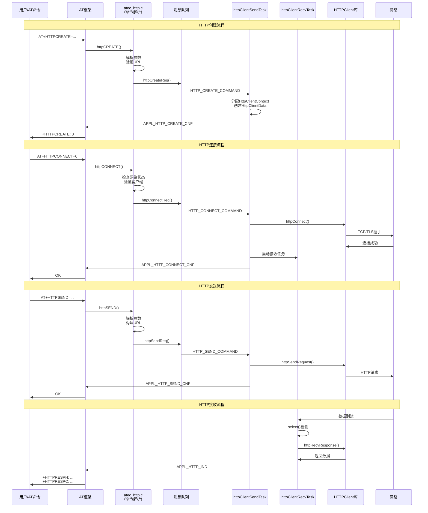
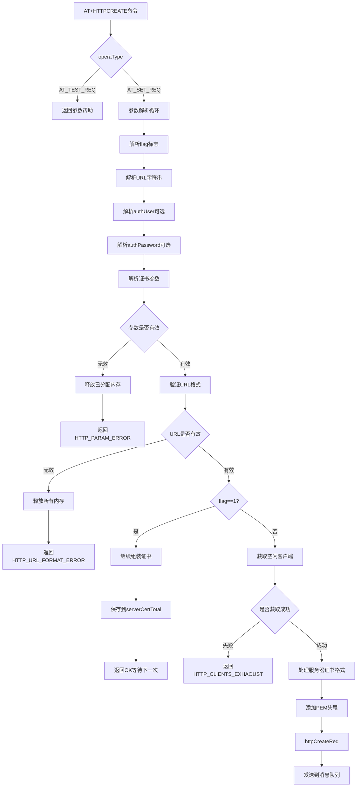
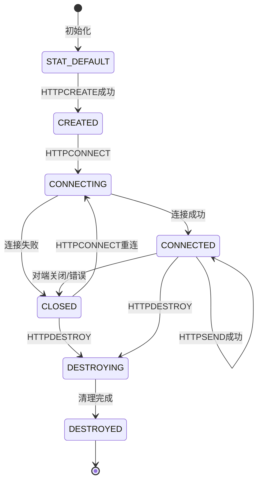

# HTTP模块AT指令 - 代码架构总结

## 目录

- [1. 架构概述](#1-架构概述)
  - [1.1 系统定位](#11-系统定位)
  - [1.2 分层架构](#12-分层架构)
  - [1.3 核心组件](#13-核心组件)
- [2. 模块依赖关系](#2-模块依赖关系)
  - [2.1 依赖的基础框架](#21-依赖的基础框架)
  - [2.2 与依赖模块的集成](#22-与依赖模块的集成)
- [3. 目录结构分析](#3-目录结构分析)
  - [3.1 目录组织](#31-目录组织)
  - [3.2 关键文件说明](#32-关键文件说明)
- [4. 核心数据结构](#4-核心数据结构)
  - [4.1 客户端上下文 (httpAtCmd)](#41-客户端上下文-httpatcmd)
  - [4.2 消息队列结构 (httpCmdMsg)](#42-消息队列结构-httpcmdmsg)
  - [4.3 创建参数结构 (httpCreatePara)](#43-创建参数结构-httpcreatepara)
  - [4.4 状态枚举](#44-状态枚举)
- [5. 关键接口分析](#5-关键接口分析)
  - [5.1 AT命令处理函数](#51-at命令处理函数)
  - [5.2 请求接口](#52-请求接口)
  - [5.3 确认/指示接口](#53-确认指示接口)
  - [5.4 客户端管理接口](#54-客户端管理接口)
- [6. 实现机制解析](#6-实现机制解析)
  - [6.1 核心流程](#61-核心流程)
  - [6.2 HTTPCREATE指令实现详解](#62-httpcreate指令实现详解)
  - [6.3 状态机设计](#63-状态机设计)
  - [6.4 通信机制](#64-通信机制)
  - [6.5 错误处理](#65-错误处理)
- [7. 配置与编译](#7-配置与编译)
  - [7.1 编译选项](#71-编译选项)
  - [7.2 宏定义](#72-宏定义)
  - [7.3 常量配置](#73-常量配置)
- [8. 扩展点识别](#8-扩展点识别)
  - [8.1 可扩展接口](#81-可扩展接口)
  - [8.2 钩子点](#82-钩子点)
- [9. 关键文件索引](#9-关键文件索引)
- [附录: AT命令列表](#附录-at命令列表)

---

## 1. 架构概述

### 1.1 系统定位

HTTP模块AT指令是EC626项目中位于中间件层的网络协议组件，负责提供HTTP/HTTPS客户端功能的AT命令接口。该模块基于第三方HTTP Client库封装，实现了完整的HTTP/HTTPS协议栈，支持GET/POST/PUT/DELETE/HEAD等请求方法，支持Basic认证、TLS安全连接、断点续传等高级功能。

### 1.2 分层架构

```
┌─────────────────────────────────────────────────────────────┐
│                    应用层 (Application)                      │
│  AT命令接口层: HTTPCREATE, HTTPCONNECT, HTTPSEND, HTTPDESTROY│
├─────────────────────────────────────────────────────────────┤
│                    HTTP AT任务层 (HTTP AT Task)              │
│  ┌─────────────────┐  ┌─────────────────┐                   │
│  │ atec_http.c     │  │ at_http_task.c  │                   │
│  │ AT命令解析/响应  │  │ 任务调度/状态机 │                   │
│  └─────────────────┘  └─────────────────┘                   │
│  ┌─────────────────┐  ┌─────────────────┐                   │
│  │ atec_http_      │  │ 消息队列        │                   │
│  │ cnf_ind.c       │  │ 互斥锁          │                   │
│  │ 确认/指示处理   │  │ 流控            │                   │
│  └─────────────────┘  └─────────────────┘                   │
├─────────────────────────────────────────────────────────────┤
│                    HTTP客户端层 (HTTP Client)                │
│  ┌─────────────────────────────────────────────────┐        │
│  │ HTTPClient.c (第三方库)                         │        │
│  │ HTTP协议实现 / TLS / 连接管理                   │        │
│  └─────────────────────────────────────────────────┘        │
├─────────────────────────────────────────────────────────────┤
│                    网络层 (Network)                          │
│  LwIP协议栈 / Socket接口 / DNS解析                          │
├─────────────────────────────────────────────────────────────┤
│                    AT框架层 (AT Framework)                   │
│  详见 [AT命令模块.md](./AT命令模块.md)                        │
├─────────────────────────────────────────────────────────────┤
│                    CMS层 (Common Service)                   │
│  消息通信、任务管理、内存管理                                 │
└─────────────────────────────────────────────────────────────┘
```

### 1.3 核心组件

| 组件 | 文件路径 | 功能描述 |
|------|----------|----------|
| **atec_http.c** | `middleware/eigencomm/at/atcust/src/atec_http.c` | AT命令入口函数，参数解析和验证 |
| **at_http_task.c** | `middleware/eigencomm/at/atentity/src/at_http_task.c` | HTTP任务管理，消息队列，状态机 |
| **atec_http_cnf_ind.c** | `middleware/eigencomm/at/atcust/src/cnfind/atec_http_cnf_ind.c` | 确认/指示处理，响应生成 |
| **HTTPClient.c/h** | `middleware/thirdparty/httpclient/` | HTTP协议实现库（第三方） |
| **atec_http.h** | `middleware/eigencomm/at/atcust/inc/atec_http.h` | AT命令参数宏定义 |
| **at_http_task.h** | `middleware/eigencomm/at/atentity/inc/at_http_task.h` | 数据结构和函数声明 |

---

## 2. 模块依赖关系

### 2.1 依赖的基础框架

本模块依赖以下模块的实现：

| 框架名 | 依赖方式 | 关键接口 | 参考文档 |
|--------|----------|----------|----------|
| AT框架 | 命令注册 | `at_register_cmd()` | [AT命令模块.md](./AT命令模块.md) |
| HTTP客户端库 | 协议实现 | `httpConnect()`, `httpSendRequest()`, `httpRecvResponse()` | 本文档详细说明 |
| LwIP | 网络传输 | Socket API, `select()`, DNS | - |
| mbedTLS | TLS安全 | SSL/TLS握手、证书验证 | - |
| CMS框架 | 信号通信 | `applSendCmsCnf()`, `applSendCmsInd()` | [AT命令模块.md](./AT命令模块.md) |
| OSAL框架 | 操作系统 | 任务、消息队列、互斥锁 | - |

### 2.2 与依赖模块的集成

本模块基于 AT 框架实现 AT 命令注册和处理。

AT 框架的详细实现机制请参考 **[AT命令模块.md](./AT命令模块.md)**。

本模块主要关注：
- HTTP 特定的 AT 命令定义和实现
- HTTP 客户端生命周期管理
- 与 AT 框架的适配层（确认/指示处理）
- 双任务架构（发送任务/接收任务）

---

## 3. 目录结构分析

### 3.1 目录组织

```
middleware/
├── eigencomm/at/
│   ├── atcust/                    # 客户AT命令
│   │   ├── src/
│   │   │   ├── atec_http.c       # AT命令入口
│   │   │   └── cnfind/
│   │   │       └── atec_http_cnf_ind.c  # 确认/指示处理
│   │   └── inc/
│   │       ├── atec_http.h       # AT命令参数宏
│   │       └── cnfind/
│   │           └── atec_http_cnf_ind.h
│   └── atentity/                  # AT实体层
│       ├── src/
│       │   └── at_http_task.c    # HTTP任务实现
│       └── inc/
│           └── at_http_task.h    # 任务层接口定义
└── thirdparty/
    └── httpclient/
        ├── HTTPClient.c          # HTTP协议库实现
        └── HTTPClient.h          # HTTP客户端接口
```

### 3.2 关键文件说明

| 文件 | 行数 | 主要功能 |
|------|------|----------|
| [atec_http.c](../../middleware/eigencomm/at/atcust/src/atec_http.c) | 747 | HTTPCREATE/HTTPCONNECT/HTTPSEND/HTTPDESTROY命令实现 |
| [at_http_task.c](../../middleware/eigencomm/at/atentity/src/at_http_task.c) | 1333 | 双任务架构、消息队列、状态机、客户端管理 |
| [atec_http_cnf_ind.c](../../middleware/eigencomm/at/atcust/src/cnfind/atec_http_cnf_ind.c) | 209 | 确认/指示消息分发处理 |
| [HTTPClient.h](../../middleware/thirdparty/httpclient/HTTPClient.h) | 192 | HTTP客户端库接口定义 |
| [atec_http.h](../../middleware/eigencomm/at/atcust/inc/atec_http.h) | 103 | AT命令参数范围宏定义 |

---

## 4. 核心数据结构

### 4.1 客户端上下文 (httpAtCmd)

```c
// 文件: at_http_task.h:104-115
typedef struct {
    BOOL isUsed;                      // 客户端是否被使用
    HTTPStatus status;                // 连接状态
    BOOL isReceiving;                 // 是否正在接收（单连接独占）
    UINT8 httpclientId;               // 客户端ID（当前固定为0）
    CHAR* host;                       // 服务器地址
    UINT8 method;                     // HTTP方法
    CHAR* url;                        // 完整URL
    HttpClientContext* clientContext; // HTTP客户端上下文
    HttpClientData* clientData;       // HTTP数据缓冲区
    UINT32 reqhandle;                 // 请求句柄（用于响应）
} httpAtCmd;
```

**作用**: 管理单个HTTP客户端的所有状态和数据，是整个模块的核心数据结构。

### 4.2 消息队列结构 (httpCmdMsg)

```c
// 文件: at_http_task.h:131-141
typedef struct {
    uint32_t cmd_type;               // 命令类型（HTTP_CREATE_COMMAND等）
    uint32_t clinetId;               // 客户端ID
    void * httpcmd;                  // 指向httpAtCmd的指针
    uint32_t reqhandle;              // AT命令句柄
    HTTPResult result;               // 操作结果
    httpCreatePara httpCreateParam;  // CREATE命令参数
} httpCmdMsg;
```

**作用**: 封装在AT命令处理任务和HTTP业务任务之间传递的消息。

### 4.3 创建参数结构 (httpCreatePara)

```c
// 文件: at_http_task.h:118-129
typedef struct {
    UINT8* authUser;                 // Basic认证用户名
    UINT8* authPassword;             // Basic认证密码
    INT32 serverCertLen;             // 服务器证书长度
    UINT8* serverCert;               // 服务器证书内容
    INT32 currentLenLast;            // 上次传输的证书长度
    INT32 clientCertLen;             // 客户端证书长度
    UINT8* clientCert;               // 客户端证书内容
    INT32 clientPkLen;               // 客户端私钥长度
    UINT8* clientPk;                 // 客户端私钥内容
} httpCreatePara;
```

**作用**: 存储HTTPCREATE命令的所有可选参数，特别是TLS相关的证书信息。

### 4.4 状态枚举

```c
// 文件: at_http_task.h:89-97
typedef enum {
    HTTPSTAT_DEFAULT = 0,    // 默认状态
    HTTPSTAT_CREATED,        // 已创建，未连接
    HTTPSTAT_CLOSED,         // 已关闭
    HTTPSTAT_CONNECTING,     // 连接中
    HTTPSTAT_CONNECTED,      // 已连接
    HTTPSTAT_RECVDATA,       // 接收数据中
    HTTPSTAT_DESTROYING,     // 销毁中
    HTTPSTAT_DESTROYED,      // 已销毁
} HTTPStatus;
```

**作用**: 定义HTTP客户端的生命周期状态。

---

## 5. 关键接口分析

### 5.1 AT命令处理函数

#### 5.1.1 httpCREATE

```c
// 文件: atec_http.c:52-360
CmsRetId httpCREATE(const AtCmdInputContext *pAtCmdReq);
```

**功能**: 创建HTTP客户端上下文，配置连接参数。

**参数**:
| 参数索引 | 参数名 | 类型 | 范围 | 说明 |
|----------|-------|------|------|------|
| 0 | flag | int | 0-1 | 0=最终，1=继续传输证书 |
| 1 | url | string | ≤128字节 | 服务器URL（http://或https://） |
| 2 | authuser | string | ≤128字节 | Basic认证用户名（可选） |
| 3 | authpasswd | string | ≤128字节 | Basic认证密码（可选） |
| 4 | totalServerCertLen | int | 0-4096 | 服务器证书总长度 |
| 5 | currentServerCertLen | int | 0-4096 | 当前传输的证书长度 |
| 6 | serverCert | string | ≤512字节 | 服务器证书内容（HEX格式） |
| 7 | clientCertLen | int | 0-4096 | 客户端证书长度 |
| 8 | clientCert | string | ≤4096字节 | 客户端证书（HEX格式） |
| 9 | clientPkLen | int | 0-4096 | 客户端私钥长度 |
| 10 | clientPk | string | ≤4096字节 | 客户端私钥（HEX格式） |

**支持的操作类型**:
- `AT_TEST_REQ`: 返回参数帮助信息
- `AT_SET_REQ`: 创建客户端

**响应**:
- 成功: `+HTTPCREATE: <clientId>`
- 失败: `+HTTPERR: <errorCode>`

#### 5.1.2 httpCONNECT

```c
// 文件: atec_http.c:372-435
CmsRetId httpCONNECT(const AtCmdInputContext *pAtCmdReq);
```

**功能**: 建立与服务器的TCP/TLS连接。

**参数**:
| 参数索引 | 参数名 | 类型 | 范围 | 说明 |
|----------|-------|------|------|------|
| 0 | clientId | int | 0 | 客户端ID（当前仅支持0） |

**前置条件检查**:
1. 网络状态必须为已激活
2. 客户端必须已创建
3. 状态必须是CREATED或CLOSED

#### 5.1.3 httpSEND

```c
// 文件: atec_http.c:447-676
CmsRetId httpSEND(const AtCmdInputContext *pAtCmdReq);
```

**功能**: 发送HTTP请求。

**参数**:
| 参数索引 | 参数名 | 类型 | 范围 | 说明 |
|----------|-------|------|------|------|
| 0 | clientId | int | 0 | 客户端ID |
| 1 | method | int | 0-4 | 0=GET,1=POST,2=PUT,3=DELETE,4=HEAD |
| 2 | pathLen | int | 0-260 | 路径长度 |
| 3 | path | string | ≤260字节 | 请求路径 |
| 4 | customHeaderLen | int | 0-255 | 自定义头部长度 |
| 5 | customHeader | string | ≤255字节 | 自定义头部（HEX格式） |
| 6 | contentTypeLen | int | 0-64 | Content-Type长度 |
| 7 | contentType | string | ≤64字节 | Content-Type |
| 8 | contentLen | int | 0-1024 | 请求体长度 |
| 9 | content | string | ≤1024字节 | 请求体（HEX格式） |
| 10 | isRange | int | 0-2 | 0=普通,1=Range,2=清除进度 |

**响应URC**:
- `+HTTPRESPH: <clientId>,<respCode>,<headerLen>,<headerData>` - 响应头部
- `+HTTPRESPC: <clientId>,<flag>,<totalLen>,<blockLen>,<hexData>` - 响应内容
- `+HTTPERR: <clientId>,<errorCode>[,<respCode>]` - 错误指示

#### 5.1.4 httpDESTROY

```c
// 文件: atec_http.c:688-744
CmsRetId httpDESTROY(const AtCmdInputContext *pAtCmdReq);
```

**功能**: 销毁HTTP客户端，释放资源。

**参数**:
| 参数索引 | 参数名 | 类型 | 范围 | 说明 |
|----------|-------|------|------|------|
| 0 | clientId | int | 0 | 客户端ID |

### 5.2 请求接口

```c
// 文件: at_http_task.h:168-171
CmsRetId httpCreateReq(UINT32 atHandle, httpAtCmd* httpCmd, httpCmdMsg httpMsg);
CmsRetId httpConnectReq(UINT32 atHandle, httpAtCmd* httpCmd);
CmsRetId httpSendReq(UINT32 atHandle, httpAtCmd* httpCmd);
CmsRetId httpDestroyReq(UINT32 atHandle, httpAtCmd* httpCmd, int httpclientId);
```

**作用**: 将AT命令请求封装成消息，发送到HTTP业务任务的消息队列。

### 5.3 确认/指示接口

#### 5.3.1 确认处理函数

```c
// 文件: atec_http_cnf_ind.c:24-84
CmsRetId httpCreateCnf(UINT16 reqHandle, UINT16 rc, void *paras);
CmsRetId httpConnCnf(UINT16 reqHandle, UINT16 rc, void *paras);
CmsRetId httpSendCnf(UINT16 reqHandle, UINT16 rc, void *paras);
CmsRetId httpDestoryCnf(UINT16 reqHandle, UINT16 rc, void *paras);
```

#### 5.3.2 指示处理函数

```c
// 文件: atec_http_cnf_ind.c:87-105
CmsRetId httpInd(UINT16 reqhandler, void *paras);
```

#### 5.3.3 消息分发表

```c
// 文件: atec_http_cnf_ind.c:112-130
static const ApplCnfFuncMapList httpCmsCnfHdrList[] = {
    {APPL_HTTP_CREATE_CNF,  httpCreateCnf},
    {APPL_HTTP_CONNECT_CNF, httpConnCnf},
    {APPL_HTTP_SEND_CNF,    httpSendCnf},
    {APPL_HTTP_DESTORY_CNF, httpDestoryCnf},
    {APPL_HTTP_PRIM_ID_END, PNULL}
};

static const ApplIndFuncMapList httpCmsIndHdrList[] = {
    {APPL_HTTP_IND,         httpInd},
    {APPL_HTTP_PRIM_ID_END, PNULL}
};
```

### 5.4 客户端管理接口

```c
// 文件: at_http_task.h:177-181
httpAtCmd* httpGetFreeClient(void);      // 获取空闲客户端
httpAtCmd* httpFindClient(int httpclientId); // 查找客户端
void httpFreeClient(int httpclientId);   // 释放客户端
```

---

## 6. 实现机制解析

### 6.1 核心流程



### 6.2 HTTPCREATE指令实现详解



**关键实现细节**:

1. **证书分块传输** (`atec_http.c:234-324`):
   - 支持超过AT命令行长度限制的大证书传输
   - `flag=1`: 继续传输，将证书片段拼接到`serverCertTotal`
   - `flag=0`: 最终传输，完成证书组装

2. **证书格式转换** (`atec_http.c:289-320`):
   - 将输入的HEX格式证书转换为PEM格式
   - 每64字符添加换行符
   - 添加`-----BEGIN CERTIFICATE-----`头和尾

3. **URL验证** (`at_http_task.c:289-426`):
   - 检查协议头（http://或https://）
   - 解析主机名和端口
   - 验证格式合法性

### 6.3 状态机设计



**状态定义** (`at_http_task.h:89-97`):

| 状态 | 值 | 说明 |
|------|---|------|
| HTTPSTAT_DEFAULT | 0 | 初始状态，客户端未创建 |
| HTTPSTAT_CREATED | 1 | 客户端已创建，等待连接 |
| HTTPSTAT_CLOSED | 2 | 连接已关闭 |
| HTTPSTAT_CONNECTING | 3 | 正在建立连接 |
| HTTPSTAT_CONNECTED | 4 | 连接已建立，可发送请求 |
| HTTPSTAT_RECVDATA | 5 | 正在接收数据 |
| HTTPSTAT_DESTROYING | 6 | 正在销毁客户端 |
| HTTPSTAT_DESTROYED | 7 | 已销毁 |

### 6.4 通信机制

#### 6.4.1 双任务架构

```c
// 文件: at_http_task.c:44-56
osThreadId_t httprecv_task_handle = NULL;   // 接收任务句柄
osThreadId_t httpsend_task_handle = NULL;   // 发送任务句柄
osMessageQueueId_t http_msgqueue = NULL;    // 消息队列
BOOL httpRecvTaskRunning = FALSE;
BOOL httpSendTaskRunning = FALSE;
```

| 任务 | 优先级 | 栈大小 | 功能 |
|------|--------|--------|------|
| `httpClientSendTask` | osPriorityBelowNormal7 | 5632 | 处理CREATE/CONNECT/SEND/DESTROY命令 |
| `httpClientRecvTask` | osPriorityBelowNormal6 | 5120 | 监听socket，接收响应数据 |

#### 6.4.2 消息队列

```c
// 文件: at_http_task.c:48-808
http_msgqueue = osMessageQueueNew(16, sizeof(httpCmdMsg), NULL);
```

**消息类型** (`at_http_task.h:48-54`):
```c
enum HTTP_MSG_CMD {
    HTTP_CREATE_COMMAND,     // 创建客户端
    HTTP_CONNECT_COMMAND,    // 建立连接
    HTTP_SEND_COMMAND,       // 发送请求
    HTTP_CLOSE_TCP_COMMAND,  // 关闭TCP（内部）
    HTTP_DESTROY_COMMAND     // 销毁客户端
};
```

#### 6.4.3 互斥锁和流控

```c
// 文件: at_http_task.c:53-54, 439-505
static osMutexId_t httpMutex = NULL;      // 客户端访问互斥
static osSemaphoreId_t flowMutex = NULL;  // 数据流控
```

- **httpMutex**: 保护`gHttpClientAtcmd`数组和socket操作
- **flowMutex**: 防止接收数据过快导致AT输出阻塞

### 6.5 错误处理

#### 6.5.1 HTTPResult错误码

```c
// 文件: HTTPClient.h:34-52
typedef enum {
    HTTP_OK = 0,         // 成功
    HTTP_PROCESSING,     // 处理中
    HTTP_PARSE,          // URL解析错误
    HTTP_DNS,            // DNS解析失败
    HTTP_PRTCL,          // 协议错误
    HTTP_NOTFOUND,       // 404错误
    HTTP_REFUSED,        // 403错误
    HTTP_ERROR,          // 其他HTTP错误
    HTTP_TIMEOUT,        // 超时
    HTTP_CONN,           // 连接错误
    HTTP_FATAL_ERROR,    // 致命错误
    HTTP_CLOSED,         // 连接被对端关闭
    HTTP_MOREDATA,       // 还有更多数据
    HTTP_OVERFLOW,       // 缓冲区溢出
    HTTP_MBEDTLS_ERR,    // TLS错误
    HTTP_CONN_ERR,       // 连接错误
} HTTPResult;
```

#### 6.5.2 AT命令错误处理

```c
// 文件: atec_http.c:174-202
if(validParam == FALSE) {
    // 释放已分配的内存
    if(url != NULL) free(url);
    if(authUser != NULL) free(authUser);
    // ...
    rc = atcReply(reqHandle, AT_RC_HTTP_ERROR, HTTP_PARAM_ERROR, NULL);
}
```

**错误处理原则**:
1. 参数解析失败时，立即释放所有已分配的内存
2. 使用`do...while(0)`模式实现统一的错误出口
3. 错误信息通过`+HTTPERR:` URC主动上报

---

## 7. 配置与编译

### 7.1 编译选项

| 宏定义 | 说明 | 默认值 |
|--------|------|--------|
| `FEATURE_HTTPC_ENABLE` | 启用HTTP客户端功能 | 需要定义 |
| `FEATURE_NWY_AT_ENABLE` | 移远AT命令扩展 | 可选 |

### 7.2 宏定义

```c
// 文件: at_http_task.h:30-37
#define HTTPCLIENT_ATCMD_MAX_NUM   1          // 最大客户端数
#define MAX_BASIC_AUTHUSER_SIZE    128        // Basic认证用户名最大长度
#define MAX_BASIC_AUTHPASSWD_SIZE  128        // Basic认证密码最大长度
#define MAX_HEAD_BUFFER_SIZE       800        // 响应头部缓冲区
#define MAX_RSP_BUFFER_SIZE        1501       // 响应内容缓冲区
#define MAX_CONTENT_TYPE_SIZE      64         // Content-Type最大长度
```

### 7.3 常量配置

```c
// 文件: at_http_task.h:41-42
#define HTTP_IS_NOT_USED   0
#define HTTP_IS_USED       1
```

---

## 8. 扩展点识别

### 8.1 可扩展接口

1. **自定义HTTP头部** (`HTTPClient.h:166`):
   ```c
   void customHeaders(HttpClientContext* context, char** headers, int pairs);
   ```

2. **Basic认证** (`HTTPClient.h:142`):
   ```c
   void basicAuth(HttpClientContext* context, const char* user, const char* password);
   ```

3. **流控回调** (`atec_http.c:64-73`):
   ```c
   __WEAK void atCmdUartHttpFlowControl(UINT8 mode);
   ```

### 8.2 钩子点

1. **证书验证钩子**: 可在`httpConnect()`中添加自定义证书验证逻辑
2. **数据接收钩子**: `httpRecvInd()`函数可用于实现自定义数据处理
3. **错误处理钩子**: `httpErrInd()`可用于实现错误重试逻辑

### 8.3 扩展限制

- 当前仅支持1个HTTP客户端（`HTTPCLIENT_ATCMD_MAX_NUM = 1`）
- 响应缓冲区大小固定为1501字节
- 不支持HTTP/2和HTTP/3

---

## 9. 关键文件索引

| 文件路径 | 主要功能 | 关键函数/结构 |
|----------|----------|---------------|
| [middleware/eigencomm/at/atcust/src/atec_http.c](../../middleware/eigencomm/at/atcust/src/atec_http.c) | AT命令入口 | `httpCREATE()`, `httpCONNECT()`, `httpSEND()`, `httpDESTROY()` |
| [middleware/eigencomm/at/atentity/src/at_http_task.c](../../middleware/eigencomm/at/atentity/src/at_http_task.c) | 任务管理 | `httpClientSendTask()`, `httpClientRecvTask()` |
| [middleware/eigencomm/at/atcust/src/cnfind/atec_http_cnf_ind.c](../../middleware/eigencomm/at/atcust/src/cnfind/atec_http_cnf_ind.c) | 确认/指示 | `httpCreateCnf()`, `httpConnCnf()`, `httpSendCnf()`, `httpInd()` |
| [middleware/eigencomm/at/atcust/inc/atec_http.h](../../middleware/eigencomm/at/atcust/inc/atec_http.h) | 参数宏定义 | HTTPCREATE_*宏 |
| [middleware/eigencomm/at/atentity/inc/at_http_task.h](../../middleware/eigencomm/at/atentity/inc/at_http_task.h) | 数据结构 | `httpAtCmd`, `HTTPStatus`, `httpCmdMsg` |
| [middleware/thirdparty/httpclient/HTTPClient.h](../../middleware/thirdparty/httpclient/HTTPClient.h) | HTTP库接口 | `httpConnect()`, `httpSendRequest()`, `httpRecvResponse()` |
| [middleware/thirdparty/httpclient/HTTPClient.c](../../middleware/thirdparty/httpclient/HTTPClient.c) | HTTP协议实现 | - |

---

## 附录: AT命令列表

### 命令汇总

| 命令 | 功能 | 语法 |
|------|------|------|
| `AT+HTTPCREATE` | 创建HTTP客户端 | `AT+HTTPCREATE=<flag>,<url>,[authuser],[authpasswd],<totalServerCertLen>,<currentServerCertLen>,<serverCert>[,<clientCertLen>,<clientCert>,<clientPkLen>,<clientPk>]` |
| `AT+HTTPCONNECT` | 建立连接 | `AT+HTTPCONNECT=<clientId>` |
| `AT+HTTPSEND` | 发送请求 | `AT+HTTPSEND=<clientId>,<method>,<pathLen>,<path>,[<customHeaderLen>,<customHeader>],[<contentTypeLen>,<contentType>],[<contentLen>,<content>],[<isRange>]` |
| `AT+HTTPDESTROY` | 销毁客户端 | `AT+HTTPDESTROY=<clientId>` |

### URC列表

| URC | 说明 |
|-----|------|
| `+HTTPCREATE: <clientId>` | 创建成功 |
| `+HTTPRESPH: <clientId>,<respCode>,<headerLen>,<headerData>` | 响应头部 |
| `+HTTPRESPC: <clientId>,<flag>,<totalLen>,<blockLen>,<hexData>` | 响应内容 |
| `+HTTPERR: <clientId>,<errorCode>[,<respCode>]` | 错误指示 |

### HTTP方法值

| 值 | 方法 |
|---|------|
| 0 | GET |
| 1 | POST |
| 2 | PUT |
| 3 | DELETE |
| 4 | HEAD |

### 典型使用流程

```
AT+HTTPCREATE=0,"http://example.com"              → 创建客户端
AT+HTTPCONNECT=0                                  → 建立连接
AT+HTTPSEND=0,0,8,"/api",0,,0,,0,                → 发送GET请求
AT+HTTPSEND=0,1,18,"/api/upload",0,,14,"application/json",28,"{\"key\":\"value\"}"  → 发送POST请求
AT+HTTPDESTROY=0                                  → 销毁客户端
```

---

*文档生成时间: 2026-02-03*
*基于代码版本: EC626 PLAT*
