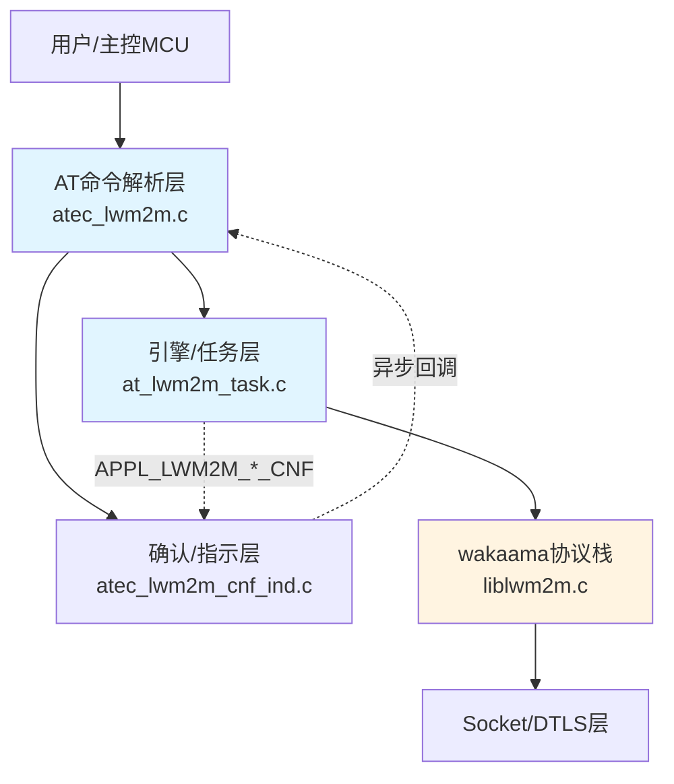
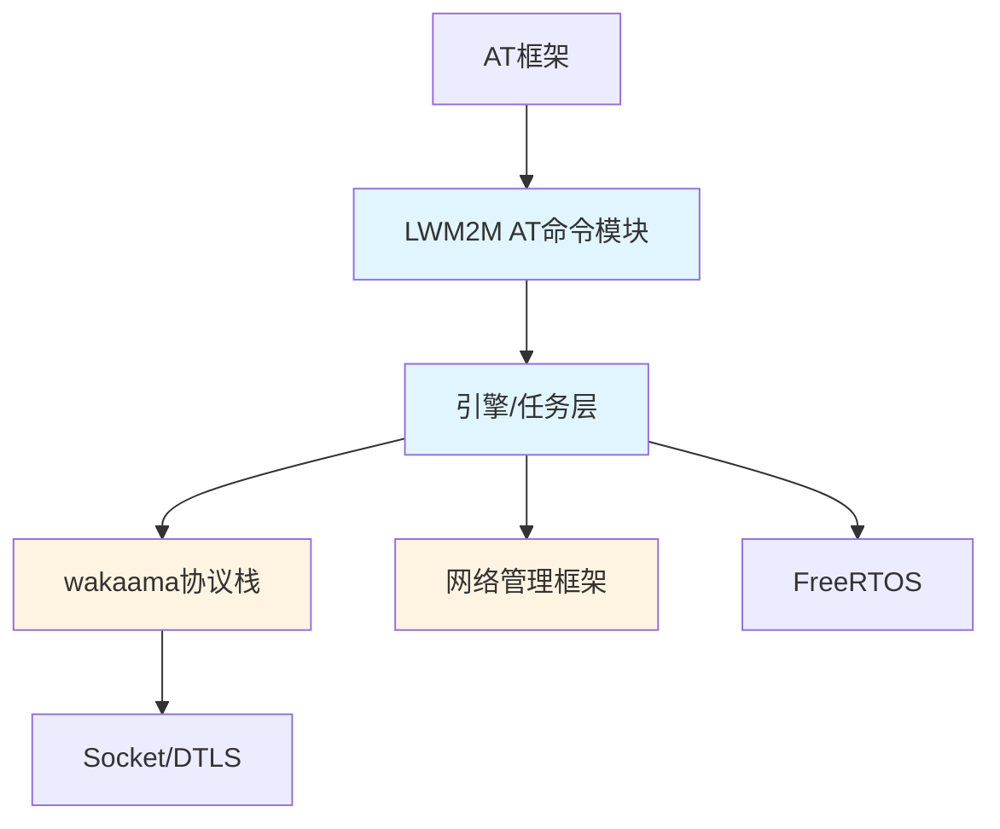
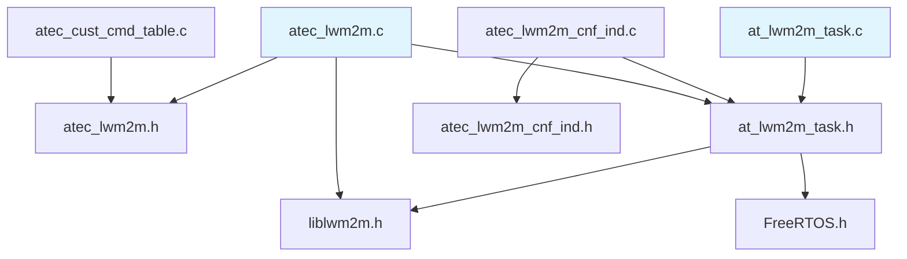
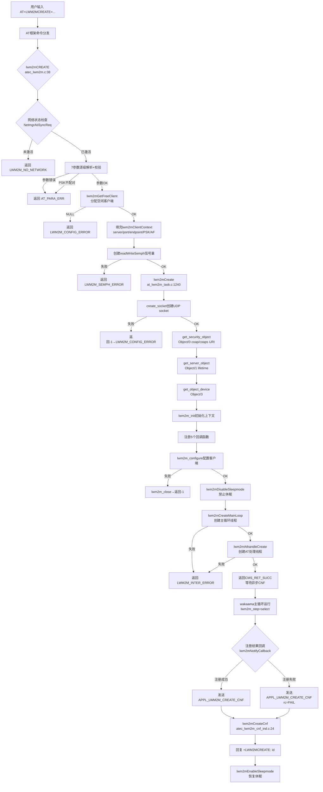
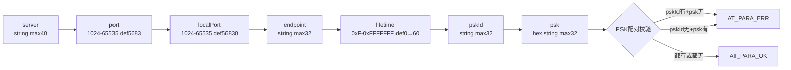
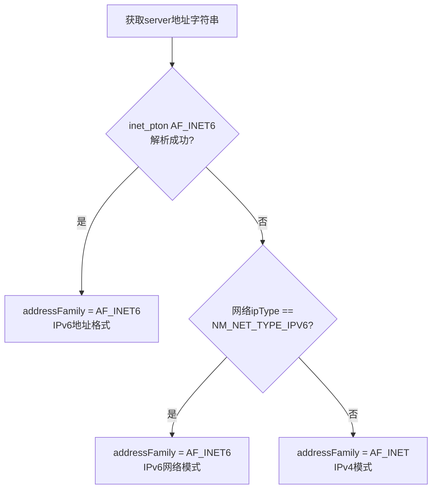
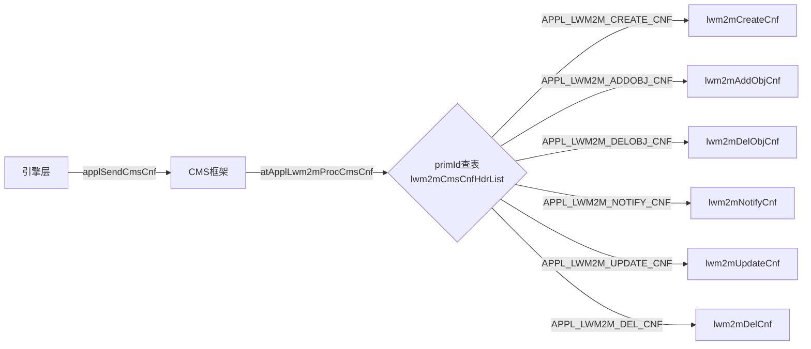

# LWM2M AT命令模块 代码架构总结

## 目录
- [1. 参考文档](#1-参考文档)
- [2. 架构概述](#2-架构概述)
- [3. 核心代码路径](#3-核心代码路径)
- [4. 模块依赖关系](#4-模块依赖关系)
- [5. 目录结构分析](#5-目录结构分析)
- [6. 核心数据结构](#6-核心数据结构)
- [7. 关键接口分析](#7-关键接口分析)
- [8. 实现机制解析](#8-实现机制解析)
- [9. 配置与编译](#9-配置与编译)
- [10. 扩展点识别](#10-扩展点识别)
- [附录](#附录)

---

## 文档信息

- **文档编号**：2
- **文档类型**：实现总结
- **模块名称**：LWM2M AT命令模块
- **代码路径**：`PLAT/middleware/eigencomm/at/`
- **分析日期**：2026-06-01
- **版本**：EC626
- **变更历史**：| 版本 | 日期 | 修订内容 | 修订人 |
  |------|------|----------|--------|
  | v1.0 | 2026-06-01 | 初始版本 | opencode |

## 1. 参考文档

> 本次分析未引用已有文档，为全新分析

## 2. 架构概述

### 2.1 系统定位

LWM2M AT命令模块属于 AT 中间件子系统，负责将 LwM2M 协议栈能力通过 AT 命令暴露给外部主控。模块基于 wakaama 开源 LwM2M 协议栈，实现设备管理、数据上报、固件升级等 OMA LwM2M 标准功能。

主要职责：
- 解析 AT 命令参数并校验合法性
- 管理 LwM2M 客户端生命周期（创建/删除/更新）
- 桥接 AT 命令层与 wakaama 协议栈引擎
- 处理异步注册结果和服务器指示

### 2.2 分层架构



### 2.3 核心组件

| 组件 | 职责 | 关键文件 |
|------|------|----------|
| AT命令解析 | 参数解析、校验、客户端上下文填充 | `atec_lwm2m.c` |
| 命令注册表 | AT命令字符串到处理函数的映射 | `atec_cust_cmd_table.c` |
| 确认/指示处理 | 异步注册结果回调、URC上报 | `atec_lwm2m_cnf_ind.c` |
| 引擎/任务 | wakaama客户端创建、主循环、消息队列 | `at_lwm2m_task.c` |
| 参数定义 | 命令参数宏（范围/默认值/长度） | `atec_lwm2m.h` |
| 引擎接口 | 数据结构定义、引擎API声明 | `at_lwm2m_task.h` |
| wakaama协议栈 | LwM2M协议核心实现 | `wakaama_core/liblwm2m.c` |

## 3. 核心代码路径

| 分类 | 文件路径 | 核心内容 | 优先级 |
|------|----------|----------|--------|
| 参数定义 | `at/atcust/inc/atec_lwm2m.h` | 9条AT命令参数宏定义、函数原型 | P0 |
| 引擎接口 | `at/atentity/inc/at_lwm2m_task.h` | lwm2mClientContext等核心数据结构、引擎API | P0 |
| AT解析实现 | `at/atcust/src/atec_lwm2m.c` | 9条AT命令的SET/TEST/READ处理 | P1 |
| 引擎实现 | `at/atentity/src/at_lwm2m_task.c` | lwm2mCreate/主循环/回调/休眠管理 | P1 |
| CNF/IND实现 | `at/atcust/src/cnfind/atec_lwm2m_cnf_ind.c` | 6个CNF+1个IND处理函数 | P1 |
| CNF/IND头 | `at/atcust/inc/cnfind/atec_lwm2m_cnf_ind.h` | CNF/IND入口函数声明 | P2 |
| 命令注册 | `at/atcust/src/atec_cust_cmd_table.c` | AT命令表注册(+LWM2MCREATE等) | P2 |
| wakaama核心 | `middleware/thirdparty/wakaama_core/liblwm2m.h` | 协议栈类型定义、回调接口 | P3 |

## 4. 模块依赖关系

### 4.1 依赖的基础框架

| 框架名 | 依赖方式 | 关键接口 | 参考文档 |
|--------|----------|----------|----------|
| AT框架 | 命令注册 | `AT_CMD_PRE_DEFINE()`, `atcReply()`, `atGetStrValue()`, `atGetNumValue()` | - |
| wakaama协议栈 | 引擎调用 | `lwm2m_init()`, `lwm2m_configure()`, `lwm2m_close()` | - |
| 网络管理框架 | 网络状态查询 | `NetmgrAtiSyncReq()`, `appGetNetInfoSync()` | - |
| FreeRTOS | 任务/同步 | `xSemaphoreCreateBinary()`, `xTaskCreate()` | - |
| Socket/DTLS | 传输层 | `create_socket()`, `connection_t`/`dtls_connection_t` | - |

### 4.2 被依赖的模块

无（本模块为最上层AT命令接口，不被其他模块依赖）

### 4.3 模块间接口

| 接口方向 | 接口函数 | 说明 |
|----------|----------|------|
| AT框架→本模块 | `lwm2mCREATE()` 等9个handler | AT框架通过命令表分发调用 |
| 本模块→引擎层 | `lwm2mCreate()`, `lwm2mCreateMainLoop()`, `lwm2mAthandleCreate()` | CREATE命令调用引擎 |
| 本模块→引擎层 | `lwm2mClientAddobj()`, `lwm2mClientDelobj()` 等 | 其他命令调用引擎 |
| 引擎层→CNF层 | `applSendCmsCnf()` 发送 `APPL_LWM2M_*_CNF` | 异步结果通知 |
| CNF层→AT框架 | `atcReply()`, `atcURC()` | 回复AT命令结果/主动上报 |

### 4.4 与依赖模块的集成

本模块基于 AT 框架实现 AT 命令注册和处理，通过 `AT_CMD_PRE_DEFINE()` 宏将命令字符串映射到处理函数。AT 框架负责命令行解析、参数分割，本模块通过 `atGetStrValue()`/`atGetNumValue()` 逐级提取参数。

wakaama 协议栈作为底层引擎，本模块通过 `lwm2m_init()`→`lwm2m_configure()` 初始化客户端，通过回调机制（`notifyCallback`/`observeCallback`）接收异步事件。

### 4.5 模块依赖关系图



## 5. 目录结构分析

### 5.1 目录组织

```
PLAT/middleware/eigencomm/at/
├── atcust/                          # AT命令定制层
│   ├── inc/                         # 头文件
│   │   ├── atec_lwm2m.h             # LWM2M AT命令参数定义
│   │   └── cnfind/
│   │       └── atec_lwm2m_cnf_ind.h # CNF/IND接口声明
│   └── src/                         # 源文件
│       ├── atec_lwm2m.c             # LWM2M AT命令处理实现
│       ├── atec_cust_cmd_table.c    # AT命令注册表
│       └── cnfind/
│           └── atec_lwm2m_cnf_ind.c # CNF/IND处理实现
├── atentity/                        # AT实体/引擎层
│   ├── inc/
│   │   └── at_lwm2m_task.h          # 引擎接口+数据结构定义
│   └── src/
│       └── at_lwm2m_task.c          # 引擎核心实现
└── nwy_at/                          # BC28兼容AT命令
    └── nwy_ctlwm2mBC28_at/
        ├── inc/nwy_ctlwm2mBC28_at.h
        └── src/nwy_ctlwm2mBC28_at.c

PLAT/middleware/thirdparty/wakaama_core/  # wakaama协议栈
├── liblwm2m.h
├── liblwm2m.c
└── ...
```

### 5.2 关键文件说明

| 文件 | 类型 | 说明 | 依赖 |
|------|------|------|------|
| `atec_lwm2m.h` | .h | 9条AT命令参数范围/默认值宏、handler函数原型 | `at_util.h` |
| `atec_lwm2m.c` | .c | 9条AT命令的解析+处理实现 | `atec_lwm2m.h`, `at_lwm2m_task.h`, `liblwm2m.h` |
| `atec_lwm2m_cnf_ind.c` | .c | 6个CNF+1个IND异步回调处理 | `atec_lwm2m_cnf_ind.h`, `at_lwm2m_task.h` |
| `at_lwm2m_task.h` | .h | 核心数据结构(lwm2mClientContext等)、引擎API | `liblwm2m.h`, `FreeRTOS.h` |
| `at_lwm2m_task.c` | .c | 引擎核心：客户端创建/主循环/回调/休眠/NVM | `at_lwm2m_task.h` |
| `atec_cust_cmd_table.c` | .c | AT命令注册表(+LWM2MCREATE等9条) | `atec_lwm2m.h` |

### 5.3 文件依赖关系图



## 6. 核心数据结构

### 6.1 结构体定义

| 结构体 | 主要字段 | 用途 | 生命周期 |
|--------|----------|------|----------|
| `lwm2mClientContext` | isUsed, isConnected, isQuit, server, serverPort, localPort, enderpoint, pskId/psk/pskLen, lifetime, addressFamily, context(lwm2m_context_t*), clientData, connP, readWriteSemph, location, hostRestore | LWM2M客户端运行时上下文，存储连接参数、协议栈句柄、同步信号量 | CREATE时malloc分配，DELETE时释放 |
| `lwm2mRetentionContext` | isUsed, isConnected, server, serverPort, localPort, enderpoint, pskId/psk, lifetime, lwm2mclientId, lwm2mState, objectInfo[], obsevInfo[], location, reqhandle, hostRestore | NVM持久化上下文，用于休眠唤醒后恢复客户端状态 | 写入NVM文件，休眠恢复时读取 |
| `lwm2mObjectInfo` | isUsed, objectId, instanceId, resourceCount, resourceIds[] | 记录客户端添加的LWM2M对象实例信息 | ADDOBJ时创建，DELOBJ时删除 |
| `lwm2m_cnf_msg` | id, ret | CNF回调消息，携带客户端ID和结果码 | 栈上临时变量 |
| `LWM2M_ATCMD_Q_MSG` | cmd_type, reqhandle, lwm2mId, objId, withobj, uri, cmd | AT命令消息队列消息体 | 任务间传递 |
| `lwm2mAddobjCmd` | objectid, instanceId, resourceIds, resourceCount | ADDOBJ命令参数 | 命令处理时临时构造 |
| `lwm2mCmdContext` | cmdType, objectId, instanceId, resId, withObj, objectP | AT命令上下文，记录当前执行的命令类型和参数 | 全局变量 `lwm2mCmdCxt` |
| `security_instance_t` | uri, isBootstrap, securityMode, publicIdentity, secretKey, shortID | LWM2M Security Object (/0) 实例数据 | wakaama对象内部使用 |
| `prv_instance_t` | shortID, resourceCount, resourceIds | LWM2M Server Object (/1) 实例数据 | wakaama对象内部使用 |

### 6.2 枚举类型

| 枚举 | 值域 | 用途 |
|------|------|------|
| `applLwm2mPrimId` | `APPL_LWM2M_CREATE_CNF`, `ADDOBJ_CNF`, `DELOBJ_CNF`, `NOTIFY_CNF`, `UPDATE_CNF`, `DEL_CNF`, `IND`, `PRIM_ID_END` | CNF/IND消息类型标识，用于分发异步回调 |
| `valuetype` | `STRING=0`, `OPAQUE`, `INTEGER`, `FLOAT`, `BOOL`, `UNKNOWN` | LWM2M资源值类型，用于READCONF/NOTIFY参数解析 |
| `LWM2M_MSG_CMD` | `MSG_LWM2M_NOTIFY`, `ADDOBJ`, `DELOBJ`, `DELETE`, `UPDATE` | AT命令处理线程消息类型 |
| `LWM2M_TASK_STATUS` | `LWM2M_TASK_STAT_NONE`, `LWM2M_TASK_STAT_CREATE` | 引擎任务状态 |
| `lwm2m_cmd_type_t` | `NONE=0`, `UPDATE=1`, `NOTIFY=2`, `ADDOBJ=3` | AT命令类型标识 |

### 6.3 全局变量

| 变量名 | 类型 | 作用域 | 说明 |
|--------|------|--------|------|
| `lwm2mCmdCxt` | `lwm2mCmdContext` | 全局(atec_lwm2m.c) | 当前AT命令上下文，初始值 `{LWM2M_CMD_NONE,0,0,0,0,0}` |
| `lwm2mTaskStart` | `UINT8` | 外部声明 | LWM2M任务启动标志 |
| `gLwm2mClient[]` | `lwm2mClientContext[]` | 全局(at_lwm2m_task.c) | 客户端实例数组，最大 `LWM2M_CLIENT_MAX_INSTANCE_NUM=1` |
| `lwm2m_objArray[][]` | `lwm2m_object_t*[][]` | 全局(at_lwm2m_task.c) | LWM2M对象指针数组 |
| `lwm2mSlpHandler` | `slpManSlpId_t` | 静态(at_lwm2m_task.c) | 休眠管理句柄 |

## 7. 关键接口分析

### 7.1 API 函数

| 函数 | 功能 | 参数 | 返回值 | 线程安全 |
|------|------|------|--------|----------|
| `lwm2mCREATE()` | AT+LWM2MCREATE处理：网络检查→参数解析→客户端分配→引擎创建 | `pAtCmdReq` | `CmsRetId` | 否(单AT通道) |
| `lwm2mDELETE()` | AT+LWM2MDELETE处理：删除客户端、释放资源 | `pAtCmdReq` | `CmsRetId` | 否 |
| `lwm2mADDOBJ()` | AT+LWM2MADDOBJ处理：添加对象实例到客户端 | `pAtCmdReq` | `CmsRetId` | 否 |
| `lwm2mDELOBJ()` | AT+LWM2MDELOBJ处理：删除对象实例 | `pAtCmdReq` | `CmsRetId` | 否 |
| `lwm2mREADCONF()` | AT+LWM2MREADCONF处理：读取资源配置值 | `pAtCmdReq` | `CmsRetId` | 否 |
| `lwm2mWRITECONF()` | AT+LWM2MWRITECONF处理：写入配置响应结果 | `pAtCmdReq` | `CmsRetId` | 否 |
| `lwm2mEXECUTECONF()` | AT+LWM2MEXECUTECONF处理：执行配置响应结果 | `pAtCmdReq` | `CmsRetId` | 否 |
| `lwm2mNOTIFY()` | AT+LWM2MNOTIFY处理：上报资源数据 | `pAtCmdReq` | `CmsRetId` | 否 |
| `lwm2mUPDATE()` | AT+LWM2MUPDATE处理：触发注册更新 | `pAtCmdReq` | `CmsRetId` | 否 |

### 7.2 命令接口（AT命令模块特有）

| 命令 | 处理函数 | 参数 | 说明 |
|------|----------|------|------|
| `AT+LWM2MCREATE` | `lwm2mCREATE()` | server,port,localPort,endpoint,lifetime,pskId,psk | 创建LWM2M客户端并注册到服务器 |
| `AT+LWM2MDELETE` | `lwm2mDELETE()` | clientId | 删除客户端、释放所有资源 |
| `AT+LWM2MADDOBJ` | `lwm2mADDOBJ()` | clientId,objId,instId,resCount,resIds | 添加对象实例 |
| `AT+LWM2MDELOBJ` | `lwm2mDELOBJ()` | clientId,objId | 删除对象实例 |
| `AT+LWM2MREADCONF` | `lwm2mREADCONF()` | clientId,objId,instId,resId,type,len,value | 读取资源配置 |
| `AT+LWM2MWRITECONF` | `lwm2mWRITECONF()` | clientId,ret | 写入配置结果回复 |
| `AT+LWM2MEXECUTECONF` | `lwm2mEXECUTECONF()` | clientId,ret | 执行配置结果回复 |
| `AT+LWM2MNOTIFY` | `lwm2mNOTIFY()` | clientId,objId,instId,resCount,type,len,value | 上报资源数据 |
| `AT+LWM2MUPDATE` | `lwm2mUPDATE()` | clientId,withObj | 触发注册更新 |

### 7.3 回调函数

| 回调 | 触发条件 | 注册方式 |
|------|----------|----------|
| `lwm2mNotifyCallback()` | LwM2M注册成功/失败/发送确认 | `lwm2m->context->notifyCallback = lwm2mNotifyCallback` (at_lwm2m_task.c:1310) |
| `lwm2mObserveCallback()` | 服务器观察/取消观察资源 | `lwm2m->context->observeCallback = lwm2mObserveCallback` (at_lwm2m_task.c:1305) |
| `lwm2mParameterCallback()` | 服务器设置/读取资源属性 | `lwm2m->context->parameterCallback = lwm2mParameterCallback` (at_lwm2m_task.c:1307) |
| `lwm2mConnectServer()` | wakaama需要建立服务器连接 | `lwm2m->context->connectServerCallback = lwm2mConnectServer` (at_lwm2m_task.c:1308) |
| `lwm2mCloseConnection()` | wakaama关闭连接 | `lwm2m->context->closeConnectionCallback = lwm2mCloseConnection` (at_lwm2m_task.c:1309) |
| `lwm2mObjectReadCallback()` | 服务器读取资源 | wakaama对象结构体 `readFunc` 字段 |
| `lwm2mObjectWriteCallback()` | 服务器写入资源 | wakaama对象结构体 `writeFunc` 字段 |
| `lwm2mObjectExecuteCallback()` | 服务器执行资源 | wakaama对象结构体 `executeFunc` 字段 |

### 7.4 引擎层核心函数

| 函数 | 功能 | 参数 | 返回值 |
|------|------|------|--------|
| `lwm2mCreate()` | 创建wakaama客户端：socket→安全对象→服务器对象→设备对象→init→configure | `lwm2mClientContext*` | 0成功/-1失败 |
| `lwm2mCreateMainLoop()` | 创建LWM2M主循环任务线程 | 无 | `LWM2M_ERRID_OK`/错误码 |
| `lwm2mAthandleCreate()` | 创建AT命令处理任务线程 | 无 | `LWM2M_ERRID_OK`/错误码 |
| `lwm2mGetFreeClient()` | 从客户端数组中获取空闲槽位 | 无 | `lwm2mClientContext*`/NULL |
| `lwm2mFindClient()` | 根据clientId查找客户端 | `INT32 clientId` | `lwm2mClientContext*`/NULL |
| `lwm2mRemoveClient()` | 释放客户端资源 | `UINT8 id` | void |
| `lwm2mClientNotify()` | 发送NOTIFY命令到引擎消息队列 | `reqHandle,id,uri` | `CmsRetId` |
| `lwm2mClientAddobj()` | 发送ADDOBJ命令到引擎消息队列 | `reqHandle,id,pCmd` | `CmsRetId` |
| `lwm2mClientDelobj()` | 发送DELOBJ命令到引擎消息队列 | `reqHandle,id,objId` | `CmsRetId` |
| `lwm2mClientUpdate()` | 发送UPDATE命令到引擎消息队列 | `reqHandle,id,withobj` | `CmsRetId` |
| `lwm2mClientDelete()` | 发送DELETE命令到引擎消息队列 | `reqHandle,id` | `CmsRetId` |

## 8. 实现机制解析

### 8.1 核心流程：AT+LWM2MCREATE 完整调用链



### 8.2 AT+LWM2MCREATE 参数解析流程



### 8.3 IP版本自动检测机制



### 8.4 URI协议选择逻辑

| 条件 | URI格式 | 说明 |
|------|---------|------|
| psk != NULL | `coaps://<server>:<port>` | DTLS加密连接 |
| psk == NULL | `coap://<server>:<port>` | 明文连接 |
| hostRestore != NULL | 使用恢复的URI | 休眠唤醒恢复场景 |

### 8.5 CNF/IND分发机制



### 8.6 休眠管理机制

| 时机 | 操作 | 位置 |
|------|------|------|
| CREATE命令执行 | `lwm2mDisableSleepmode()` 禁止SLP2 | atec_lwm2m.c:191 |
| CREATE CNF回调(成功/失败) | `lwm2mEnableSleepmode()` 恢复SLP2 | atec_lwm2m_cnf_ind.c:42 |
| ADDOBJ/DELOBJ/UPDATE/DELETE CNF | `lwm2mEnableSleepmode()` 恢复SLP2 | atec_lwm2m_cnf_ind.c:62,81,118,139 |
| NOTIFY发送确认 | `slpManPlatVoteEnableSleep()` 恢复SLP2 | at_lwm2m_task.c:1236 |

### 8.7 错误处理

| 错误码 | 含义 | 触发条件 | 处理方式 |
|--------|------|----------|----------|
| `LWM2M_NO_NETWORK` | 网络未激活 | `netStatus != NM_NETIF_ACTIVATED` | 直接返回错误，不创建客户端 |
| `AT_PARA_ERR` | 参数错误 | 参数超范围/PSK不配对 | 直接返回错误 |
| `LWM2M_SEMPH_ERROR` | 信号量创建失败 | `xSemaphoreCreateBinary() == NULL` | 移除客户端，返回错误 |
| `LWM2M_CONFIG_ERROR` | 引擎配置失败 | `lwm2mCreate() < 0` (socket/对象/init/configure失败) | 移除客户端，返回错误 |
| `LWM2M_INTER_ERROR` | 内部错误 | `lwm2mCreateMainLoop()`/`lwm2mAthandleCreate()` 失败 | 返回错误 |
| `LWM2M_SESSION_INVALID` | 会话无效 | DELETE时客户端未连接 | CNF返回错误 |

### 8.8 PSK处理流程

```
输入: pskId="identity", psk="A1B2C3D4"(hex字符串)
  │
  ├─ pskId: malloc(pskIdLen+1) → memcpy
  │
  └─ psk:   malloc(pskLen/2+1) → cmsHexStrToHex(psk, pskLen/2, pskHexStr, pskLen)
            "A1B2C3D4" → {0xA1, 0xB2, 0xC3, 0xD4}  (4字节二进制)
            pskLen = pskLen/2 = 4
```

## 9. 配置与编译

### 9.1 编译选项

- **WITH_TINYDTLS_LWM2M**: 启用DTLS支持，影响连接类型(`dtls_connection_t` vs `connection_t`)和PSK加密流程

### 9.2 宏定义

| 宏名 | 默认值 | 说明 |
|------|--------|------|
| `MAX_SERVER_LEN` | 40 | 服务器地址最大长度 |
| `MAX_NAME_LEN` | 32 | endpoint/pskId最大长度 |
| `DEFAULT_LIFE_TIME` | 60 | 默认注册生命周期(秒) |
| `LWM2M_CLIENT_MAX_INSTANCE_NUM` | 1 | 最大客户端实例数 |
| `MAX_OBJECT_COUNT` | 5 | 每客户端最大对象数 |
| `MAX_RESOURCE_COUNT` | 10 | 每对象最大资源数 |
| `MAX_HOST_SIZE` | 64 | 恢复主机地址最大长度 |
| `MAX_LWM2M_PACKET_SIZE` | 1024 | LWM2M数据包最大尺寸 |
| `READ_WRITE_TIMEOUT` | 5000 | 读写超时(ms) |
| `IND_BUFFER` | 512 | 指示缓冲区大小 |
| `LWM2M_ATHDL_TASK_STACK_SIZE` | 2560 | AT处理任务栈大小 |
| `LWM2M_MSG_TIMEOUT` | 500 | 消息等待超时(ms) |
| `LWM2M_NVM_FILE_NAME` | "lwm2mconfig.nvm" | NVM持久化文件名 |
| `LWM2M_NVM_FILE_VERSION` | 0 | NVM文件版本号 |

### 9.3 AT命令参数宏 (atec_lwm2m.h)

| 命令 | 参数 | 宏前缀 | 范围/长度 | 默认值 |
|------|------|--------|-----------|--------|
| LWM2MCREATE | server | `LWM2MCREATE_0_SERVER_STR` | max 40 | NULL |
| LWM2MCREATE | port | `LWM2MCREATE_1_PORT` | 1024-65535 | 5683 |
| LWM2MCREATE | localPort | `LWM2MCREATE_2_LOCALPORT` | 1024-65535 | 56830 |
| LWM2MCREATE | endpoint | `LWM2MCREATE_3_ENDPOINT_STR` | max 32 | NULL |
| LWM2MCREATE | lifetime | `LWM2MCREATE_4_LIFETIME` | 0xF-0xFFFFFFF | 0 |
| LWM2MCREATE | pskId | `LWM2MCREATE_5_PSKID_STR` | max 32 | NULL |
| LWM2MCREATE | psk | `LWM2MCREATE_6_PSK_STR` | max 32 | NULL |
| LWM2MDELETE | clientId | `LWM2MDELETE_0_CLIENTID` | 0-0 | 0 |
| LWM2MADDOBJ | clientId | `LWM2MADDOBJ_0_ID` | 0-0 | 0 |
| LWM2MADDOBJ | objId | `LWM2MADDOBJ_1_OBJID` | 0-0xFFFF | 0 |
| LWM2MADDOBJ | instId | `LWM2MADDOBJ_2_INSTID` | 0-0xFFFF | 0 |
| LWM2MADDOBJ | resCount | `LWM2MADDOBJ_3_RESOURCECOUNT` | 1-0xFF | 0 |
| LWM2MADDOBJ | resIds | `LWM2MADDOBJ_4_RESID_STR` | max 32 | NULL |
| LWM2MNOTIFY | clientId | `LWM2MNOTIFY_0_ID` | 0-0 | 0 |
| LWM2MNOTIFY | objId | `LWM2MNOTIFY_1_OBJID` | 0-0xFFFF | 0 |
| LWM2MNOTIFY | instId | `LWM2MNOTIFY_2_INSTID` | 0-0xFFFF | 0 |
| LWM2MNOTIFY | resCount | `LWM2MNOTIFY_3_RESOURCECOUNT` | 0-0xFFFF | 0 |
| LWM2MNOTIFY | type | `LWM2MNOTIFY_4_TYPE` | 0-4 | 0 |
| LWM2MNOTIFY | len | `LWM2MNOTIFY_5_LEN` | 1-40 | 0 |
| LWM2MNOTIFY | value | `LWM2MNOTIFY_6_VALUE` | max 40 | NULL |
| LWM2MUPDATE | clientId | `LWM2MUPDATE_0_ID` | 0-0 | 0 |
| LWM2MUPDATE | withObj | `LWM2MUPDATE_1_WITHOBJ` | 0-1 | 0 |

### 9.4 AT命令注册表 (atec_cust_cmd_table.c)

| 命令字符串 | 处理函数 | 参数属性数组 | 命令类型 | 超时 |
|-----------|----------|-------------|----------|------|
| `+LWM2MCREATE` | `lwm2mCREATE` | `attrLWM2MCREATE` | `AT_EXT_PARAM_CMD` | 13*DEFAULT_TIMEOUT |
| `+LWM2MDELETE` | `lwm2mDELETE` | `attrLWM2MDELETE` | `AT_EXT_PARAM_CMD` | DEFAULT_TIMEOUT |
| `+LWM2MADDOBJ` | `lwm2mADDOBJ` | `attrLWM2MADDOBJ` | `AT_EXT_PARAM_CMD` | DEFAULT_TIMEOUT |
| `+LWM2MDELOBJ` | `lwm2mDELOBJ` | `attrLWM2MDELOBJ` | `AT_EXT_PARAM_CMD` | DEFAULT_TIMEOUT |
| `+LWM2MREADCONF` | `lwm2mREADCONF` | `attrLWM2MREADCONF` | `AT_EXT_PARAM_CMD` | DEFAULT_TIMEOUT |
| `+LWM2MWRITECONF` | `lwm2mWRITECONF` | `attrLWM2MWRITECONF` | `AT_EXT_PARAM_CMD` | DEFAULT_TIMEOUT |
| `+LWM2MEXECUTECONF` | `lwm2mEXECUTECONF` | `attrLWM2MEXECUTECONF` | `AT_EXT_PARAM_CMD` | DEFAULT_TIMEOUT |
| `+LWM2MNOTIFY` | `lwm2mNOTIFY` | `attrLWM2MNOTIFY` | `AT_EXT_PARAM_CMD` | DEFAULT_TIMEOUT |
| `+LWM2MUPDATE` | `lwm2mUPDATE` | `attrLWM2MUPDATE` | `AT_EXT_PARAM_CMD` | DEFAULT_TIMEOUT |

## 10. 扩展点识别

### 10.1 可扩展接口

| 接口 | 扩展方式 | 示例 |
|------|----------|------|
| wakaama对象回调 | 通过 `lwm2m_object_t` 结构体的 `readFunc`/`writeFunc`/`executeFunc`/`createFunc` 字段注册自定义处理 | `lwm2mObjectReadCallback` 处理服务器Read请求 |
| AT命令注册表 | 在 `atec_cust_cmd_table.c` 中添加 `AT_CMD_PRE_DEFINE` 条目 | 新增 `+LWM2MXXX` 命令 |
| CNF/IND分发表 | 在 `lwm2mCmsCnfHdrList[]`/`lwm2mCmsIndHdrList[]` 中添加新primId映射 | 新增异步消息类型 |

### 10.2 钩子点

| 钩子 | 触发时机 | 用途 |
|------|----------|------|
| `lwm2mNotifyCallback()` | LwM2M注册状态变化、发送确认 | 处理注册成功/失败，发送CNF |
| `lwm2mObserveCallback()` | 服务器观察/取消观察资源 | 生成URC通知主控 |
| `lwm2mParameterCallback()` | 服务器设置资源属性 | 处理Discover/Observe属性 |
| `lwm2mConnectServer()` | wakaama建立服务器连接 | 创建socket连接/DTLS会话 |
| `lwm2mCloseConnection()` | wakaama关闭连接 | 释放socket/DTLS资源 |

### 10.3 插件机制

本模块无显式插件机制。扩展主要通过：
1. **wakaama对象系统**：通过 `get_*_object()` 函数添加新的LWM2M对象
2. **AT命令表**：通过 `AT_CMD_PRE_DEFINE` 宏扩展命令集
3. **编译宏**：`WITH_TINYDTLS_LWM2M` 控制DTLS/明文切换

## 附录

### A. 文件清单

| 序号 | 文件绝对路径 | 说明 |
|------|-------------|------|
| 1 | `PLAT/middleware/eigencomm/at/atcust/inc/atec_lwm2m.h` | LWM2M AT命令参数定义头文件 |
| 2 | `PLAT/middleware/eigencomm/at/atcust/src/atec_lwm2m.c` | LWM2M AT命令处理实现 |
| 3 | `PLAT/middleware/eigencomm/at/atcust/src/atec_cust_cmd_table.c` | AT命令注册表 |
| 4 | `PLAT/middleware/eigencomm/at/atcust/src/cnfind/atec_lwm2m_cnf_ind.c` | CNF/IND处理实现 |
| 5 | `PLAT/middleware/eigencomm/at/atcust/inc/cnfind/atec_lwm2m_cnf_ind.h` | CNF/IND接口声明 |
| 6 | `PLAT/middleware/eigencomm/at/atentity/inc/at_lwm2m_task.h` | 引擎接口+数据结构定义 |
| 7 | `PLAT/middleware/eigencomm/at/atentity/src/at_lwm2m_task.c` | 引擎核心实现 |
| 8 | `PLAT/middleware/thirdparty/wakaama_core/liblwm2m.h` | wakaama协议栈头文件 |
| 9 | `PLAT/middleware/thirdparty/wakaama_core/liblwm2m.c` | wakaama协议栈核心实现 |

### B. 术语表

| 术语 | 全称 | 说明 |
|------|------|------|
| LwM2M | Lightweight M2M | OMA组织定义的物联网设备管理协议 |
| wakaama | - | Eclipse开源LwM2M C语言实现 |
| CNF | Confirm | AT命令异步确认响应 |
| IND | Indication | AT命令主动上报(URC) |
| PSK | Pre-Shared Key | 预共享密钥，用于DTLS加密 |
| DTLS | Datagram TLS | 基于UDP的TLS加密协议 |
| NVM | Non-Volatile Memory | 非易失性存储，用于休眠恢复 |
| SLP2 | Sleep Level 2 | EC616芯片的第二级休眠模式 |
| URC | Unsolicited Result Code | 主动上报结果码 |
| Object/0 | Security Object | LwM2M安全对象，存储服务器URI和密钥 |
| Object/1 | Server Object | LwM2M服务器对象，存储lifetime等 |
| Object/3 | Device Object | LwM2M设备对象，存储设备信息 |

### C. 参考资料

- OMA LwM2M 规范: https://www.omaspecworks.org/what-is-oma-specworks/iot/lightweight-m2m-lwm2m/
- Eclipse Wakaama: https://github.com/eclipse/wakaama
