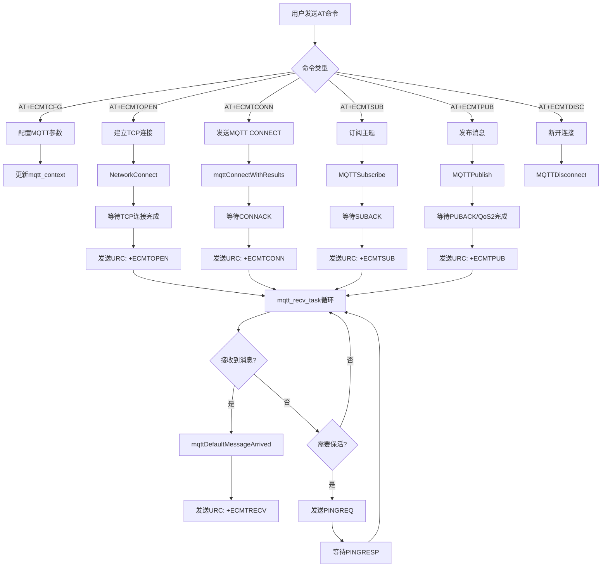
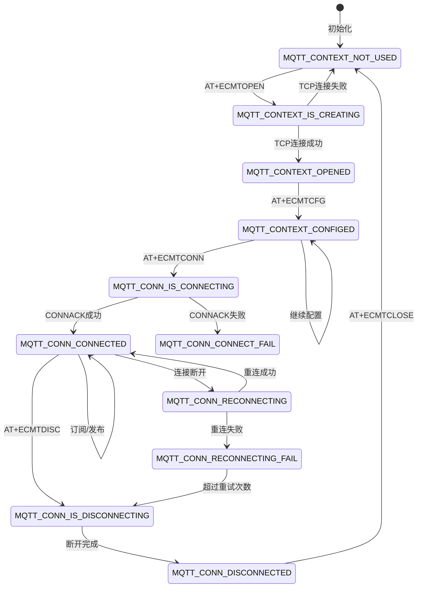

# MQTT模块 - 代码架构总结

## 目录

- [1. 架构概述](#1-架构概述)
  - [1.1 系统定位](#11-系统定位)
  - [1.2 分层架构](#12-分层架构)
  - [1.3 核心组件](#13-核心组件)
- [2. 模块依赖关系](#2-模块依赖关系)
  - [2.1 依赖的基础框架](#21-依赖的基础框架)
  - [2.2 被依赖的模块](#22-被依赖的模块)
  - [2.3 与依赖模块的集成](#23-与依赖模块的集成)
- [3. 目录结构分析](#3-目录结构分析)
  - [3.1 目录组织](#31-目录组织)
  - [3.2 关键文件说明](#32-关键文件说明)
- [4. 核心数据结构](#4-核心数据结构)
  - [4.1 MQTT上下文 (mqtt_context)](#41-mqtt上下文-mqtt_context)
  - [4.2 发送消息结构 (mqtt_send_msg)](#42-发送消息结构-mqtt_send_msg)
  - [4.3 消息数据结构 (mqtt_message)](#43-消息数据结构-mqtt_message)
  - [4.4 枚举类型](#44-枚举类型)
- [5. 关键接口分析](#5-关键接口分析)
  - [5.1 AT命令接口](#51-at命令接口)
  - [5.2 MQTT客户端API](#52-mqtt客户端api)
  - [5.3 回调函数](#53-回调函数)
- [6. 实现机制解析](#6-实现机制解析)
  - [6.1 核心流程](#61-核心流程)
  - [6.2 状态机设计](#62-状态机设计)
  - [6.3 任务架构](#63-任务架构)
  - [6.4 错误处理](#64-错误处理)
- [7. 配置与编译](#7-配置与编译)
  - [7.1 编译选项](#71-编译选项)
  - [7.2 宏定义](#72-宏定义)
  - [7.3 云平台配置](#73-云平台配置)
- [8. 扩展点识别](#8-扩展点识别)
  - [8.1 可扩展接口](#81-可扩展接口)
  - [8.2 钩子点](#82-钩子点)
- [9. 关键文件索引](#9-关键文件索引)

---

## 1. 架构概述

### 1.1 系统定位

MQTT模块是EC626项目中位于中间件层的物联网协议组件，基于MQTT 3.1/3.1.1协议标准实现，提供设备与云平台之间的轻量级消息通信能力。该模块支持多种云平台（OneNET、阿里云、Eclipse MQTT），支持TLS安全传输，具备自动重连、QoS保证、遗嘱消息等企业级特性。

### 1.2 分层架构

```
+===========================================================================+
|                              应用层 (Application)                          |
|  用户业务逻辑 + 云平台业务层                                              |
+===========================================================================+
|                              AT命令层 (AT Layer)                          |
|  +------------+  +------------+  +------------+  +---------------------+ |
|  | AT+ECMTCFG |  | AT+ECMTOPEN|  | AT+ECMTCONN|  | AT+ECMTSUB/PUB/UNS  | |
|  +------------+  +------------+  +------------+  +---------------------+ |
+===========================================================================+
|                            MQTT中间件层 (Middleware)                      |
|  +-------------------+  +-------------------+  +-----------------------+ |
|  | atec_mqtt         |  | at_mqtt_task      |  | ec_mqtt_api           | |
|  | (AT命令处理)      |  | (任务核心实现)    |  | (API封装)             | |
|  +-------------------+  +-------------------+  +-----------------------+ |
+===========================================================================+
|                          Paho MQTT Client (第三方库)                      |
|  +---------------+  +---------------+  +---------------------------------+ |
|  | MQTTClient    |  | MQTTPacket    |  | Network/Timer                  | |
|  | (客户端核心)  |  | (协议编解码)  |  | (网络抽象层)                  | |
|  +---------------+  +---------------+  +---------------------------------+ |
+===========================================================================+
|                          底层服务层 (Service Layer)                       |
|  +----------------+  +----------------+  +----------------+              |
|  | LWIP/Socket    |  | MbedTLS        |  | CMS消息队列    |              |
|  | (网络传输)     |  | (TLS安全)      |  | (任务通信)     |              |
|  +----------------+  +----------------+  +----------------+              |
+===========================================================================+
```

### 1.3 核心组件

| 组件 | 文件路径 | 功能描述 |
|------|----------|----------|
| **atec_mqtt** | `middleware/eigencomm/at/atcust/src/atec_mqtt.c` | AT命令处理入口，解析AT参数并调用底层API |
| **at_mqtt_task** | `middleware/eigencomm/at/atentity/src/at_mqtt_task.c` | MQTT任务核心实现，包含连接管理、消息收发、重连逻辑 |
| **atec_mqtt_cnf_ind** | `middleware/eigencomm/at/atcust/src/cnfind/atec_mqtt_cnf_ind.c` | AT响应/URC处理，格式化输出结果 |
| **ec_mqtt_api** | `middleware/eigencomm/ecapi/appmwapi/src/ec_mqtt_api.c` | 对外API封装层，提供标准MQTT操作接口 |
| **MQTTClient** | `middleware/thirdparty/mqtt/MQTTClient-C/` | Paho MQTT客户端库，协议实现 |
| **MQTTPacket** | `middleware/thirdparty/mqtt/MQTTPacket/` | MQTT数据包编解码 |
| **MQTTTls** | `middleware/thirdparty/mqtt/MQTTClient-C/src/eigencomm/` | TLS传输层适配 |

---

## 2. 模块依赖关系

### 2.1 依赖的基础框架

本模块依赖以下框架的实现：

| 框架名 | 依赖方式 | 关键接口 | 参考文档 |
|--------|----------|----------|----------|
| **AT框架** | 命令注册与响应 | `atcReply()`, `atcURC()` | [AT命令模块.md](./AT命令模块.md) |
| **CMS框架** | 消息通信 | `applSendCmsCnf()`, `applSendCmsInd()` | CMS消息队列 |
| **LWIP/Socket** | 网络传输 | `socket()`, `connect()`, `send()`, `recv()` | 网络栈 |
| **MbedTLS** | TLS安全 | `mbedtls_ssl_*()` | TLS库 |
| **FreeRTOS** | 任务管理 | `osThreadCreate()`, `osMessageQueue*()` | OS层 |
| **cJSON** | 数据解析 | JSON格式化处理 | JSON库 |

### 2.2 被依赖的模块

以下模块通过MQTT模块实现物联网功能：
- **云平台对接**: OneNET、阿里云IoT、自定义MQTT服务器
- **应用层业务**: 设备数据上报、远程配置下发、OTA升级

### 2.3 与依赖模块的集成

#### AT框架集成

本模块使用 AT 框架注册命令和处理响应。

AT 框架的详细实现机制请参考 **[AT命令模块.md](./AT命令模块.md)**。

本模块注册的 AT 命令：

| 命令 | 处理函数 | 说明 |
|------|----------|------|
| AT+ECMTCFG | mqttCFG | 配置MQTT参数（keepalive、session、will、version等） |
| AT+ECMTOPEN | mqttOPEN | 建立TCP连接到MQTT服务器 |
| AT+ECMTCLOSE | mqttCLOSE | 关闭TCP连接 |
| AT+ECMTCONN | mqttCONN | 发送MQTT CONNECT报文 |
| AT+ECMTDISC | mqttDISC | 发送MQTT DISCONNECT报文 |
| AT+ECMTSUB | mqttSUB | 订阅主题 |
| AT+ECMTUNS | mqttUNS | 取消订阅 |
| AT+ECMTPUB | mqttPUB | 发布消息 |

AT 命令注册详见 [atec_cust_cmd_table.c:1685](../../middleware/eigencomm/at/atcust/src/atec_cust_cmd_table.c#L1685)。

#### 消息流处理

```
用户AT命令
    ↓
atec_mqtt.c (解析参数)
    ↓
at_mqtt_task.c (执行操作)
    ↓
Paho MQTT库 (协议处理)
    ↓
LWIP/Socket (网络传输)
    ↓
MQTT服务器
    ↓
服务器响应 → at_mqtt_task.c
    ↓
atec_mqtt_cnf_ind.c (格式化)
    ↓
AT URC输出 → 用户
```

---

## 3. 目录结构分析

### 3.1 目录组织

```
middleware/
├── eigencomm/
│   ├── at/
│   │   ├── atcust/
│   │   │   ├── inc/
│   │   │   │   ├── atec_mqtt.h              # MQTT AT命令头文件
│   │   │   │   └── cnfind/
│   │   │   │       └── atec_mqtt_cnf_ind.h  # MQTT响应/URC头文件
│   │   │   └── src/
│   │   │       ├── atec_mqtt.c              # MQTT AT命令实现
│   │   │       └── cnfind/
│   │   │           └── atec_mqtt_cnf_ind.c  # MQTT响应/URC实现
│   │   └── atentity/
│   │       ├── inc/
│   │       │   └── at_mqtt_task.h           # MQTT任务头文件
│   │       └── src/
│   │           └── at_mqtt_task.c           # MQTT任务核心实现
│   └── ecapi/appmwapi/
│       ├── inc/
│       │   └── ec_mqtt_api.h                # MQTT API头文件
│       └── src/
│           └── ec_mqtt_api.c                # MQTT API封装
└── thirdparty/
    └── mqtt/                                 # Paho MQTT库
        ├── MQTTClient-C/
        │   ├── src/
        │   │   ├── MQTTClient.c              # MQTT客户端核心
        │   │   ├── MQTTClient.h
        │   │   └── eigencomm/
        │   │       ├── MQTTTls.c             # TLS传输适配
        │   │       └── MQTTTls.h
        ├── MQTTPacket/
        │   └── src/
        │       ├── MQTTPacket.c              # 协议编解码
        │       ├── MQTTConnectClient.c       # CONNECT报文
        │       ├── MQTTSubscribeClient.c     # SUBSCRIBE报文
        │       └── MQTTSerializePublish.c    # PUBLISH报文
        └── Makefile.inc
```

### 3.2 关键文件说明

| 文件 | 说明 | 依赖 |
|------|------|------|
| [atec_mqtt.c](../../middleware/eigencomm/at/atcust/src/atec_mqtt.c) | AT命令处理入口，参数解析与验证 | at_util.h, at_mqtt_task.h |
| [at_mqtt_task.c](../../middleware/eigencomm/at/atentity/src/at_mqtt_task.c) | MQTT任务核心，连接/消息/重连管理 | MQTTClient.h, ec_mqtt_api.h |
| [atec_mqtt_cnf_ind.c](../../middleware/eigencomm/at/atcust/src/cnfind/atec_mqtt_cnf_ind.c) | 响应/URC格式化输出 | atc_reply.h, ec_mqtt_api.h |
| [ec_mqtt_api.c](../../middleware/eigencomm/ecapi/appmwapi/src/ec_mqtt_api.c) | 标准API封装层 | MQTTClient.h |
| [MQTTClient.h](../../middleware/thirdparty/mqtt/MQTTClient-C/src/MQTTClient.h) | Paho客户端核心定义 | MQTTPacket.h |
| [MQTTTls.c](../../middleware/thirdparty/mqtt/MQTTClient-C/src/eigencomm/MQTTTls.c) | TLS传输层实现 | mbedtls |

---

## 4. 核心数据结构

### 4.1 MQTT上下文 (mqtt_context)

位置: [at_mqtt_task.h:281](../../middleware/eigencomm/at/atentity/inc/at_mqtt_task.h#L281)

```c
typedef struct
{
    int is_used;                    // 上下文使用标志
    int is_connected;               // 连接状态 (见 enum MQTT_CONNECT)
    int is_mqtts;                   // TLS标志
    int cloud_type;                 // 云平台类型 (见 enum MQTT_CLOUD_TYPE)
    int tcp_id;                     // TCP连接ID (固定为0)
    int mqtt_id;                    // MQTT客户端ID
    UINT32 reqHandle;               // AT请求句柄

    char *mqtt_uri;                 // 服务器地址
    unsigned int port;              // 服务器端口

    char *mqtt_send_buf;            // 发送缓冲区
    int mqtt_send_buf_len;          // 发送缓冲区大小
    char *mqtt_read_buf;            // 接收缓冲区
    int mqtt_read_buf_len;          // 接收缓冲区大小

    int reconnect_count;            // 重连计数
    int (*reconnect)(void *c);      // 重连函数指针

    MQTTPacket_connectData mqtt_connect_data;  // 连接参数
    Network* mqtt_network;          // 网络抽象层
    MQTTClient *mqtt_client;        // Paho客户端
    messageHandler mqtt_msg_handler; // 消息处理回调
#ifdef FEATURE_MQTT_TLS_ENABLE
    mqttsClientContext* mqtts_client; // TLS客户端上下文
#endif

    int echomode;                   // 回显模式
    int send_data_format;           // 发送数据格式 (TXT/HEX)
    int recv_data_format;           // 接收数据格式 (TXT/HEX)
    int keepalive;                  // 保活时间
    int session;                    // 清除会话标志
    int timeout;                    // 超时时间
    int version;                    // MQTT协议版本 (3/4)
    int pkt_timeout;                // 报文超时
    int retry_time;                 // 重试次数
    int timeout_notice;             // 超时通知

    ali_auth aliAuth;               // 阿里云认证参数

    char *sub_topic;                // 订阅主题
    char *unsub_topic;              // 取消订阅主题
    int qos;                        // QoS等级
    int retained;                   // 保留标志
    int payloadType;                // 载荷类型 (JSON/STR/HEX)
    int ssl_type;                   // SSL类型 (NONE/PSK/ECC/CA)
    char *ecc_key;                  // ECC密钥
    char *ca_key;                   // CA证书
    char *host_name;                // TLS主机名
} mqtt_context;
```

### 4.2 发送消息结构 (mqtt_send_msg)

位置: [at_mqtt_task.h:231](../../middleware/eigencomm/at/atentity/inc/at_mqtt_task.h#L231)

```c
typedef struct
{
    int    cmd_type;               // 命令类型
    unsigned int reqhandle;         // 请求句柄
    void * context_ptr;            // 上下文指针
    void * client_ptr;             // 客户端指针
    int tcp_id;                    // TCP ID
    int msg_id;                    // 消息ID
    int pub_mode;                  // 发布模式 (AT/CTRLZ)
    int server_ack_mode;           // 服务器确认模式
    char *sub_topic;               // 订阅主题
    char *unsub_topic;             // 取消订阅主题
    char *topic;                   // 发布主题
    int qos;                       // QoS等级
    int rai;                       // RAI参数
    MQTTMessage message;           // Paho消息结构
} mqtt_send_msg;
```

### 4.3 消息数据结构 (mqtt_message)

位置: [at_mqtt_task.h:249](../../middleware/eigencomm/at/atentity/inc/at_mqtt_task.h#L249)

```c
typedef struct
{
    int mqtt_id;                   // MQTT ID
    char *mqtt_topic;              // 主题
    int  mqtt_topic_len;           // 主题长度
    char *mqtt_payload;            // 载荷
    int  mqtt_payload_len;         // 载荷长度
    int tcp_id;                    // TCP ID
    int msg_id;                    // 消息ID
    int ret;                       // 返回值
    int conn_ret_code;             // 连接返回码
    int sub_ret_value;             // 订阅返回值
    int pub_ret_value;             // 发布返回值
} mqtt_message;
```

### 4.4 枚举类型

#### MQTT连接状态 (enum MQTT_CONNECT)
位置: [at_mqtt_task.h:100](../../middleware/eigencomm/at/atentity/inc/at_mqtt_task.h#L100)

```c
enum MQTT_CONNECT
{
    MQTT_CONN_DEFAULT,             // 默认状态
    MQTT_CONN_NOT_OPEN,            // 未打开
    MQTT_CONN_IS_OPENING,          // 正在打开
    MQTT_CONN_OPENED,              // 已打开
    MQTT_CONN_OPEN_FAIL,           // 打开失败
    MQTT_CONN_IS_CONNECTING,       // 正在连接
    MQTT_CONN_CONNECTED,           // 已连接
    MQTT_CONN_CONNECT_FAIL,        // 连接失败
    MQTT_CONN_IS_CLOSING,          // 正在关闭
    MQTT_CONN_CLOSED,              // 已关闭
    MQTT_CONN_CLOSED_FAIL,         // 关闭失败
    MQTT_CONN_IS_DISCONNECTING,    // 正在断开
    MQTT_CONN_DISCONNECTED,        // 已断开
    MQTT_CONN_DISCONNECTED_FAIL,   // 断开失败
    MQTT_CONN_RECONNECTING,        // 正在重连
    MQTT_CONN_RECONNECTING_FAIL,   // 重连失败
};
```

#### MQTT返回码 (enum MQTT_RET)
位置: [at_mqtt_task.h:70](../../middleware/eigencomm/at/atentity/inc/at_mqtt_task.h#L70)

```c
enum MQTT_RET
{
    MQTT_OK = 200,                 // 成功
    MQTT_ERR,                      // 一般错误
    MQTT_NETWORK_ERR,              // 网络错误
    MQTT_CONTEXT_ERR,              // 上下文错误
    MQTT_PARAM_ERR,                // 参数错误
    MQTT_SOCKET_ERR,               // Socket错误
    MQTT_SOCKET_TIME_ERR,          // Socket超时
    MQTT_MQTT_CONN_ERR,            // MQTT连接错误
    MQTT_TASK_ERR,                 // 任务错误
    MQTT_RECONNECT,                // 需要重连
    MQTT_CLIENT_ERR,               // 客户端错误
    MQTT_ALI_ENCRYP_ERR,           // 阿里云加密错误
    MQTT_BUSY_ERR,                 // 忙碌错误
    MQTT_CONTINUE,                 // 继续执行
    MQTT_MAX_ERR,
};
```

#### 云平台类型 (enum MQTT_CLOUD_TYPE)
位置: [at_mqtt_task.h:173](../../middleware/eigencomm/at/atentity/inc/at_mqtt_task.h#L173)

```c
enum MQTT_CLOUD_TYPE
{
    CLOUD_TYPE_ONENET = 1,         // OneNET云平台
    CLOUD_TYPE_ALI,                // 阿里云IoT
    CLOUD_TYPE_ECLIPSE,            // Eclipse MQTT (不使用用户名密码)
    CLOUD_TYPE_NORMAL,             // 标准MQTT (需要用户名密码)
    CLOUD_TYPE_MAX
};
```

#### SSL类型 (enum MQTT_SSL_TYPE)
位置: [at_mqtt_task.h:204](../../middleware/eigencomm/at/atentity/inc/at_mqtt_task.h#L204)

```c
enum MQTT_SSL_TYPE
{
    MQTT_SSL_NONE = 0,             // 无SSL
    MQTT_SSL_HAVE = 1,             // 有SSL
    MQTT_SSL_PSK = 2,              // PSK模式
    MQTT_SSL_ECC,                  // ECC模式
    MQTT_SSL_CA,                   // CA模式
};
```

---

## 5. 关键接口分析

### 5.1 AT命令接口

#### 配置命令 AT+ECMTCFG
位置: [atec_mqtt.c:43](../../middleware/eigencomm/at/atcust/src/atec_mqtt.c#L43)

```c
CmsRetId mqttCFG(const AtCmdInputContext *pAtCmdReq);
```

**支持的配置项**：
| 配置项 | 参数 | 说明 |
|--------|------|------|
| "echomode" | tcpId, mode | 回显模式 (0/1) |
| "dataformat" | tcpId, txFormat, rxFormat | 数据格式 (0=TXT, 1=HEX) |
| "keepalive" | tcpId, seconds | 保活时间 (0-3600秒) |
| "session" | tcpId, flag | 清除会话 (0/1) |
| "timeout" | tcpId, pktTimeout, retryTime, notice | 超时配置 |
| "will" | tcpId, flag, qos, retained, topic, msg | 遗嘱消息 |
| "version" | tcpId, ver | MQTT版本 (3/4) |
| "aliauth" | tcpId, productKey, deviceName... | 阿里云认证 |
| "cloud" | tcpId, cloudType, payloadType | 云平台类型 |
| "ssl" | type, key, [identity] | SSL配置 |

#### 连接命令 AT+ECMTOPEN
位置: [atec_mqtt.c:622](../../middleware/eigencomm/at/atcust/src/atec_mqtt.c#L622)

```c
CmsRetId mqttOPEN(const AtCmdInputContext *pAtCmdReq);
```

**参数**：
- tcpId: TCP连接ID (固定为0)
- host: 服务器地址
- port: 服务器端口 (默认1883)

**响应**：`+ECMTOPEN: <tcpId>,<result>`

#### MQTT连接命令 AT+ECMTCONN
位置: [atec_mqtt.c:762](../../middleware/eigencomm/at/atcust/src/atec_mqtt.c#L762)

```c
CmsRetId mqttCONN(const AtCmdInputContext *pAtCmdReq);
```

**参数**：
- tcpId: TCP连接ID
- clientID: 客户端ID
- username: 用户名 (可选)
- password: 密码 (可选)

**响应**：`+ECMTCONN: <tcpId>,<result>,<connCode>`

#### 订阅命令 AT+ECMTSUB
位置: [atec_mqtt.c:915](../../middleware/eigencomm/at/atcust/src/atec_mqtt.c#L915)

```c
CmsRetId mqttSUB(const AtCmdInputContext *pAtCmdReq);
```

**参数**：
- tcpId: TCP连接ID
- msgId: 消息ID
- topic: 订阅主题
- qos: QoS等级 (0-2)

**响应**：`+ECMTSUB: <tcpId>,<msgId>,<result>,<grantedQoS>`

#### 发布命令 AT+ECMTPUB
位置: [atec_mqtt.c:1045](../../middleware/eigencomm/at/atcust/src/atec_mqtt.c#L1045)

```c
CmsRetId mqttPUB(const AtCmdInputContext *pAtCmdReq);
```

**参数**：
- tcpId: TCP连接ID
- msgId: 消息ID
- qos: QoS等级 (0-2)
- retain: 保留标志 (0-1)
- topic: 发布主题
- payload: 消息载荷 (可选，缺省进入数据模式)

**响应**：`+ECMTPUB: <tcpId>,<msgId>,<result>`

### 5.2 MQTT客户端API

位置: [ec_mqtt_api.h](../../middleware/eigencomm/ecapi/appmwapi/inc/ec_mqtt_api.h)

```c
// 初始化MQTT客户端
int mqtt_init(MQTTClient* client, Network* network,
              unsigned char** sendBuf, int sendBufLen,
              unsigned char** readBuf, int readBufLen);

// 创建连接
int mqtt_create(MQTTClient* client, Network* network,
                char* clientID, char* username, char* password,
                char *serverAddr, int port,
                MQTTPacket_connectData* connData);

// 关闭连接
int mqtt_close(MQTTClient* client, Network* network);

// 订阅主题
int mqtt_sub(MQTTClient* client, const char* topic,
             enum QoS qos, messageHandler messageHandler);

// 取消订阅
int mqtt_unsub(MQTTClient* client, const char* topic);

// 发布消息
int mqtt_pub(MQTTClient* client, const char* topic,
             MQTTMessage* message);
```

### 5.3 回调函数

#### 消息到达回调
位置: [at_mqtt_task.c:90](../../middleware/eigencomm/at/atentity/src/at_mqtt_task.c#L90)

```c
void mqttDefaultMessageArrived(MessageData* data);
```

**功能**：接收到PUBLISH消息时的默认处理函数，将消息封装为CMS Indication发送到AT层。

#### CMS消息处理
位置: [atec_mqtt_cnf_ind.c:276](../../middleware/eigencomm/at/atcust/src/cnfind/atec_mqtt_cnf_ind.c#L276)

```c
void atApplMqttProcCmsInd(CmsApplInd *pCmsInd);
```

**功能**：处理来自MQTT任务的指示消息，分发到具体的URC处理函数。

---

## 6. 实现机制解析

### 6.1 核心流程



### 6.2 状态机设计



### 6.3 任务架构

MQTT模块采用双任务架构：

| 任务 | 栈大小 | 功能 |
|------|--------|------|
| mqtt_recv_task | 1800/6600(TLS) | 接收循环、保活、消息分发 |
| mqtt_send_task | 1800/6600(TLS) | 发送队列处理 |

#### 接收任务流程

位置: [at_mqtt_task.c:1-25](../../middleware/eigencomm/at/atentity/src/at_mqtt_task.c#L1)

```
while(1) {
    1. readPacket() - 读取MQTT报文
    2. 检查报文类型:
       - CONNACK: 连接确认
       - PUBACK: QoS1发布确认
       - SUBACK: 订阅确认
       - PUBLISH: 接收消息 → 调用messageHandler
       - PUBREC: QoS2收到
       - PUBREL: QoS2释放
       - PUBCOMP: QoS2完成
       - PINGRESP: 保活响应
    3. 检查是否需要发送保活包
    4. 处理超时重连
}
```

#### 发送任务流程

```
while(1) {
    1. osMessageQueueGet() - 等待发送队列
    2. 根据cmdType分发:
       - MQTT_MSG_PUBLISH: 发送PUBLISH
       - MQTT_MSG_SUB: 发送SUBSCRIBE
       - MQTT_MSG_UNSUB: 发送UNSUBSCRIBE
       - MQTT_MSG_KEEPALIVE: 发送PINGREQ
       - MQTT_MSG_RECONNECT: 执行重连
}
```

### 6.4 错误处理

#### 错误码映射

位置: [ec_mqtt_api.h:85](../../middleware/eigencomm/ecapi/appmwapi/inc/ec_mqtt_api.h#L85)

| AT错误码 | 含义 |
|----------|------|
| MQTT_PARAM_ERROR (1) | 参数错误 |
| MQTT_CREATE_CLIENT_ERROR (2) | 创建客户端失败 |
| MQTT_CREATE_SOCK_ERROR (3) | 创建Socket失败 |
| MQTT_CONNECT_TCP_FAIL (4) | TCP连接失败 |
| MQTT_CONNECT_MQTT_FAIL (5) | MQTT连接失败 |
| MQTT_SUB_FAIL (6) | 订阅失败 |
| MQTT_UNSUB_FAIL (7) | 取消订阅失败 |
| MQTT_SEND_FAIL (8) | 发送失败 |
| MQTT_DELETE_FAIL (9) | 删除失败 |
| MQTT_FIND_CLIENT_FAIL (10) | 查找客户端失败 |
| MQTT_NOT_SUPPORT (11) | 不支持的操作 |
| MQTT_NOT_CONNECTED (12) | 未连接 |
| MQTT_INFO_FAIL (13) | 信息获取失败 |
| MQTT_NETWORK_FAIL (14) | 网络失败 |
| MQTT_PARAM_FAIL (15) | 参数失败 |
| MQTT_TASK_FAIL (16) | 任务失败 |
| MQTT_RECV_FAIL (17) | 接收失败 |
| MQTT_ALI_ENCRYP_FAIL (18) | 阿里云加密失败 |

#### 重连机制

位置: [at_mqtt_task.c:477](../../middleware/eigencomm/at/atentity/src/at_mqtt_task.c#L477)

```c
int mqttReconnect(void *context)
{
    // 1. 获取socket错误状态
    socket_stat = sock_get_errno(mqttContext->mqtt_client->ipstack->my_socket);

    // 2. 断开TCP连接
    rc = mqttContext->mqtt_client->ipstack->disconnect(mqttContext->mqtt_client->ipstack);

    // 3. 重新建立TCP连接
    rc = NetworkConnect(mqttContext->mqtt_client->ipstack,
                        mqttContext->mqtt_uri, mqttContext->port);

    // 4. 重新发送MQTT CONNECT
    rc = mqttConnect(mqttContext, &mqttContext->mqtt_connect_data);

    return rc;
}
```

**重连参数**：
- 最大重连次数: `MQTT_RECONN_MAX` (3次)
- 保活重试次数: `KEEPALIVE_RETRY_MAX` (3次)

---

## 7. 配置与编译

### 7.1 编译选项

在 `nwy_project.mk` 和 `nwy_common.mk` 中配置:

```makefile
# MQTT相关宏
FEATURE_MQTT_ENABLE          # MQTT功能使能
FEATURE_MQTT_TLS_ENABLE      # MQTT over TLS使能
FEATURE_MQTT_ALIYUN_ENABLE   # 阿里云平台支持
FEATURE_MQTT_ONENET_ENABLE   # OneNET平台支持
```

### 7.2 宏定义

| 宏 | 默认值 | 说明 |
|---|--------|------|
| MQTT_SEND_Q_LENGTH | 7 | 发送队列长度 |
| MQTT_SEND_TIMEOUT | 2000 | 发送超时(ms) |
| MQTT_RECV_TIMEOUT | 5000 | 接收超时(ms) |
| MQTT_CONTEXT_NUMB_MAX | 1 | 最大MQTT上下文数 |
| MQTT_KEEPALIVE_DEFAULT | 120 | 默认保活时间(秒) |
| MQTT_TX_BUF_DEFAULT | 1156 | 发送缓冲区大小 |
| MQTT_RX_BUF_DEFAULT | 1156 | 接收缓冲区大小 |
| MQTT_PORT_DEFAULT | 1883 | 默认端口 |
| MQTT_RECONN_MAX | 3 | 最大重连次数 |
| KEEPALIVE_RETRY_MAX | 3 | 保活重试次数 |

### 7.3 云平台配置

#### OneNET平台

```c
// 产品类型
ONENET_DATA_TYPE1 = 1  // 类型1
ONENET_DATA_TYPE2 = 2  // 类型2
...

// 设备认证
AT+ECMTCFG="cloud",0,1,<payloadType>
```

#### 阿里云平台

```c
// 动态注册
ALI_DYNAMIC_REGISTER_IS_NOT_USED = 0
ALI_DYNAMIC_REGISTER_IS_USED = 1

// 设备认证参数
AT+ECMTCFG="aliauth",<tcpId>,<productKey>,<deviceName>,<deviceSecret>,\
                        <productName>,<productSecret>,<authType>,\
                        <signMethod>,<authMode>,<secureMode>,<instanceId>,<dynRegUsed>
```

**参数说明**：
- authType: "register"(一型一密) / "regnwl"(一机一密)
- signMethod: "hmac_sha1" / "hmac_sha256" / "hmac_md5"
- authMode: "tls-psk" / "tls-ca"
- secureMode: "-2" / "2" (3.1/3.1.1)

---

## 8. 扩展点识别

### 8.1 可扩展接口

#### 添加新云平台支持

1. **定义云平台类型**:
```c
// 在 at_mqtt_task.h 中添加
enum MQTT_CLOUD_TYPE
{
    ...
    CLOUD_TYPE_CUSTOM,  // 自定义云平台
};
```

2. **实现载荷格式化**:
```c
// 在 at_mqtt_task.c 中添加
int formatCustomPayload(mqtt_context *context, char *payload, int len)
{
    // 实现自定义载荷格式
}
```

3. **注册到配置处理**:
```c
// 在 mqttCFG 中添加
else if(strcmp((CHAR*)mqttCfg, "customauth") == 0)
{
    // 处理自定义认证参数
}
```

#### 添加自定义消息处理

```c
// 注册消息处理器
int MQTTSetMessageHandler(MQTTClient *c, const char *topicFilter,
                          messageHandler messageHandler);

// 示例
void myMessageHandler(MessageData* data)
{
    // 自定义消息处理逻辑
}

MQTTSetMessageHandler(&client, "my/topic", myMessageHandler);
```

### 8.2 钩子点

| 钩子点 | 接口 | 说明 |
|--------|------|------|
| 消息到达 | messageHandler | 接收到PUBLISH消息时调用 |
| 连接状态 | mqttCONNind | 连接状态变化通知 |
| 接收消息 | mqttRecvInd | 收到消息URC输出 |
| 统计信息 | mqttStatInd | 连接统计信息 |

---

## 9. 关键文件索引

| 文件路径 | 说明 |
|----------|------|
| [atec_mqtt.h](../../middleware/eigencomm/at/atcust/inc/atec_mqtt.h) | MQTT AT命令头文件 |
| [atec_mqtt.c](../../middleware/eigencomm/at/atcust/src/atec_mqtt.c) | MQTT AT命令实现 |
| [at_mqtt_task.h](../../middleware/eigencomm/at/atentity/inc/at_mqtt_task.h) | MQTT任务头文件 |
| [at_mqtt_task.c](../../middleware/eigencomm/at/atentity/src/at_mqtt_task.c) | MQTT任务核心实现 |
| [atec_mqtt_cnf_ind.h](../../middleware/eigencomm/at/atcust/inc/cnfind/atec_mqtt_cnf_ind.h) | 响应/URC头文件 |
| [atec_mqtt_cnf_ind.c](../../middleware/eigencomm/at/atcust/src/cnfind/atec_mqtt_cnf_ind.c) | 响应/URC实现 |
| [ec_mqtt_api.h](../../middleware/eigencomm/ecapi/appmwapi/inc/ec_mqtt_api.h) | MQTT API头文件 |
| [ec_mqtt_api.c](../../middleware/eigencomm/ecapi/appmwapi/src/ec_mqtt_api.c) | MQTT API封装 |
| [MQTTClient.h](../../middleware/thirdparty/mqtt/MQTTClient-C/src/MQTTClient.h) | Paho客户端核心 |
| [MQTTClient.c](../../middleware/thirdparty/mqtt/MQTTClient-C/src/MQTTClient.c) | Paho客户端实现 |
| [MQTTPacket.h](../../middleware/thirdparty/mqtt/MQTTPacket/src/MQTTPacket.h) | 协议编解码 |
| [MQTTTls.h](../../middleware/thirdparty/mqtt/MQTTClient-C/src/eigencomm/MQTTTls.h) | TLS传输适配 |
| [MQTTTls.c](../../middleware/thirdparty/mqtt/MQTTClient-C/src/eigencomm/MQTTTls.c) | TLS传输实现 |

---

## 附录: AT命令速查

### 基本操作流程

```
1. AT+ECMTCFG="cloud",0,<cloudType>,<payloadType>    // 配置云平台
2. AT+ECMTOPEN=0,"<host>",<port>                    // 建立TCP连接
   → URC: +ECMTOPEN: 0,0

3. AT+ECMTCFG="version",0,<version>                 // 配置MQTT版本 (可选)
4. AT+ECMTCFG="keepalive",0,<seconds>               // 配置保活 (可选)
5. AT+ECMTCONN=0,"<clientID>","<username>","<pwd>"  // MQTT连接
   → URC: +ECMTCONN: 0,0,0

6. AT+ECMTSUB=0,<msgId>,"<topic>",<qos>             // 订阅主题
   → URC: +ECMTSUB: 0,<msgId>,0,<qos>

7. AT+ECMTPUB=0,<msgId>,<qos>,<retain>,"<topic>","<payload>"  // 发布消息
   → URC: +ECMTPUB: 0,<msgId>,0

8. (接收消息)
   → URC: +ECMTRECV: 0,<msgId>,"<topic>","<payload>"

9. AT+ECMTDISC=0                                     // 断开MQTT连接
   → URC: +ECMTDISC: 0,0

10. AT+ECMTCLOSE=0                                   // 关闭TCP连接
    → URC: +ECMTCLOSE: 0,0
```

### TLS连接流程

```
1. AT+ECMTCFG="ssl","psk",<psk_key>,<psk_identity>   // PSK模式
   或 AT+ECMTCFG="ssl","ecc",<ecc_key>               // ECC模式
   或 AT+ECMTCFG="ssl","ca",<ca_cert>,<host_name>    // CA模式

2. AT+ECMTOPEN=0,"<host>",8883                       // 使用TLS端口

3. AT+ECMTCONN=0,"<clientID>","<username>","<pwd>"   // 建立MQTT连接
```

### 阿里云连接流程

```
1. AT+ECMTCFG="aliauth",0,"<productKey>","<deviceName>",\
                        "<deviceSecret>","<productName>",\
                        "<productSecret>","register",\
                        "hmac_sha256","tls-ca","2","",0

2. AT+ECMTOPEN=0,"<iot-as-mqtt.cn-shanghai.aliyuncs.com",1883

3. AT+ECMTCONN=0,"",""                              // 阿里云自动生成clientID
```

---

*文档生成时间: 2026-02-04*
*基于项目: EC626 PLAT*
*分析深度: 深度分析*
