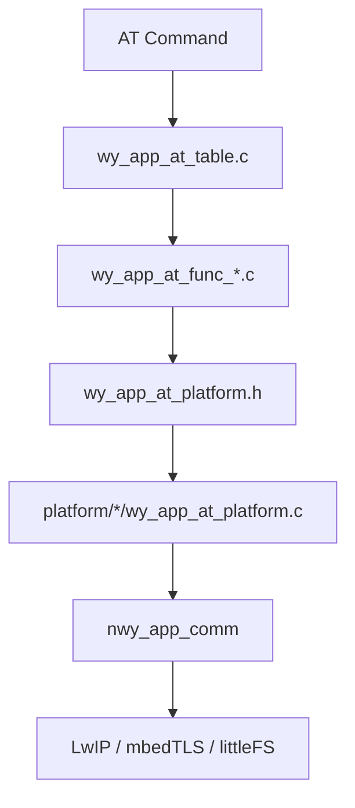
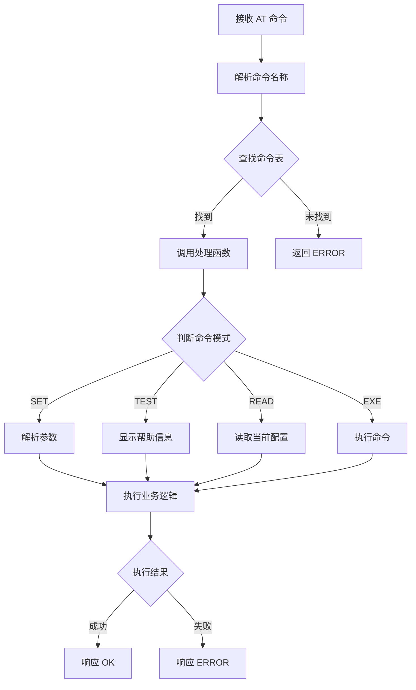
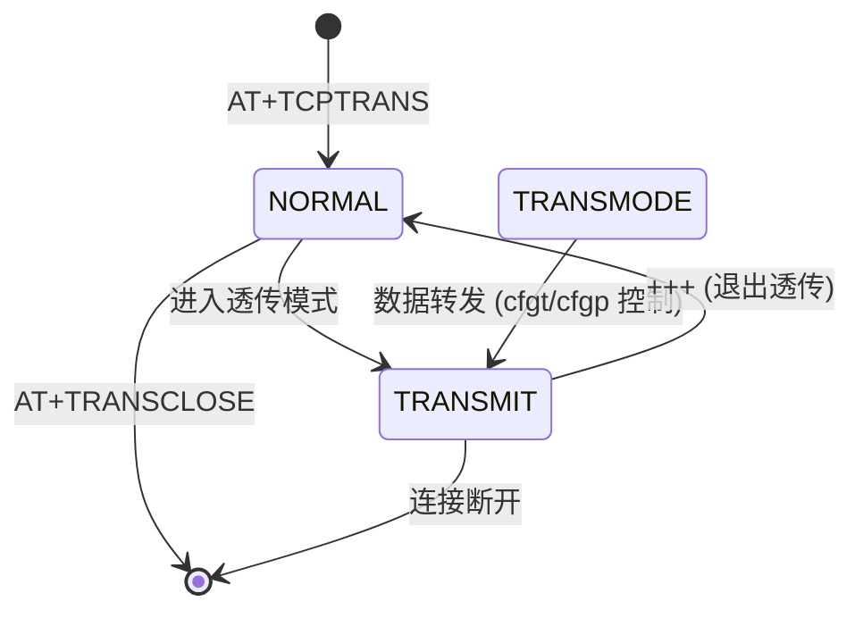
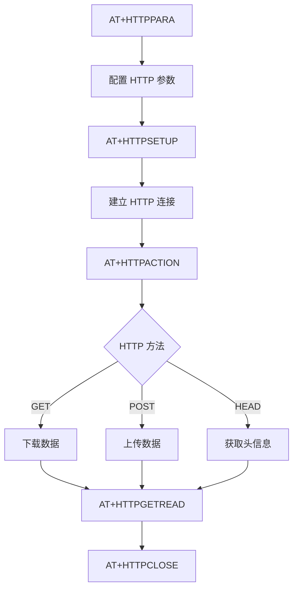
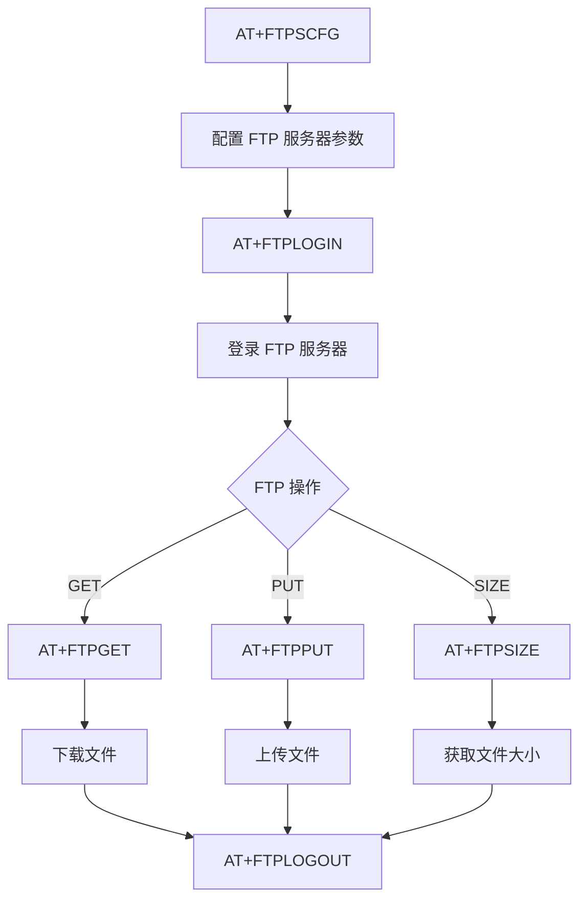
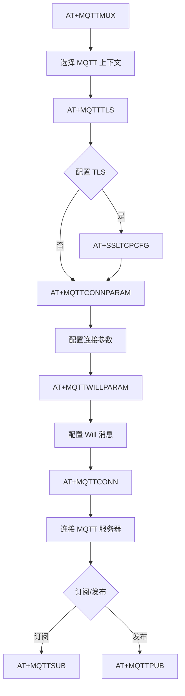
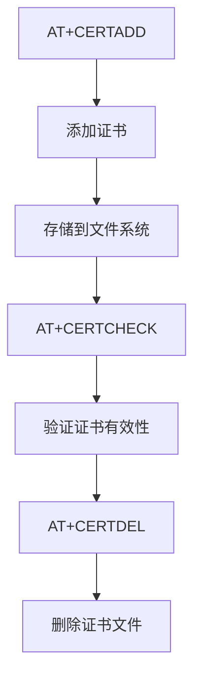
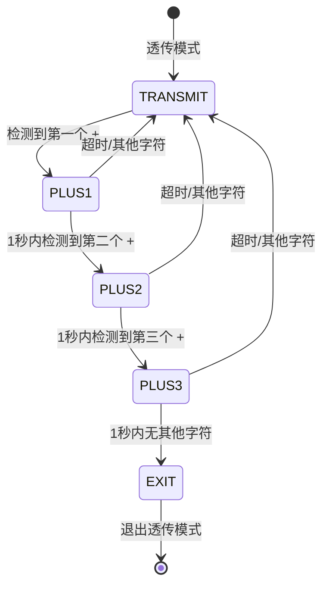

# NWY_FRAMEWORK AT 模块架构总结

## 1. 架构概述

### 1.1 系统定位

NWY_FRAMEWORK 是一个跨平台的 AT 命令处理框架，为嵌入式蜂窝模组提供统一的 AT 命令接口。该框架支持多种硬件平台（EC626/EC61X/EC7XX/ASR/MDM9205/RDA 等），实现网络协议栈（TCP/UDP/HTTP/FTP/MQTT）的 AT 命令封装。

**版本信息**:
- AT 处理层版本: `NWY_APP_AT_PROC_V1.0.5`
- 平台适配层版本: `NWY_APP_AT_PLAT_V1.0.1`

### 1.2 分层架构

```
┌─────────────────────────────────────────────────────────────────────┐
│                        AT 命令接口层                                 │
│  AT+TCPSETUP, AT+HTTPSETUP, AT+FTPPUT, AT+MQTTCONN, ...            │
├─────────────────────────────────────────────────────────────────────┤
│                      AT 命令处理层 (nwy_app_at_proc)                │
│  ┌───────────────┬───────────────┬───────────────┬──────────────┐ │
│  │   TCP/UDP     │    HTTP/HTTPS │     FTP/FTPS   │    MQTT      │ │
│  │   AT 命令     │    AT 命令    │    AT 命令     │   AT 命令    │ │
│  └───────────────┴───────────────┴───────────────┴──────────────┘ │
├─────────────────────────────────────────────────────────────────────┤
│                      平台适配层 (platform)                          │
│  ┌──────────────────────────────────────────────────────────────┐  │
│  │  wy_app_at_platform.c   - 平台相关接口实现                    │  │
│  │  wy_app_at_parser_adpt.c - AT 解析器适配                      │  │
│  │  wy_app_at_platform_def.h - 平台定义                         │  │
│  └──────────────────────────────────────────────────────────────┘  │
├─────────────────────────────────────────────────────────────────────┤
│                      通用服务层 (nwy_app_comm/ext)                  │
│  ┌──────────┬──────────┬──────────┬──────────┬────────────────┐  │
│  │ Socket   │ HTTP     │ FTP      │ SSL/TLS  │ 文件系统/定时器│  │
│  │ Client   │ Client   │ Client   │          │                │  │
│  └──────────┴──────────┴──────────┴──────────┴────────────────┘  │
├─────────────────────────────────────────────────────────────────────┤
│                    底层 AT 框架 (atentity/atreply)                  │
│                    网络栈 (LwIP)                                    │
│                    文件系统 (littleFS)                              │
│                    加密库 (mbedTLS)                                 │
└─────────────────────────────────────────────────────────────────────┘
```

### 1.3 核心组件

| 组件 | 说明 | 文件位置 |
|------|------|----------|
| **AT 命令表** | 注册所有 AT 命令和处理函数 | [wy_app_at_table.c](../middleware/thirdparty/NWY_FRAMEWORK/nwy_app_at_proc/src/wy_app_at_table.c) |
| **AT 函数定义** | 核心数据结构和接口定义 | [wy_app_at_func_def.h](../middleware/thirdparty/NWY_FRAMEWORK/nwy_app_at_proc/inc/nwy_app_at_func_def.h) |
| **平台接口层** | 平台相关的 AT 接口实现 | `nwy_app_at_platform.h` |
| **平台适配层** | 各平台的具体适配实现 | `platform/*/` |

---

## 2. 模块依赖关系

### 2.1 依赖的基础框架

本模块依赖以下底层框架和服务：

| 框架/库 | 依赖方式 | 关键接口 | 说明 |
|---------|----------|----------|------|
| AT 框架 | 命令注册/响应 | atentity, atreply | 底层 AT 命令解析和响应 |
| LwIP | 网络通信 | Socket API | TCP/UDP 协议栈 |
| mbedTLS | SSL/TLS | SSL 配置/证书 | HTTPS/FTPS/SSL-TCP |
| littleFS | 文件操作 | nwy_vfs_* | 文件读写操作 |
| FreeRTOS | 任务/定时器 | nwy_rex_timer_type | 定时器和任务管理 |

### 2.2 被依赖的模块

本模块作为 AT 命令处理层，被上层应用业务逻辑依赖。

### 2.3 模块间接口

```c
// AT 命令处理函数类型
typedef int (*nwy_app_at_proc_func)(nwy_app_at_func_args_type* arg, void* plat_arg);

// AT 命令参数结构
typedef struct
{
  const char* cmd_name;           // 命令名称
  int param_cnt;                  // 参数个数
  nwy_app_at_cmd_mode_type cmd_mode; // 命令模式 (SET/TEST/READ/EXE)
  void* params_list;              // 参数列表
  void* at_channel;               // AT 通道
} nwy_app_at_func_args_type;
```

---

## 3. 目录结构分析

### 3.1 目录组织

```
middleware/thirdparty/NWY_FRAMEWORK/
├── nwy_app_at_proc/              # AT 命令处理模块
│   ├── inc/                      # 头文件目录
│   │   ├── wy_app_at_func_def.h      # 核心定义
│   │   ├── wy_app_at_platform.h      # 平台接口
│   │   ├── wy_app_at_func_tcp.h      # TCP/UDP AT 命令
│   │   ├── wy_app_at_func_http.h     # HTTP/HTTPS AT 命令
│   │   ├── wy_app_at_func_ftp.h      # FTP/FTPS AT 命令
│   │   ├── wy_app_at_func_bz_mqtt.h  # MQTT AT 命令
│   │   └── ...
│   ├── src/                      # 源文件目录
│   │   ├── wy_app_at_table.c         # AT 命令注册表
│   │   ├── wy_app_at_func_tcp.c      # TCP/UDP 实现
│   │   ├── wy_app_at_func_http.c     # HTTP 实现
│   │   ├── wy_app_at_func_ftp.c      # FTP 实现
│   │   └── ...
│   └── platform/                 # 平台适配层
│       ├── EC626/                    # EC626 平台
│       ├── EC61X/                    # EC61X 平台
│       ├── EC7XX/                    # EC7XX 平台
│       ├── asr1803/                  # ASR1803 平台
│       ├── asr1603/                  # ASR1603 平台
│       ├── mdm9205/                  # MDM9205 平台
│       └── ...
├── nwy_app_comm/                # 通用服务层 (C++)
│   ├── inc/                      # 头文件
│   ├── src/                      # 源文件
│   └── platform/                 # 平台适配
├── nwy_app_ext/                 # 扩展服务层
│   ├── inc/
│   ├── src/
│   └── platform/
├── nwy_app_pipecloudmgr/        # 管道云管理 (可选)
├── Makefile.inc                 # 通用 Makefile
├── Makefile.EC626.inc           # EC626 Makefile
└── module.mk                    # 模块定义
```

### 3.2 关键文件说明

| 文件 | 功能说明 |
|------|----------|
| `wy_app_at_table.c` | **核心文件**: AT 命令注册表，包含所有支持的 AT 命令及其处理函数映射 |
| `wy_app_at_func_def.h` | **核心头文件**: 定义所有数据结构、枚举、函数原型 |
| `wy_app_at_platform.h` | **平台接口**: 定义平台抽象层接口，供 AT 命令调用 |
| `wy_app_at_func_tcp.c` | TCP/UDP/SSL-TCP AT 命令实现 |
| `wy_app_at_func_http.c` | HTTP/HTTPS AT 命令实现 |
| `wy_app_at_func_ftp.c` | FTP/FTPS AT 命令实现 |
| `wy_app_at_func_bz_mqtt.c` | MQTT AT 命令实现 |
| `platform/*/wy_app_at_platform.c` | 各平台的具体接口实现 |
| `platform/*/wy_app_at_parser_adpt.c` | 各平台的 AT 解析器适配 |

### 3.3 依赖关系图



---

## 4. 核心数据结构

### 4.1 AT 命令参数结构

```c
// wy_app_at_func_def.h:92-103
typedef struct
{
  const char* cmd_name;                  // AT 命令名称 (如 "+TCPSETUP")
  int param_cnt;                         // 参数个数
  nwy_app_at_cmd_mode_type cmd_mode;     // 命令模式
  void* params_list;                     // 参数列表 (平台提供)
  void* at_channel;                      // AT 通道句柄
} nwy_app_at_func_args_type;
```

### 4.2 AT 命令模式枚举

```c
// wy_app_at_func_def.h:84-90
typedef enum
{
    NWY_AT_CMD_SET,   // SET: AT+CMD=1 (设置参数)
    NWY_AT_CMD_TEST,  // TEST: AT+CMD=? (查询可用参数)
    NWY_AT_CMD_READ,  // READ: AT+CMD? (读取当前值)
    NWY_AT_CMD_EXE    // EXE: AT+CMD (执行命令)
} nwy_app_at_cmd_mode_type;
```

### 4.3 AT 命令表项结构

```c
// wy_app_at_table.c:40-45
typedef struct
{
  char* name;                  // AT 命令名称 (如 "+TCPSETUP")
  nwy_app_at_proc_func func;   // 处理函数指针
} nwy_app_at_table_item_type;
```

### 4.4 透传模式上下文

```c
// wy_app_at_func_def.h:122-145
typedef struct
{
  // 通用参数
  void *plat_arg;              // 平台参数
  unsigned char *data;         // 数据缓冲区
  int len;                     // 数据长度
  int channel;                 // 通道 ID (sid)
  commCallback_t timeout_cb;   // 超时回调
  int timeout;                 // 超时时间
  int pos;                     // 当前位置
  int ctx_type;                // 上下文类型 (TCP/UDP/HTTP)
  char *tag;                   // AT 命令标签 (如 "+FTPPUT")

  // HTTP/FTP 专用参数
  int mode;                    // 0:ASCII, 1:HEX; HTTP: 0:GET, 1:HEAD, 2:POST
  int http_type;               // HTTP POST 类型
  char *fname;                 // 文件名
  uint8 ftp_put_type;          // FTP PUT 类型
  uint8 ftp_put_mode;          // FTP PUT 模式
  nwy_plus_e plus_count;       // +++ 计数
  void *timer_3plus;           // +++ 定时器
} nwy_app_at_byapss_ctx;
```

### 4.5 透传模式控制信息

```c
// wy_app_at_func_def.h:248-265
typedef struct {
  int sid;                     // 通道 ID
  int type;                    // 类型 (TCP/UDP)
  trans_send_cb cb;            // 发送回调函数
  char buf[NWY_TRANSFER_BUF_SIZE]; // 发送缓冲区 (4096 字节)
  unsigned int len;            // 有效数据长度

  int cfgt;                    // 配置时间: 1~65535 (ms)
  int cfgp;                    // 配置包长度: 1~2048 (字节)
  void *timer;                 // cfgt 超时定时器
  const void *msg_ptr;         // 来自回调的消息指针
  int status;                  // 来自回调的状态
  void *recv_timer;            // TCP 接收定时器
  void *at_channel;            // AT 通道
  int cid;                     // 上下文 ID
  nwy_trans_state_type state;  // 透传状态
} trans_cb_info_t;
```

### 4.6 Socket 相关结构

```c
// wy_app_at_func_def.h:276-295
// Socket 类型
typedef enum
{
    TCP_CLIENT = 1,
    UDP_CLIENT,
    TCP_SERVER,
    UDP_SERVER,
    SSL_TCP_CLIENT,      // 5
    SSL_TCP_LISTENER,
    TCP_INCOMING,        // TCP_ACCEPT
    SSL_TCP_INCOMING     // SSL_TCP_ACCEPT
} nwy_module_at_socket_type;

// Socket 状态
typedef enum
{
    SOCKET_INIT = 1,
    SOCKET_OPEN,
    SOCKET_CONNECT,
    SOCKET_LISTENING,
    SOCKET_CLOSE
} nwy_module_at_socket_state_type;

// Socket-CID 映射
// wy_app_at_table.c:367
typedef struct
{
    int sockid;       // 这不是 socket id，是 sid!!!
    sint15 cid;       // 上下文 ID
    int closed;       // 关闭标志 (HTTP 关闭后仍可读数据)
} sockid_cid_map;
```

### 4.7 HTTP 参数结构

```c
// wy_app_at_func_def.h:150-185
typedef struct
{
  int id;                      // HTTP ID (HTTP_ID_MIN ~ HTTP_ID_MAX)
  int https;                   // 0: http, 1: https
  int connected;               // 是否真正连接
  int valid;                   // 配置是否有效

  // 接收缓冲区
  void *recv_ptr;              // 保存接收数据的指针
  int recv_idx;                // 当前有效数据索引
  int recv_len;                // 真实接收长度
  int head_skipped;            // HTTP 头是否已跳过

  // 连接参数
  char host[NWY_HTTP_URL_MAX_LEN+1];     // 主机名
  char abs_path[NWY_HTTP_URL_MAX_LEN+1]; // 绝对路径
  int port;                               // 端口
  unsigned char keepalive;                // 保活
  unsigned char recv_mode;                // 接收模式
  unsigned char recv_flag;                // 接收标志

  // 文件操作
  char file_name[256];          // 文件名
  int mode;                     // 模式
  int save_dir;                 // 保存目录
  unsigned int offset;          // 偏移量
  int engin;                    // 引擎

  // MD5 校验
  int md5_enable;               // MD5 使能
  char md5_sum[64];             // MD5 值
} nwy_http_para_t;
```

### 4.8 MQTT 参数结构

```c
// wy_app_at_func_def.h:370-405
typedef struct
{
    /* MQTT 选项 */
    int mqttversion;                     // MQTT 版本
    char clientid[MQTT_CLIENT_ID_LEN+1]; // 客户端 ID
    char username[MQTT_USER_NAME_LEN+1]; // 用户名
    char password[MQTT_PASSWORD_LEN+1];  // 密码
    int cleansession;                    // 清除会话
    unsigned int keepalive;              // 保活时间

    char url_port[MQTT_HOST_ADDRESS_LEN + 1]; // URL:端口

    /* Will 选项 */
    char will_flag;                      // Will 标志
    unsigned char willqos;               // Will QoS
    unsigned char willretained;          // Will 保留
    char willtopic[MQTT_TOPIC_LEN+1];    // Will 主题
    char *willmessage;                   // Will 消息
    int willmessage_len;                 // Will 消息长度

    /* 消息选项 */
    int qos;                             // QoS 等级
    int retained;                        // 保留标志
    char topic[MQTT_TOPIC_LEN+1];        // 主题
    char *message;                       // 消息
    int message_len;                     // 消息长度

    /* TLS 选项 */
    char is_ssl;                         // 是否 SSL
    nwy_app_ssl_conf_type *ssl_cfg;      // SSL 配置

    /* 回调 */
    connect_lost_cb connlost_cb;         // 连接丢失回调
    message_arrived_cb recv_cb;          // 消息到达回调
    int nwy_mqtt_sid;                    // MQTT 会话 ID
} nwy_bz_mqtt_para_t;
```

### 4.9 透传类型枚举

```c
// wy_app_at_func_def.h:67-82
enum {
    TRANS_NULL = 0,
    TRANS_SEND,        // 固定大小数据输入
    TRANS_TCP,
    TRANS_UDP,
    TRANS_SSL,
    TRANS_TCPSRV,      // 5
    TRANS_UDPSRV,
    TRANS_HTTP,
    TRANS_HTTPS,
    TRANS_FTP,
    TRANS_CERT,        // 10
    TRANS_CERT_NW,     // nw- 命令
    TRANS_ERR,
    TRANS_SSLTCPSRV
};
```

### 4.10 全局变量

```c
// wy_app_at_table.c:367
static sockid_cid_map sid_cid_map[50];  // Socket-CID 映射表 (50 个条目)

// wy_app_at_platform.h:5-7
extern trans_cb_info_t trans_cb_info;   // 透传回调信息
extern nwy_rex_timer_type trans_send_timer; // 透传发送定时器
extern int trans_mode;                  // 透传模式标志
```

---

## 5. 关键接口分析

### 5.1 AT 命令解析接口

```c
// wy_app_at_table.c:312-337
/**
 * @brief 解析 AT 命令名称，获取对应的处理函数
 * @param at_name AT 命令名称 (如 "+TCPSETUP")
 * @return 命令处理函数指针，未找到返回 NULL
 */
nwy_app_at_proc_func nwy_app_at_table_parse(char *at_name)
```

**实现机制**:
1. 遍历 `nwy_app_at_table` 数组
2. 使用 `strcasecmp` 进行不区分大小写的字符串比较
3. 返回匹配的处理函数指针

### 5.2 AT 响应接口

```c
// wy_app_at_platform.h:120-132

// 响应 OK
int nwy_app_at_func_resp_ok(void* at_channel);

// 响应 OK 并附带字符串
int nwy_app_at_func_resp_ok_str(void* at_channel, char* str);

// 响应 ERROR
int nwy_app_at_func_resp_err(void* at_channel);

// 响应 ERROR 并附带错误码
int nwy_app_at_func_resp_err_code(void* at_channel, int err_code);

// 响应 ERROR 并附带错误字符串
int nwy_app_at_func_resp_err_str(void* at_channel, char* str);

// 响应字符串 (不带 OK)
int nwy_app_at_func_resp_str(void* at_channel, char* str);

// 响应 NULL (无响应)
int nwy_app_at_func_resp_null(void* at_channel);

// 写入指定长度的数据
int nwy_app_at_data_write_len(void* at_channel, char* data, int len);

// 写入字符串数据
int nwy_app_at_data_write(void* at_channel, char* data);
```

### 5.3 AT 主动上报接口

```c
// wy_app_at_platform.h:138-140

// 上报字符串 (变长格式)
int nwy_app_at_unsol_str(void* at_channel, char* fmt, ...);

// 上报原始数据
int nwy_app_at_unsol_data(void* at_channel, const char* data, int len);
```

### 5.4 AT 参数获取接口

```c
// wy_app_at_platform.h:105-118

// 获取整数参数
int nwy_app_at_get_int(void* params_list,
                       int index,
                       int *val_ptr,
                       int min,
                       int max,
                       int def_val);

// 获取字符串参数
int nwy_app_at_get_str(void* params_list,
                       int index,
                       char *out_str,
                       int out_len,
                       char* def_str,
                       char quote_req); // 0:可选, 1:必须, 2:不需要引号

// 检查参数是否为空
int nwy_app_check_arg_is_empty(void *params_list, int index);
```

### 5.5 透传模式接口

```c
// wy_app_at_platform.h:144-151

// 进入透传模式
int nwy_app_at_enter_bypass(nwy_app_at_bypass_cb cb,
                            nwy_app_at_ctx_destroy destroy,
                            void *cb_ctx);

// 获取透传上下文
void* nwy_app_at_get_bypass_ctx(void* param);

// 获取透传通道
void* nwy_app_at_get_channel_bypass(void* param);

// 退出透传模式
void plat_exit_bypass(void *param);

// 从透传模式返回 (带数据大小和结束标志)
int nwy_app_at_bypass_return(int size, unsigned char end);
```

### 5.6 平台抽象接口

```c
// wy_app_at_platform.h:142-143

// 获取平台 AT 通道
void* nwy_app_at_get_plat_at_channel(int cid, int sid);
```

### 5.7 Socket-CID 映射接口

```c
// wy_app_at_table.c:369-418

// 添加映射
int add_sockid_cid_map(int sockid, sint15 cid);

// 根据 sockid 获取 cid
sint15 get_cid_by_sockid(int sockid);

// 删除映射
int del_sockid_cid_map(int sockid);
```

### 5.8 文件操作接口

```c
// wy_app_at_platform.h:169-194

// 文件打开/关闭
int nwy_vfs_open(char *path, int flag);
void nwy_vfs_fclose(int fileHandle);

// 文件读写
int nwy_vfs_fread(int fileHandle, char *readBuffer, int numberOfBytesToRead);
int nwy_vfs_fwrite(int fileHandle, char *writeBuffer, int numberOfBytesToWrite);

// 文件操作
int nwy_vfs_fdelete(char *lpFileName);
int nwy_vfs_fseek(int fileHandle, int offset, int whence);
int nwy_vfs_fsize(char *lpFileName);

// 文件系统信息
unsigned long nwy_vfs_get_free(const char *path);
int nwy_vfs_statvfs(const char *path, struct nwy_statvfs *buf);
int nwy_vfs_mount_count(void);
int nwy_vfs_mount_points(char **mp, int count);

// MD5 校验
int nwy_file_md5_check(const char *file_path, char *md5_str);
```

### 5.9 证书操作接口

```c
// wy_app_at_platform.h:182-187

// 检查证书有效性
int nwy_plat_check_cert_valid(const char *file);

// 打开/删除证书
int nwy_app_at_open_cert(char *fname, int flags);
int nwy_app_at_del_cert(const char *fname);

// 读取证书信息
int nwy_app_at_read_cert(void* at_channel, const char *fname);
int nwy_app_at_cert_size(void* at_channel, const char *fname);

// 计算证书校验和
uint16 nwy_app_at_get_cert_checksum(unsigned short* data, int size);
```

### 5.10 DNS/网络配置接口

```c
// wy_app_at_platform.h:153-155, 213-224

// 获取 PDP IP 地址
void nwy_at_get_pdp_ipadress(void* at_channel, char* str, char* str_v6);

// 获取 PDP CID
unsigned short nwy_get_pdp_cid(void);

// 设置 DNS 服务器
int nwy_app_at_set_dns_server(int sim_id, int cid, int index,
                              nwy_ip_addr_type* ip_addr);

// 获取 DNS 服务器
int nwy_app_at_get_dns_server(int sim_id, int cid, int srv_ip_type,
                              char *dns1, char *dns2);

// 获取网关地址
int nwy_app_at_get_gateway(int cid, char *gate);

// 获取 PDP 状态
int nwy_app_get_pdp_state(int channel);
```

### 5.11 时间操作接口

```c
// wy_app_at_platform.h:212, 219-220

// 设置时间戳 (UNIX 时间)
void nwy_app_at_set_ms(int64_t ms);

// 获取时间基数
uint32 nwy_app_get_time_base(void);

// 设置系统时间
void nwy_app_set_time(nwy_app_time_t *julian_time, char timezone);
```

### 5.12 FOTA 操作接口

```c
// wy_app_at_platform.h:198-205

// 重启系统
void nwy_reboot(void);

// 设置 FOTA 就绪
bool nwy_fupdateSetReady(const char *curr_version);

// FOTA 更新
int nwy_app_fota_update(void *at_channel, const void *data, unsigned size);
int nwy_app_at_fota_init(void);
int nwy_app_at_fota_getdeltasize(void);
void nwy_app_at_fota_upgrade_and_reboot(void);
int nwy_app_at_fota_write_deltanvmdata(unsigned int offset,
                                       unsigned char *buf,
                                       unsigned int bufLen);
```

---

## 6. 实现机制解析

### 6.1 AT 命令处理流程



**关键代码** ([wy_app_at_table.c](../middleware/thirdparty/NWY_FRAMEWORK/nwy_app_at_proc/src/wy_app_at_table.c:312-337)):

```c
nwy_app_at_proc_func nwy_app_at_table_parse(char *at_name)
{
  int i = 0;
  char *temptr = (char *)at_name;
  for (i = 0; i < ARRAY_SIZE(nwy_app_at_table); i++) {
    if (nwy_app_at_table[i].name == NULL) {
      break;
    }
    int cmp = strcasecmp(temptr, nwy_app_at_table[i].name);
    if (cmp == 0) {
      NWY_APP_LOG_HIGH("%s found!", at_name, 0, 0);
      return nwy_app_at_table[i].func;
    }
  }
  NWY_APP_LOG_ERROR("%s NOT Found!!!", at_name, 0, 0);
  return NULL;
}
```

### 6.2 TCP/UDP 透传模式机制

**透传模式状态机**:



**透传模式控制参数**:

| 参数 | 范围 | 说明 |
|------|------|------|
| cfgt | 1~65535 ms | 数据包发送超时时间 |
| cfgp | 1~2048 字节 | 数据包最大长度 |

**发送规则**: 满足以下任一条件即发送:
1. 缓冲区数据长度 >= cfgp
2. 距上次发送时间 >= cfgt

**关键数据结构** ([wy_app_at_func_def.h](../middleware/thirdparty/NWY_FRAMEWORK/nwy_app_at_proc/inc/nwy_app_at_func_def.h:248-265)):

```c
typedef struct {
  int sid;                          // 通道 ID
  int type;                         // TCP/UDP
  trans_send_cb cb;                 // 实际发送函数
  char buf[NWY_TRANSFER_BUF_SIZE];  // 发送缓冲区 (4096 字节)
  unsigned int len;                 // 有效数据长度
  int cfgt;                         // 配置时间 (ms)
  int cfgp;                         // 配置包长度 (字节)
  void *timer;                      // cfgt 超时定时器
  nwy_trans_state_type state;       // 透传状态
} trans_cb_info_t;
```

### 6.3 HTTP 处理机制

**HTTP 操作流程**:



**HTTP 数据接收机制**:

```c
// wy_app_at_func_def.h:150-185
typedef struct
{
  int id;                      // HTTP ID (0~N)
  void *recv_ptr;              // 接收缓冲区指针
  int recv_idx;                // 当前索引
  int recv_len;                // 接收长度
  int head_skipped;            // HTTP 头是否已跳过
  unsigned char recv_mode;     // 接收模式
  unsigned char recv_flag;     // 接收标志
  char file_name[256];         // 保存文件名
  unsigned int offset;         // 文件偏移量
  int md5_enable;              // MD5 校验使能
  char md5_sum[64];            // MD5 值
} nwy_http_para_t;
```

### 6.4 FTP 处理机制

**FTP 操作流程**:



**FTP 文件操作状态** ([wy_app_at_func_def.h](../middleware/thirdparty/NWY_FRAMEWORK/nwy_app_at_proc/inc/nwy_app_at_func_def.h:52-65)):

```c
typedef struct
{
  int is_vaild;          // 是否有效
  int recv_mode;         // 接收模式
  char filename[256];    // 远程文件名
  char locname[256];     // 本地文件名
  int pos;               // 当前位置
  int length;            // 总长度
  int file_size;         // 文件大小
  int dowload_size;      // 已下载大小
  int curr_size;         // 当前处理大小
} nwy_ftp_fileinfo;
```

### 6.5 MQTT 处理机制

**MQTT 连接流程**:



### 6.6 证书管理机制

**证书操作流程**:



**证书存储路径约定**:
- 客户端证书: `/cert/client_cert.pem`
- 私钥: `/cert/client_key.pem`
- CA 证书: `/cert/ca_cert.pem`

### 6.7 平台适配机制

**平台适配层结构**:

```
platform/
├── EC626/          # 移远 EC626 平台
│   ├── wy_app_at_platform.c      # 平台接口实现
│   ├── wy_app_at_parser_adpt.c   # 解析器适配
│   └── wy_app_at_platform_def.h  # 平台定义
├── EC61X/          # 移远 EC61X 平台
├── EC7XX/          # 移远 EC7XX 平台
├── asr1803/        # ASR1803 平台
├── asr1603/        # ASR1603 平台
├── mdm9205/        # 高通 MDM9205 平台
├── rda8811/        # RDA8811 平台
├── rda8850/        # RDA8850 平台
└── ...
```

**平台适配接口** ([wy_app_at_platform.h](../middleware/thirdparty/NWY_FRAMEWORK/nwy_app_at_proc/inc/nwy_app_at_platform.h)):

```c
// 获取平台 AT 通道
void* nwy_app_at_get_plat_at_channel(int cid, int sid);

// 平台相关的内存操作
void* nwy_modem_mem_alloc(size_t size, int client);
void nwy_modem_mem_free(void *ptr, int client);

// 宏定义简化调用
#define nwy_malloc(n) nwy_modem_mem_alloc(n, NWY_MODEM_MEM_CLIENT_DATA)
#define nwy_free(p) nwy_modem_mem_free((void*)p, NWY_MODEM_MEM_CLIENT_DATA)
```

### 6.8 错误处理机制

**错误响应接口** ([wy_app_at_platform.h](../middleware/thirdparty/NWY_FRAMEWORK/nwy_app_at_proc/inc/nwy_app_at_platform.h:124-128)):

```c
// 响应 ERROR
int nwy_app_at_func_resp_err(void* at_channel);

// 响应 ERROR 并附带错误码
int nwy_app_at_func_resp_err_code(void* at_channel, int err_code);

// 响应 ERROR 并附带错误字符串
int nwy_app_at_func_resp_err_str(void* at_channel, char* str);
```

**FTP 错误码定义** ([wy_app_at_func_ftp.h](../middleware/thirdparty/NWY_FRAMEWORK/nwy_app_at_proc/inc/nwy_app_at_func_ftp.h:4-37)):

| 错误码 | 说明 |
|--------|------|
| 0 | 操作成功 |
| 601 | 未知错误 |
| 602 | FTP(S) 服务器被阻止 |
| 603 | FTP(S) 服务器忙 |
| 604 | DNS 解析失败 |
| 605 | 网络错误 |
| 606 | 控制连接关闭 |
| 607 | 数据连接关闭 |
| 608 | 对端关闭 Socket |
| 609 | 超时错误 |
| 610 | 无效参数 |
| 611 | 打开文件失败 |
| 631 | SSL 认证失败 |

### 6.9 +++ 退出透传机制

**+++ 退出流程**:



**关键数据结构** ([wy_app_at_func_def.h](../middleware/thirdparty/NWY_FRAMEWORK/nwy_app_at_proc/inc/nwy_app_at_func_def.h:108-114)):

```c
typedef enum {
  NWY_PLUS_NONE,
  NWY_PLUS_START,
  NWY_PLUS_ONE,
  NWY_PLUS_TWO,
  NWY_PLUS_THREE,
} nwy_plus_e;
```

---

## 7. 配置与编译

### 7.1 编译选项

**编译宏定义** ([Makefile.EC626.inc](../middleware/thirdparty/NWY_FRAMEWORK/Makefile.EC626.inc)):

| 宏定义 | 说明 |
|--------|------|
| `PlAT_EC626` | EC626 平台标识 |
| `FEATURE_NWY_AT_ECOTA_FORMAT` | ECOTA 格式支持 |
| `NWY_APP_PING_USE_LWIP` | 使用 LwIP 实现 PING |
| `FEATURE_NWY_AT_PROC_NWFOTA` | NWY FOTA 支持 |
| `NWY_AT_PROC_TCP_UDP_NS` | TCP/UDP 新命令集 |
| `NWY_AT_PROC_FTP_NS` | FTP 新命令集 |
| `NWY_AT_PROC_HTTP_NS` | HTTP 新命令集 |
| `NWY_AT_PROC_SSLTCP_NS` | SSL-TCP 新命令集 |
| `NWY_AT_PROC_NWTCP_NWUDP_NS` | NW- TCP/UDP 命令集 |
| `NWY_AT_PROC_NWFTP_NS` | NW- FTP 命令集 |
| `NWY_AT_PROC_NWCERT_NS` | NW- CERT 命令集 |
| `NWY_AT_PROC_NWHTTP_NS` | NW- HTTP 命令集 |

### 7.2 源文件配置

**EC626 平台编译源文件** ([Makefile.EC626.inc](../middleware/thirdparty/NWY_FRAMEWORK/Makefile.EC626.inc:28-52)):

```makefile
NW_CSRC += $(ATPROC_DIR)/src/nwy_app_at_func_tcp.c \
           $(ATPROC_DIR)/src/nwy_app_at_func_ftp.c \
           $(ATPROC_DIR)/src/nwy_app_at_func_tcp_ns.c \
           $(ATPROC_DIR)/src/nwy_app_at_func_ftp_ns.c \
           $(ATPROC_DIR)/src/nwy_app_at_func_http.c \
           $(ATPROC_DIR)/src/nwy_app_at_func_http_ns.c \
           $(ATPROC_DIR)/src/nwy_app_at_table.c \
           $(ATPROC_DIR)/platform/EC626/nwy_app_at_parser_adpt.c \
           $(ATPROC_DIR)/platform/EC626/nwy_app_at_platform.c \
           $(ATPROC_DIR)/src/nwy_app_at_func_updatetime.c \
           $(ATPROC_DIR)/src/nwy_app_at_func_nwdns.c
```

### 7.3 头文件搜索路径

```makefile
CFLAGS_INC += -I $(ATPROC_DIR)/inc -I $(ATPROC_DIR)/platform/EC626
```

### 7.4 平台相关配置

**不同平台的 Makefile**:

| 文件 | 平台 |
|------|------|
| `Makefile.inc` | EC61X 通用 |
| `Makefile.EC626.inc` | EC626 |
| `Makefile.EC7XX.inc` | EC7XX |
| `Makefile.ASR1803E` | ASR1803E |
| `Makefile.ASR1803L` | ASR1803L |
| `module.mk` | NRC7394 |

---

## 8. 扩展点识别

### 8.1 可扩展接口

**1. AT 命令注册扩展**

在 [wy_app_at_table.c](../middleware/thirdparty/NWY_FRAMEWORK/nwy_app_at_proc/src/wy_app_at_table.c:47-310) 中添加新命令:

```c
static nwy_app_at_table_item_type nwy_app_at_table[] =
{
  // 添加新命令
  {"+MYNEWCMD", nwy_app_at_mynewcmd_func},
  // ...
};
```

**2. 平台适配扩展**

在 `platform/` 目录下创建新平台目录:
```
platform/
└── NEW_PLATFORM/
    ├── wy_app_at_platform.c      # 实现平台接口
    ├── wy_app_at_parser_adpt.c   # 实现解析器适配
    └── wy_app_at_platform_def.h  # 平台定义
```

**3. 协议栈扩展**

通过 `nwy_app_comm` 层添加新的网络协议支持。

### 8.2 钩子点

**1. 透传模式回调** ([wy_app_at_func_def.h](../middleware/thirdparty/NWY_FRAMEWORK/nwy_app_at_proc/inc/nwy_app_at_func_def.h:235-238)):

```c
typedef int (*nwy_app_at_bypass_cb)(void *ctx, const void *data, unsigned int size);
typedef int (*trans_send_cb)(void *context, const void *data, unsigned int size);
typedef void (*nwy_app_at_ctx_destroy)(void* ctx);
```

**2. MQTT 回调** ([wy_app_at_func_def.h](../middleware/thirdparty/NWY_FRAMEWORK/nwy_app_at_proc/inc/nwy_app_at_func_def.h:350-351)):

```c
typedef void (*connect_lost_cb)(int mqtt_sid);
typedef int (*message_arrived_cb)(mqtt_message_t*);
```

**3. 超时回调** ([wy_app_at_func_def.h](../middleware/thirdparty/NWY_FRAMEWORK/nwy_app_at_proc/inc/nwy_app_at_func_def.h:106)):

```c
typedef void (*commCallback_t)(void *ctx);

// 在 nwy_app_at_byapss_ctx 中使用
commCallback_t timeout_cb;  // 超时回调
```

### 8.3 插件机制

NWY_FRAMEWORK 通过编译宏控制功能模块的启用/禁用:

```c
#ifdef FEATURE_NWY_AT_PROC_BPTEST
  {"+NWATTEST", nwy_app_at_nwattest_func},
#endif

#ifdef NWY_AT_PROC_MQTT
  {"+MQTTMUX", nwy_app_at_mqttmux_func},
#endif
```

---

## 9. AT 命令列表

### 9.1 TCP/UDP 相关命令

| 命令 | 说明 |
|------|------|
| `AT+RECVMODE` | 设置接收模式 |
| `AT+TCPSETUP` | 建立 TCP 连接 |
| `AT+TCPCLOSE` | 关闭 TCP 连接 |
| `AT+TCPSEND` | 发送 TCP 数据 |
| `AT+TCPREAD` | 读取 TCP 数据 |
| `AT+TCPSETMODE` | 设置 TCP 模式 |
| `AT+TCPKEEPALIVE` | 设置 TCP 保活 |
| `AT+UDPSETUP` | 建立 UDP 连接 |
| `AT+UDPCLOSE` | 关闭 UDP 连接 |
| `AT+UDPSEND` | 发送 UDP 数据 |
| `AT+UDPREAD` | 读取 UDP 数据 |
| `AT+TCPTRANS` | 进入 TCP 透传模式 |
| `AT+UDPTRANS` | 进入 UDP 透传模式 |
| `AT+TRANSCLOSE` | 关闭透传模式 |
| `AT+TCPLISTEN` | 启动 TCP 服务器 |
| `AT+CLOSELISTEN` | 关闭 TCP 服务器 |
| `AT+SSLTCPCFG` | 配置 SSL-TCP |
| `AT+SSLTCPSETUP` | 建立 SSL-TCP 连接 |

### 9.2 HTTP/HTTPS 相关命令

| 命令 | 说明 |
|------|------|
| `AT+HTTPPARA` | 配置 HTTP 参数 |
| `AT+HTTPSETUP` | 建立 HTTP 连接 |
| `AT+HTTPACTION` | 执行 HTTP 操作 |
| `AT+HTTPGET` | 获取 HTTP 数据 |
| `AT+HTTPCLOSE` | 关闭 HTTP 连接 |
| `AT+HTTPSCFG` | 配置 HTTPS |
| `AT+HTTPSSETUP` | 建立 HTTPS 连接 |

### 9.3 FTP/FTPS 相关命令

| 命令 | 说明 |
|------|------|
| `AT+FTPSCFG` | 配置 FTP(S) 服务器 |
| `AT+FTPLOGIN` | 登录 FTP 服务器 |
| `AT+FTPLOGOUT` | 登出 FTP 服务器 |
| `AT+FTPGET` | 下载文件 |
| `AT+FTPPUT` | 上传文件 |
| `AT+FTPSIZE` | 获取文件大小 |
| `AT+FTPRENAME` | 重命名文件 |
| `AT+FTPMKDIR` | 创建目录 |
| `AT+FTPRMDIR` | 删除目录 |

### 9.4 MQTT 相关命令

| 命令 | 说明 |
|------|------|
| `AT+MQTTMUX` | 选择 MQTT 上下文 |
| `AT+MQTTTLS` | 配置 MQTT TLS |
| `AT+MQTTCONNPARAM` | 配置连接参数 |
| `AT+MQTTWILLPARAM` | 配置 Will 消息 |
| `AT+MQTTCONN` | 连接 MQTT 服务器 |
| `AT+MQTTSUB` | 订阅主题 |
| `AT+MQTTUNSUB` | 取消订阅 |
| `AT+MQTTPUB` | 发布消息 |
| `AT+MQTTDISCONN` | 断开连接 |
| `AT+MQTTSTATE` | 查询状态 |

### 9.5 证书相关命令

| 命令 | 说明 |
|------|------|
| `AT+CERTADD` | 添加证书 |
| `AT+CERTCHECK` | 检查证书有效性 |
| `AT+CERTDEL` | 删除证书 |

### 9.6 NW- 前缀命令 (新命令集)

| 命令 | 说明 |
|------|------|
| `AT+NWIBOPEN` | 打开 TCP 连接 |
| `AT+NWITOPEN` | 打开 UDP 连接 |
| `AT+NWISEND` | 发送数据 |
| `AT+NWIREAD` | 读取数据 |
| `AT+NWISTATE` | 查询状态 |
| `AT+NWICLOSE` | 关闭连接 |
| `AT+NWISSLCFG` | 配置 SSL |
| `AT+NWFTPOPEN` | 打开 FTP 连接 |
| `AT+NWHTTPSCFG` | 配置 HTTPS |
| `AT+NWCERTADD` | 添加证书 |

### 9.7 其他命令

| 命令 | 说明 |
|------|------|
| `AT+ATPROCVER` | 查询 AT 处理器版本 |
| `AT+IPSTATUS` | 查询 IP 状态 |
| `AT+NWDNS` | DNS 查询 |
| `AT+NWPING` | ICMP Ping |
| `AT+PING` | Ping 命令 |
| `AT+UPDATETIME` | 更新时间 |
| `AT+NWFOTA` | FOTA 升级 |

---

## 10. 关键调用链

### 10.1 AT 命令处理调用链

```
底层 AT 解析器 (atentity)
    ↓
nwy_app_at_table_parse(at_name)
    ↓
nwy_app_at_table[i].func(arg, plat_arg)
    ↓
nwy_app_at_func_xxx()
    ↓
nwy_app_at_func_resp_ok/err(at_channel)
```

### 10.2 TCP 透传模式调用链

```
AT+TCPTRANS
    ↓
nwy_app_at_tcptrans_func()
    ↓
nwy_enter_trans_mode(&trans_cb_info)
    ↓
trans_tcp_recv_timer_cb() [接收回调]
    ↓
trans_send_cb() [发送回调]
    ↓
检测到 +++ 退出透传
    ↓
nwy_leave_trans_mode()
```

### 10.3 HTTP GET 调用链

```
AT+HTTPPARA=<url>
AT+HTTPSETUP=<contextID>
    ↓
nwy_app_at_httpsetup_func()
    ↓
nwy_http_client->open()
AT+HTTPACTION=<method>
    ↓
nwy_app_at_httpaction_func()
    ↓
nwy_http_client->action()
AT+HTTPGET
    ↓
nwy_app_at_httpget_func()
    ↓
nwy_http_client->read()
AT+HTTPCLOSE
    ↓
nwy_app_at_httpclose_func()
    ↓
nwy_http_client->close()
```

---

## 11. 总结

NWY_FRAMEWORK AT 模块是一个设计良好的跨平台 AT 命令处理框架，具有以下特点:

1. **跨平台支持**: 通过平台适配层支持多种硬件平台
2. **模块化设计**: 各协议功能独立，便于维护和扩展
3. **统一的接口**: 提供统一的 AT 命令注册和处理机制
4. **丰富的功能**: 支持 TCP/UDP/HTTP/FTP/MQTT 等多种协议
5. **灵活的配置**: 通过编译宏控制功能模块的启用
6. **完善的透传机制**: 支持数据透传模式，满足高速数据传输需求

该框架为蜂窝模组产品提供了标准化的 AT 命令接口，是连接上层应用和底层协议栈的重要桥梁。
