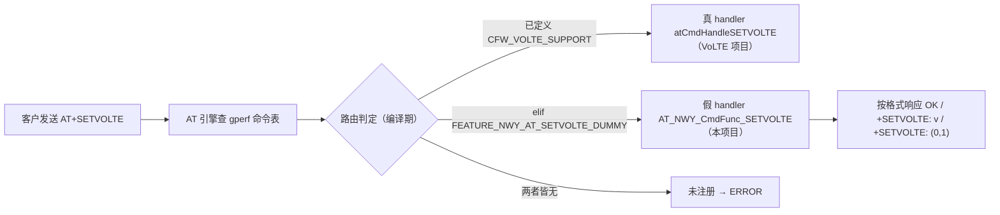
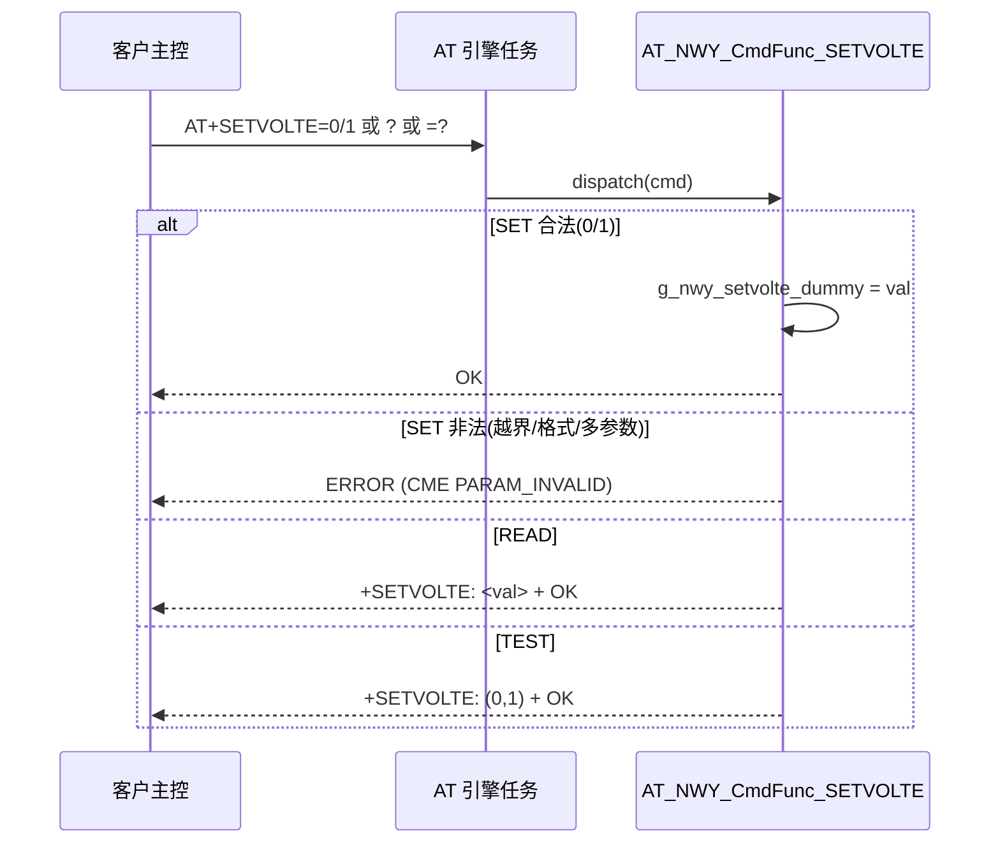
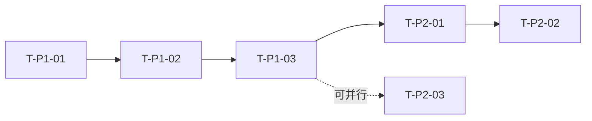

# AT+SETVOLTE 假命令（空实现）技术方案

## 0. 结构化摘要

> 以下信息便于实施计划引用与后续追溯，需完整准确填写。

| 字段 | 内容 |
|------|------|
| **项目 ID** | 7019695640 |
| **模块** | AT 命令 / VoLTE |
| **方案概述** | 新增 NWY 假 handler `AT_NWY_CmdFunc_SETVOLTE`，通过 gperf 命令表 `#elif` 在未启用真实 VoLTE 时把 `+SETVOLTE` 路由到空实现；仅本项目开启功能宏 `FEATURE_NWY_AT_SETVOLTE_DUMMY` |
| **影响面** | AT 命令注册层（`at_cmd_table.gperf`）+ NWY 定制 handler（`nwy_at_std.c`）；**不动** CFW/协议栈/任务/外设 |
| **关联需求文档** | [需求.md](./需求.md) |

---

## 目录
- [文档信息](#文档信息)
- [1. 方案目标与范围](#1-方案目标与范围)
- [2. 现状分析](#2-现状分析)
- [3. 方案选型](#3-方案选型)
- [4. 架构与分层设计](#4-架构与分层设计)
- [5. 任务与并发设计](#5-任务与并发设计)
- [6. 资源预算](#6-资源预算)
- [7. 硬件与外设依赖](#7-硬件与外设依赖)
- [8. AT 与协议栈兼容性](#8-at-与协议栈兼容性)
- [9. 接口设计](#9-接口设计)
- [10. 关键流程](#10-关键流程)
- [11. 异常处理与降级](#11-异常处理与降级)
- [12. 风险与对策](#12-风险与对策)
- [13. 验证要点](#13-验证要点)
- [14. 待澄清事项](#14-待澄清事项)

## 文档信息
| 字段 | 内容 |
|------|------|
| 项目名称 | N706_CB_BM_GP_B41F（target：`8850BM_cat1bis_plus`） |
| 创建日期 | 2026-06-18 |
| 版本 | v1.0 |
| 作者 | niusulong |

| 版本 | 日期 | 修改内容 | 作者 |
|------|------|----------|------|
| v1.0 | 2026-06-18 | 初始创建 | niusulong |

## 1. 方案目标与范围
### 1.1 目标
让 `+SETVOLTE` 命令在本项目（未启用 `CFW_VOLTE_SUPPORT`）被注册，并按客户提供的格式响应 SET/READ/TEST，**不触发任何 IMS/VoLTE 业务**。呼应需求 FR-001~FR-006 与非功能约束（内存可忽略、注网行为不变、不影响其它项目）。

### 1.2 范围
- **包含**：
  - 新增 NWY 假 handler `AT_NWY_CmdFunc_SETVOLTE`（并入 `components/nwy/std_old/common/nwy_at_std.c`）。
  - gperf 命令表 `at_cmd_table.gperf` 改为 `#ifdef CFW_VOLTE_SUPPORT / #elif FEATURE_NWY_AT_SETVOLTE_DUMMY` 路由（本项目 AT 版用此表；`at_cmd_table_open.gperf` 不动）。
  - 仅本项目 `nwy_project.h.in` 开启 `FEATURE_NWY_AT_SETVOLTE_DUMMY`。
- **不包含**：真实 VoLTE/IMS 能力；其它项目；任务/协议栈/外设改动；NVM 掉电保存。

## 2. 现状分析
- **相关现有代码**：
  - 真实实现：`atCmdHandleSETVOLTE` @ `components/ats/cc/at_cmd_cc.c:227`，整体被 `#ifdef CFW_VOLTE_SUPPORT` 包裹，内部调用 `CFW_ImsSetVolte()` 并有 POC/PDP/CC 计数等业务检查。
  - gperf 注册：`components/atr/src/at_cmd_table.gperf:133` 与 `at_cmd_table_open.gperf:74`，均在 `#ifdef CFW_VOLTE_SUPPORT` 下。
  - 宏控门控：`CONFIG_CFW_VOLTE_SUPPORT`（`components/cfw/Kconfig:20`，`default n if SOC_8850`）；由 `components/cfw/CMakeLists.txt:18` 转为 `CFW_VOLTE_SUPPORT`。
  - 本项目 target `8850BM_cat1bis_plus` 的 target.config **未设** `CONFIG_CFW_VOLTE_SUPPORT=y` → 真实实现未编译、`+SETVOLTE` 未注册 → 客户得 **ERROR**（根因）。
  - NWY 自定义命令范式：handler 命名 `AT_NWY_CmdFunc_<NAME>(atCommand_t *cmd)`，直接由 gperf 表注册、用 `FEATURE_NWY_*` 宏门控；例：`nwy_at_std.c` 中 `AT_NWY_CmdFunc_RECVMODE` / `IPSTATUS` 等，gperf 中 `+NWTEST→AT_NWY_CmdFunc_NWTEST`（`FEATURE_NWY_FRM_TEST`）。
  - 项目宏注入点：`nwy_project/N706_CB_BM_GP_B41F/components/nwy/include/nwy_project.h.in`（`FEATURE_NWY_*` 定义处），经 `nwy_config.h` 全局可见；gperf 表顶部已 `#include "nwy_config.h"`，故 `FEATURE_NWY_AT_*` 宏对 gperf 编译可见（已有 `FEATURE_NWY_AT_LASTGASP_MQTT` 等先例）。
- **现有调用链**：客户主控 → 模组 AT 引擎收到 `+SETVOLTE` → 查 gperf 命令表 → 本项目无注册项 → 回 ERROR。
- **可复用能力**：NWY AT handler 框架（`nwy_at_std.c`，已在 `components/nwy/std_old/CMakeLists.txt:55` 纳入编译，无需改 CMake）；AT 响应/参数解析 API（`atCmdRespOK` / `atCmdRespInfoText` / `atCmdRespCmeError` / `atParamUintInRange`）。

## 3. 方案选型
| 方案 | 思路 | 关键权衡 | 适用场景 | 是否采用 |
|------|------|----------|----------|----------|
| 方案 A（推荐） | NWY 独立假 handler + gperf `#elif` 路由，功能宏 `FEATURE_NWY_AT_SETVOLTE_DUMMY` 仅本项目开 | 改动隔离（NWY 定制文件 + `at_cmd_table.gperf` 加 `#elif` + 项目头 1 行）；真实实现优先、其它项目零影响、回滚好；符合"定制隔离/新代码 nwy 化"规范 | 单项目非-VoLTE 兼容桩 | ✅ |
| 方案 B | 复用平台 `at_cmd_cc.c`，用 `#elif` 编一个同名 `atCmdHandleSETVOLTE` dummy 版 | 不增文件，但把假实现塞进**共享平台文件**，污染面大、不符合定制隔离 | — | ❌ |
| 方案 C | 项目级宏 `FEATURE_NWY_AT_PRJ_N706_BM` 门控 | 违反规范"功能宏不得含项目名"；粒度过粗 | — | ❌ |

**选定理由**：A 把定制代码隔离在 NWY 层（`nwy_at_std.c`），共享平台文件（`at_cmd_cc.c`）零改动；gperf 仅加 `#elif`（宏未定义时零代码、真实实现优先），风险与改动量最小且回滚性好。B 污染共享平台文件、多项目回归面大；C 违反宏控命名规范且粒度不合理。

## 4. 架构与分层设计
### 4.1 分层落点
- **AT 命令注册层**（gperf 表）：增加 `+SETVOLTE` 到假 handler 的条件路由。
- **NWY 应用定制层**（`nwy_at_std.c`）：假 handler 实现 + RAM 状态变量。
- **不触碰**：CFW / IMS / 协议栈 / 驱动。

### 4.2 命令路由数据流


## 5. 任务与并发设计
| 任务/上下文 | 职责 | 优先级 | 栈大小 | 通信机制 | 备注 |
|-------------|------|--------|--------|----------|------|
| AT 引擎任务（复用） | 执行 `AT_NWY_CmdFunc_SETVOLTE` | 现有 | 现有 | 无 | 不新建任务 |

- **同步与互斥**：状态变量 `g_nwy_setvolte_dummy` 仅在 AT 引擎任务上下文被读写；AT 命令串行处理，**无需锁/临界区**。
- **实时性考量**：handler 同步即返（无阻塞、无 I/O、无定时器），不进入任何关键路径。

## 6. 资源预算
| 类别 | 指标 | 预算 | 评估 | 验证方法 |
|------|------|------|------|----------|
| RAM | 增量 | < 64 B | +1 个 `static uint8_t`；handler 复用任务栈 | map/符号表比对 |
| Flash | 增量 | < 1 KB | handler ~40 行 + gperf 一条表项 | 编译产物比对 |
| 功耗 | 影响 | 无 | 不新增任务/定时器/唤醒源 | 代码审查 |
| 时序 | 关键路径 | 无影响 | 同步即返 | 日志计时 |

## 7. 硬件与外设依赖
| 依赖项 | 说明 | 备注 |
|--------|------|------|
| 无 | 纯软件 AT 命令桩，不涉及引脚/总线/时钟/电源 | — |

## 8. AT 与协议栈兼容性
- **对现有链路的影响**：无。假 handler 不调用任何 CFW/IMS 接口，不触发注网/附着/IMS 注册变化。
- **兼容性保证**：`#elif` 保证 `CFW_VOLTE_SUPPORT`（真实实现）优先；功能宏仅本项目开启；其它项目（宏未定义）`+SETVOLTE` 行为不变（未注册→ERROR）。
- **回归面**：本项目 AT 命令解析；任选一个 VoLTE 项目（如 `N706_CB_CM`）回归确认真实 `+SETVOLTE` 未受影响。

## 9. 接口设计
### 9.1 对外接口/API
> 命名遵循 spec-neoway-coding-standards（`AT_NWY_CmdFunc_<NAME>` 范式；全局变量 `static` + `g_` 前缀）。

| 接口 | 原型 | 说明 |
|------|------|------|
| AT 命令 | `AT+SETVOLTE=<onoff>` / `AT+SETVOLTE?` / `AT+SETVOLTE=?` | 假命令对外语法（见需求 §2.1） |
| NWY handler | `void AT_NWY_CmdFunc_SETVOLTE(atCommand_t *cmd)` | SET/READ/TEST 处理；`#ifdef FEATURE_NWY_AT_SETVOLTE_DUMMY` 包裹 |
| 状态变量 | `static uint8_t g_nwy_setvolte_dummy = 0;` | 跟踪最近一次 SET，开机默认 0，掉电不保存 |

### 9.2 配置项与宏控
> 功能宏命名遵循 spec-neoway-coding-standards §3.4：`FEATURE_NWY_[AT]_FUNC_[FUNC1]_[BZ]`，大写+下划线、不含项目名。

| 宏控/配置项 | 类型 | 默认(开/关) | 生效范围 | 说明 |
|--------|------|--------|--------|------|
| `FEATURE_NWY_AT_SETVOLTE_DUMMY` | 功能宏（FUNC=SETVOLTE，FUNC1=DUMMY 变体） | 关 | **仅** `N706_CB_BM_GP_B41F` | 控制 `+SETVOLTE` 假命令注册与 handler 编译；区别于真实 `CFW_VOLTE_SUPPORT` |

- **启用方式**：在 `nwy_project/N706_CB_BM_GP_B41F/components/nwy/include/nwy_project.h.in` 增 `#define FEATURE_NWY_AT_SETVOLTE_DUMMY`。
- **回滚性**：去掉该宏后，gperf `#elif` 分支与 handler 均不编译，`+SETVOLTE` 回到未注册（ERROR），其余代码不变。

## 10. 关键流程
### 10.1 命令处理时序


### 10.2 关键代码骨架（实施参考）
handler（`nwy_at_std.c`）：
```c
/*Begin: Add by niusulong for/to SETVOLTE dummy cmd in 2026.06.18*/
#ifdef FEATURE_NWY_AT_SETVOLTE_DUMMY
static uint8_t g_nwy_setvolte_dummy = 0;   /* default off, RAM only */

void AT_NWY_CmdFunc_SETVOLTE(atCommand_t *cmd)
{
    if (AT_CMD_SET == cmd->type) {
        bool paramok = true;
        uint8_t val = atParamUintInRange(cmd->params[0], 0, 1, &paramok);
        if (!paramok || cmd->param_count > 1) {
            atCmdRespCmeError(cmd->engine, ERR_AT_CME_PARAM_INVALID);
            return;
        }
        g_nwy_setvolte_dummy = val;
        atCmdRespOK(cmd->engine);
    } else if (AT_CMD_READ == cmd->type) {
        char rsp[20] = {0};
        sprintf(rsp, "+SETVOLTE: %u", g_nwy_setvolte_dummy);
        atCmdRespInfoText(cmd->engine, rsp);
        atCmdRespOK(cmd->engine);
    } else if (AT_CMD_TEST == cmd->type) {
        atCmdRespInfoText(cmd->engine, "+SETVOLTE: (0,1)");   /* 带括号，对齐客户格式 */
        atCmdRespOK(cmd->engine);
    } else {
        atCmdRespCmeError(cmd->engine, ERR_AT_CME_OPERATION_NOT_SUPPORTED);
    }
}
#endif
/*End: Add by niusulong for/to SETVOLTE dummy cmd in 2026.06.18*/
```

gperf 路由（`at_cmd_table.gperf` 单表；open 表本项目不用，不动）：
```c
#ifdef CFW_VOLTE_SUPPORT
+SETVOLTE,      atCmdHandleSETVOLTE, 0
#elif defined(FEATURE_NWY_AT_SETVOLTE_DUMMY)
+SETVOLTE,      AT_NWY_CmdFunc_SETVOLTE, 0
#endif
```

> 实施备注：handler 原型由构建脚本 `gperf2h.py` 对 gperf 表中每个 handler 自动生成 `DECLARE_CMD_HANDLER(AT_NWY_CmdFunc_SETVOLTE);`，**无需手写原型**；定义放 `nwy_at_std.c` 即可由链接器解析（与 `AT_NWY_CmdFunc_RECMODE` 同机制）。

## 11. 异常处理与降级
| 异常场景 | 处理策略 | 降级/回滚 |
|----------|----------|-----------|
| SET 参数越界（`=2`）/格式错（`=abc`）/多参数 | 返回 `CME ERROR (PARAM_INVALID)` | — |
| 未知子类型（如 EXEC） | 返回 `CME ERROR (OPERATION_NOT_SUPPORTED)` | — |
| 功能宏未开启 | `+SETVOLTE` 未注册→ERROR（天然回滚） | 去掉宏即恢复 |

## 12. 风险与对策
| 风险 | 影响 | 概率 | 对策 |
|------|------|------|------|
| gperf 表为共享平台文件，误改影响所有项目编译 | 中 | 低 | 仅加纯 `#elif`（宏未定义零代码）；真实实现优先；多项目构建验证 |
| 误将功能宏开到 VoLTE 项目导致 `+SETVOLTE` 重复/错路由 | 中 | 低 | 宏仅在本项目 `nwy_project.h.in` 开启；`#ifdef CFW_VOLTE_SUPPORT` 优先兜底 |
| handler 原型未声明导致 gperf 编译失败 | 低 | 低 | 按现有 `AT_NWY_CmdFunc_RECMODE` 声明方式补原型 |

## 13. 验证要点
> 供实施计划引用，每条应可被测试覆盖。
- [ ] 本项目（N706_CB_BM_GP_B41F）构建通过，`+SETVOLTE` 已注册
- [ ] `AT+SETVOLTE=0` / `=1` → `OK`；`=2` / `=abc` / 多参数 → `ERROR`
- [ ] `AT+SETVOLTE?` → `+SETVOLTE: <最近SET值>`，开机默认 `1`
- [ ] `AT+SETVOLTE=?` → `+SETVOLTE: (0,1)`（**带括号**）+ `OK`
- [ ] 连续 1000 次 SET/READ/TEST 无异常、内存无增长
- [ ] 重启后值回到默认 `1`（掉电不保存）
- [ ] 回归：`N706_CB_CM`（VoLTE）真实 `+SETVOLTE` 行为不变；任一其它项目 `+SETVOLTE` 仍 `ERROR`（未误开宏）

## 14. 待澄清事项
- [ ] handler 落点：默认并入 `nwy_at_std.c`（零 CMake 改动）；若团队偏好独立文件则新建 `nwy_at_setvolte.c` 并在 `components/nwy/std_old/CMakeLists.txt` 注册。
- [ ] 是否将此假命令同步给其它同类非-VoLTE BM 项目（当前需求范围仅本项目）。

---

# AT+SETVOLTE 假命令（空实现）实施计划

## 0. 结构化摘要

> 以下信息便于执行与追溯，需完整准确填写。

| 字段 | 内容 |
|------|------|
| **项目 ID** | 7019695640 |
| **模块** | AT 命令 / VoLTE |
| **计划概述** | 落地方案 A：加 NWY 假 handler + gperf `#elif` 路由 + 本项目开功能宏，分 2 期（编码编译 → 板级验证回归） |
| **分期数** | 2 期（P1–P2；改动面小，已收敛典型 P0–P3） |
| **关联方案文档** | [方案.md](./方案.md) |
| **关联需求文档** | [需求.md](./需求.md) |

---

## 目录
- [文档信息](#文档信息)
- [1. 计划概述](#1-计划概述)
- [2. 文件/模块结构映射](#2-文件模块结构映射)
- [3. 分期规划](#3-分期规划)
- [4. 任务分解（WBS）与接口契约](#4-任务分解wbs与接口契约)
- [5. 依赖与关键路径](#5-依赖与关键路径)
- [6. 验收与验证矩阵](#6-验收与验证矩阵)
- [7. 风险与应对](#7-风险与应对)
- [8. 交付与合入策略](#8-交付与合入策略)
- [9. 待澄清事项](#9-待澄清事项)
- [10. 后续执行](#10-后续执行)

## 文档信息
| 字段 | 内容 |
|------|------|
| 项目名称 | N706_CB_BM_GP_B41F（target：`8850BM_cat1bis_plus`） |
| 创建日期 | 2026-06-18 |
| 版本 | v1.0 |
| 作者 | niusulong |

| 版本 | 日期 | 修改内容 | 作者 |
|------|------|----------|------|
| v1.0 | 2026-06-18 | 初始创建 | niusulong |

## 1. 计划概述
### 1.1 目标
把方案 A 落地：在 `N706_CB_BM_GP_B41F` 让 `+SETVOLTE` 被注册到 NWY 假 handler 并按客户格式响应，不启用真实 VoLTE、不影响其它项目。呼应方案分层落点（AT 注册层 + NWY 定制层）与核心流程。

### 1.2 约束
| 约束 | 内容 |
|------|------|
| 工期 | 约 0.5 人天（3 文件、~50 行、单模块） |
| 人力 | 1 人 |
| 合入策略 | 一次性合入（改动小、单一可回滚） |
| 回归范围 | `N706_CB_CM`（VoLTE）真实 `+SETVOLTE` 行为不变；任一其它非-VoLTE 项目 `+SETVOLTE` 仍 ERROR |
| 开发方式 | 无单测；编译验证 + 上板串口 AT 命令实测 + 回归构建 |

### 1.3 全局约束（所有任务隐含）
- **编码规范合规**：所有代码须符合 `spec-neoway-coding-standards`——handler 命名 `AT_NWY_CmdFunc_SETVOLTE`、全局变量 `static uint8_t g_nwy_setvolte_dummy`、宏 `FEATURE_NWY_AT_SETVOLTE_DUMMY`、修改处加 `Begin/End` 注释。每个代码任务验收隐含"通过规范检查"。

## 2. 文件/模块结构映射
| 文件/模块 | 操作 | 职责 | 所属分期 |
|-----------|------|------|----------|
| `nwy_project/N706_CB_BM_GP_B41F/components/nwy/include/nwy_project.h.in` | 修改 | 增 `#define FEATURE_NWY_AT_SETVOLTE_DUMMY`（仅本项目生效） | P1 |
| `components/nwy/std_old/common/nwy_at_std.c` | 修改 | 新增假 handler `AT_NWY_CmdFunc_SETVOLTE` + 状态变量（原型由 gperf2h.py 自动声明，无需手写） | P1 |
| `components/atr/src/at_cmd_table.gperf` | 修改 | `+SETVOLTE` 行改 `#ifdef/#elif` 路由（本项目用此表；open 表不动） | P1 |

## 3. 分期规划
| 期号 | 目标 | 可验证产物 | 依赖 | 预估 |
|------|------|-----------|------|------|
| P1 | 编码 + 编译通过 | `N706_CB_BM_GP_B41F` 完整构建通过，`+SETVOLTE` 注册到 `AT_NWY_CmdFunc_SETVOLTE`，镜像可烧录 | — | 0.2 人天 |
| P2 | 板级功能验证 + 回归 | SET/READ/TEST/非法 按客户格式实测通过；压测稳定；VoLTE 项目回归通过 | P1 | 0.3 人天 |

## 4. 任务分解（WBS）与接口契约

### P1（编码与编译）
| 任务 ID | 标题 | 依赖 | 预估 | 验收点（可勾选） | 验证方式 | 涉及文件 |
|---------|------|------|------|-----------------|----------|----------|
| T-P1-01 | 在本项目 `nwy_project.h.in` 增加功能宏 `FEATURE_NWY_AT_SETVOLTE_DUMMY` | — | 0.05 人天 | - [ ] 文件含 `#define FEATURE_NWY_AT_SETVOLTE_DUMMY` <br>- [ ] 配置生成后 `nwy_project.h` 中该宏可见 <br>- [ ] 仅本项目头改动，其它项目 `nwy_project.h.in` 不受影响 | 配置生成 + grep 确认 | nwy_project.h.in |
| T-P1-02 | 实现 NWY 假 handler `AT_NWY_CmdFunc_SETVOLTE` | T-P1-01 | 0.1 人天 | - [ ] `nwy_at_std.c` 含 `void AT_NWY_CmdFunc_SETVOLTE(atCommand_t *cmd)`，整体在 `#ifdef FEATURE_NWY_AT_SETVOLTE_DUMMY` 内 <br>- [ ] 含 `static uint8_t g_nwy_setvolte_dummy = 0;`（开机默认 0） <br>- [ ] SET 合法(0/1)→`atCmdRespOK`；越界/格式错/多参数→`atCmdRespCmeError(ERR_AT_CME_PARAM_INVALID)` <br>- [ ] READ→`sprintf "+SETVOLTE: %u"` + OK；TEST→`"+SETVOLTE: (0,1)"`（带括号）+ OK <br>- [ ] 命名/注释(Begin/End)合规（原型由 gperf2h.py 自动声明，无需手写） | 编译通过 | nwy_at_std.c |
| T-P1-03 | 修改 `at_cmd_table.gperf` 把 `+SETVOLTE` 改为条件路由 | T-P1-02 | 0.05 人天 | - [ ] `at_cmd_table.gperf` 的 `+SETVOLTE` 行改为 `#ifdef CFW_VOLTE_SUPPORT / #elif defined(FEATURE_NWY_AT_SETVOLTE_DUMMY) / #endif`（open 表不动） <br>- [ ] 真实分支仍指向 `atCmdHandleSETVOLTE`，假分支指向 `AT_NWY_CmdFunc_SETVOLTE` <br>- [ ] `N706_CB_BM_GP_B41F` 完整构建通过，镜像生成 | 编译（本项目构建） | at_cmd_table.gperf |

### P2（板级验证与回归）
| 任务 ID | 标题 | 依赖 | 预估 | 验收点（可勾选） | 验证方式 | 涉及文件 |
|---------|------|------|------|-----------------|----------|----------|
| T-P2-01 | 烧录后串口实测 AT 响应格式 | P1 | 0.15 人天 | - [ ] `AT+SETVOLTE=0` / `=1` → `OK` <br>- [ ] `AT+SETVOLTE=2` / `=abc` / 多参数 → `ERROR` <br>- [ ] `AT+SETVOLTE?` → `+SETVOLTE: <最近SET值>`，开机默认 `+SETVOLTE: 0` <br>- [ ] `AT+SETVOLTE=?` → `+SETVOLTE: (0,1)` + `OK`（带括号） <br>- [ ] 响应与需求§2.1 客户日志逐字一致 | 串口 AT 命令实测，对比客户日志 | — |
| T-P2-02 | 稳定性与掉电不保存验证 | T-P2-01 | 0.05 人天 | - [ ] 连续 1000 次 SET/READ/TEST 循环无异常、无内存增长 <br>- [ ] 断电重启后 `AT+SETVOLTE?` 回到默认 `0` | 脚本压测 + 重启复测 | — |
| T-P2-03 | VoLTE 项目回归构建与行为确认 | P1 | 0.05 人天 | - [ ] `N706_CB_CM` 构建通过 <br>- [ ] 其 `+SETVOLTE` 仍指向真实 `atCmdHandleSETVOLTE`（查 map/符号表，未路由到假 handler） <br>- [ ] 任一其它非-VoLTE 项目 `+SETVOLTE` 仍 `ERROR`（宏未误开） | 回归构建 + 符号表比对 | — |

### 接口契约（单一事实源）
| 接口名 | 签名 | 产出任务 | 消费任务 |
|--------|------|----------|----------|
| `AT_NWY_CmdFunc_SETVOLTE` | `void AT_NWY_CmdFunc_SETVOLTE(atCommand_t *cmd)` | T-P1-02 | T-P1-03（gperf 表引用） |
| `g_nwy_setvolte_dummy` | `static uint8_t g_nwy_setvolte_dummy = 0;` | T-P1-02 | T-P1-02（内部，不跨文件） |
| `FEATURE_NWY_AT_SETVOLTE_DUMMY` | `#define`（功能宏） | T-P1-01 | T-P1-02、T-P1-03（门控编译） |

## 5. 依赖与关键路径

- **关键路径**：T-P1-01 → T-P1-02 → T-P1-03 → T-P2-01 → T-P2-02（决定总工期）
- **可并行任务**：T-P2-03（回归）只依赖 P1，可与 T-P2-01/T-P2-02 并行

## 6. 验收与验证矩阵
> 验收点追溯至方案『验证要点』章节（按章节名引用）。

| 验收点 | 验证方式 | 关联任务 | 关联方案验证点 |
|--------|----------|----------|---------------|
| 本项目构建通过、`+SETVOLTE` 已注册 | 编译 | T-P1-03 | 验证要点-构建通过 |
| SET/READ/TEST 按客户格式响应 | 串口 AT 实测 | T-P2-01 | 验证要点-SET/READ/TEST |
| 非法参数返回 ERROR | 串口 AT 实测 | T-P2-01 | 验证要点-非法参数 |
| 压测稳定、掉电回默认 | 长时间运行 + 重启 | T-P2-02 | 验证要点-压测/掉电 |
| VoLTE 项目真实 `+SETVOLTE` 不变、其它项目仍 ERROR | 回归构建 + 符号表 | T-P2-03 | 验证要点-回归 |

## 7. 风险与应对
| 风险 | 影响 | 概率 | 应对 |
|------|------|------|------|
| handler 原型声明位置不对致 gperf 编译失败 | 中 | 中 | 按现有 `AT_NWY_CmdFunc_RECMODE` 的声明位置补原型；以"本项目编译通过"为客观判据 |
| gperf 共享表误改影响其它项目编译 | 中 | 低 | 仅加纯 `#elif`，宏未定义零代码；T-P2-03 回归构建兜底 |
| 测试板/串口不具备 | 低 | 低 | 见§9 待澄清；不具备则功能验证延后，先交付编译通过的镜像 |

## 8. 交付与合入策略
- **分支策略**：特性分支（基于当前 `master_cm_volte_W23.42.5_4891451412`）。
- **评审节点**：P1 编码完成自测 + 一次代码评审（关注 gperf `#elif` 与宏控合规）。
- **合入方式**：P1+P2 全部通过后一次性合入。
- **回滚方案**：从 `nwy_project.h.in` 删除 `FEATURE_NWY_AT_SETVOLTE_DUMMY` → gperf `#elif` 与 handler 均不编译 → `+SETVOLTE` 回到未注册（ERROR），其余代码不变。呼应方案§11 降级设计。

## 9. 待澄清事项
- [ ] 是否具备 `N706_CB_BM_GP_B41F` 可烧录测试板 + 串口（影响 T-P2-01/T-P2-02 执行时机）。
- [ ] handler 原型声明的确切头文件位置（实施 T-P1-02 时按 `AT_NWY_CmdFunc_RECMODE` 声明位置定位）。
- [ ] 回归项目是否固定用 `N706_CB_CM`，还是需另加项目（当前以 `N706_CB_CM` 为代表）。

## 10. 后续执行
本计划为项目级计划，可直接人工推进：按 P1 → P2 顺序执行各任务卡，每卡对照验收点勾选。全部通过后即可合入。

---

# AT+SETVOLTE 假命令（空实现）需求文档

## 0. 结构化摘要

> 以下信息供知识库检索使用，需完整准确填写。

| 字段 | 内容 |
|------|------|
| **项目 ID** | 7019695640 |
| **模块** | AT 命令 / VoLTE |
| **需求描述** | 为 N706_CB_BM_GP_B41F 增加一个假的空实现 AT+SETVOLTE 命令，使客户表计发送时能正确响应 SET/READ/TEST，不启用真实 VoLTE、不触发任何 IMS 业务 |
| **优先级** | P0 必须实现（阻断客户表计初始化流程） |

---

## 目录
- [文档信息](#文档信息)
- [1. 项目概述](#1-项目概述)
- [2. 功能需求](#2-功能需求)
- [3. 非功能需求](#3-非功能需求)
- [4. 待澄清事项](#4-待澄清事项)

## 文档信息
| 字段 | 内容 |
|------|------|
| 文档编号 | - |
| 项目名称 | N706_CB_BM_GP_B41F（target：`8850BM_cat1bis_plus`） |
| 创建日期 | 2026-06-18 |
| 版本 | v1.0 |
| 需求来源 | 销售机会 IN-Polaris-N706-CB-12 / 客户表计（Polaris） |

| 版本 | 日期 | 修改内容 | 作者 |
|------|------|----------|------|
| v1.0 | 2026-06-18 | 初始创建 | niusulong |

## 1. 项目概述

### 1.1 项目背景
客户（销售机会 IN-Polaris-N706-CB-12）的表计主控固件在初始化流程中会发送 `AT+SETVOLTE` 来设置/查询 VoLTE 开关（该固件从其他支持 VoLTE 的模组移植而来）。客户明确表示"**不涉及业务，只是做个假 AT**"，即命令只需被接受并正确响应，并不依赖任何真实 VoLTE 通话能力。

**根因（已定位）**：仓库中已存在完整的真实实现 `atCmdHandleSETVOLTE`（`components/ats/cc/at_cmd_cc.c:227`），但被 `#ifdef CFW_VOLTE_SUPPORT` 包裹。该宏由 Kconfig `CONFIG_CFW_VOLTE_SUPPORT` 控制，对 SOC_8850 默认关闭（`components/cfw/Kconfig:23`）。本项目 `N706_CB_BM_GP_B41F` 的 target `8850BM_cat1bis_plus` 是有意裁剪掉 VoLTE 的 Cat-1 bis 版本（target.config 未设置 `CONFIG_CFW_VOLTE_SUPPORT=y`，全仓仅 `*_CM_*cat1bis_volte_plus` 系列项目启用）。因此当前编译中 `AT+SETVOLTE` **未注册，客户发送得到 ERROR**，阻断其初始化流程。

### 1.2 目标用户与场景
- **目标用户**：客户表计主控 MCU 固件。
- **使用场景**：表计上电注网流程中，主控依次发送 `AT+SETVOLTE=0/1`（设置）、`AT+SETVOLTE?`（查询）、`AT+SETVOLTE=?`（查询支持的取值），需得到约定格式的响应以继续后续流程。

### 1.3 项目目标
在不启用真实 VoLTE（不打开 `CFW_VOLTE_SUPPORT`、不引入 IMS 协议栈、不改变注网行为）的前提下，让 `AT+SETVOLTE` 命令在本项目中被正确注册并按客户约定格式响应。

### 1.4 适用范围
- **包含**：
  - 仅 `N706_CB_BM_GP_B41F`（target `8850BM_cat1bis_plus`）项目生效的假命令空实现。
  - SET / READ / TEST 三种语法。
- **不包含**：
  - 任何真实 VoLTE / IMS 通话能力。
  - 其它已启用真实 VoLTE 的项目（如 `N706_CB_CM`）——这些项目继续走现有真实实现，不受影响。
  - 命令值与实际网络/IMS 行为的任何联动。

## 2. 功能需求

### 2.1 响应格式约定（以客户提供的实际日志为准）
| 语法 | 响应 |
|------|------|
| `AT+SETVOLTE=0` | `OK` |
| `AT+SETVOLTE=1` | `OK` |
| `AT+SETVOLTE=?` | `+SETVOLTE: (0,1)` 换行 `OK` |
| `AT+SETVOLTE?` | `+SETVOLTE: <value>` 换行 `OK`（value 见 FR-002） |

**客户实际日志原文（格式基准）：**

```
[2026-06-18_09:59:37:691] AT+SETVOLTE=0
[2026-06-18_09:59:37:691] OK
[2026-06-18_09:59:44:533] AT+SETVOLTE=?
[2026-06-18_09:59:44:533] +SETVOLTE: (0,1)
[2026-06-18_09:59:44:533] OK
[2026-06-18_09:59:48:290] AT+SETVOLTE=1
[2026-06-18_09:59:48:290] OK
[2026-06-18_09:59:54:006] AT+SETVOLTE?
[2026-06-18_09:59:54:006] +SETVOLTE: 1
[2026-06-18_09:59:54:006] OK
```

> 注意：测试命令的取值列表**带括号** `+SETVOLTE: (0,1)`，与现有真实代码 `+SETVOLTE: 0,1`（无括号）不同，本假命令须严格按客户格式带括号输出。

### 2.2 核心功能
| 编号 | 功能名称 | 描述 | 优先级 | 备注 |
|------|----------|------|--------|------|
| FR-001 | SET 命令 | `AT+SETVOLTE=<onoff>`，`<onoff>` ∈ {0,1}：0=关闭 VoLTE，1=打开 VoLTE。合法值响应 `OK`，并记录该值供 READ 返回。 | P0 | 默认值 0（关闭） |
| FR-002 | READ 命令 | `AT+SETVOLTE?`：响应 `+SETVOLTE: <value>` + `OK`，`<value>` 为最近一次 SET 的值，开机默认 0。 | P0 | 仅 RAM 保存，**掉电不保存**（已确认） |
| FR-003 | TEST 命令 | `AT+SETVOLTE=?`：响应 `+SETVOLTE: (0,1)` + `OK`。 | P0 | 格式须带括号 |
| FR-004 | 空实现/无业务 | 假命令**不依赖 `CFW_VOLTE_SUPPORT`**，不调用 `CFW_ImsSetVolte` 等任何 IMS/VoLTE 业务接口，不触发注网行为变化。 | P0 | 区别于真实实现 |
| FR-005 | 非法参数处理 | 参数越界（如 `=2`）或格式错误（如 `=abc`）或参数个数不符，返回 `ERROR`。仅 {0,1} 返回 `OK`。 | P1 | 标准 AT 行为 |
| FR-006 | 项目隔离 | 假命令仅在本项目（`8850BM_cat1bis_plus`）生效，不得影响其它已启用真实 VoLTE 项目的现有 `atCmdHandleSETVOLTE` 行为。 | P0 | |

> **优先级定义**：P0 = 必须实现，否则产品不可用 | P1 = 重要功能，严重影响用户体验 | P2 = 增值功能，可后续实现

### 2.3 扩展功能（可选）
> 已确认无扩展项。多卡（per-SIM）支持经评估**不需要**：假命令值不驱动任何业务，无按卡区分的语义。

## 3. 非功能需求
| 类别 | 需求项 | 具体要求 | 验证方法 |
|------|--------|----------|----------|
| 内存 | RAM/Flash 占用 | 仅新增一个静态存储变量 + handler，RAM 增量可忽略，不得引入 IMS/VoLTE 协议栈代码。 | 编译后对比 map 文件代码段/数据段增量 |
| 可靠性 | 注网行为不变 | 不改变现有注网、搜网、附着流程，不发起 IMS 注册。 | 对比启用前后 `+CEREG`/注网日志无差异 |
| 可靠性 | 运行稳定性 | 连续发送 SET/READ/TEST 1000 次无异常、无内存增长。 | 压力测试 |
| 兼容性 | 不影响真实实现 | 其它 VoLTE 项目编译/行为不受影响。 | 全量构建相关 VoLTE 项目并回归 |
| 功耗 | 功耗指标 | 不引入额外周期性任务/定时器。 | 代码审查 |

## 4. 待澄清事项
- [x] **待澄清 1（查询值掉电保存）**：**已确认——掉电不保存**。仅 RAM 保存、开机默认 0。
- [x] **待澄清 2（多卡）**：**已确认——无需多卡，采用全局单值**。假命令值不驱动任何业务，无按卡区分语义；客户流程亦不按卡区分。
- [x] **待澄清 3（复用范围）**：**已确认——只在 `N706_CB_BM_GP_B41F` 启用**，不推广到其它项目。