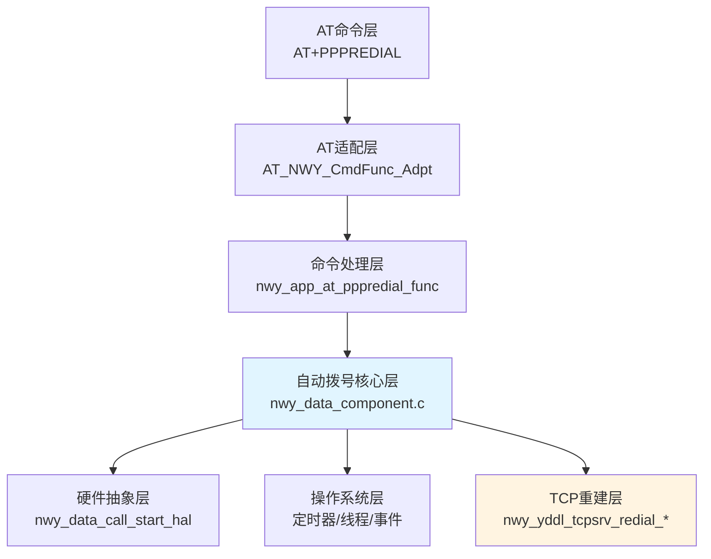
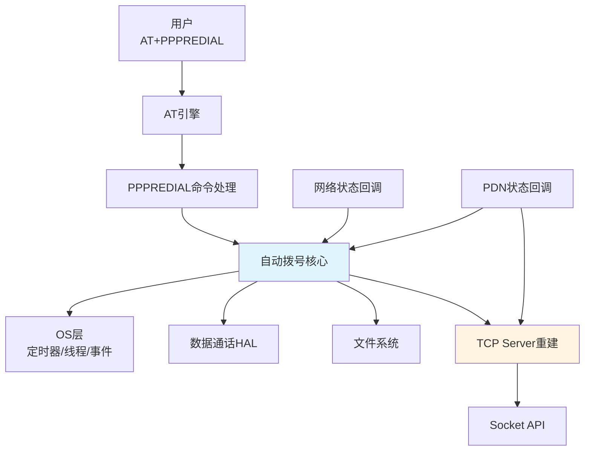
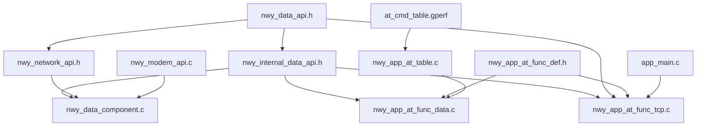
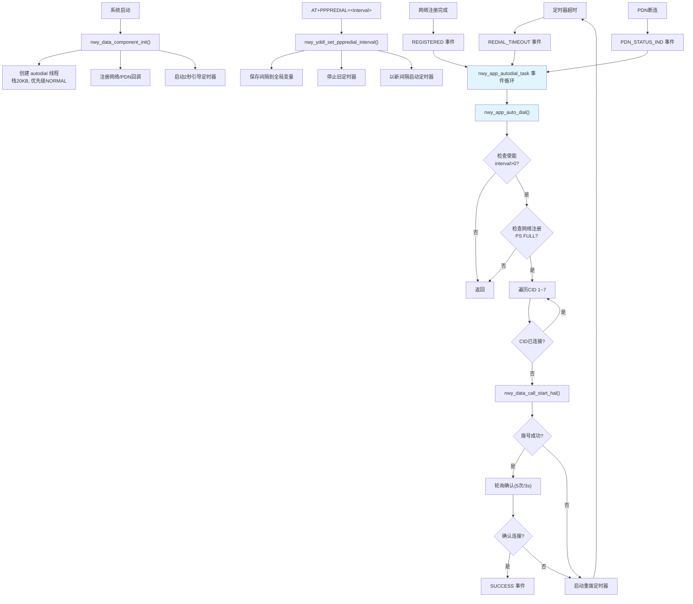
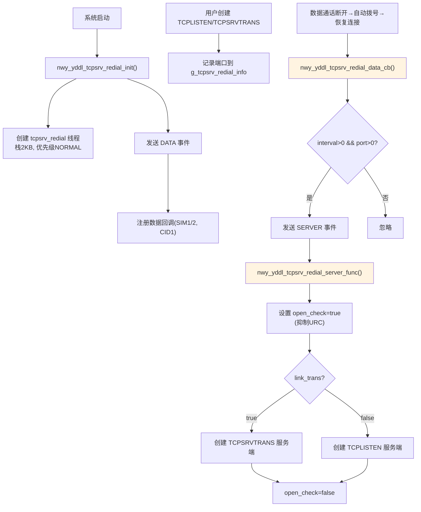
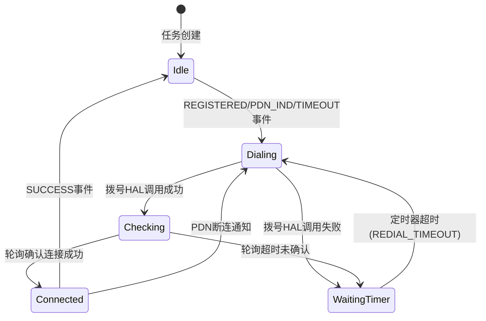

# PPPREDIAL指令模块 代码架构总结

## 目录
- [1. 参考文档](#1-参考文档)
- [2. 架构概述](#2-架构概述)
- [3. 核心代码路径](#3-核心代码路径)
- [4. 模块依赖关系](#4-模块依赖关系)
- [5. 目录结构分析](#5-目录结构分析)
- [6. 核心数据结构](#6-核心数据结构)
- [7. 关键接口分析](#7-关键接口分析)
- [8. 实现机制解析](#8-实现机制解析)
- [9. 配置与编译](#9-配置与编译)
- [10. 扩展点识别](#10-扩展点识别)
- [附录](#附录)

---

## 文档信息

- **文档编号**：2
- **文档类型**：实现总结
- **模块名称**：PPPREDIAL指令模块
- **代码路径**：`idh.code/components/nwy/nwy_fwk_v2/NWY_FRAMEWORK/`
- **分析日期**：2026-06-09
- **版本**：master
- **变更历史**：

| 版本 | 日期 | 修订内容 | 修订人 |
|------|------|----------|--------|
| 1.0 | 2026-06-09 | 初始版本 | Claude |

## 1. 参考文档

> 本次分析未引用已有文档，为全新分析。

## 2. 架构概述

### 2.1 系统定位

PPPREDIAL指令模块是 **LNT定制兼容层** 的核心功能，属于 Neoway Framework V2 的数据通话(DataCall)子系统。该模块提供两个核心能力：

1. **自动拨号(Auto-Dial)** — 通过定时器+事件循环机制，在数据通话断开后自动重拨，间隔由 AT+PPPREDIAL 命令配置
2. **TCP Server 自动重建** — 数据通话恢复后，自动重建 TCPLISTEN/TCPSRVTRANS 服务端监听

本模块仅在 `FEATURE_NWY_AT_COMPATIBLE_LNT` 宏启用时编译，为 LNT 客户定制专用。

### 2.2 分层架构



### 2.3 核心组件

| 组件 | 职责 | 关键文件 |
|------|------|----------|
| AT命令处理 | 解析 AT+PPPREDIAL 参数，调用核心接口 | `nwy_app_at_func_data.c` |
| 自动拨号引擎 | 定时器驱动的事件循环，管理拨号重试 | `nwy_data_component.c` |
| TCP Server 重建 | 数据通话恢复后自动重建 TCP 监听 | `nwy_app_at_func_tcp.c` |
| 参数持久化 | 保存/加载自动拨号参数到文件系统 | `nwy_data_component.c` |
| AT命令注册 | gperf 哈希表 + 函数表路由 | `at_cmd_table.gperf`, `nwy_app_at_table.c` |

## 3. 核心代码路径

| 分类 | 文件路径 | 核心内容 | 优先级 |
|------|----------|----------|--------|
| 类型定义 | `include/nwy_data_api.h` | `nwy_data_start_call_t`, `nwy_data_call_state_e` 等公共类型 | P0 |
| 内部接口 | `internal_include/nwy_internal_data_api.h` | `nwy_app_autodial_para_t`, get/set pppredial 声明 | P0 |
| 核心实现 | `components/datacall/nwy_data_component.c` | 自动拨号引擎全部实现 | P1 |
| AT处理 | `atcmd/nwy_at_data/src/nwy_app_at_func_data.c` | AT+PPPREDIAL 命令处理函数 | P1 |
| TCP重建 | `atcmd/nwy_at_proc/src/nwy_app_at_func_tcp.c` | TCP Server 自动重建机制 | P1 |
| 命令注册 | `atcmd/nwy_app_at_table.c` | 函数表 `"+pppredial"` 注册 | P2 |
| 命令路由 | `components/atr/src/at_cmd_table.gperf` | gperf 哈希表注册 | P2 |
| 初始化入口 | `components/modem/nwy_modem_api.c` | `nwy_data_component_init()` 调用 | P2 |
| 启动入口 | `components/appstart/src/app_main.c` | TCP 重建任务启动 | P2 |

> 以上路径均相对于 `idh.code/components/nwy/nwy_fwk_v2/NWY_FRAMEWORK/`

## 4. 模块依赖关系

### 4.1 依赖的基础框架

| 框架名 | 依赖方式 | 关键接口 | 说明 |
|--------|----------|----------|------|
| AT引擎 | 命令注册与分发 | `AT_NWY_CmdFunc_Adpt`, `nwy_app_at_func_resp_ok/err` | AT命令解析与响应 |
| RT-Thread OS | 线程/定时器/互斥 | `nwy_thread_create`, `nwy_sdk_timer_create`, `nwy_sdk_mutex_create` | 基础OS原语 |
| 数据通话HAL | 拨号/挂断 | `nwy_data_call_start_hal`, `nwy_data_call_stop_hal` | 底层Modem数据呼叫 |
| 网络状态 | 注册状态监听 | `nwy_nw_reg_cb`, `nwy_nw_regstatus_get` | PS域网络注册状态 |
| 数据回调 | PDN状态通知 | `nwy_data_reg_cb`, `nwy_data_call_info_get` | 数据通话状态查询 |
| 文件系统 | 参数持久化 | `nwy_file_open/read/write/close` | 自动拨号参数存取 |
| Socket API | TCP Server 创建 | `nwy_sdk_tcp_server_listen`, `nwy_sdk_tcpsrv_trans_listen` | TCP监听重建 |

### 4.2 被依赖的模块

| 模块 | 依赖方式 | 说明 |
|------|----------|------|
| TCPLISTEN/TCPSRVTRANS | 读取 pppredial interval | TCP Server 的 socket 回调中检测 pppredial 使能状态 |
| app_main | 调用初始化 | 系统启动时创建 TCP 重建任务 |

### 4.3 模块间接口

| 接口函数 | 声明位置 | 调用者 | 说明 |
|----------|----------|--------|------|
| `nwy_yddl_get_pppredial_interval()` | `nwy_internal_data_api.h:219` | AT处理/TCP重建/自动拨号 | 获取当前重拨间隔 |
| `nwy_yddl_set_pppredial_interval()` | `nwy_internal_data_api.h:220` | AT+PPPREDIAL处理 | 设置重拨间隔并重启定时器 |
| `nwy_data_component_init()` | `nwy_internal_data_api.h` | `nwy_modem_api.c` | 自动拨号组件初始化 |
| `nwy_yddl_tcpsrv_redial_init()` | `nwy_app_at_func_tcp.h` | `app_main.c` | TCP重建子系统初始化 |

### 4.4 与依赖模块的集成

本模块集成方式为：
- **AT引擎集成**：通过 gperf 哈希表 `+PPPREDIAL` -> `AT_NWY_CmdFunc_Adpt` -> 函数表 `"+pppredial"` -> `nwy_app_at_pppredial_func` 三级路由
- **OS集成**：创建两个独立线程（自动拨号线程 + TCP重建线程），各自运行事件循环
- **网络事件集成**：通过回调注册机制监听网络注册变化和PDN状态变化

### 4.5 模块依赖关系图



## 5. 目录结构分析

### 5.1 目录组织

```
idh.code/components/
├── atr/src/
│   └── at_cmd_table.gperf              # AT命令哈希表注册
├── appstart/src/
│   └── app_main.c                       # 系统启动入口
├── nwy/nwy_fwk_v2/NWY_FRAMEWORK/
│   ├── include/
│   │   ├── nwy_data_api.h               # 数据通话公共类型(P0)
│   │   ├── nwy_osi_api.h                # OS接口
│   │   └── nwy_network_api.h            # 网络API
│   ├── internal_include/
│   │   └── nwy_internal_data_api.h      # 内部数据接口(P0)
│   ├── components/
│   │   ├── datacall/
│   │   │   └── nwy_data_component.c     # 自动拨号核心(P1)
│   │   └── modem/
│   │       └── nwy_modem_api.c          # Modem初始化入口
│   └── atcmd/
│       ├── nwy_app_at_table.c           # AT函数表(P2)
│       ├── nwy_at_data/
│       │   ├── inc/nwy_app_at_func_data.h  # 数据AT声明
│       │   └── src/nwy_app_at_func_data.c  # AT+PPPREDIAL处理(P1)
│       └── nwy_at_proc/
│           ├── inc/nwy_app_at_func_tcp.h   # TCP AT声明
│           └── src/nwy_app_at_func_tcp.c   # TCP Server重建(P1)
```

### 5.2 关键文件说明

| 文件 | 类型 | 说明 | 依赖 |
|------|------|------|------|
| `nwy_data_component.c` | .c | 自动拨号全部实现：事件循环、定时器、拨号逻辑、参数存储 | `nwy_internal_data_api.h`, `nwy_data_api.h`, `nwy_network_api.h` |
| `nwy_app_at_func_data.c` | .c | AT+PPPREDIAL 命令解析与参数校验 | `nwy_internal_data_api.h`, `nwy_app_at_func_def.h` |
| `nwy_app_at_func_tcp.c` | .c | TCP Server 自动重建：事件循环、数据回调、服务重建 | `nwy_internal_data_api.h`, `nwy_app_at_func_tcp.h` |
| `nwy_internal_data_api.h` | .h | 内部接口声明与 `nwy_app_autodial_para_t` 结构体 | - |
| `nwy_data_api.h` | .h | 公共数据类型定义 | - |
| `at_cmd_table.gperf` | .gperf | gperf 哈希表，AT命令到处理函数映射 | - |
| `nwy_app_at_table.c` | .c | Neoway AT 函数路由表 | - |

### 5.3 文件依赖关系图



## 6. 核心数据结构

### 6.1 结构体定义

| 结构体 | 字段说明 | 用途 | 生命周期 |
|--------|----------|------|----------|
| `nwy_app_autodial_para_t` | `auto_val`(int32): 自动拨号使能<br/>`triggertype`(int32): 触发来源类型<br/>`cid`(int32): 通话ID<br/>`interval`(int32): 重拨间隔 | 每CID自动拨号参数，支持持久化到文件系统 | 静态全局数组 `g_nwy_app_autodial_para_arr[7]` |
| `nwy_data_start_call_t` | `cid`, `action`, `trigger_type`, `call_auto_type`, `set_profile`, `if_internal_call` | 数据通话启动/停止参数 | 栈上临时变量，函数调用时构造 |
| `nwy_yddl_tcpsrv_redial_t` | `open_check`(bool): 是否为重建中<br/>`link_trans`(bool): 透传模式标记<br/>`port`(uint16): TCP监听端口 | TCP Server 重建上下文 | 静态全局 `g_tcpsrv_redial_info` |
| `nwy_timer_para_t` | `expired_time`, `type`, `cb`, `cb_para` | 定时器配置 | 栈上临时变量 |

### 6.2 枚举类型

| 枚举 | 值域 | 用途 |
|------|------|------|
| `nwy_app_autodial_event_e` | `NOT_REGISTERED=0`, `REGISTERED=1`, `PDN_STATUS_IND=5`, `REDIAL_TIMEOUT=10`, `SUCCESS=15` | 自动拨号任务事件ID |
| `nwy_data_call_state_e` | `DISCONNECTED=0`, `CONNECTED=1` | 数据通话连接状态 |
| `nwy_data_call_auto_type_e` | `DISABLE=0`, `ENABLE=1` | 自动拨号使能标志 |
| `nwy_data_call_action_type_e` | `DEACT=0`, `ACT=1` | 拨号动作类型 |
| `nwy_data_trigger_type_e` | `NONE=0x00` .. `NETSHAREACT=0x07`, `NWNETSHAREACT=0x08` | 触发来源标识 |

TCP Server 重建事件（宏定义）：

| 宏 | 值 | 用途 |
|------|------|------|
| `NWY_TCPSRV_REDIAL_EVENT_DATA` | `0x11` | 注册数据回调事件 |
| `NWY_TCPSRV_REDIAL_EVENT_SERVER` | `0x12` | 重建 TCP Server 事件 |

### 6.3 全局变量

| 变量名 | 类型 | 作用域 | 说明 |
|--------|------|--------|------|
| `g_nwy_xiic_redial_interval` | `static int` | `nwy_data_component.c` | PPPREDIAL 重拨间隔（秒），0=禁用 |
| `g_nwy_app_autodial_hdl` | `nwy_osi_thread_t` | `nwy_data_component.c` | 自动拨号任务句柄 |
| `g_auto_dial_timer` | `static nwy_osi_timer_t` | `nwy_data_component.c` | 一次性重拨定时器 |
| `app_auto_dial_mutex` | `nwy_osi_mutex_t` | `nwy_data_component.c` | 拨号执行互斥锁 |
| `app_auto_dial_running` | `int` | `nwy_data_component.c` | 拨号执行中标志（防重入） |
| `g_nwy_app_autodial_para_arr[7]` | `nwy_app_autodial_para_t[]` | `nwy_data_component.c` | 7个CID的自动拨号参数 |
| `g_nwy_app_autodial_by_user[7]` | `int[]` | `nwy_data_component.c` | 用户启停标志（1=用户启动, 0=用户停止） |
| `g_tcpsrv_redial_info` | `static nwy_yddl_tcpsrv_redial_t` | `nwy_app_at_func_tcp.c` | TCP Server 重建上下文 |
| `g_tcpsrv_redial_task` | `static nwy_osi_thread_t` | `nwy_app_at_func_tcp.c` | TCP 重建任务句柄 |

## 7. 关键接口分析

### 7.1 API 函数

| 函数 | 功能 | 参数 | 返回值 | 线程安全 |
|------|------|------|--------|----------|
| `nwy_yddl_get_pppredial_interval()` | 获取当前重拨间隔 | 无 | `int` 间隔秒数（0=禁用） | 是（原子读） |
| `nwy_yddl_set_pppredial_interval(int value)` | 设置重拨间隔并重启定时器 | `value`: 0~7200秒 | `void` | 否（非线程安全，仅AT任务调用） |
| `nwy_data_component_init()` | 自动拨号子系统初始化 | 无 | `void` | 单次调用 |
| `nwy_data_call_start(sim_id, param)` | 启动数据通话并记录自动拨号参数 | `sim_id`: SIM卡, `param`: 拨号参数 | `nwy_error_e` | 是（受互斥保护） |
| `nwy_data_call_stop(sim_id, param)` | 停止数据通话并标记用户停止 | 同上 | `nwy_error_e` | 是 |

### 7.2 命令接口

| 命令 | 处理函数 | 说明 |
|------|----------|------|
| `AT+PPPREDIAL=<interval>` | `nwy_app_at_pppredial_func` | SET模式：设置重拨间隔（0~7200秒，步进10） |
| `AT+PPPREDIAL?` | `nwy_app_at_pppredial_func` | READ模式：返回 OK |
| `AT+PPPREDIAL=?` | `nwy_app_at_pppredial_func` | TEST模式：返回 OK |

**命令路由链**：`at_cmd_table.gperf` (`+PPPREDIAL` -> `AT_NWY_CmdFunc_Adpt`) -> `nwy_app_at_table.c` (`"+pppredial"` -> `nwy_app_at_pppredial_func`)

### 7.3 回调函数

| 回调 | 触发条件 | 注册方式 | 说明 |
|------|----------|----------|------|
| `nwy_app_autodial_nw_event_cb` | PS域注册状态变化 | `nwy_nw_reg_cb()` | 网络注册完成时触发 REGISTERED 事件 |
| `nwy_app_autodial_data_event_cb` | PDN状态变化（断连） | `nwy_data_reg_cb(sim, cid, cb)` | 数据通话断连时触发 PDN_STATUS_IND 事件 |
| `nwy_app_redial_timeout_cb` | 定时器超时 | `nwy_sdk_timer_create()` | 触发 REDIAL_TIMEOUT 事件 |
| `nwy_yddl_tcpsrv_redial_data_cb` | CID=1 数据通话状态变化 | `nwy_data_reg_cb(sim, 1, cb)` | 数据恢复连接时触发 TCP Server 重建 |

## 8. 实现机制解析

### 8.1 核心流程：自动拨号



### 8.2 核心流程：TCP Server 自动重建



### 8.3 状态机设计：自动拨号任务



### 8.4 TCP Server Socket 回调与 URC 抑制

当 `pppredial_interval > 0` 时，TCP Server 的 socket 回调行为改变：

| 事件 | 正常行为 | PPPREDIAL 使能时行为 |
|------|----------|---------------------|
| TCPLISTEN socket 建立 | 输出 `+TCPLISTEN:` URC | 若 `open_check=true`，**抑制URC** |
| TCPLISTEN socket 被动关闭 | 输出 `+CLOSELISTEN:` URC | **抑制URC**，`link_trans=false` |
| TCPSRVTRANS socket 建立 | 输出 `+TCPSRVTRANS:` URC | 若 `open_check=true`，**抑制URC** |
| TCPSRVTRANS socket 被动关闭 | 输出关闭 URC | **抑制URC**，`link_trans=true` |
| AT+CLOSELISTEN | 清除监听 | 清除 `g_tcpsrv_redial_info` (port=0) |

**设计意图**：自动重建过程中的 socket 状态变化不应向用户输出 URC，避免干扰上层应用。

### 8.5 LNT 与非 LNT 差异

| 特性 | LNT (PPPREDIAL) | 非 LNT (通用 Auto-Dial) |
|------|----------------|------------------------|
| 重拨间隔 | AT 命令配置 0~7200s | 固定 10s |
| 最大重拨次数 | **无限制** | 31 次 (`APP_AUTO_DIAL_MAX_REDIAL_ATTEMPTS`) |
| 使能条件 | `interval > 0` 且 CID0 用户未停止 | `auto_val == ENABLE` |
| TCP Server 重建 | 支持 | 不支持 |
| 引导定时器 | 使用 pppredial 间隔 | 2秒 |

### 8.6 错误处理

| 场景 | 处理方式 |
|------|----------|
| AT参数个数错误 | 返回 ERROR |
| 间隔值超出范围(0~7200) | 返回 ERROR |
| CID无效(<1或>7) | 返回 `NWY_GEN_E_INVALID_PARA` |
| 拨号HAL失败 | 启动重拨定时器等待下次重试 |
| 拨号后轮询未确认连接 | 启动重拨定时器等待下次重试 |
| 网络未注册(非FULL) | 直接返回，不拨号 |
| 定时器为NULL | 先创建再启动 |
| 线程事件等待失败 | 打印错误日志，继续循环 |

## 9. 配置与编译

### 9.1 编译选项

- **CFLAGS**: 标准 C11 编译
- **DEFINES**: 通过 Kconfig 系统生成

### 9.2 宏定义

| 宏名 | 默认值 | 说明 |
|------|--------|------|
| `FEATURE_NWY_BP_AUTO_DIAL` | 项目配置 | 启用自动拨号基础框架（整个 `nwy_data_component.c` 的编译守卫） |
| `FEATURE_NWY_AT_COMPATIBLE_LNT` | 项目配置 | 启用 LNT 定制兼容层（PPPREDIAL 指令、TCP 重建、无限重拨） |
| `FEATURE_NWY_FRAMEWORK_V2` | 项目配置 | 启用 Neoway Framework V2（AT命令路由依赖） |
| `APP_AUTO_DIAL_GET_STATUS_MAX` | 5 | 拨号后轮询确认最大次数 |
| `APP_AUTO_DIAL_MAX_REDIAL_ATTEMPTS` | 31 | 非 LNT 路径最大重拨次数 |
| `APP_NETSHAREACT_DEFAULT_CID` | 2 | USB共享网络默认CID |
| `NWY_APP_DATA_CALL_MAX_NUM` | 7 | 最大CID数量 |

### 9.3 配置文件

- **Kconfig**: 通过 `FEATURE_NWY_AT_COMPATIBLE_LNT` 在 `target.config` 中配置
- **参数持久化文件**: `\nwy\app_autodial_para.txt`（`NWY_APP_AUTODIAL_PARA_FILE`），存储 `nwy_app_autodial_para_t` 结构体

## 10. 扩展点识别

### 10.1 可扩展接口

| 接口 | 扩展方式 | 说明 |
|------|----------|------|
| `nwy_data_reg_cb()` | 注册新的数据回调 | 可为不同CID注册回调，当前 CID1 用于 TCP 重建 |
| `nwy_nw_reg_cb()` | 注册网络状态回调 | 自动拨号监听网络注册变化 |

### 10.2 钩子点

| 钩子 | 触发时机 | 用途 |
|------|----------|------|
| `nwy_app_autodial_nw_event_cb` | PS域注册状态变化 | 触发自动拨号 |
| `nwy_app_autodial_data_event_cb` | PDN断连通知 | 触发断线重拨 |
| `nwy_yddl_tcpsrv_redial_data_cb` | CID1 数据恢复连接 | 触发 TCP Server 重建 |

### 10.3 插件机制

本模块无插件机制。功能扩展通过以下方式：
1. **新增宏守卫**：类似 `FEATURE_NWY_AT_COMPATIBLE_LNT`，可为不同客户定制添加新的宏分支
2. **新增事件类型**：在 `nwy_app_autodial_event_e` 中添加新事件，扩展事件循环处理逻辑

## 附录

### A. 文件清单

| 序号 | 文件绝对路径 | 核心行号 |
|------|-------------|----------|
| 1 | `idh.code/components/nwy/nwy_fwk_v2/NWY_FRAMEWORK/components/datacall/nwy_data_component.c` | 全文 1-566 |
| 2 | `idh.code/components/nwy/nwy_fwk_v2/NWY_FRAMEWORK/internal_include/nwy_internal_data_api.h` | L37-38, L59-64, L218-221 |
| 3 | `idh.code/components/nwy/nwy_fwk_v2/NWY_FRAMEWORK/atcmd/nwy_at_data/src/nwy_app_at_func_data.c` | L3660-3691 |
| 4 | `idh.code/components/nwy/nwy_fwk_v2/NWY_FRAMEWORK/atcmd/nwy_at_data/inc/nwy_app_at_func_data.h` | L83-86 |
| 5 | `idh.code/components/nwy/nwy_fwk_v2/NWY_FRAMEWORK/atcmd/nwy_at_proc/src/nwy_app_at_func_tcp.c` | L490-530, L770-800, L6880-7113 |
| 6 | `idh.code/components/nwy/nwy_fwk_v2/NWY_FRAMEWORK/atcmd/nwy_at_proc/inc/nwy_app_at_func_tcp.h` | L143-151 |
| 7 | `idh.code/components/nwy/nwy_fwk_v2/NWY_FRAMEWORK/atcmd/nwy_app_at_table.c` | L782-785 |
| 8 | `idh.code/components/atr/src/at_cmd_table.gperf` | L2315-2318 |
| 9 | `idh.code/components/nwy/nwy_fwk_v2/NWY_FRAMEWORK/components/modem/nwy_modem_api.c` | L84 |
| 10 | `idh.code/components/appstart/src/app_main.c` | L112-133 |
| 11 | `idh.code/components/nwy/nwy_fwk_v2/NWY_FRAMEWORK/include/nwy_data_api.h` | L44, L73-134, L238-246 |

### B. 术语表

| 术语 | 说明 |
|------|------|
| PPPREDIAL | PPP预拨号，LNT定制AT命令，控制自动拨号间隔 |
| Auto-Dial | 自动拨号机制，数据通话断开后自动重连 |
| PDN | Packet Data Network，分组数据网络 |
| CID | Context ID，PDP上下文标识（1~7） |
| PS域 | Packet Switched domain，分组交换域 |
| LNT | 特定客户定制标识 |
| TCPLISTEN | TCP服务端监听模式 |
| TCPSRVTRANS | TCP服务端透传模式 |
| URC | Unsolicited Result Code，主动上报结果码 |
| NETSHAREACT | 网络共享激活，USB共享网络的触发类型 |
| HAL | Hardware Abstraction Layer，硬件抽象层 |

### C. 参考资料

- [Neoway N706C AT命令手册](../../../../AT_Commands_doc/Neoway_N706C_AT命令手册_V1.1.docx)
- [Neoway N706C 扩展命令手册](../../../../AT_Commands_doc/Neoway_N706C扩展命令手册.docx)
