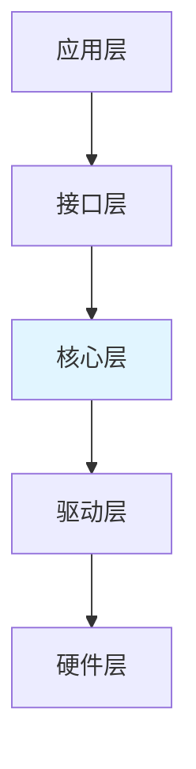
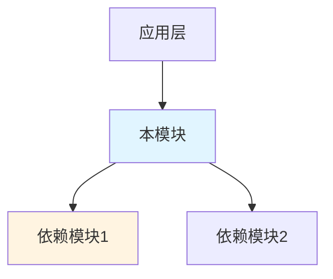

深入分析单个模块的代码实现，生成结构化的代码实现总结文档。

## 核心原则
1. **单模块深入**：每次只分析一个模块的内部实现细节
2. **依赖引用**：新模块依赖已有总结时，引用避免重复，只写差异部分
3. **实现导向**：聚焦代码层面的实现机制，而非架构组织
4. **结构化输出**：严格按照标准模板生成.md文档

## 执行流程（严格按步骤执行）

### Step 1：确定分析范围
**从用户输入直接提取**：
- **模块名称**: 用于文件命名和文档标题（如"AT命令模块"、"LwM2M模块"）
- **代码路径**: 待分析的代码目录（相对或绝对路径）

**模块命名建议**：
| 模块类型 | 建议命名 |
|---------|---------|
| AT命令 | `AT命令模块` |
| 协议栈 | `{协议名}模块`（如 LwM2M模块、MQTT模块） |
| 驱动 | `{外设名}驱动`（如 UART驱动） |
| 业务逻辑 | `{功能名}模块`（如 数据采集模块） |

### Step 2：环境检查 + 确定平台
1. 检查 `.spec` 目录是否存在，不存在则提示用户先运行 `spec-init`
2. 确定**平台名**（如 EC626、ASR1603）：
   - 优先从用户输入获取
   - 或从项目路径推断（如 `D:\EC626\` → 平台名 `EC626`）
3. 确认中央知识库路径：`~/.agents/knowledge/platform/{平台名}/code-summary/`

### Step 3：代码分析与文档生成
按优先级解析文件并提取信息：

**推荐工具**：
| 工具 | 用途 | 示例 |
|------|------|------|
| `glob` | 查找文件 | `glob "**/*.h" path` |
| `search_file_content` | 搜索代码内容 | `search_file_content "typedef struct" path` |
| `read_file` | 读取文件内容 | `read_file absolute_path` |
| `list_directory` | 列出目录结构 | `list_directory path` |

**分析优先级**：
| 优先级 | 文件类型 | 说明 |
|--------|----------|------|
| P0 | `*_types.h`, `*_api.h` | 核心类型和接口 |
| P1 | `*_core.c`, `*_main.c` | 核心实现 |
| P2 | `*_config.h` | 配置定义 |
| P3 | `*_port.c`, `*_hal.c` | 硬件适配 |

**分析内容**：
1. 目录结构扫描 → 识别文件组织
2. 代码解析 → 提取数据结构、函数接口、宏定义
3. 架构梳理 → 梳理分层、模块边界、数据流向
4. 模块依赖分析（如有依赖） → 确定引用内容

### Step 4：生成结构化文档

**输出路径**：`~/.agents/knowledge/platform/{平台名}/code-summary/{模块名}/代码总结.md`

**使用模板**：读取 `references/code-summary-template.md`，填充占位符后输出。

### Step 5：文档完整性检查

**章节检查**：按照文档结构必须包含所有章节。无需包含的章节需要告知用户。
**质量检查**：
1. Mermaid图表代码块闭合
2. 表格格式正确
3. 引用链接有效


### 模块依赖关系章节示例

当模块依赖已有总结时，使用以下格式：

```markdown
## 4. 模块依赖关系

### 4.1 依赖的基础框架

本模块依赖以下模块的实现：

| 框架名 | 依赖方式 | 关键接口 | 参考文档 |
|--------|----------|----------|----------|
| AT框架 | 命令注册 | at_register_cmd() | [AT命令模块](../AT命令模块/代码总结.md) |

### 4.4 与依赖模块的集成

本模块基于 AT 框架实现 AT 命令注册和处理。

AT 框架的详细实现机制请参考 **[AT命令模块](../AT命令模块/代码总结.md)**。

本模块主要关注：
- LwM2M 特定的 AT 命令定义
- LwM2M 协议层实现
- 与 AT 框架的适配层
```

## 输出格式要求（严格遵守）
1. **必须有目录**：文档开头生成Markdown目录（使用 `## 目录` + `- [章节名](#锚点)` 格式）
2. **优先使用Mermaid**：架构图、流程图、状态图使用Mermaid语法
3. **表格化数据**：数据结构、接口、配置等用表格呈现
4. **引用链接**：依赖模块使用相对路径引用链接

## 代码分析指南

### 模块依赖识别方法

| 依赖类型 | 识别方法 | 示例 |
|----------|----------|------|
| 头文件依赖 | 查找 `#include` 语句 | `#include "at_api.h"` |
| 函数调用依赖 | 查找外部函数调用 | `at_register_cmd()` |
| 数据结构依赖 | 查找使用外部结构体 | `at_context_t` |
| 宏定义依赖 | 查找使用外部宏 | `AT_MAX_CMD_LEN` |

### 架构图绘制模板

**分层架构图**：


**模块依赖关系图**：


### 扩展点识别方法

| 扩展类型 | 识别方法 |
|----------|----------|
| 回调函数 | 查找 callback_t、register |
| 配置表 | 查找 const 数组、config 表 |
| 虚函数表 | 查找函数指针结构体 |
| Weak 函数 | 查找 `__attribute__((weak))` |


## 常见问题

**Q: 代码量太大如何分析？**

A: 聚焦核心模块，按 P0→P1→P2→P3 优先级解析，先画出架构图再深入细节。

**Q: 新模块依赖已有总结时如何处理？**

A: 在"模块依赖关系"章节中引用依赖模块，只详细说明本模块特有的实现，避免重复。

**Q: 如何避免不同总结之间的内容重复？**

A: 通过引用链接和模块依赖关系章节明确依赖，只在本总结中详细说明本模块特有内容。

