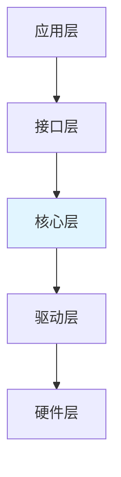
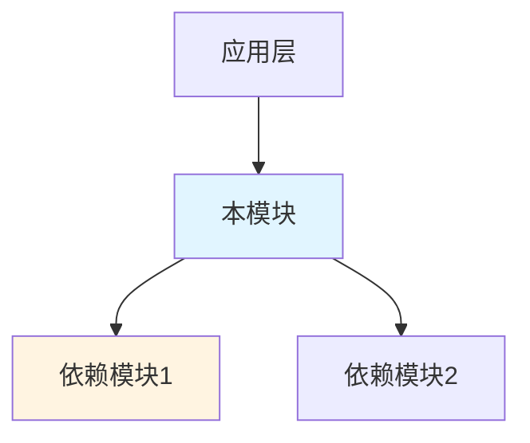
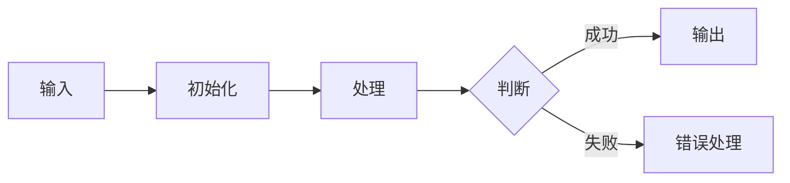
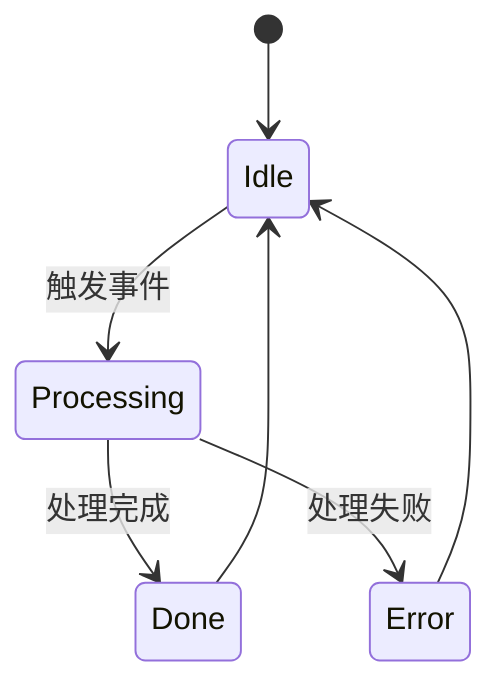

# [模块名称] 代码架构总结

## 目录
- [1. 参考文档](#1-参考文档)
- [2. 架构概述](#2-架构概述)
- [3. 核心代码路径](#3-核心代码路径)
- [4. 模块依赖关系](#4-模块依赖关系)
- [5. 目录结构分析](#5-目录结构分析)
- [6. 核心数据结构](#6-核心数据结构)
- [7. 关键接口分析](#7-关键接口分析)
- [8. 实现机制解析](#8-实现机制解析)
- [9. 配置与编译](#9-配置与编译)
- [10. 扩展点识别](#10-扩展点识别)
- [附录](#附录)

---

## 文档信息

- **文档编号**：2
- **文档类型**：实现总结
- **模块名称**：[模块名称]
- **代码路径**：[相对路径]
- **分析日期**：[YYYY-MM-DD]
- **版本**：[代码版本/标签]
- **变更历史**：| 版本 | 日期 | 修订内容 | 修订人 |

## 1. 参考文档

> 本章节记录分析过程中引用的已有文档

### 1.1 引用的项目文档

| 文档名称 | 类型 | 来源 | 用途说明 |
|---------|------|------|---------|
| `[文档名]` | 项目概览/代码总结 | `.spec/` | `{用途说明}` |

### 1.2 引用的代码总结

| 文档名称 | 模块名 | 关联关系 | 参考内容 |
|---------|--------|---------|---------|
| `[文档名]` | `{模块名}` | 依赖/参考 | `{参考的内容}` |

### 1.3 文档关联说明

- **项目指导**：项目概览提供了模块所在的项目整体布局、分层设计等信息
- **依赖参考**：代码总结提供了被依赖模块的实现细节
- **补充分析**：本分析聚焦于本模块特有实现，公共部分引用已有文档

> **无参考文档时**：本次分析未引用已有文档，为全新分析

## 2. 架构概述

### 2.1 系统定位

（所属子系统、主要职责、依赖关系）

### 2.2 分层架构



### 2.3 核心组件

| 组件 | 职责 | 关键文件 |
|------|------|----------|
| [组件名] | [职责描述] | [文件列表] |

## 3. 核心代码路径

> 本章节提供模块核心文件的快速索引，便于其他技能引用和定位代码。

| 分类 | 文件路径 | 核心内容 | 优先级 |
|------|----------|----------|--------|
| 类型定义 | [相对路径] | 核心数据结构、枚举定义 | P0 |
| API接口 | [相对路径] | 对外接口声明 | P0 |
| 核心实现 | [相对路径] | 核心业务逻辑 | P1 |
| 主入口 | [相对路径] | 模块初始化、主流程 | P1 |
| 配置定义 | [相对路径] | 宏定义、配置项 | P2 |
| 硬件适配 | [相对路径] | 平台适配层 | P3 |

## 4. 模块依赖关系

### 4.1 依赖的基础框架

| 框架名 | 依赖方式 | 关键接口 | 参考文档 |
|--------|----------|----------|----------|
| [框架名] | [如何依赖] | [关键接口] | [引用链接] |

### 4.2 被依赖的模块

（列出依赖本模块的其他模块）

### 4.3 模块间接口

（模块间的接口定义）

### 4.4 与依赖模块的集成

（说明如何使用依赖模块，引用避免重复）

### 4.5 模块依赖关系图



## 5. 目录结构分析

### 5.1 目录组织

```
{module_path}/
├── include/           # 头文件
│   ├── {module}_api.h
│   └── {module}_types.h
├── src/               # 源文件
│   ├── {module}_core.c
│   └── {module}_main.c
└── port/              # 硬件适配
    └── {module}_port.c
```

### 5.2 关键文件说明

| 文件 | 类型 | 说明 | 依赖 |
|------|------|------|------|
| [文件名] | [.h/.c] | [功能说明] | [依赖文件] |

### 5.3 文件依赖关系图

```mermaid
graphTD
    A[api.h] --> B[core.c]
    B --> C[types.h]
    B --> D[port.c]
```

## 6. 核心数据结构

### 6.1 结构体定义

| 结构体 | 字段说明 | 用途 | 生命周期 |
|--------|----------|------|----------|
| [typedef] | [主要字段] | [用途] | [生命周期] |

### 6.2 枚举类型

| 枚举 | 值域 | 用途 |
|------|------|------|
| [enum] | [枚举值] | [用途说明] |

### 6.3 全局变量

| 变量名 | 类型 | 作用域 | 说明 |
|--------|------|--------|------|
| [变量] | [类型] | [全局/静态] | [说明] |

## 7. 关键接口分析

### 7.1 API 函数

| 函数 | 功能 | 参数 | 返回值 | 线程安全 |
|------|------|------|--------|----------|
| [函数名] | [功能] | [参数列表] | [返回值] | [是/否] |

### 7.2 命令接口（AT命令模块特有）

| 命令 | 处理函数 | 说明 |
|------|----------|------|
| AT+XXX | [函数名] | [命令说明] |

### 7.3 回调函数

| 回调 | 触发条件 | 注册方式 |
|------|----------|----------|
| [回调名] | [触发时机] | [注册方法] |

## 8. 实现机制解析

### 8.1 核心流程



### 8.2 状态机设计



### 8.3 错误处理

| 错误码 | 含义 | 处理方式 |
|--------|------|----------|
| [错误码] | [错误含义] | [处理方式] |

## 9. 配置与编译

### 9.1 编译选项

- **CFLAGS**: [编译选项]
- **DEFINES**: [宏定义]

### 9.2 宏定义

| 宏名 | 默认值 | 说明 |
|------|--------|------|
| [宏] | [默认值] | [用途] |

### 9.3 配置文件

（列出配置文件及其作用）

## 10. 扩展点识别

### 10.1 可扩展接口

| 接口 | 扩展方式 | 示例 |
|------|----------|------|
| [接口名] | [如何扩展] | [示例代码] |

### 10.2 钩子点

| 钩子 | 触发时机 | 用途 |
|------|----------|------|
| [钩子名] | [何时触发] | [用途] |

### 10.3 插件机制

（说明插件如何扩展本模块）

## 附录

### A. 文件清单

（完整文件列表）

### B. 术语表

（专业术语解释）

### C. 参考资料

（相关文档链接）
