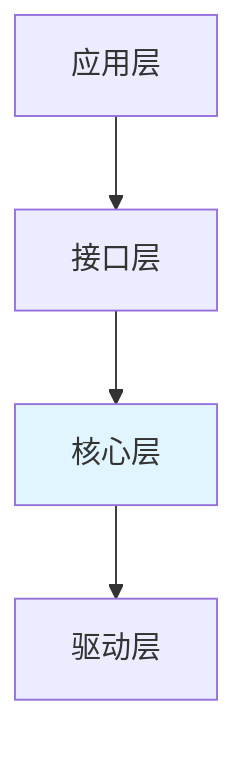
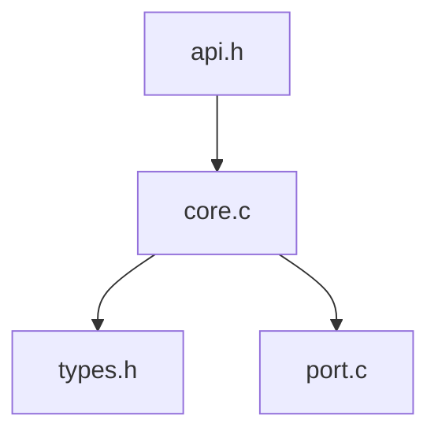
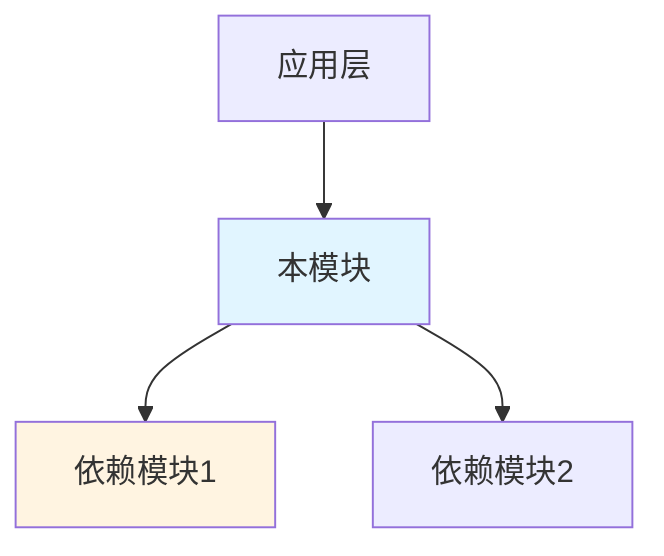
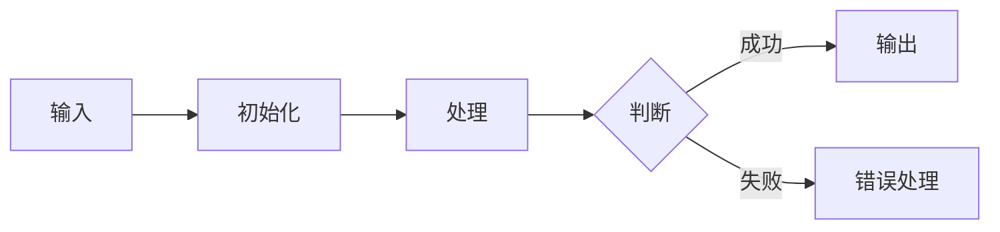
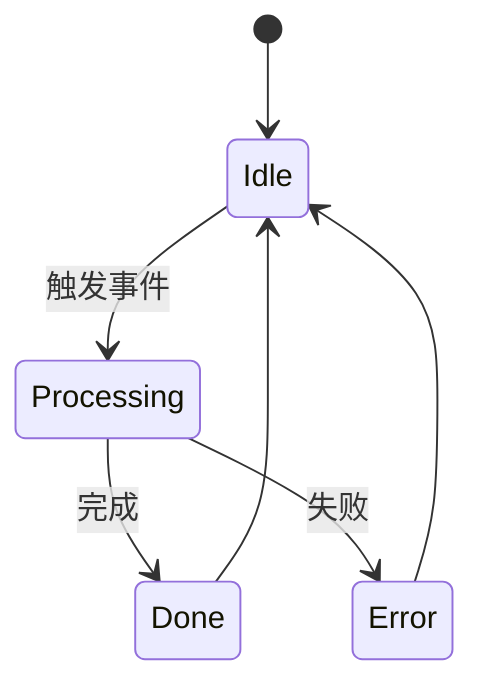

# [模块名称] 代码架构总结

## 目录
- [文档信息](#文档信息)
- [1. 参考文档](#1-参考文档)
- [2. 架构概述](#2-架构概述)
- [3. 代码结构](#3-代码结构)
- [4. 模块依赖关系](#4-模块依赖关系)
- [5. 核心数据结构](#5-核心数据结构)
- [6. 关键接口分析](#6-关键接口分析)
- [7. 实现机制解析](#7-实现机制解析)
- [8. 关键日志检索字段](#8-关键日志检索字段)
  - [8.0 快速检索清单](#80-快速检索清单-给-bug-analyzer-直接-grep)
- [9. 配置与编译](#9-配置与编译)
- [附录 A. 术语表](#附录-a-术语表)
- [附录 B. 扩展点（可选）](#附录-b-扩展点可选)

---

## 文档信息

- **模块名称**：[模块名称]
- **代码路径**：[相对路径]
- **所属平台**：[平台名]
- **分析日期**：[YYYY-MM-DD]
- **代码版本/标签**：[版本]

## 1. 参考文档

> 本分析引用的已有文档；无则注明"全新分析，未引用已有文档"。

| 文档名称 | 类型 | 来源 | 参考内容 |
|---------|------|------|---------|
| `[文档名]` | 项目概览/代码总结 | `.spec/` 或知识库 | `{参考了什么}` |

## 2. 架构概述

### 2.1 系统定位

（所属子系统、主要职责、上下游关系）

### 2.2 分层架构



### 2.3 核心组件

| 组件 | 职责 | 关键文件 |
|------|------|----------|
| [组件名] | [职责] | [文件] |

## 3. 代码结构

> 合并自原"核心代码路径 + 目录结构分析"。给出目录组织 + 关键文件索引（含优先级）+ 文件依赖。

### 3.1 目录组织

```
{module_path}/
├── include/           # 头文件
│   ├── {module}_api.h
│   └── {module}_types.h
├── src/               # 源文件
│   ├── {module}_core.c
│   └── {module}_main.c
└── port/              # 硬件适配
    └── {module}_port.c
```

### 3.2 关键文件索引

| 分类 | 文件路径 | 核心内容 | 优先级 |
|------|----------|----------|--------|
| 类型定义 | [相对路径] | 核心数据结构、枚举 | P0 |
| API 接口 | [相对路径] | 对外接口声明 | P0 |
| 核心实现 | [相对路径] | 核心业务逻辑 | P1 |
| 主入口 | [相对路径] | 初始化、主流程 | P1 |
| 配置定义 | [相对路径] | 宏、配置项 | P2 |
| 硬件适配 | [相对路径] | 平台适配层 | P3 |

### 3.3 文件依赖关系图



## 4. 模块依赖关系

### 4.1 依赖的基础框架

| 框架名 | 依赖方式 | 关键接口 | 参考文档 |
|--------|----------|----------|----------|
| [框架名] | [如何依赖] | [关键接口] | [引用链接] |

> 被哪些模块依赖（若有）：（列出反向依赖）

### 4.2 模块依赖关系图



## 5. 核心数据结构

### 5.1 结构体定义

| 结构体 | 主要字段 | 用途 | 生命周期 |
|--------|----------|------|----------|
| [typedef] | [字段] | [用途] | [生命周期] |

### 5.2 枚举类型

| 枚举 | 值域 | 用途 |
|------|------|------|
| [enum] | [枚举值] | [用途] |

### 5.3 全局变量

| 变量名 | 类型 | 作用域 | 说明 |
|--------|------|--------|------|
| [变量] | [类型] | [全局/静态] | [说明] |

## 6. 关键接口分析

### 6.1 API 函数

| 函数 | 功能 | 参数 | 返回值 | 线程安全 |
|------|------|------|--------|----------|
| [函数名] | [功能] | [参数] | [返回值] | [是/否] |

### 6.2 命令接口（AT 命令模块特有）

| 命令 | 处理函数 | 说明 |
|------|----------|------|
| AT+XXX | [函数名] | [说明] |

### 6.3 回调函数

| 回调 | 触发条件 | 注册方式 |
|------|----------|----------|
| [回调名] | [触发时机] | [注册方法] |

## 7. 实现机制解析

### 7.1 核心流程



### 7.2 状态机设计



### 7.3 错误处理

| 错误码 | 含义 | 抛出位置 | 处理方式 |
|--------|------|----------|----------|
| [错误码] | [含义] | [函数:行] | [处理] |

## 8. 关键日志检索字段

> 本模块运行期日志（AP 日志 / AT 日志 / crash dump 残留）中可供 **spec-bug-analyzer / spec-memory-leak-analyzer 直接 grep 过滤大文件日志**的关键字符串、错误码、任务名、状态值。
>
> **规矩**：
> - 所有字段必须是代码里**真实出现的字面量**（反引号包裹，保留大小写、`0x` 前缀、冒号空格），每条带出处（函数:行）。不要描述、不要编造——analyzer 拿来直接 grep，描述性文字无价值。
> - **标注默认可见性**：很多日志有级别（`LOG_DEBUG`/`NWY_APP_LOG_LOW` 等），低级别默认不输出。每条字段要标明"默认是否出现在运行日志里"——bug-analyzer grep 一个默认不打印的串会落空并误判"模块无日志"，这是大坑。
> - **适配不同平台日志宏**：Neoway 用 `NWY_APP_LOG_*`、EC626 EigenComm 用 `ECOMM_TRACE(UNILOG_xx, tag, ...)`（提取模块 ID `UNILOG_xx` + 唯一 tag）、Unisoc 用 `OSI_LOGI`。提取的是日志宏的模块 ID / tag，以及 `printf`/字符串字面量。
>
> 若本模块无日志输出，整节明确说明并跳过。

### 8.0 快速检索清单（★ 给 bug-analyzer 的关键字来源）

> 本模块**默认可见**的高价值日志关键字，按用途分组列出。spec-bug-analyzer 取这些关键字作为输入，由其按场景判断用法——大文件喂给 `scripts/log_analyzer.py -k`（search/compare/stats）、小文件直接 `grep -E`。本节只产出**关键字**，不规定调用方式。
>
> **格式约定**：纯字面量关键字，每行一个（或空格分隔），用反引号包裹。只收「默认会打印 + 能定位关键流程/错误」者；非默认可见项放 §8.1–§8.6 详尽字典。每串必须能在源码 grep 命中。

| 分组 | 关键字（默认可见） |
|------|------------------|
| 模块标识（任务名 / 模块 ID / TAG） | `任务名` `模块ID` `UNILOG_xx` |
| 关键流程节点 | `流程串1` `流程串2` |
| 错误码 / 失败字符串 | `错误码1` `错误码2` `CME ERROR` |
| URC / AT 回复（AT 类模块） | `+CMD` `+CMD: OK` |

> 注意：部分串是 AT 框架/日志框架格式化后的运行期输出（源码里以宏形式存在，如 `CME_OPERATION_NOT_ALLOW` → 日志 `CME ERROR: 3`），这些串 grep **日志文件**有效、grep **源码**需换宏名。完整字段（带出处、可见性、含义、非默认可见项）见 §8.1–§8.6。

### 8.1 模块标识（任务名 / 日志 TAG / 模块 ID）

> 三类标识，按模块实际有的填：① 本模块创建的 FreeRTOS 任务名（dump 崩溃时 `curr_task_name` 常为空，靠这里反推"崩溃任务 → 本模块"）；② 日志前缀 TAG（如 `NWY_APP_LOG_*` 带的串）；③ 日志宏的模块 ID + 唯一 tag（如 ECOMM_TRACE 的 `UNILOG_xx` + tag）。非任务化、无字符串 TAG 的模块填第③类即可，不必硬编任务名。

| 标识 | 类型 | 出现位置 | 出处 |
|------|------|----------|------|
| `[任务名]` | FreeRTOS task name | AP 日志 / dump TCB | [函数:行] |
| `[TAG 或 模块ID]` | 日志前缀 / 模块 ID | AP 日志 | [宏:行] |

### 8.2 错误码与错误字符串

> bug-analyzer 现查错误码定义是其痛点，这里直接喂现成的。

| 字面值 | 类型 | 含义 | 出处 |
|--------|------|------|------|
| `-0x7200` | mbedTLS 错误码 | BUFFER_TOO_SMALL | [函数:行] |
| `631` | AT CME ERROR | 认证失败 | [函数:行] |
| `OPTLIST_FULL` | 字符串错误 | 选项链表满 | [函数:行] |

### 8.3 状态字符串 / 状态机值

> 用 `key=value` 形式，对齐 contrast-analysis 的对比维度。

| 状态值 | 日志形式 | 触发条件 | 出处 |
|--------|----------|----------|------|
| `state=CONNECTED` | AP 日志 | 握手成功 | [函数:行] |
| `220` / `230` | 应答行 | 服务就绪/登录成功 | [函数:行] |

### 8.4 URC / AT 回复（AT 类模块）

| AT 命令 | 成功 URC | 失败 URC | 出处 |
|---------|----------|----------|------|
| `AT+XXX` | `+XXX: OK` | `CME ERROR: 631` | [函数:行] |

### 8.5 内存管理入口（供 memory-leak-analyzer）

> 标注每个分配点走统一接口还是直接系统调用/第三方库，直接服务内存泄漏排查。

| 调用点用途 | 接口 | 是否统一接口 | 出处 |
|-----------|------|--------------|------|
| [用途] | `nwy_malloc` | 是 | [函数:行] |
| [用途] | `mbedtls_calloc` | 第三方库，需宏重定向 | [函数:行] |

### 8.6 埋点标签（如启用 MEM_TRACE / STATS）

| 标签 | 格式 | 字段 | 出处 |
|------|------|------|------|
| `MEM_ALLOC` | `MEM_ALLOC: addr=0x.., size=N, caller=0x..` | addr/size/caller | [函数:行] |

### 8.7 一行 grep 速查

> 把本节关键字预拼成一条命令，复制即用。

```bash
# 本模块日志快速过滤（喂给 spec-bug-analyzer 的 log_analyzer.py）
python log_analyzer.py search app.log -k "CoAPTask" "coap" "OPTLIST" "CME ERROR" -c 3
```

## 9. 配置与编译

### 9.1 宏定义

| 宏名 | 默认值 | 说明 |
|------|--------|------|
| [宏] | [默认值] | [用途] |

### 9.2 配置文件

（列出配置文件及其作用；若无则说明）

## 附录 A. 术语表

（专业术语解释）

## 附录 B. 扩展点（可选）

> 嵌入式二次开发场景多数模块无插件机制；**有则写、无则整节省略**，不要硬凑。

### B.1 可扩展接口

| 接口 | 扩展方式 | 示例 |
|------|----------|------|
| [接口名] | [如何扩展] | [示例] |

### B.2 钩子点

| 钩子 | 触发时机 | 用途 |
|------|----------|------|
| [钩子名] | [何时] | [用途] |
