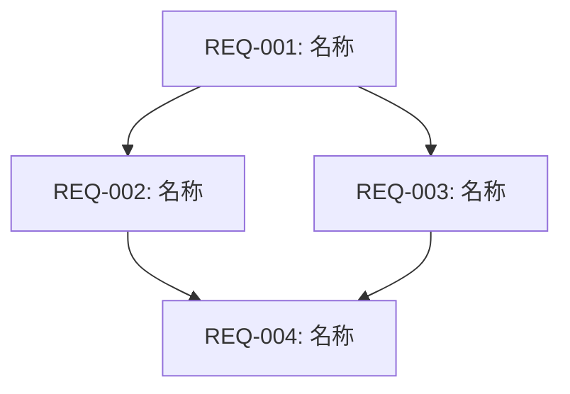

# 需求拆分清单模板

## 基本信息

| 项目 | 内容 |
|------|------|
| 原始需求文档 | [原始需求文档路径] |
| 拆分日期 | [YYYY-MM-DD] |
| 拆分策略 | [功能模块/分层架构/用户场景/优先级/混合] |
| 拆分原因 | [复杂度评估结果] |

## 复杂度评估

| 评估维度 | 得分 | 权重 | 加权得分 | 说明 |
|----------|------|------|----------|------|
| 功能模块数 | [1-4] | 30% | [得分] | [说明] |
| 涉及层次 | [1-4] | 25% | [得分] | [说明] |
| 接口复杂度 | [1-4] | 20% | [得分] | [说明] |
| 场景数量 | [1-4] | 15% | [得分] | [说明] |
| 硬件依赖 | [1-4] | 10% | [得分] | [说明] |
| **综合得分** | - | - | **[总分]** | [是否需要拆分] |

## 拆分策略说明

### 选定策略

**策略名称**：[策略名称]

**选择理由**：
[说明为什么选择这个策略]

**拆分依据**：
- [依据1]
- [依据2]
- [依据3]

### 备选策略

| 策略 | 适用性 | 未选择原因 |
|------|--------|------------|
| [策略A] | [高/中/低] | [原因] |
| [策略B] | [高/中/低] | [原因] |

## 子需求清单

### 子需求总览

| 子需求ID | 名称 | 简要描述 | 优先级 | 状态 | 负责人 |
|----------|------|----------|--------|------|--------|
| REQ-001 | [名称] | [描述] | P0/P1/P2 | 待分析/分析中/已完成 | [负责人] |
| REQ-002 | [名称] | [描述] | P0/P1/P2 | 待分析/分析中/已完成 | [负责人] |
| REQ-003 | [名称] | [描述] | P0/P1/P2 | 待分析/分析中/已完成 | [负责人] |

### 子需求详情

#### REQ-001: [子需求名称]

| 属性 | 内容 |
|------|------|
| ID | REQ-001 |
| 名称 | [子需求名称] |
| 优先级 | P0/P1/P2 |
| 依赖 | [依赖的子需求ID列表，无依赖填"-"] |

**详细描述**：
[子需求的详细功能描述]

**功能点**：
- [功能点1]
- [功能点2]
- [功能点3]

**验收标准**：
- [ ] [验收标准1]
- [ ] [验收标准2]
- [ ] [验收标准3]

---

#### REQ-002: [子需求名称]

[同上格式]

---

## 依赖关系

### 依赖关系图

### 依赖关系表

| 子需求 | 依赖项 | 依赖类型 | 说明 |
|--------|--------|----------|------|
| REQ-002 | REQ-001 | 强依赖 | [说明] |
| REQ-003 | REQ-001 | 强依赖 | [说明] |
| REQ-004 | REQ-002, REQ-003 | 强依赖 | [说明] |

## 完整性检查

### 功能覆盖检查

| 原始需求功能点 | 覆盖的子需求 | 状态 |
|----------------|--------------|------|
| [功能点1] | REQ-001 | ✅ 已覆盖 |
| [功能点2] | REQ-002 | ✅ 已覆盖 |
| [功能点3] | REQ-003 | ✅ 已覆盖 |
| [功能点4] | REQ-004 | ✅ 已覆盖 |

### 遗漏检查

- [ ] 所有原始需求功能点已被覆盖
- [ ] 无功能重复定义
- [ ] 无功能遗漏

## 粒度评估

| 子需求 | 预估工作量 | 粒度评估 | 建议 |
|--------|------------|----------|------|
| REQ-001 | [人天] | 适中/过大/过小 | [建议] |
| REQ-002 | [人天] | 适中/过大/过小 | [建议] |
| REQ-003 | [人天] | 适中/过大/过小 | [建议] |

## 附录

### 原始需求摘要

[原始需求文档的核心内容摘要]

### 拆分记录

| 版本 | 日期 | 修改内容 | 修改人 |
|------|------|----------|--------|
| v1.0 | [日期] | 初始拆分 | [姓名] |
