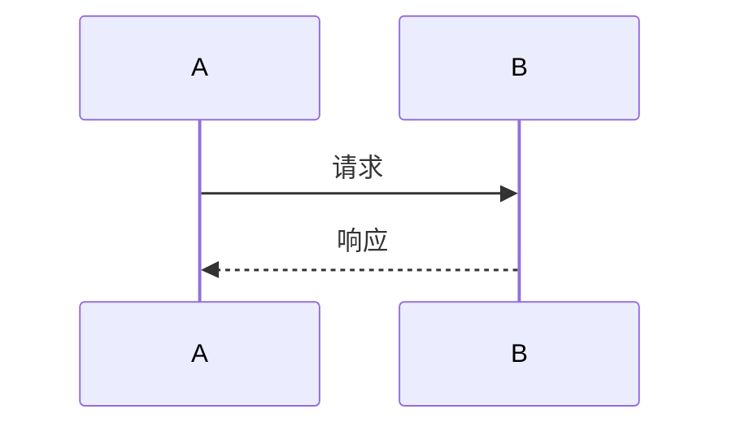
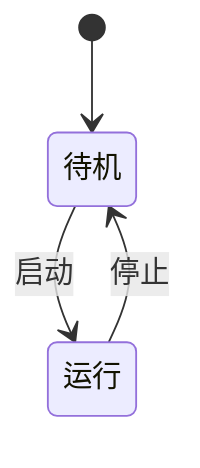

# [核心功能] 技术方案

## 0. 结构化摘要

> 以下信息便于实施计划引用与后续追溯，需完整准确填写。

| 字段 | 内容 |
|------|------|
| **项目 ID** | [继承自需求文档，如 6977185133；必填] |
| **模块** | [如 网络 / 蓝牙 / 文件系统 / 电源管理] |
| **方案概述** | [一句话说明技术实现思路] |
| **影响面** | [改动的层次/模块/协议链路，如：应用层+PPP拨号+TCP重建] |
| **关联需求文档** | [如 需求.md] |

---

## 目录
- [文档信息](#文档信息)
- [1. 方案目标与范围](#1-方案目标与范围)
- [2. 现状分析](#2-现状分析)
- [3. 方案选型](#3-方案选型)
- [4. 架构与分层设计](#4-架构与分层设计)
- [5. 任务与并发设计](#5-任务与并发设计)
- [6. 资源预算](#6-资源预算)
- [7. 硬件与外设依赖](#7-硬件与外设依赖)
- [8. AT 与协议栈兼容性](#8-at-与协议栈兼容性)
- [9. 接口设计](#9-接口设计)
- [10. 关键流程](#10-关键流程)
- [11. 异常处理与降级](#11-异常处理与降级)
- [12. 风险与对策](#12-风险与对策)
- [13. 验证要点](#13-验证要点)
- [14. 待澄清事项](#14-待澄清事项)

## 文档信息
| 字段 | 内容 |
|------|------|
| 项目名称 | [从需求文档继承] |
| 创建日期 | [自动生成当前日期] |
| 版本 | v1.0 |
| 作者 | [作者] |

| 版本 | 日期 | 修改内容 | 作者 |
|------|------|----------|------|
| v1.0 | [当前日期] | 初始创建 | [作者] |

## 1. 方案目标与范围
### 1.1 目标
[本方案要解决的实现问题，呼应需求中的核心功能与非功能约束]

### 1.2 范围
- **包含**：[本方案覆盖的实现内容]
- **不包含**：[明确不做的部分]

## 2. 现状分析
- **相关现有代码/模块**：[涉及哪些文件、模块、调用链]
- **现有调用链**：[当前是怎么走的，用文字或 Mermaid 描述]
- **可复用能力**：[已有的任务、接口、配置可直接复用的部分]

## 3. 方案选型
> 记录定稿前考虑过的备选方案与取舍，便于后续评审与追溯"为什么这么选"。对应 SKILL Step 3。
> 方案 A 必填；B/C 可选——若确实只有一个合理落点，可只写 A 行 + 在"选定理由"里说明为什么排除其他常见做法，不必硬凑稻草人。

| 方案 | 思路 | 关键权衡（资源/实时性/兼容性/改动量/风险） | 适用场景 | 是否采用 |
|------|------|------------------------------------------|----------|----------|
| 方案 A（推荐，必填） | [一句话] | | | ✅ |
| 方案 B（可选） | | | | ❌ |
| 方案 C（可选） | | | | ❌ |

**选定理由**：[为什么是 A；以及为什么排除其他——如 B 改动量过大、C 破坏协议栈兼容]

## 4. 架构与分层设计
### 4.1 分层落点
[功能落在哪一层：AT / 协议栈 / 应用 / 驱动，为什么——应与「方案选型」结论一致]

### 4.2 模块划分与数据流

## 5. 任务与并发设计
| 任务/上下文 | 职责 | 优先级 | 栈大小 | 通信机制 | 备注 |
|-------------|------|--------|--------|----------|------|
| [新建/复用任务名] | [职责] | [优先级] | [栈大小] | [队列/事件/信号量] | |
| [ISR] | [中断处理] | — | — | [事件/信号量] | |

- **同步与互斥**：[共享资源如何保护、临界区考量]
- **实时性考量**：[关键路径是否被高优先级抢占、有无阻塞点]

## 6. 资源预算
| 类别 | 指标 | 预算 | 评估 | 验证方法 |
|------|------|------|------|----------|
| RAM | 增量 | [如 <2KB] | [预估] | [map/符号表比对] |
| Flash | 增量 | [如 <10KB] | [预估] | [编译产物比对] |
| 功耗 | 影响 | [如 待机不增加] | [预估] | [功耗测试] |
| 时序 | 关键路径 | [如 拨号恢复<30s] | [预估] | [抓包/日志计时] |

## 7. 硬件与外设依赖
| 依赖项 | 说明 | 备注 |
|--------|------|------|
| [引脚/总线/时钟/电源] | [用途] | [是否冲突] |

## 8. AT 与协议栈兼容性
- **对现有链路的影响**：[PPP / TCP / 蓝牙 / LWIP 等，是否冲突或抢占]
- **兼容性保证**：[如何保证不影响既有功能]
- **回归面**：[需要回归验证的相关功能]

## 9. 接口设计
### 9.1 对外接口/API
| 接口 | 原型 | 说明 |
|------|------|------|
| [函数/AT命令] | [原型] | [用途] |

### 9.2 配置项与宏控
| 配置项 | 类型 | 默认值 | 说明 |
|--------|------|--------|------|
| [宏控/NV/运行时配置] | [类型] | [默认] | [用途] |

## 10. 关键流程
### 10.1 核心时序

### 10.2 状态机（如有）

## 11. 异常处理与降级
| 异常场景 | 处理策略 | 降级/回滚 |
|----------|----------|-----------|
| [场景1：超时/失败/资源不足] | [重试/上报] | [降级方式/能否回滚] |

## 12. 风险与对策
| 风险 | 影响 | 概率 | 对策 |
|------|------|------|------|
| [技术风险/兼容风险/回归风险] | [高/中/低] | [高/中/低] | [对策] |

## 13. 验证要点
> 供实施计划引用，每条应可被测试覆盖。
- [ ] [验证点1：关键功能路径]
- [ ] [验证点2：异常与降级]
- [ ] [验证点3：资源预算达标]
- [ ] [验证点4：协议栈兼容/回归]

## 14. 待澄清事项
- [ ] [问题1：仍需确认的实现细节]
- [ ] [问题2：依赖外部决策的点]
